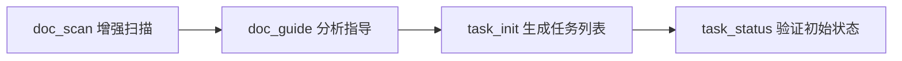
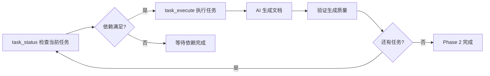
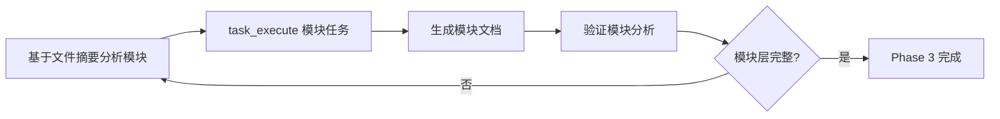
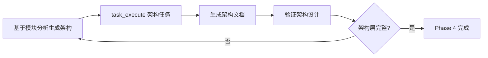

# CodeLens 增强MCP任务流程设计方案

## 概述

基于当前CodeLens架构，设计一个任务导向的智能文档生成流程，通过引导式AI协作和阶段性任务执行，实现项目文档的自动化、结构化生成。

## 当前架构分析

### 现有组件
- **FileService**: 文件扫描和信息提取（已有）
- **TemplateService**: 16个核心模板管理（已有）
- **ValidationService**: 文档验证服务（已有）
- **现有MCP工具**: doc_scan, template_get, doc_verify（已有）

### 现有问题
1. 缺乏智能引导，AI不知道该生成什么文档
2. 没有任务分解和循环机制，无法确保阶段性完成
3. 文件过滤功能不完善，会分析不必要的文件
4. 缺乏任务依赖管理，无法保证生成顺序

## 新增MCP工具设计

### 1. doc_guide - 智能文档引导工具

**功能**: 分析项目特征，为AI提供文档生成策略和建议

**输入参数**:
```json
{
  "project_path": "string",
  "project_type": "auto|python|javascript|java|go|rust", 
  "analysis_depth": "basic|detailed|comprehensive",
  "ignore_patterns": ["*.md", "*.txt", "__pycache__", ".git"],
  "focus_areas": ["architecture", "modules", "files", "project"]
}
```

**输出内容**:
```json
{
  "project_analysis": {
    "project_type": "python",
    "main_framework": "flask|django|fastapi|custom",
    "identified_modules": ["auth", "database", "api", "utils"],
    "code_complexity": "simple|medium|complex",
    "file_count": 45,
    "key_files": ["app.py", "models.py", "config.py"]
  },
  "documentation_strategy": {
    "recommended_phases": [
      "files_first", "modules_second", "architecture_third", "project_last"
    ],
    "priority_files": ["app.py", "models/user.py", "services/auth.py"],
    "estimated_templates": 16,
    "complexity_level": "medium"
  },
  "generation_plan": {
    "phase_1_files": ["list of key files to document"],
    "phase_2_modules": ["identified functional modules"],
    "phase_3_architecture": ["architecture components to analyze"],
    "phase_4_project": ["project-level documents to create"]
  }
}
```

### 2. task_init - 任务初始化工具

**功能**: 基于项目分析结果，生成完整的阶段性任务列表

**输入参数**:
```json
{
  "project_path": "string",
  "analysis_result": "doc_guide的输出结果",
  "task_granularity": "file|batch|module",
  "parallel_tasks": false,
  "custom_priorities": {}
}
```

**输出内容**:
```json
{
  "task_plan": {
    "total_phases": 5,
    "total_tasks": 28,
    "estimated_duration": "2-3 hours",
    "dependencies_graph": "任务依赖关系"
  },
  "phase_1_scan": {
    "description": "项目扫描和分析",
    "tasks": [
      {
        "id": "scan_001",
        "type": "scan",
        "description": "扫描项目文件结构",
        "dependencies": [],
        "estimated_time": "2 minutes",
        "status": "pending"
      }
    ]
  },
  "phase_2_files": {
    "description": "文件层文档生成（18个文件）",
    "dependencies": ["phase_1_complete"],
    "tasks": [
      {
        "id": "file_001", 
        "type": "file_summary",
        "target_file": "app.py",
        "template": "file_summary",
        "dependencies": ["scan_001"],
        "priority": "high",
        "status": "pending"
      }
    ]
  },
  "phase_3_modules": {
    "description": "模块层文档生成（6个模板）",
    "dependencies": ["phase_2_complete"],
    "tasks": []
  },
  "phase_4_architecture": {
    "description": "架构层文档生成（6个模板）", 
    "dependencies": ["phase_3_complete"],
    "tasks": []
  },
  "phase_5_project": {
    "description": "项目层文档生成（仅README.md）",
    "dependencies": ["phase_4_complete"],
    "tasks": []
  }
}
```

### 3. task_execute - 任务执行工具

**功能**: 执行单个或批量任务，提供模板和上下文信息

**输入参数**:
```json
{
  "task_id": "file_001",
  "execution_mode": "single|batch|auto_next",
  "force_dependencies": false,
  "context_enhancement": true
}
```

**输出内容**:
```json
{
  "task_info": {
    "id": "file_001",
    "type": "file_summary", 
    "target_file": "app.py",
    "phase": "phase_2_files"
  },
  "dependencies_check": {
    "all_satisfied": true,
    "missing_dependencies": []
  },
  "execution_context": {
    "template_content": "文件摘要模板内容",
    "template_variables": ["filename", "function_overview", "class_definitions"],
    "file_content": "目标文件的完整内容",
    "file_metadata": {"size": 5312, "modified": "2025-04-15"},
    "related_files": ["相关文件列表"],
    "project_context": "项目背景信息"
  },
  "generation_guidance": {
    "focus_points": ["主要功能分析", "架构模式识别", "依赖关系梳理"],
    "template_instructions": "具体的模板填写指导",
    "quality_criteria": "生成质量标准",
    "output_path": "docs/files/summaries/app.py.md"
  },
  "next_task": {
    "id": "file_002",
    "description": "下一个建议执行的任务"
  }
}
```

### 4. task_status - 任务状态管理工具

**功能**: 检查任务完成状态，管理阶段性进展

**输入参数**:
```json
{
  "project_path": "string",
  "check_type": "current_task|phase_progress|overall_status", 
  "phase_filter": "phase_2_files|phase_3_modules|phase_4_architecture|phase_5_project",
  "detailed_analysis": true
}
```

**输出内容**:
```json
{
  "overall_progress": {
    "current_phase": "phase_2_files",
    "total_progress": "15/28 tasks (53.6%)",
    "phase_progress": "8/18 files completed",
    "can_proceed_next_phase": false,
    "estimated_remaining": "45 minutes"
  },
  "current_task": {
    "id": "file_009",
    "description": "生成services/auth.py文件摘要",
    "status": "ready_to_execute",
    "dependencies_satisfied": true
  },
  "phase_status": {
    "phase_2_files": {
      "status": "in_progress",
      "completed_tasks": 8,
      "total_tasks": 18,
      "blocking_tasks": ["file_012", "file_015"],
      "can_complete": false
    }
  },
  "next_actions": [
    "继续执行file_009任务",
    "完成剩余10个文件摘要",
    "通过task_execute获取file_009的执行上下文"
  ],
  "quality_check": {
    "generated_files_valid": true,
    "template_compliance": "95%",
    "potential_issues": []
  }
}
```

## 增强现有工具

### 增强 doc_scan - 智能文件过滤

**新增功能**:
1. **智能忽略模式**: 自动识别和忽略文档文件、临时文件、编译产物
2. **项目类型检测**: 根据项目类型应用不同的过滤规则
3. **内容相关过滤**: 基于文件内容特征进行过滤

**新增参数**:
```json
{
  "ignore_patterns": {
    "files": ["*.md", "*.txt", "*.log", "*.tmp"],
    "directories": ["__pycache__", ".git", "node_modules", ".idea", "venv"],
    "content_based": ["empty_files", "generated_files", "binary_files"]
  },
  "smart_filtering": {
    "enabled": true,
    "project_type": "auto_detect",
    "keep_config_files": true,
    "keep_test_files": true
  },
  "analysis_focus": {
    "main_source_only": false,
    "exclude_examples": true,
    "exclude_migrations": true
  }
}
```

## 新的任务流程设计

### Phase 1: 项目分析和初始化 (5分钟)


**具体步骤**:
1. `doc_scan`: 使用增强过滤功能扫描项目
2. `doc_guide`: 分析项目特征，生成文档策略
3. `task_init`: 基于分析结果生成完整任务计划
4. `task_status`: 验证任务计划和依赖关系

### Phase 2: 文件层文档生成 (循环执行)


**任务特点**:
- 每个任务包含：模板内容 + 文件内容 + 生成指导
- 必须逐个完成，确保质量
- 自动提供下一个任务的执行上下文
- 阶段完成前不能进入Phase 3

### Phase 3: 模块层文档生成 (循环执行)


**任务特点**:
- 依赖Phase 2的所有文件摘要
- 分析模块关系和依赖
- 生成6个模块层模板文档
- 自动识别项目的功能模块

### Phase 4: 架构层文档生成 (循环执行)


**任务特点**:
- 依赖Phase 3的模块分析结果
- 生成6个架构层模板文档
- 包含技术栈、数据流、系统设计等

### Phase 5: 项目层文档生成


**任务特点**:
- 仅生成README.md
- CHANGELOG.md和roadmap.md保持空文件
- 汇总所有前期分析结果

## 系统状态管理

### 任务状态枚举
```typescript
enum TaskStatus {
  PENDING = "pending",           // 等待执行
  READY = "ready",              // 依赖满足，可执行  
  IN_PROGRESS = "in_progress",  // 执行中
  COMPLETED = "completed",      // 已完成
  FAILED = "failed",            // 执行失败
  BLOCKED = "blocked"           // 被阻塞
}

enum PhaseStatus {
  NOT_STARTED = "not_started",
  IN_PROGRESS = "in_progress", 
  COMPLETED = "completed",
  BLOCKED = "blocked"
}
```

### 阶段依赖检查
- Phase 2 依赖 Phase 1 完成
- Phase 3 依赖 Phase 2 **所有任务**完成
- Phase 4 依赖 Phase 3 **所有任务**完成
- Phase 5 依赖 Phase 4 **所有任务**完成

### 质量控制机制
1. **文档内容验证**: 检查生成的文档是否符合模板要求
2. **依赖关系验证**: 确保后续文档基于前序文档的分析结果
3. **完整性检查**: 每个阶段必须完成所有必要任务
4. **自动重试机制**: 失败任务可以重新执行

## 实现建议

### 新增文件结构
```
src/
├── task_engine/              # 新增：任务引擎
│   ├── __init__.py
│   ├── task_manager.py       # 任务管理核心
│   ├── phase_controller.py   # 阶段控制器
│   └── state_tracker.py      # 状态跟踪器
├── mcp_tools/
│   ├── doc_guide.py          # 新增：智能引导工具
│   ├── task_init.py          # 新增：任务初始化工具
│   ├── task_execute.py       # 新增：任务执行工具
│   ├── task_status.py        # 新增：状态管理工具
│   ├── doc_scan.py           # 增强：文件过滤功能
│   └── [现有工具...]
└── [现有目录...]
```

### 配置文件扩展
```json
{
  "task_engine": {
    "max_parallel_tasks": 1,
    "auto_proceed_phases": false,
    "quality_check_enabled": true,
    "retry_failed_tasks": 3
  },
  "file_filtering": {
    "smart_ignore_enabled": true,
    "project_type_detection": true,
    "custom_ignore_patterns": []
  }
}
```

## 用户体验流程

### Claude Code 使用流程
```bash
# 第一步：智能分析和规划
python src/mcp_tools/doc_guide.py /path/to/project
python src/mcp_tools/task_init.py /path/to/project

# 第二步：开始文档生成循环
while not phase_2_complete:
    python src/mcp_tools/task_status.py /path/to/project
    python src/mcp_tools/task_execute.py --task-id file_001
    # AI 基于提供的上下文生成文档
    
# 第三步：自动进入下一阶段
python src/mcp_tools/task_status.py /path/to/project --check-phase-transition
python src/mcp_tools/task_execute.py --phase modules

# 继续直到完成...
```

### 关键优势
1. **智能引导**: AI明确知道每一步需要做什么
2. **质量保证**: 阶段性验证确保文档质量
3. **进度可视**: 清晰的任务状态和进度跟踪
4. **灵活配置**: 可根据项目特点调整策略
5. **错误恢复**: 支持任务重试和状态恢复

## 总结

这个增强的MCP流程设计通过引入任务管理、智能引导和阶段控制，解决了现有系统的核心问题：

1. ✅ **智能引导**: doc_guide提供分析和策略建议
2. ✅ **任务循环**: task_execute + task_status 实现循环控制
3. ✅ **文件过滤**: 增强doc_scan的智能过滤功能  
4. ✅ **阶段控制**: 5个明确阶段，严格依赖管理
5. ✅ **质量保证**: 每个阶段都有验证机制

通过这个设计，Claude Code可以获得明确的指导和上下文，按部就班地生成高质量的项目文档。