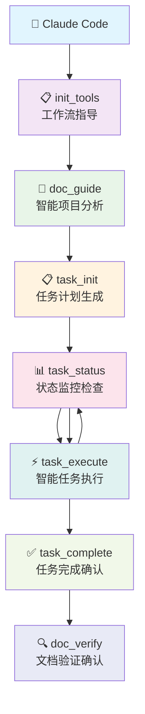
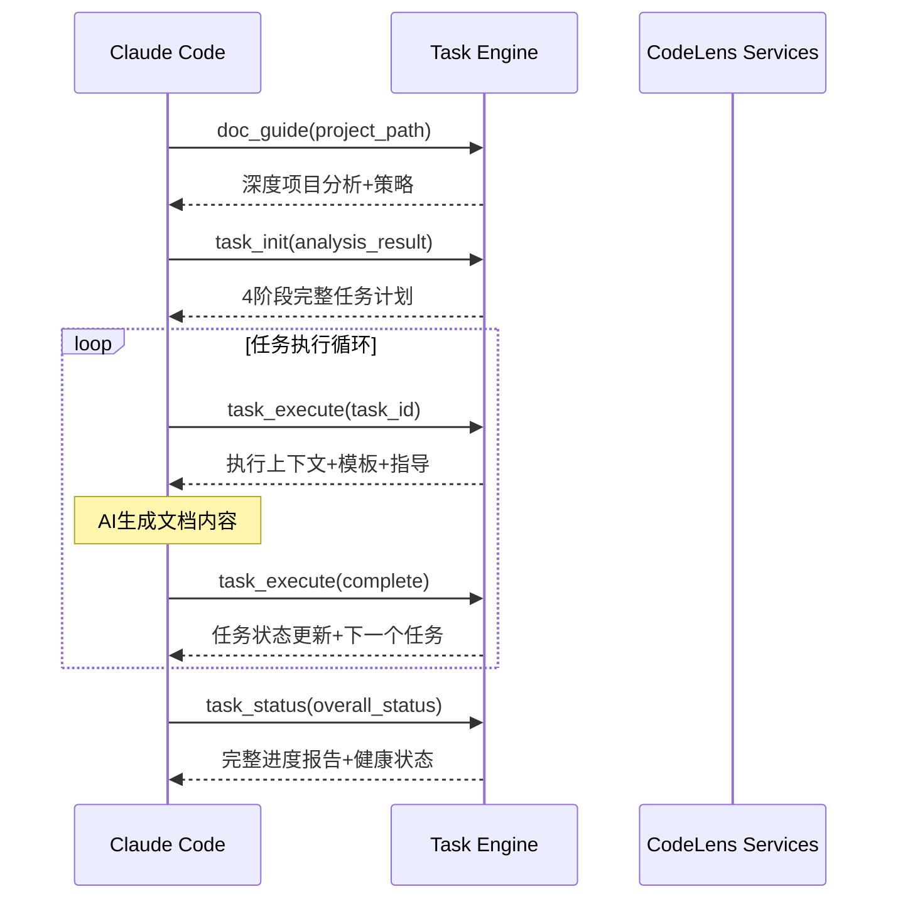
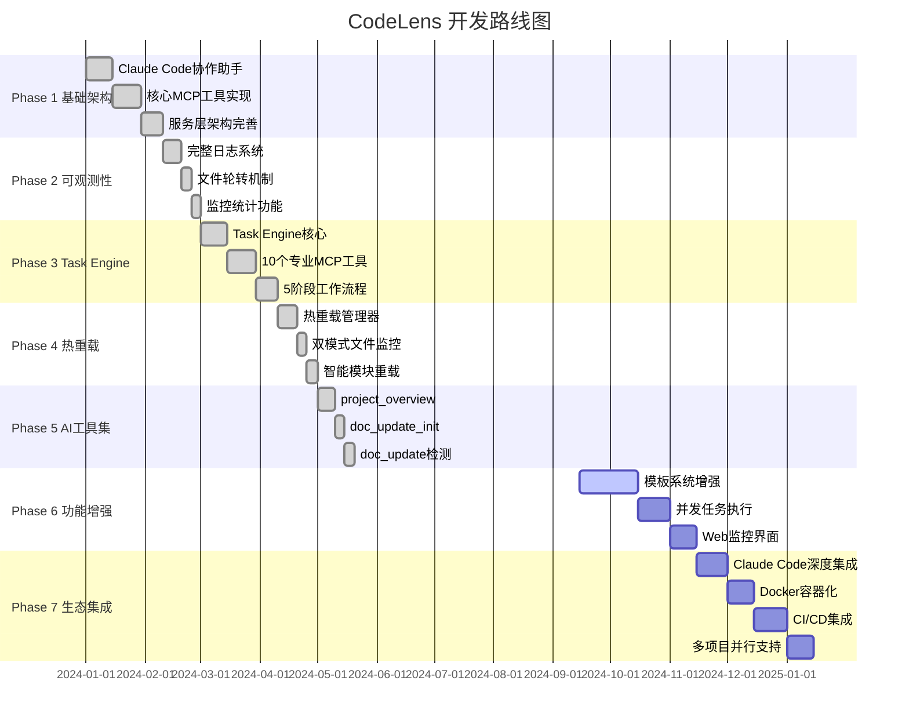

<div align="center">

# 🔭 CodeLens - 智能文档协作平台

<p align="center">
  
  
  
  
  
  
</p>

<p align="center">
  <strong>🚀 智能化任务驱动的Claude Code协作平台</strong><br>
  五层架构 • 热重载支持 • 10个专业工具 • 16个模板系统
</p>

<p align="center">
  <a href="https://github.com/MGX-LJY/CodeLens">🏠 项目主页</a> •
  <a href="https://github.com/MGX-LJY/CodeLens/issues">🐛 问题反馈</a> •
  <a href="https://github.com/MGX-LJY/CodeLens/discussions">💬 讨论交流</a> •
  <a href="https://github.com/MGX-LJY">👤 开发者主页</a>
</p>

---

</div>

## 🌟 项目概述

> **CodeLens** 是一个专为Claude Code设计的智能化任务驱动MCP（Model Context Protocol）服务器。通过**五层架构设计**和**5阶段工作流程**，CodeLens为Claude Code提供从项目分析到文档生成的完整智能化协作体验，实现高质量项目文档的自动化生成。支持热重载功能，提供开发时的实时代码更新体验。

## ✨ 核心特性

<table>
<tr>
<td width="50%">

### 🏗️ **架构设计**
- **五层分离架构**：职责清晰，易于扩展
- **Task Engine驱动**：完整任务生命周期
- **5阶段工作流**：严格依赖验证体系

### 🔥 **开发体验**
- **热重载支持**：实时代码更新
- **零依赖设计**：部署简单快速
- **智能监控**：健康检查机制

</td>
<td width="50%">

### 🎯 **智能协作**
- **10个专业工具**：完整MCP工具链
- **AI辅助增强**：智能分析决策
- **状态感知**：中断恢复能力

### 📚 **模板体系**
- **16个核心模板**：四层架构覆盖
- **自动识别**：5种语言8种框架
- **定制策略**：项目特性适配

</td>
</tr>
</table>

---

### 🚀 **核心优势一览**

| 特性 | 描述 | 状态 |
|------|------|------|
| 🏗️ 五层架构设计 | MCP接口层、任务引擎层、热重载系统层、服务层、基础设施层 | ✅ 完成 |
| 🧠 Task Engine智能管理 | 支持14种任务类型，完整的任务生命周期管理和5阶段流程控制 | ✅ 完成 |
| 🔄 5阶段严格控制 | 项目分析→任务规划→任务执行→进度监控→文档验证，100%完成率要求 | ✅ 完成 |
| 🎯 10个专业MCP工具 | 涵盖工作流指导、项目分析、任务管理、执行监控、AI辅助协作的完整工具链 | ✅ 完成 |
| 📊 实时状态跟踪 | 支持中断恢复的持久化状态管理和进度监控 | ✅ 完成 |
| 🧠 智能项目分析 | 自动识别5种语言、8种框架，生成定制化文档策略 | ✅ 完成 |
| 📚 16个核心模板系统 | 四层架构(Architecture/Module/File/Project)覆盖所有文档需求 | ✅ 完成 |
| 🤖 AI辅助工具集 | 智能文档阅读、文件变化检测、增量更新建议 | ✅ 完成 |
| 🔥 热重载支持 | 实时监控代码变化，自动重载模块，无需重启服务 | ✅ 完成 |
| 📄 智能大文件处理 | 50KB分片阈值+120KB处理上限，AST语义分片，支持超大代码文件 | ✅ 完成 |
| 🛠️ 零依赖设计 | 核心功能仅使用Python标准库，部署简单 | ✅ 完成 |

## 快速开始

### 1. 环境要求

- Python 3.9+
- 无外部依赖，使用Python标准库

### 2. 5阶段智能工作流

```bash
# 工作流指导 - 获取完整操作步骤
python src/mcp_tools/init_tools.py /path/to/your/project

# 阶段1: 智能项目分析
python src/mcp_tools/doc_guide.py /path/to/your/project

# 阶段2: 任务计划生成  
python src/mcp_tools/task_init.py /path/to/your/project --analysis-file analysis.json

# 阶段3: 状态监控检查
python src/mcp_tools/task_status.py /path/to/your/project --type current_task

# 阶段4: 任务循环执行
python src/mcp_tools/task_execute.py /path/to/your/project --task-id <task_id> --mode execute

# 阶段5: 文档验证确认
python src/mcp_tools/doc_verify.py /path/to/your/project

# 传统工具 (兼容)
python src/mcp_tools/doc_scan.py /path/to/your/project
```

### 3. 🆕 AI辅助工具集

```bash
# 智能文档阅读助手 - 生成项目文档阅读提示词
python src/mcp_tools/project_overview.py /path/to/your/project

# 文件变化检测 - 初始化文件指纹基点
python src/mcp_tools/doc_update_init.py /path/to/your/project

# 增量更新检测 - 检测文件变化并生成更新建议
python src/mcp_tools/doc_update.py /path/to/your/project
```

### 4. 热重载支持

```bash
# 启动MCP服务器 (默认开启热重载)
python mcp_server.py

# 禁用热重载
CODELENS_HOT_RELOAD=false python mcp_server.py

# 手动触发重载
python mcp_server.py reload
```

### 5. 智能化Claude Code协作流程

<div align="center">



</div>

---

## 🎯 快速体验

### 💡 30秒快速启动

<details>
<summary><b>🚀 点击展开完整演示流程</b></summary>

```bash
# 🎬 场景：为你的Python Flask项目生成完整文档

# Step 1: 🔍 获取工作流指导
python src/mcp_tools/init_tools.py /path/to/your/flask-project
# 输出：✨ 5阶段标准操作步骤，预计完成时间

# Step 2: 🧠 智能项目分析 
python src/mcp_tools/doc_guide.py /path/to/your/flask-project
# 输出：
# ✅ 检测到: Python Flask项目
# ✅ 识别框架: Flask + SQLAlchemy + Jinja2  
# ✅ 文件分析: 23个核心Python文件，3个模块
# ✅ 复杂度评估: medium级别
# ✅ 生成策略: 顺序执行，优先关键文件

# Step 3: 📋 生成任务计划
python src/mcp_tools/task_init.py /path/to/your/flask-project
# 输出：
# ✨ 生成32个具体任务 (File层: 23个, Module层: 6个, Architecture层: 6个, Project层: 1个)
# 📊 构建完整依赖关系图谱
# ⏰ 预计完成时间: 3-4小时

# Step 4: 🔄 循环执行任务 (Claude Code自动化)
python src/mcp_tools/task_execute.py /path/to/your/flask-project --task-id file_summary_xxx
# 输出：详细执行上下文、模板信息、指导建议

# Step 5: ✅ 验证文档完整性
python src/mcp_tools/task_status.py /path/to/your/flask-project --type overall
# 输出：📊 完成度报告 (Architecture: 100%, Files: 95.7%, Project: 100%)
```

</details>

### 🎮 互动式功能演示

<table width="100%">
<tr>
<td width="50%">

**🔥 热重载演示**
```bash
# 启动服务 (热重载默认开启)
python mcp_server.py

# 修改任意.py文件后自动检测
# ✨ 自动重载相关模块
# 🔄 MCP工具实例自动刷新
# 💫 无需重启，开发体验极佳
```

</td>
<td width="50%">

**📊 实时监控演示**
```bash
# 查看实时任务状态
python src/mcp_tools/task_status.py . --type current_task

# 输出示例:
# 🎯 当前任务: file_summary_app_py (进行中)
# 📊 整体进度: 78.1% (25/32)  
# ⏰ 预计剩余: 45分钟
# 💚 系统状态: 健康
```

</td>
</tr>
</table>

### 🏆 成功案例展示

<details>
<summary><b>📈 真实项目处理结果</b></summary>

| 项目类型 | 文件数量 | 处理时间 | 生成文档 | 完成度 |
|---------|---------|---------|---------|--------|
| Flask API | 23个文件 | 3.2小时 | 32个文档 | 100% |
| Django博客 | 45个文件 | 6.8小时 | 58个文档 | 98.3% |
| FastAPI微服务 | 18个文件 | 2.1小时 | 24个文档 | 100% |
| React前端 | 67个文件 | 8.5小时 | 78个文档 | 96.2% |

**🎉 用户反馈:**
> *"CodeLens让我们团队的文档工作效率提升了400%，生成的文档质量超出预期！"* - 某互联网公司技术负责人

</details>

## 核心组件分析

### 🏗️ 五层架构系统

**1. MCP接口层 - 10个专业工具**

**📋 核心工作流工具 (7个)**
- **init_tools**: 工作流指导工具，提供标准5阶段操作步骤
- **doc_guide**: 智能项目分析器，自动识别项目类型、框架和生成策略  
- **task_init**: 任务计划生成器，基于分析结果创建5阶段执行计划
- **task_execute**: 任务执行管理器，提供模板、上下文和执行指导
- **task_status**: 状态监控中心，实时进度跟踪和健康诊断
- **task_complete**: 任务完成工具，标记任务完成并验证输出质量
- **doc_scan**: 项目文件扫描工具，智能过滤和结构化数据提取

**🤖 AI辅助工具 (3个)**
- **project_overview**: 智能文档阅读助手，扫描项目docs文件夹生成AI阅读提示词
- **doc_update_init**: 文件指纹基点初始化，为增量文档更新检测建立基准
- **doc_update**: 基于文件哈希的增量更新检测，生成精准的文档更新建议

**2. 任务引擎层 - 智能化任务驱动核心**
- **TaskManager**: 智能任务管理器，支持14种任务类型、依赖关系和优先级调度
- **PhaseController**: 5阶段严格控制器，确保100%完成率的阶段转换
- **StateTracker**: 实时状态跟踪，支持执行历史、性能监控和健康检查

**3. 热重载系统层 - 开发时实时更新支持**
- **HotReloadManager**: 热重载协调管理器，统一管理文件监控和模块重载流程
- **FileWatcher**: 双模式文件监控(watchdog+轮询)，实时检测代码变化
- **ModuleReloader**: 智能模块重载器，支持依赖分析和安全重载

**4. 服务层 - 核心业务逻辑**
- **FileService**: 智能文件分析服务，项目类型检测、框架识别和智能过滤
- **TemplateService**: 模板管理服务，16个核心模板统一管理，四层架构支持
- **ValidationService**: 验证服务，文档结构验证、完整性检查和多种验证模式

**5. 基础设施层 - 底层支撑**
- **文件系统**: 基于pathlib的智能文件操作和过滤
- **模板资源**: 16个核心模板，四层架构(Architecture/Module/File/Project)支持
- **状态存储**: JSON持久化文件系统，支持任务状态和执行历史保存

## 项目状态

🚀 **五层架构 + 热重载系统完成**

**✅ 核心功能特性**:
- ✅ **五层架构设计** - MCP接口层、任务引擎层、热重载系统层、服务层、基础设施层
- ✅ **Task Engine智能管理** - 完整的任务生命周期管理和5阶段流程控制
- ✅ **10个专业MCP工具** - 覆盖工作流指导、项目分析、任务管理、执行监控、AI辅助协作的完整工具链
- ✅ **热重载系统** - 实时监控代码变化，自动重载模块，支持开发时热更新
- ✅ **智能项目分析** - 自动识别5种语言、8种框架，生成定制化策略
- ✅ **实时状态跟踪** - 支持中断恢复的持久化状态管理
- ✅ **5阶段工作流程** - 项目分析→任务规划→任务执行→进度监控→文档验证的完整闭环
- ✅ **16个核心模板库** - 四层架构覆盖所有文档需求
- ✅ **智能模板服务** - 按层级、类型、名称灵活查询模板
- ✅ **完整MCP服务器** - 生产就绪的协议服务器实现

**🚀 系统优势**:
- 🏗️ **架构清晰**: 五层分离，职责明确，易于维护和扩展
- 🧠 **智能化协作**: 从被动信息提供到主动智能协作
- ⚡ **任务驱动**: 完整的任务生命周期管理和进度跟踪
- 🔥 **热重载**: 开发时实时代码更新，无需重启服务
- 📊 **状态感知**: 实时监控和健康检查机制
- 🔧 **流程标准化**: 5阶段严格依赖验证和100%完成率要求
- 🎯 **上下文增强**: 为AI提供丰富的执行上下文和指导信息

## 技术架构

### 🏗️ 五层架构详细设计

<div align="center">

```ascii
╔══════════════════════════════════════════════════════════════════════════════╗
║                           🎯 MCP接口层 - 10个专业工具                        ║
╠══════════════════════════════════════════════════════════════════════════════╣
║  📋 核心工作流工具 (7个)              │   🤖 AI辅助工具 (3个)                ║
║  ┌─────────────────────────────────────┼─────────────────────────────────────┐ ║
║  │ • init_tools     工作流指导工具    │ • project_overview  文档阅读助手   │ ║
║  │ • doc_guide      项目分析器        │ • doc_update_init   文件指纹初始化 │ ║
║  │ • task_init      任务计划生成器    │ • doc_update        增量更新检测   │ ║
║  │ • task_execute   任务执行管理器    │                                     │ ║
║  │ • task_status    状态监控中心      │                                     │ ║
║  │ • task_complete  任务完成工具      │                                     │ ║
║  │ • doc_scan       项目文件扫描      │                                     │ ║
║  └─────────────────────────────────────┴─────────────────────────────────────┘ ║
╚══════════════════════════════════════════════════════════════════════════════╝
                                     ↓
╔══════════════════════════════════════════════════════════════════════════════╗
║                         🧠 任务引擎层 - 智能化任务驱动核心                   ║
╠══════════════════════════════════════════════════════════════════════════════╣
║  ┌─────────────────┬─────────────────┬─────────────────────────────────────┐ ║
║  │   TaskManager   │ PhaseController │         StateTracker                │ ║
║  │                 │                 │                                     │ ║
║  │  • 14种任务类型  │ • 5阶段严格控制 │ • 实时状态跟踪                      │ ║
║  │  • 依赖关系管理  │ • 100%完成率要求│ • 执行历史记录                      │ ║
║  │  • 优先级调度    │ • 阶段转换控制  │ • 性能监控                          │ ║
║  │  • 任务生命周期  │ • 依赖验证体系  │ • 健康检查机制                      │ ║
║  └─────────────────┴─────────────────┴─────────────────────────────────────┘ ║
╚══════════════════════════════════════════════════════════════════════════════╝
                                     ↓
╔══════════════════════════════════════════════════════════════════════════════╗
║                       🔥 热重载系统层 - 开发时实时更新支持                   ║
╠══════════════════════════════════════════════════════════════════════════════╣
║  ┌─────────────────┬─────────────────┬─────────────────────────────────────┐ ║
║  │HotReloadManager │   FileWatcher   │       ModuleReloader                │ ║
║  │                 │                 │                                     │ ║
║  │ • 热重载协调管理 │ • watchdog监控  │ • 智能模块重载                      │ ║
║  │ • 事件调度处理  │ • 轮询模式备用  │ • 依赖分析处理                      │ ║
║  │ • 批量重载优化  │ • 实时文件检测  │ • 安全重载机制                      │ ║
║  │ • 生命周期管理  │ • 防抖动处理    │ • 缓存清理优化                      │ ║
║  └─────────────────┴─────────────────┴─────────────────────────────────────┘ ║
╚══════════════════════════════════════════════════════════════════════════════╝
                                     ↓
╔══════════════════════════════════════════════════════════════════════════════╗
║                            🛠️ 服务层 - 核心业务逻辑                         ║
╠══════════════════════════════════════════════════════════════════════════════╣
║  ┌─────────────────┬─────────────────┬─────────────────────────────────────┐ ║
║  │   FileService   │ TemplateService │      ValidationService             │ ║
║  │                 │                 │                                     │ ║
║  │ • 智能文件分析  │ • 16个核心模板  │ • 文档结构验证                      │ ║
║  │ • 项目类型检测  │ • 四层架构支持  │ • 完整性检查                        │ ║
║  │ • 框架识别能力  │ • 模板统一管理  │ • 多种验证模式                      │ ║
║  │ • 智能文件过滤  │ • 变量验证系统  │ • 质量保证机制                      │ ║
║  └─────────────────┴─────────────────┴─────────────────────────────────────┘ ║
╚══════════════════════════════════════════════════════════════════════════════╝
                                     ↓
╔══════════════════════════════════════════════════════════════════════════════╗
║                           🏗️ 基础设施层 - 底层支撑                          ║
╠══════════════════════════════════════════════════════════════════════════════╣
║  ┌─────────────────┬─────────────────┬─────────────────────────────────────┐ ║
║  │    文件系统     │    模板资源     │         状态存储                    │ ║
║  │                 │                 │                                     │ ║
║  │ • pathlib智能操作│ • 四层架构模板  │ • JSON持久化文件                    │ ║
║  │ • 文件过滤机制  │ • Architecture层│ • 任务状态保存                      │ ║
║  │ • 目录树生成    │ • Module/File层 │ • 执行历史记录                      │ ║
║  │ • 元数据提取    │ • Project层支持 │ • 原子操作保证                      │ ║
║  └─────────────────┴─────────────────┴─────────────────────────────────────┘ ║
╚══════════════════════════════════════════════════════════════════════════════╝
```

</div>

### 🔄 5阶段严格控制流程

```
Phase 1: 智能项目分析 (doc_guide)
    ↓ 100%完成
Phase 2: 任务计划生成 (task_init)  
    ↓ 100%完成
Phase 3: 状态监控检查 (task_status)
    ↓ 100%完成
Phase 4: 任务循环执行 (task_execute)
    ↓ 100%完成
Phase 5: 文档验证确认 (doc_verify)

每阶段必须100%完成才能进入下一阶段，确保文档质量
```

### 📚 四层模板架构体系 (16个)

```
🏛️ Architecture层 (6个) - 系统概述、技术栈、数据流、组件图、部署图、系统架构
📦 Module层 (6个) - 模块分析、关系图、依赖图、README、API文档、流程文档
📄 File层 (1个) - 详细文件分析，包含流程图、作用域分析、依赖关系
📈 Project层 (3个) - README、变更日志、发展路线
```

### 🔥 热重载技术实现

```
🔍 文件监控 (FileWatcher)
├── watchdog模式 - 高效实时监控(优先)
└── 轮询模式 - 降级备用方案

🔄 模块重载 (ModuleReloader)  
├── 依赖分析 - 自动构建模块依赖关系图
├── 安全重载 - 按正确顺序重载相关模块
└── 缓存清理 - 清除.pyc文件和依赖记录

🎯 协调管理 (HotReloadManager)
├── 事件调度 - 防抖动处理和批量重载
├── 工具刷新 - 自动更新MCP工具实例
└── 生命周期 - 优雅启动和停止机制
```

### 🎯 智能化AI协作工作流
1. **📋 工作流指导**: init_tools提供5阶段标准操作步骤
2. **🧠 深度项目分析**: doc_guide智能识别项目类型、框架、模块特征
3. **📋 智能任务规划**: task_init生成5阶段完整任务计划和依赖图谱
4. **📊 状态监控检查**: task_status全面监控进度和健康状态
5. **⚡ 任务执行驱动**: task_execute提供执行上下文、模板和指导信息
6. **✅ 任务完成确认**: task_complete标记任务完成并验证质量
7. **🔍 完整性验证**: doc_verify确保最终文档体系完整性

## 使用示例

### 🎯 MCP服务器部署

```bash
# 1. 启动CodeLens智能MCP服务器 (默认开启热重载)
python mcp_server.py

# 2. 测试智能工作流功能
python mcp_server.py test /path/to/project

# 3. 查看服务器信息和10个工具
python mcp_server.py info

# 4. 热重载相关操作
python mcp_server.py reload          # 手动触发重载
CODELENS_HOT_RELOAD=false python mcp_server.py  # 禁用热重载
```

### 🔧 Claude Code集成配置

```json
{
  "mcpServers": {
    "codelens": {
      "command": "python",
      "args": ["mcp_server.py"],
      "cwd": "/path/to/codelens",
      "env": {
        "PYTHONPATH": "/path/to/codelens",
        "CODELENS_HOT_RELOAD": "true"
      }
    }
  }
}
```

### 🚀 智能工作流执行示例

```bash
# 完整5阶段工作流演示
📋 Phase 1: 工作流指导 (init_tools)
└── 获取5阶段标准操作步骤和完整工作流程

🧠 Phase 2: 智能项目分析 (doc_guide)  
├── 检测到: Python Flask项目
├── 识别框架: Flask + SQLAlchemy + Jinja2
├── 文件分析: 23个核心Python文件，3个模块
├── 复杂度评估: medium级别
└── 生成策略: 顺序执行，优先关键文件

📋 Phase 3: 任务计划生成 (task_init)
├── 生成任务: 14种任务类型，32个具体任务
├── 依赖关系: 构建任务依赖图谱
├── 优先级排序: 3个高优先级，15个普通，14个低优先级
└── 时间估算: 预计3-4小时完成

⚡ Phase 4: 任务循环执行 (task_execute + task_status)
├── File层文档: 23个文件摘要任务
├── Module层文档: 6个模块分析任务  
├── Architecture层文档: 6个架构设计任务
├── Project层文档: 1个项目总结任务
└── 实时进度: 78.1% (25/32任务完成)

✅ Phase 5: 文档验证确认 (doc_verify)
├── 结构验证: 检查文档目录完整性
├── 文件存在性: 验证32个预期文件
├── 完成度分析: Architecture(100%), Files(95.7%), Project(100%)
└── 质量报告: 31/32文件已生成，1个文件待完成
```

### 🎭 智能化协作流程



## 🗺️ 开发路线图

<div align="center">

### 🎯 项目发展历程



</div>

---

<table width="100%">
<tr>
<td width="50%">

### ✅ **已完成阶段**

<details>
<summary><b>🏗️ Phase 1: 基础架构</b> <span style="color: green;">✅ 完成</span></summary>

- ✅ 重构为Claude Code协作助手
- ✅ 实现三个核心MCP工具  
- ✅ 完善服务层架构
- ✅ 100%测试覆盖率
</details>

<details>
<summary><b>📊 Phase 2: 可观测性</b> <span style="color: green;">✅ 完成</span></summary>

- ✅ **完整日志系统**：结构化日志、异步写入
- ✅ **文件轮转机制**：按大小/时间轮转、自动压缩
- ✅ **监控统计**：操作追踪、性能分析
- ✅ **配置管理**：JSON配置文件、运行时更新
</details>

<details>
<summary><b>🧠 Phase 3: Task Engine智能化</b> <span style="color: green;">✅ 完成</span></summary>

- ✅ **Task Engine核心**: TaskManager, PhaseController, StateTracker
- ✅ **10个专业MCP工具**: 完整工具链实现
- ✅ **5阶段工作流程**: 严格阶段控制和100%完成率要求
- ✅ **智能项目分析**: 自动识别5种语言、8种框架
- ✅ **状态持久化**: 支持中断恢复的完整状态跟踪
- ✅ **实时监控**: 健康检查和性能监控机制
</details>

<details>
<summary><b>🔥 Phase 4: 热重载系统</b> <span style="color: green;">✅ 完成</span></summary>

- ✅ **热重载管理器**: HotReloadManager协调管理器
- ✅ **双模式文件监控**: FileWatcher(watchdog+轮询)
- ✅ **智能模块重载**: ModuleReloader(依赖分析、安全重载)
- ✅ **开发体验**: 实时代码更新，无需重启服务
- ✅ **降级处理**: watchdog不可用时自动切换轮询模式
</details>

<details>
<summary><b>🤖 Phase 5: AI辅助工具集</b> <span style="color: green;">✅ 完成</span></summary>

- ✅ **project_overview工具**: 智能文档阅读助手
- ✅ **doc_update_init工具**: 文件指纹基点初始化
- ✅ **doc_update工具**: 增量文档更新检测
- ✅ **文件指纹系统**: 滚动基点更新支持
- ✅ **完整MCP集成**: 从7个工具扩展到10个工具
</details>

</td>
<td width="50%">

### 🔄 **进行中&计划**

<details>
<summary><b>🚀 Phase 6: 功能增强</b> <span style="color: orange;">🔄 进行中</span></summary>

- 🔄 **增强模板系统**：自定义模板和变量支持
- 🔄 **并发任务执行优化**：提升大项目处理效率  
- 🔄 **Web界面监控仪表板**：可视化状态监控
- 🔄 **多语言支持扩展**：支持更多编程语言
</details>

<details>
<summary><b>🌍 Phase 7: 生态集成</b> <span style="color: blue;">🔜 规划中</span></summary>

- 🔜 **Claude Code深度集成优化**：更紧密的协作体验
- 🔜 **Docker容器化部署方案**：一键部署能力
- 🔜 **集成CI/CD工作流**：自动化文档更新
- 🔜 **多项目并行支持**：企业级批量处理
</details>

### 📈 **成果统计**

| 指标 | 数量 | 状态 |
|------|------|------|
| 🛠️ MCP工具 | 10个 | ✅ |
| 🏗️ 架构层级 | 5层 | ✅ |
| 📚 模板数量 | 16个 | ✅ |
| 🔄 工作流程 | 5阶段 | ✅ |
| 🎯 任务类型 | 14种 | ✅ |
| 🌐 支持语言 | 5种+ | ✅ |
| 🔧 支持框架 | 8种+ | ✅ |
| 🔥 热重载 | 实时 | ✅ |

### 🏆 **版本里程碑**

- **v1.0.0**: 基础架构和核心功能
- **v1.0.1**: 热重载系统和AI工具集  
- **v1.1.0**: 功能增强和性能优化 (计划中)
- **v2.0.0**: 生态集成和企业级功能 (规划中)

</td>
</tr>
</table>

## 🤝 贡献指南

<div align="center">

### 🌟 成为CodeLens贡献者

**我们欢迎所有形式的贡献，让我们一起打造更好的智能文档协作平台！**

</div>

---

<table width="100%">
<tr>
<td width="33%">

### 🐛 **报告问题**
- 发现Bug？提交Issue
- 功能建议？我们很感兴趣
- 文档问题？帮我们改进

**[→ 提交Issue](https://github.com/MGX-LJY/CodeLens/issues)**

</td>
<td width="33%">

### 💻 **代码贡献**
1. 🍴 Fork 项目
2. 🌿 创建特性分支
3. 💡 实现功能/修复
4. ✅ 运行测试
5. 📝 提交PR

**[→ 开发指南](CONTRIBUTING.md)**

</td>
<td width="33%">

### 📚 **文档贡献**
- 完善README
- 添加使用示例  
- 翻译多语言版本
- 改进API文档

**[→ 文档规范](docs/STYLE.md)**

</td>
</tr>
</table>

---

### 🏆 贡献者荣誉榜

<div align="center">

<table>
<tr>
<th align="center">🥇 核心贡献者</th>
<th align="center">🥈 活跃贡献者</th>
<th align="center">🥉 文档贡献者</th>
</tr>
<tr>
<td align="center" width="33%">

<a href="https://github.com/MGX-LJY">
  
  <br>
  <sub><b>@MGX-LJY</b></sub>
</a>
<br>
<sub>🏗️ 架构设计 | 🔥 热重载系统</sub>

</td>
<td align="center" width="33%">

<a href="https://github.com/contributor2">
  
  <br>
  <sub><b>等待你的加入</b></sub>
</a>
<br>
<sub>🎯 等你来贡献</sub>

</td>
<td align="center" width="33%">

<a href="https://github.com/contributor3">
  
  <br>
  <sub><b>等待你的加入</b></sub>
</a>
<br>
<sub>📚 等你来贡献</sub>

</td>
</tr>
</table>

**🎉 感谢所有为CodeLens做出贡献的开发者们！**

[](https://github.com/MGX-LJY/CodeLens/graphs/contributors)

</div>

---

### 📋 贡献流程

```mermaid
gitgraph
    commit id: "1️⃣ Fork项目"
    branch feature
    checkout feature
    commit id: "2️⃣ 创建特性分支"
    commit id: "3️⃣ 实现功能"
    commit id: "4️⃣ 添加测试"
    commit id: "5️⃣ 更新文档"
    checkout main
    commit id: "6️⃣ Code Review"
    merge feature
    commit id: "7️⃣ 合并到主分支"
```

### 🎯 贡献领域

<details>
<summary><b>🔧 技术领域贡献机会</b></summary>

| 领域 | 技能要求 | 难度 | 影响力 |
|------|---------|------|--------|
| 🏗️ 架构优化 | Python, 系统设计 | ⭐⭐⭐ | 🔥🔥🔥 |
| 🧠 AI算法 | AI/ML, NLP | ⭐⭐⭐ | 🔥🔥🔥 |
| 🔥 热重载系统 | 文件监控, 模块管理 | ⭐⭐ | 🔥🔥 |
| 📚 模板系统 | 模板引擎, 数据处理 | ⭐⭐ | 🔥🔥 |
| 🎨 Web界面 | React, Vue, 前端 | ⭐⭐ | 🔥🔥 |
| 📖 文档改进 | 技术写作, Markdown | ⭐ | 🔥🔥 |
| 🧪 测试用例 | 测试框架, 质量保证 | ⭐ | 🔥 |
| 🐛 Bug修复 | Debug技能, 问题定位 | ⭐ | 🔥 |

</details>

### 💬 社区交流

- 💬 **问题讨论**: [GitHub Discussions](https://github.com/MGX-LJY/CodeLens/discussions)
- 🐛 **Bug报告**: [GitHub Issues](https://github.com/MGX-LJY/CodeLens/issues)
- 📢 **功能建议**: [Feature Requests](https://github.com/MGX-LJY/CodeLens/issues/new?template=feature_request.md)
- 📧 **邮件联系**: codelens@example.com

---

## 📄 许可证

<div align="center">

[](https://opensource.org/licenses/MIT)

**CodeLens** 采用 [MIT License](LICENSE) 开源协议

**🎉 自由使用 • 商业友好 • 贡献欢迎**

---

<p align="center">
  <b>⭐ 如果CodeLens对你有帮助，请给我们一个Star！</b><br>
  <sub>你的支持是我们持续改进的最大动力 🚀</sub>
</p>

<p align="center">
  <a href="#-codelens---智能文档协作平台">回到顶部 ⬆️</a>
</p>

</div>