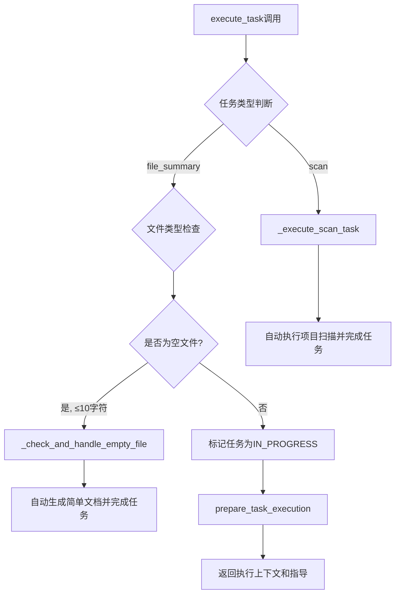
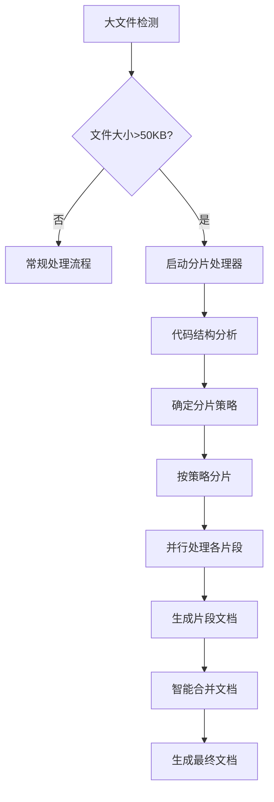

# CodeLens大文件分片处理方案分析

## 📋 概述

本文档分析CodeLens系统中大文件处理的现状、挑战和基于分片处理的解决方案。重点关注如何在现有任务执行流程中集成智能分片处理，以支持几千行甚至几万行的大型代码文件。

---

## 🔍 现有系统分析

### 当前任务执行流程



### 现有文件服务限制

**FileService.read_file_safe()** `src/services/file_service.py:89-106`
```python
def read_file_safe(self, file_path: str, max_size: int = 50000) -> Optional[str]:
    # 检查文件大小
    file_size = file_path.stat().st_size
    if file_size > max_size:  # 默认50KB限制
        print(f"Warning: File {file_path} is too large ({file_size} bytes), skipping")
        return None  # 直接跳过大文件
```

**问题分析:**
1. **硬性50KB限制** - 超过直接跳过，无法处理
2. **无分片能力** - 不支持分块读取
3. **无结构分析** - 缺乏代码结构理解
4. **处理中断** - 大文件导致整个文档生成失败

---

## 💡 分片处理方案设计

### 核心思想

基于**分片处理 + 智能合并**的策略，按照代码结构的语义边界进行分片，而不是简单的字节切分。

### 整体架构



---

## 🐍 Python文件分片策略

### 分层分片原则

#### **第一层：模块级分片**
```python
# 大文件结构示例
class DataProcessor:      # 片段1: DataProcessor类
    def __init__(self): pass
    def process(self): pass
    # ... 500行代码

class APIHandler:         # 片段2: APIHandler类  
    def get(self): pass
    def post(self): pass
    # ... 800行代码

def utility_function():   # 片段3: 模块级函数组
    pass

# 模块级变量和常量    # 片段4: 模块级定义
CONFIG = {...}
```

**分片策略:**
- 每个**类定义**作为一个独立片段
- 所有**模块级函数**合并为一个片段  
- **模块级变量/常量**作为一个片段
- **导入语句**保留在每个片段中

#### **第二层：类内方法分片**
当单个类仍然过大（>30KB）时：
```python
class LargeClass:
    # 片段A: 构造和基础方法
    def __init__(self): pass
    def __repr__(self): pass
    
    # 片段B: 核心业务方法组1
    def process_data(self): pass
    def validate_data(self): pass
    
    # 片段C: 核心业务方法组2  
    def save_results(self): pass
    def export_data(self): pass
    
    # 片段D: 辅助方法
    def _helper1(self): pass
    def _helper2(self): pass
```

### Python分片实现

```python
class PythonChunker:
    def chunk_by_classes(self, content: str) -> List[CodeChunk]:
        """按类定义分片"""
        tree = ast.parse(content)
        chunks = []
        
        # 提取导入语句（每个片段都需要）
        imports = self._extract_imports(tree)
        
        # 按类分片
        for node in ast.walk(tree):
            if isinstance(node, ast.ClassDef):
                chunk_content = imports + self._extract_class_code(node, content)
                chunks.append(CodeChunk(
                    id=f"class_{node.name}",
                    content=chunk_content,
                    type="class",
                    name=node.name,
                    line_range=(node.lineno, node.end_lineno)
                ))
        
        # 模块级函数和变量
        module_level = self._extract_module_level_code(tree, content)
        if module_level:
            chunks.append(CodeChunk(
                id="module_level",
                content=imports + module_level,
                type="module",
                name="模块级定义"
            ))
            
        return chunks
```

---

## 🌐 其他语言分片策略

### JavaScript/TypeScript
```javascript
// 分片策略
export class ComponentA { }     // 片段1: ComponentA类
export class ComponentB { }     // 片段2: ComponentB类

export function utilA() { }     // 片段3: 导出函数组
export function utilB() { }

const config = { };             // 片段4: 模块级定义和类型
type UserType = { };
```

**特点:**
- 按**类/接口**分片
- **导出函数**按相关性分组
- **类型定义**和**常量**合并处理

### Java
```java
// Java通常一个文件一个主类，分片策略：
public class MainClass {
    // 片段1: 静态成员和常量
    static final String CONFIG = "";
    
    // 片段2: 构造方法和基础方法
    public MainClass() { }
    
    // 片段3: 业务方法组1
    public void businessMethod1() { }
    
    // 片段4: 业务方法组2  
    public void businessMethod2() { }
    
    // 片段5: 内部类
    static class InnerClass { }
}
```

### C/C++
```cpp
// 分片策略
// 片段1: 包含和宏定义
#include <iostream>
#define MAX_SIZE 1000

// 片段2: 结构体和类型定义
struct DataStruct { };
typedef int DataType;

// 片段3: 类定义
class ProcessorClass {
    // 如果类过大，按public/private/protected分片
};

// 片段4: 全局函数
void globalFunction1() { }
void globalFunction2() { }
```

### Go
```go
// 分片策略
// 片段1: 包声明和导入
package main
import "fmt"

// 片段2: 类型定义
type User struct { }
type Handler interface { }

// 片段3: 方法组（按接收者分组）
func (u *User) GetName() string { }
func (u *User) SetName(name string) { }

// 片段4: 包级函数
func ProcessData() { }
func ValidateInput() { }
```

---

## 🔧 与FileService集成方案

### 扩展FileService

```python
# 在FileService中添加分片读取能力
class FileService:
    def __init__(self):
        # ... 现有初始化
        self.chunker_factory = ChunkerFactory()  # 新增：分片处理工厂
    
    def read_file_chunked(self, file_path: str, 
                         chunk_strategy: str = "auto") -> List[CodeChunk]:
        """分片读取大文件"""
        if not self.is_large_file(file_path):
            # 小文件直接返回单个chunk
            content = self.read_file_safe(file_path, max_size=float('inf'))
            return [CodeChunk.from_content(content)]
        
        # 大文件分片处理
        language = self.detect_language(file_path)
        chunker = self.chunker_factory.get_chunker(language)
        
        # 读取文件（分块读取避免内存问题）
        content = self._read_large_file_streaming(file_path)
        
        # 按语言特定策略分片
        chunks = chunker.chunk_file(content, strategy=chunk_strategy)
        
        return chunks
    
    def is_large_file(self, file_path: str) -> bool:
        """判断是否为大文件（复用现有逻辑）"""
        try:
            path = Path(file_path)
            return path.stat().st_size > 50000  # 50KB阈值
        except:
            return False
```

### ChunkerFactory设计

```python
class ChunkerFactory:
    """分片处理器工厂"""
    
    def __init__(self):
        self.chunkers = {
            'python': PythonChunker(),
            'javascript': JavaScriptChunker(),
            'java': JavaChunker(),
            'cpp': CppChunker(),
            'go': GoChunker(),
            'rust': RustChunker()
        }
    
    def get_chunker(self, language: str) -> BaseChunker:
        return self.chunkers.get(language, GenericChunker())

class CodeChunk:
    """代码片段数据结构"""
    id: str              # 片段唯一标识
    content: str         # 片段内容
    type: str           # 片段类型（class/function/module等）
    name: str           # 片段名称
    line_range: tuple   # 在原文件中的行号范围
    dependencies: List[str]  # 对其他片段的依赖
    metadata: dict      # 额外元数据
```

---

## 🔄 任务执行流程集成

### 集成点位置

在`TaskExecutor.execute_task()`中添加大文件分片处理：

```python
# 在task_execute.py:135-142之间插入
if task.type.value == "file_summary" and task.target_file:
    # 现有：空文件检查
    empty_file_result = self._check_and_handle_empty_file(task_id)
    if empty_file_result:
        return empty_file_result
    
    # 新增：大文件分片处理 
    large_file_result = self._check_and_handle_large_file_with_chunking(task_id)
    if large_file_result:
        return large_file_result
```

### 分片处理方法实现

```python
def _check_and_handle_large_file_with_chunking(self, task_id: str) -> Optional[Dict]:
    """大文件分片处理"""
    task = self.task_manager.get_task(task_id)
    file_path = self.project_path / task.target_file
    
    # 检查是否为大文件
    if not self.file_service.is_large_file(str(file_path)):
        return None
    
    self.logger.info(f"检测到大文件，启动分片处理: {task.target_file}")
    
    # 1. 分片读取
    chunks = self.file_service.read_file_chunked(str(file_path))
    
    # 2. 创建子任务或直接处理
    if len(chunks) <= 3:
        # 片段较少，直接处理
        return self._process_chunks_directly(task_id, chunks)
    else:
        # 片段较多，创建子任务系统
        return self._process_chunks_as_subtasks(task_id, chunks)

def _process_chunks_directly(self, task_id: str, chunks: List[CodeChunk]) -> Dict:
    """直接处理少量片段"""
    task = self.task_manager.get_task(task_id)
    chunk_docs = []
    
    # 并行处理各个片段
    for chunk in chunks:
        chunk_doc = self._generate_chunk_documentation(chunk, task)
        chunk_docs.append(chunk_doc)
    
    # 合并文档
    final_doc = self._merge_chunk_documents(chunk_docs, task.target_file)
    
    # 写入最终文档
    output_path = self.project_path / task.output_path
    output_path.parent.mkdir(parents=True, exist_ok=True)
    
    with open(output_path, 'w', encoding='utf-8') as f:
        f.write(final_doc)
    
    # 完成任务
    self.task_manager.update_task_status(task_id, TaskStatus.COMPLETED)
    self.state_tracker.record_task_event("completed", task_id)
    
    return {
        "success": True,
        "message": f"Large file processed with {len(chunks)} chunks",
        "output_file": str(output_path),
        "task_completed": True,
        "processing_method": "chunked_direct",
        "chunk_info": {
            "total_chunks": len(chunks),
            "chunk_types": [c.type for c in chunks]
        }
    }
```

### 文档合并策略

```python
def _merge_chunk_documents(self, chunk_docs: List[str], filename: str) -> str:
    """智能合并片段文档"""
    
    # 文档头部
    merged_doc = f"# 文件分析报告：{filename}\n\n"
    merged_doc += "## 文件概述\n\n"
    merged_doc += f"这是一个大型文件，采用分片处理方式生成文档。共{len(chunk_docs)}个片段。\n\n"
    
    # 目录
    merged_doc += "## 内容目录\n\n"
    for i, chunk_doc in enumerate(chunk_docs, 1):
        title = self._extract_chunk_title(chunk_doc)
        merged_doc += f"- [{title}](#片段{i}-{title})\n"
    merged_doc += "\n"
    
    # 合并各片段文档
    for i, chunk_doc in enumerate(chunk_docs, 1):
        title = self._extract_chunk_title(chunk_doc)
        merged_doc += f"## 片段{i}: {title}\n\n"
        
        # 移除片段文档的标题，添加内容
        content = self._clean_chunk_doc_for_merge(chunk_doc)
        merged_doc += content + "\n\n"
    
    # 文档尾部
    merged_doc += "---\n\n"
    merged_doc += "*此文档通过CodeLens大文件分片处理技术生成*"
    
    return merged_doc
```

---

## 📊 性能和资源优化

### 内存管理

```python
def _read_large_file_streaming(self, file_path: str) -> str:
    """流式读取大文件，避免内存溢出"""
    content_parts = []
    
    with open(file_path, 'r', encoding='utf-8') as f:
        while True:
            chunk = f.read(8192)  # 8KB块读取
            if not chunk:
                break
            content_parts.append(chunk)
    
    return ''.join(content_parts)
```

### 并行处理

```python
from concurrent.futures import ThreadPoolExecutor

def _process_chunks_parallel(self, chunks: List[CodeChunk]) -> List[str]:
    """并行处理片段"""
    with ThreadPoolExecutor(max_workers=min(4, len(chunks))) as executor:
        chunk_docs = list(executor.map(self._generate_chunk_documentation, chunks))
    return chunk_docs
```

### 缓存策略

```python
def _generate_chunk_documentation(self, chunk: CodeChunk, task: Task) -> str:
    """生成片段文档（支持缓存）"""
    # 计算chunk内容hash作为缓存key
    chunk_hash = hashlib.md5(chunk.content.encode()).hexdigest()
    cache_key = f"chunk_doc_{chunk_hash}"
    
    # 尝试从缓存获取
    cached_doc = self._get_from_cache(cache_key)
    if cached_doc:
        return cached_doc
    
    # 生成新文档
    doc = self._do_generate_chunk_documentation(chunk, task)
    
    # 存入缓存
    self._save_to_cache(cache_key, doc)
    
    return doc
```

---

## 🎯 集成优势

### 最小入侵原则
- **保持现有API兼容** - 不修改现有方法签名
- **渐进式增强** - 在现有流程中添加分片检查点
- **向后兼容** - 小文件继续使用原有处理逻辑

### 智能处理能力
- **语义分片** - 按代码结构分片，不破坏语义完整性
- **自适应策略** - 根据文件大小和结构动态选择分片策略  
- **智能合并** - 保持文档的逻辑连贯性和可读性

### 多语言支持
- **可扩展架构** - 支持多种编程语言的特定分片策略
- **通用后备** - 对未知语言提供通用分片方案
- **结构感知** - 理解不同语言的代码结构特点

---

## 🚀 实施计划

### 阶段1：核心基础 (Week 1-2)
1. 实现`BaseChunker`和`ChunkerFactory`
2. 实现`PythonChunker`（重点）
3. 扩展`FileService`添加分片读取能力

### 阶段2：任务集成 (Week 2-3)  
1. 在`TaskExecutor`中添加大文件检测点
2. 实现直接分片处理流程
3. 实现文档合并逻辑

### 阶段3：多语言支持 (Week 3-4)
1. 实现JavaScript/TypeScript分片器
2. 实现Java分片器
3. 实现C/C++分片器

### 阶段4：优化和测试 (Week 4-5)
1. 性能优化（并行处理、缓存）
2. 错误处理和边界情况
3. 集成测试和文档

---

## 📋 总结

本方案通过**智能分片 + 语义合并**的策略解决大文件处理问题：

✅ **保持系统兼容性** - 在现有架构中最小入侵式集成  
✅ **支持超大文件** - 可处理几千行到几万行的文件  
✅ **多语言支持** - 针对不同语言的专门分片策略  
✅ **智能处理** - 按语义边界分片，保持代码完整性  
✅ **性能优化** - 并行处理、缓存和流式读取  

该方案将大幅提升CodeLens对大型项目和复杂代码文件的处理能力，同时保持现有功能的稳定性。