# CodeLens 数据流设计

## 整体协作流程图

### Claude Code 与 CodeLens 5阶段协作流程

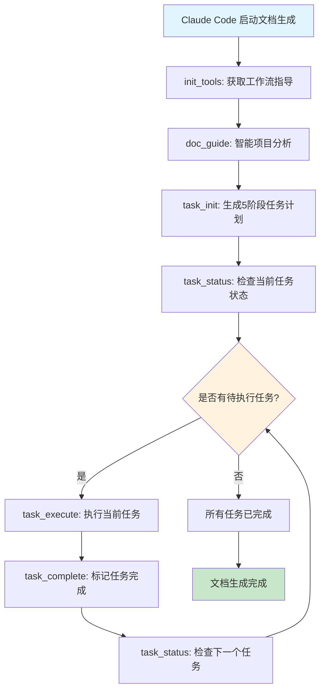

## MCP工具数据流程图

### 7个核心MCP工具协作流程

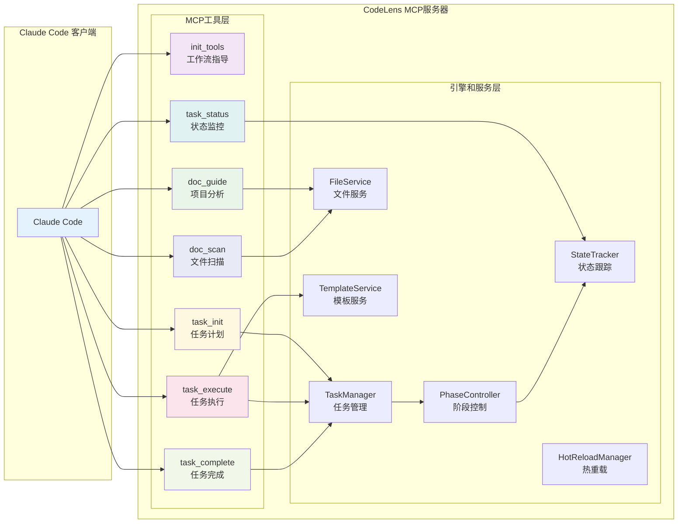

## 5阶段文档生成工作流

### 完整任务执行流程图

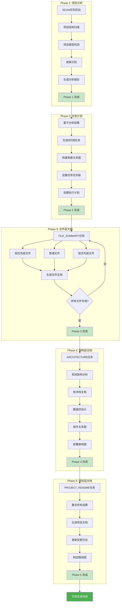

## 任务引擎内部流程图

### TaskManager + PhaseController + StateTracker 协作

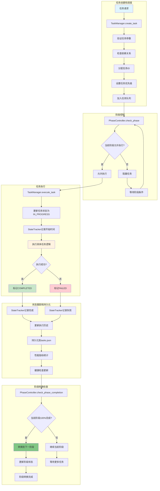

## 热重载系统流程图

### 开发时实时代码更新流程

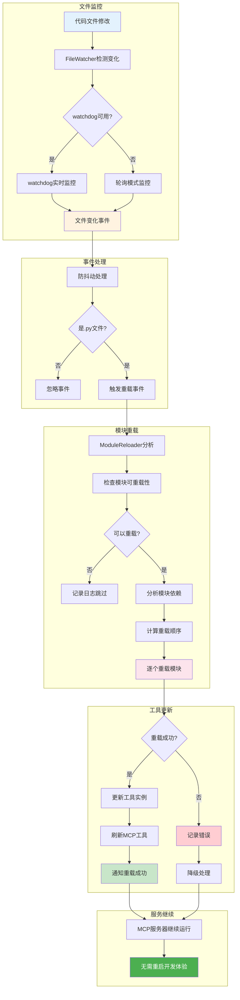

## MCP工具详细数据流

### init_tools 工作流指导

### doc_guide 项目分析流程

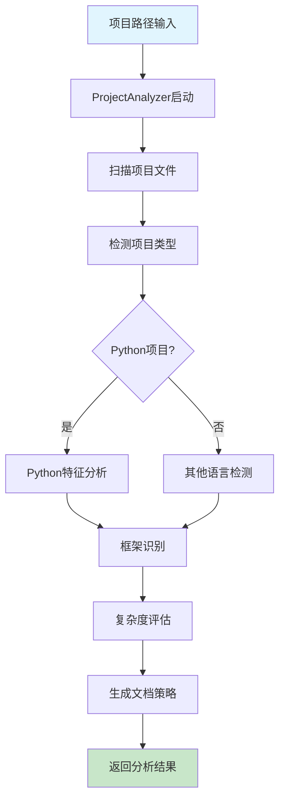

### task_execute 任务执行流程

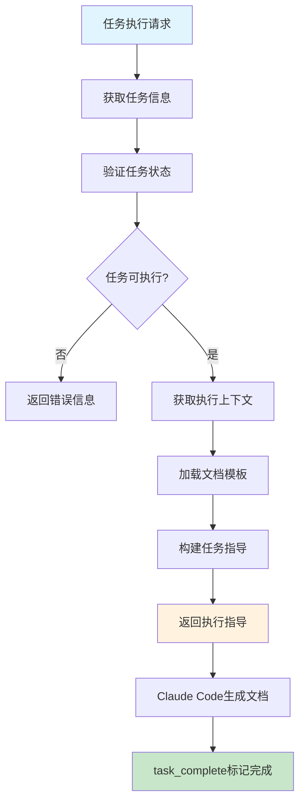

## 数据格式和接口规范

### JSON数据流格式

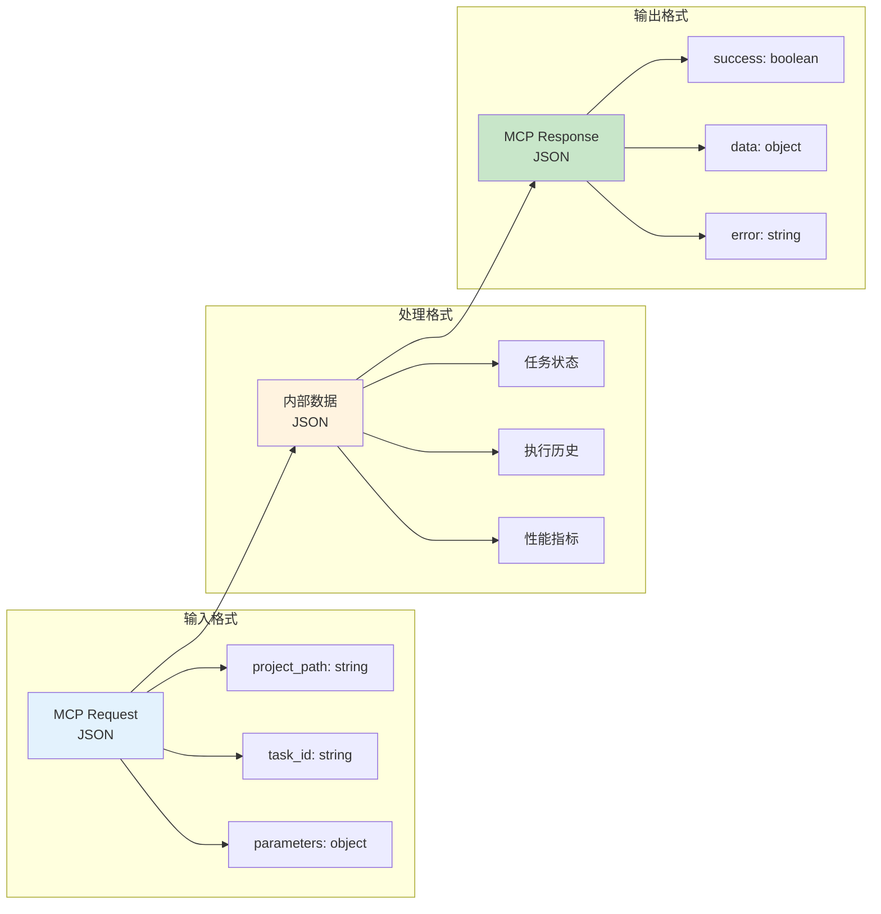

### 状态持久化流程

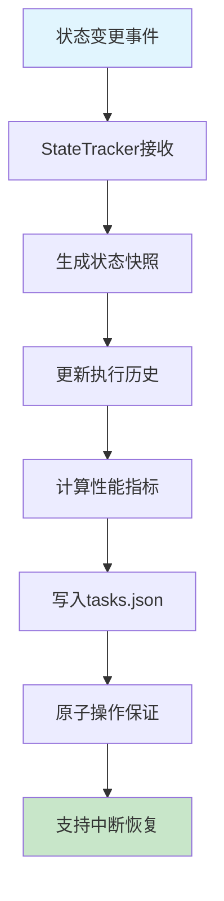

## 性能优化流程

### 智能文件过滤流程

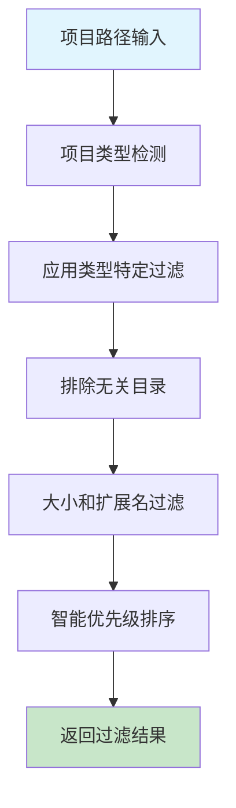

### 任务调度优化流程

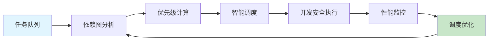

这套流程图设计提供了CodeLens系统完整的数据流可视化，涵盖了从Claude Code协作到内部任务引擎处理的所有关键流程，让整个系统的工作机制一目了然。