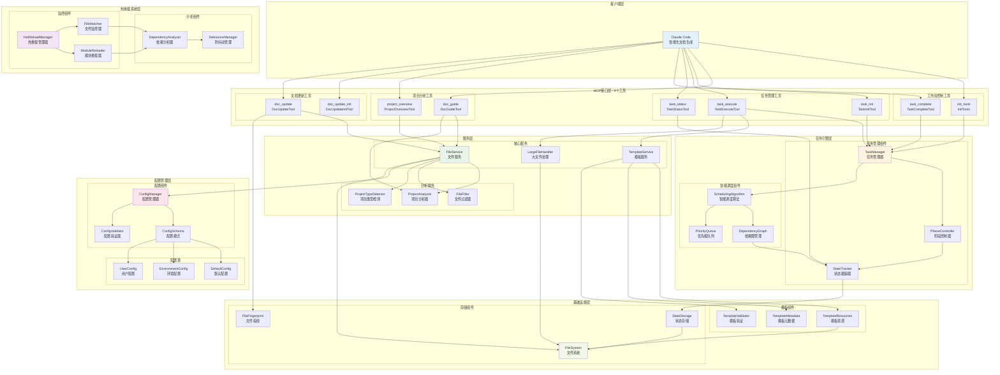

# CodeLens 组件关系图

## 组件层次结构



## 组件详细说明

### 1. 客户端层组件

#### Claude Code
- **功能**: 智能化文档生成客户端
- **接口**: MCP协议标准接口
- **作用**: 与CodeLens协作进行文档生成

### 2. MCP接口层组件

#### 工作流控制工具
- **init_tools**: 提供3阶段标准工作流指导
- **task_complete**: 任务完成验证和质量保证

#### 项目分析工具
- **doc_guide**: 智能项目分析和策略生成
- **project_overview**: 项目概览和文档导航

#### 任务管理工具
- **task_init**: 3阶段任务计划生成
- **task_execute**: 任务执行管理和模板集成
- **task_status**: 实时状态监控和健康检查

#### 文档更新工具
- **doc_update_init**: 建立文件指纹基点
- **doc_update**: 变化检测和更新建议

### 3. 任务引擎层组件

#### 任务管理组件
- **TaskManager**: 8种任务类型管理，生命周期控制
- **PhaseController**: 3阶段严格控制，100%完成率要求
- **StateTracker**: 执行历史、性能监控、健康检查

#### 智能调度组件
- **SchedulingAlgorithm**: 依赖图+优先级的智能调度
- **DependencyGraph**: 任务依赖关系管理
- **PriorityQueue**: 任务优先级队列管理

### 4. 服务层组件

#### 核心服务
- **FileService**: 文件扫描、项目分析（集成原doc_scan功能）
- **TemplateService**: 10个模板的统一管理
- **LargeFileHandler**: AST语义分片处理

#### 分析服务
- **ProjectAnalyzer**: 项目类型检测和复杂度评估
- **FileFilter**: 智能文件过滤和优先级排序
- **ProjectTypeDetector**: 多语言项目类型识别

### 5. 热重载系统层组件

#### 监控组件
- **HotReloadManager**: 热重载流程协调管理
- **FileWatcher**: watchdog/轮询双模式文件监控
- **ModuleReloader**: Python模块安全重载

#### 分析组件
- **DependencyAnalyzer**: 模块依赖关系分析
- **DebounceManager**: 防抖动和批量处理

### 6. 配置管理层组件

#### 配置组件
- **ConfigManager**: 多环境配置管理和动态加载
- **ConfigSchema**: 强类型数据模型和验证
- **ConfigValidator**: 配置完整性和有效性验证

#### 配置源
- **DefaultConfig**: 默认配置模板
- **EnvironmentConfig**: 环境变量配置
- **UserConfig**: 用户自定义配置

### 7. 基础设施层组件

#### 存储组件
- **FileSystem**: pathlib/glob文件系统操作
- **StateStorage**: JSON状态持久化存储
- **FileFingerprint**: 文件变化检测和指纹管理

#### 模板组件
- **TemplateResources**: 10个Markdown模板资源
- **TemplateMetadata**: 模板元数据和变量定义
- **TemplateValidator**: 模板格式验证

## 组件协作模式

### 1. 纵向协作 (层级间)
```
Client → MCP → Engine → Service → Infrastructure
```

### 2. 横向协作 (层级内)
```
同层组件通过接口和事件进行协作
```

### 3. 热重载协作 (侧向)
```
HotReload → Module Update → Component Refresh
```

### 4. 配置协作 (全局)
```
ConfigManager → All Components Configuration
```

## 关键设计原则

### 1. 松耦合
- 组件间通过接口协作，降低耦合度
- 支持组件独立部署和测试

### 2. 可扩展
- 插件化架构支持自定义组件
- 模板系统支持扩展新的文档类型

### 3. 可靠性
- 每个组件都有完整的异常处理
- 状态持久化支持故障恢复

### 4. 高性能
- 组件级缓存和按需加载
- 智能调度减少不必要的计算