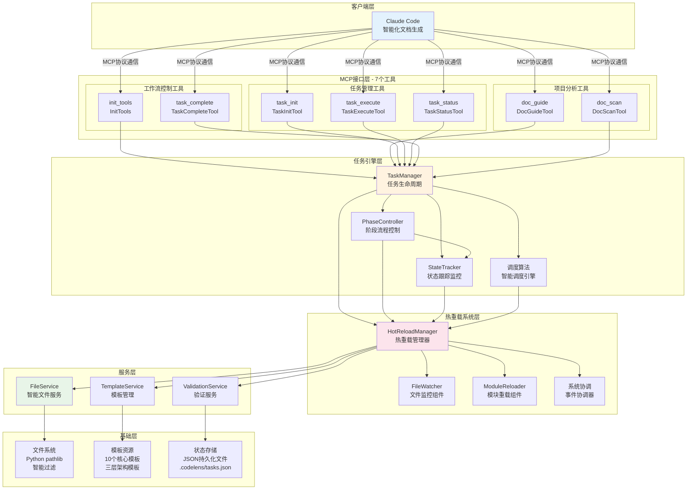
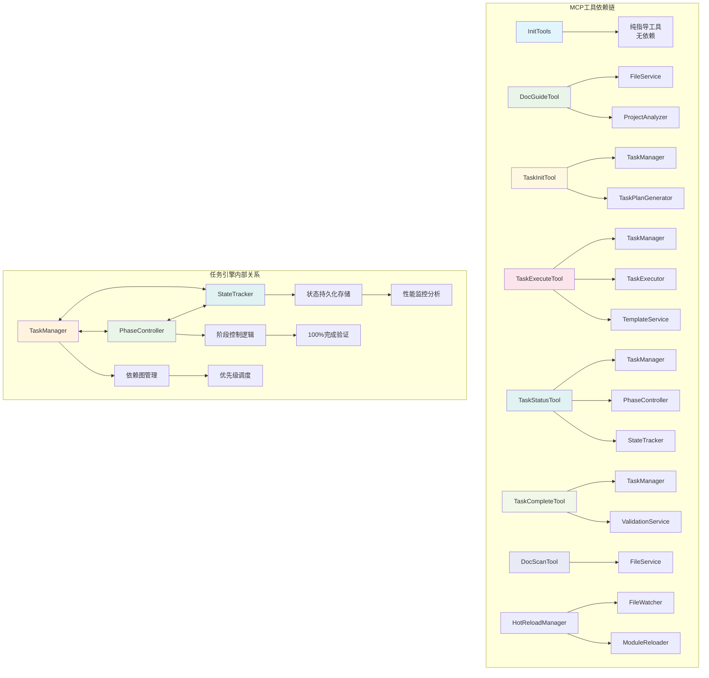
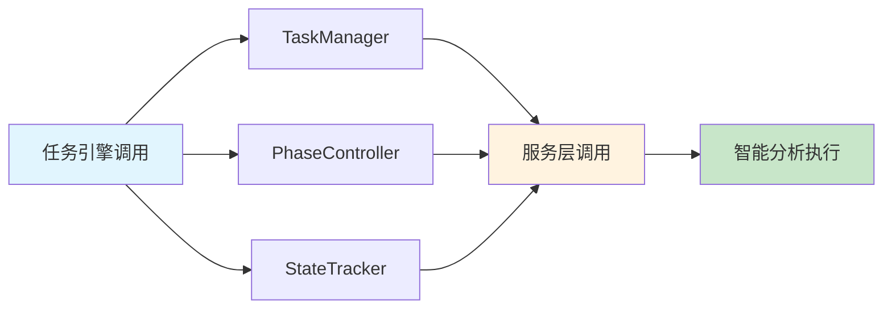
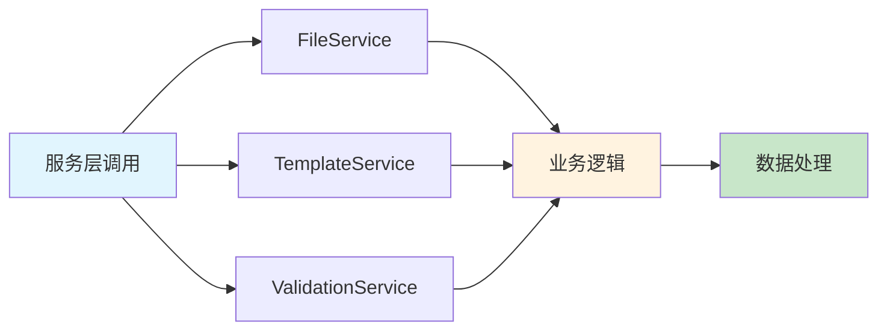

# CodeLens 组件关系图

## 组件层次结构

## 详细组件说明

### 1. **MCP 工具组件** - 对外接口层 (7个专业工具)
- **InitTools**: 工作流指导工具，提供标准5阶段操作步骤指导
- **DocGuideTool**: 智能项目分析器，自动识别项目类型、框架和生成文档策略
- **TaskInitTool**: 任务计划生成器，基于分析结果创建5阶段执行计划
- **TaskExecuteTool**: 任务执行管理器，提供模板、上下文和执行指导
- **TaskStatusTool**: 状态监控中心，实时进度跟踪和健康诊断
- **TaskCompleteTool**: 任务完成工具，标记任务完成并验证输出质量
- **DocScanTool**: 项目文件扫描工具，智能过滤和结构化数据提取

### 2. **任务引擎组件** - 智能化任务驱动核心
- **TaskManager**: 智能任务管理器，支持核心任务类型、依赖关系和优先级调度
- **PhaseController**: 5阶段严格控制器，确保100%完成率的阶段转换
- **StateTracker**: 实时状态跟踪，支持执行历史、性能监控和健康检查
- **调度算法**: 基于依赖关系的DAG调度和优先级算法

### 3. **热重载系统组件** - 开发时实时更新支持
- **HotReloadManager**: 热重载协调管理器，统一管理文件监控和模块重载流程
- **FileWatcher**: 文件监控组件，支持watchdog实时监控和轮询备用方案
- **ModuleReloader**: 模块重载组件，安全重载Python模块，支持依赖分析
- **系统协调**: 事件调度、状态同步、降级处理和性能优化

### 4. **服务组件** - 核心业务逻辑
- **FileService**: 智能文件分析服务，项目类型检测、框架识别和智能过滤
- **TemplateService**: 模板管理服务，10个核心模板统一管理，三层架构支持
- **ValidationService**: 验证服务，文档结构验证、完整性检查和多种验证模式

### 5. **基础组件** - 底层支撑
- **文件系统接口**: 基于 pathlib 的智能文件操作和过滤
- **模板资源**: 10个核心模板，三层架构(Architecture/File/Project)支持
- **状态存储**: JSON持久化文件系统，支持任务状态和执行历史保存

## 组件依赖关系

### 依赖说明
- **MCP 工具** → **任务引擎/服务层**: MCP工具依赖任务引擎和对应服务组件
- **任务引擎组件** → **相互协作**: TaskManager、PhaseController、StateTracker紧密协作
- **任务引擎** → **服务层**: 任务引擎调用FileService、TemplateService、ValidationService
- **服务间无依赖**: FileService、TemplateService、ValidationService 相互独立
- **状态持久化**: 任务状态保存到JSON文件，支持中断恢复

## 数据流组件

### 智能化协作处理流

### 任务引擎处理流  

### 服务层处理流

### 输出处理流

### 状态持久化流

