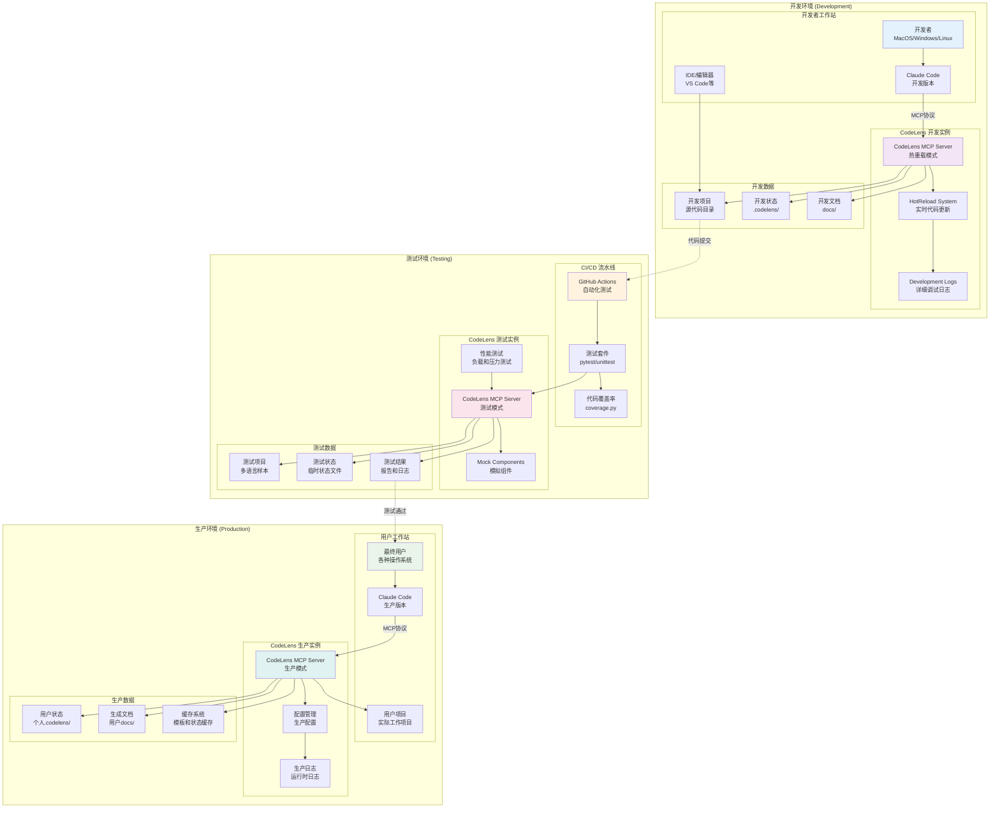

# CodeLens 部署架构图

## 部署环境架构



## 部署方式详解

### 1. 本地开发部署

#### 开发环境特点
- **热重载支持**: 实时代码更新，无需重启服务
- **详细日志**: 完整的调试信息和性能监控
- **快速迭代**: 支持频繁的代码修改和测试

#### 部署步骤
```bash
# 1. 克隆项目
git clone https://github.com/your-repo/CodeLens.git
cd CodeLens

# 2. 安装依赖（可选，核心功能零依赖）
pip install watchdog  # 热重载增强
pip install psutil    # 性能监控增强

# 3. 启动开发服务器
CODELENS_HOT_RELOAD=true python mcp_server.py

# 4. 配置Claude Code
# 编辑 claude_code_config.json
{
  "mcpServers": {
    "codelens": {
      "command": "python",
      "args": ["mcp_server.py"],
      "cwd": "/path/to/CodeLens",
      "env": {
        "PYTHONPATH": ".",
        "CODELENS_HOT_RELOAD": "true"
      }
    }
  }
}
```

### 2. 测试环境部署

#### CI/CD 流水线
```yaml
# .github/workflows/test.yml
name: CodeLens Tests
on: [push, pull_request]

jobs:
  test:
    runs-on: ubuntu-latest
    strategy:
      matrix:
        python-version: [3.9, 3.10, 3.11]
    
    steps:
    - uses: actions/checkout@v3
    - name: Set up Python
      uses: actions/setup-python@v3
      with:
        python-version: ${{ matrix.python-version }}
    
    - name: Install dependencies
      run: |
        pip install pytest coverage
        pip install watchdog psutil  # 可选依赖
    
    - name: Run tests
      run: |
        python mcp_server.py test
        pytest tests/ -v --cov=src
    
    - name: Performance tests
      run: |
        python tests/performance_tests.py
```

#### 测试环境特点
- **自动化测试**: GitHub Actions CI/CD流水线
- **多版本支持**: Python 3.9-3.11兼容性测试
- **性能测试**: 负载测试和内存使用监控
- **代码覆盖率**: 完整的测试覆盖率报告

### 3. 生产环境部署

#### 生产部署特点
- **稳定可靠**: 关闭热重载，使用稳定配置
- **性能优化**: 启用缓存和性能优化选项
- **日志管理**: 生产级日志记录和轮转
- **配置管理**: 多环境配置支持

#### 生产部署步骤
```bash
# 1. 生产环境安装
pip install CodeLens  # 通过PyPI安装（未来）

# 或者从源码安装
git clone --branch stable https://github.com/your-repo/CodeLens.git
cd CodeLens

# 2. 生产配置
export CODELENS_HOT_RELOAD=false
export CODELENS_LOG_LEVEL=INFO
export CODELENS_CACHE_SIZE=100MB

# 3. 启动生产服务
python mcp_server.py

# 4. 配置Claude Code生产环境
{
  "mcpServers": {
    "codelens": {
      "command": "python",
      "args": ["mcp_server.py"],
      "cwd": "/opt/codelens",
      "env": {
        "CODELENS_HOT_RELOAD": "false",
        "CODELENS_LOG_LEVEL": "INFO"
      }
    }
  }
}
```

## 系统要求

### 最小系统要求
```
操作系统: Windows 10+ / macOS 10.15+ / Ubuntu 20.04+
Python版本: 3.9+
内存: 256MB (核心功能)
磁盘空间: 50MB (安装) + 项目大小
网络: 无需网络连接（离线工作）
```

### 推荐系统配置
```
操作系统: 最新稳定版本
Python版本: 3.11+
内存: 1GB+ (大型项目)
磁盘空间: 500MB+ (缓存和日志)
CPU: 多核处理器（并发处理）
SSD: 固态硬盘（文件IO性能）
```

## 配置管理

### 环境配置层级
```
1. 默认配置 (src/config/default_config.json)
2. 环境变量配置 (CODELENS_*)
3. 用户配置文件 (~/.codelens/config.json)
4. 项目配置文件 (./codelens.json)
```

### 关键配置参数
```json
{
  "hot_reload": {
    "enabled": true,
    "debounce_seconds": 0.5,
    "polling_interval": 1.0
  },
  "performance": {
    "max_file_size": 122880,
    "large_file_threshold": 50000,
    "cache_size": "100MB"
  },
  "logging": {
    "level": "INFO",
    "file_rotation": true,
    "max_file_size": "10MB"
  }
}
```

## 监控和维护

### 健康检查
```bash
# 服务器状态检查
python mcp_server.py info

# 组件健康检查
python -c "from src.mcp_tools.task_status import TaskStatusTool; \
           tool = TaskStatusTool(); \
           print(tool.execute({'check_type': 'health_check'}))"
```

### 日志管理
```
日志位置: logs/codelens.log
日志级别: DEBUG/INFO/WARNING/ERROR
日志轮转: 10MB/文件，保留5个历史文件
性能日志: logs/performance.log
错误日志: logs/error.log
```

### 备份和恢复
```bash
# 状态备份
cp -r .codelens/ backup_$(date +%Y%m%d)/

# 配置备份
cp ~/.codelens/config.json config_backup.json

# 恢复操作
cp -r backup_20231201/.codelens/ ./
```

## 安全考虑

### 文件访问安全
- 仅访问指定项目目录
- 禁止访问系统敏感目录
- 文件权限检查和验证

### 数据隐私
- 本地处理，无数据上传
- 敏感信息过滤
- 临时文件安全清理

### 代码执行安全
- 仅分析代码结构，不执行代码
- AST解析安全边界
- 异常处理和资源限制

## 扩展和定制

### 插件开发
```python
# 自定义分片器
class CustomChunker(BaseChunker):
    def supports_language(self, language: str) -> bool:
        return language == "custom"
    
    def chunk_code(self, content: str, file_path: str) -> ChunkingResult:
        # 自定义分片逻辑
        pass

# 注册插件
large_file_handler.register_chunker("custom", CustomChunker())
```

### 模板扩展
```python
# 自定义模板
custom_template = {
    "name": "custom_analysis",
    "description": "自定义分析模板",
    "content": "# 自定义分析\n{analysis_content}",
    "variables": ["analysis_content"]
}

# 注册模板
template_service.register_template(custom_template)
```

这个部署架构支持从开发到生产的完整部署生命周期，确保在各种环境下的稳定运行。