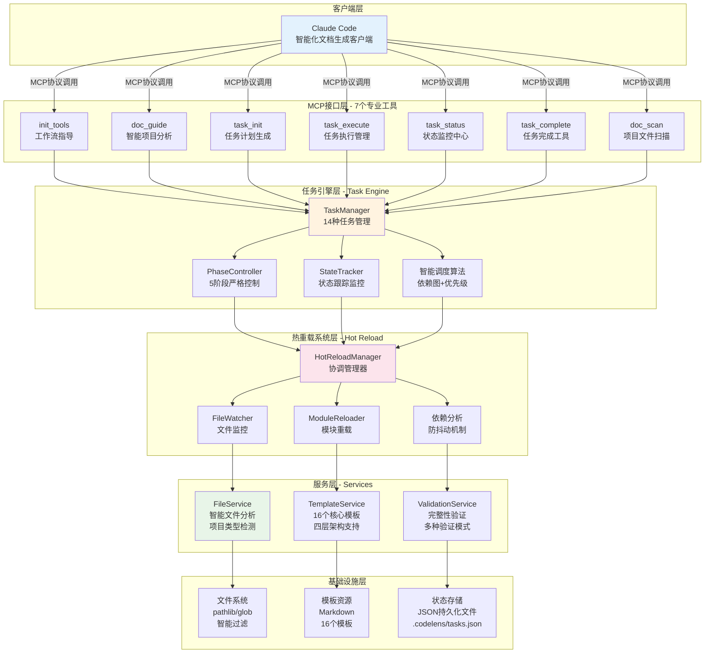
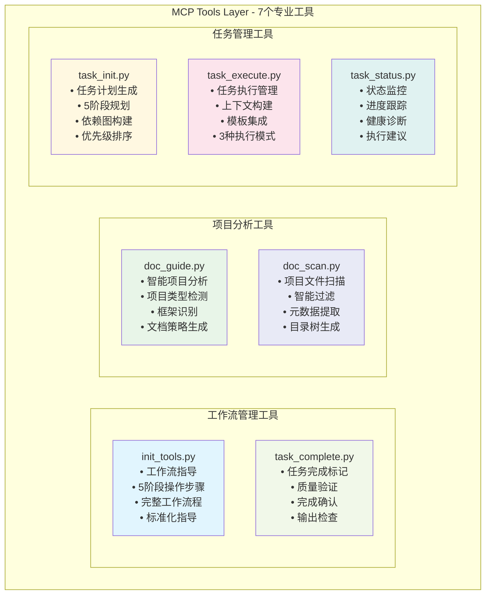
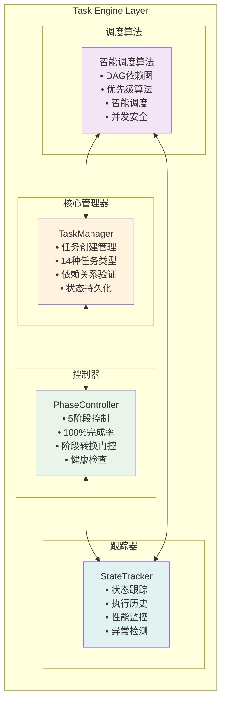
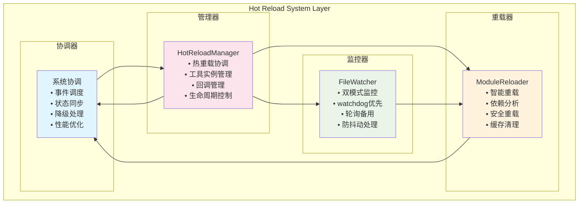
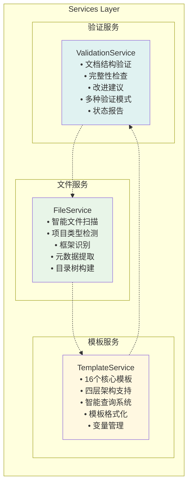
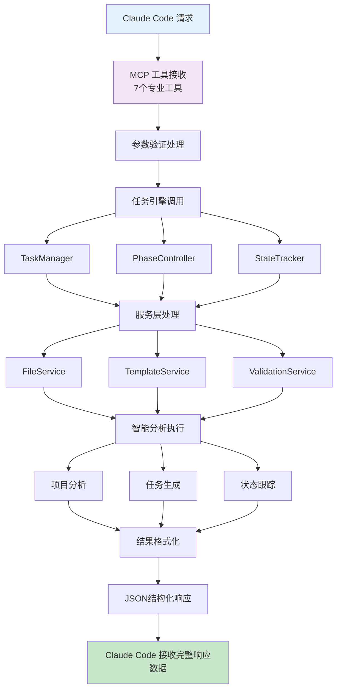
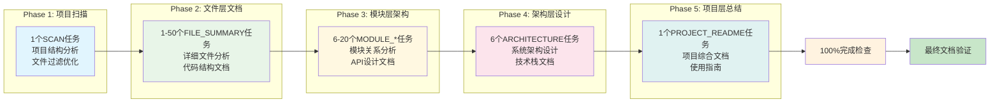
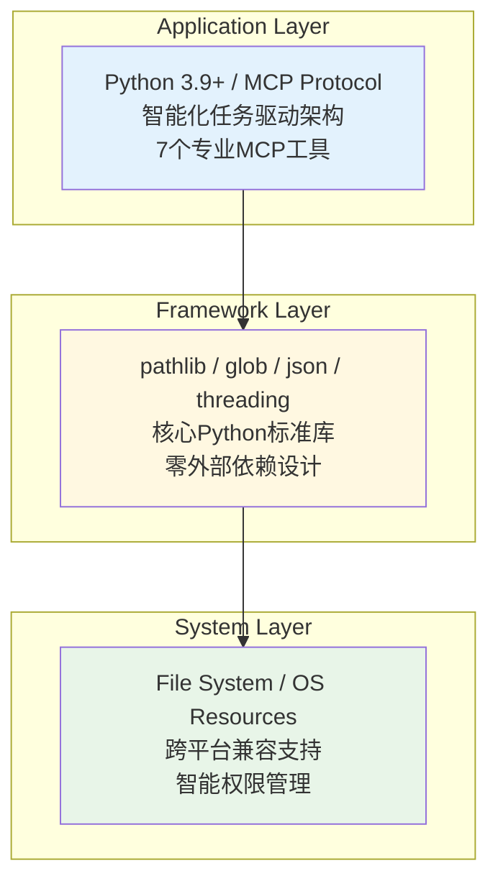

# CodeLens 系统架构图

## 整体架构

## 详细组件架构

### MCP 接口层 (7个专业工具)

### 任务引擎层架构

### 热重载系统层架构

**14种支持任务类型**:
- **Phase 1**: SCAN (项目扫描)
- **Phase 2**: FILE_SUMMARY (文件摘要) 
- **Phase 3**: MODULE_ANALYSIS, MODULE_RELATIONS, DEPENDENCY_GRAPH, MODULE_README, MODULE_API, MODULE_FLOW
- **Phase 4**: ARCHITECTURE, TECH_STACK, DATA_FLOW, SYSTEM_ARCHITECTURE, COMPONENT_DIAGRAM, DEPLOYMENT_DIAGRAM
- **Phase 5**: PROJECT_README (项目README)

### 服务层架构

## 智能化协作数据流

## 5阶段文档生成流程

## 技术栈架构

这是一个专为 Claude Code 协作设计的智能化任务驱动 MCP 服务器，采用五层分层架构，具有完整的任务引擎、热重载系统、智能项目分析和5阶段严格控制能力。
