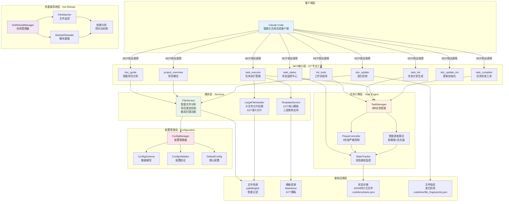

# CodeLens 系统架构图

## 整体架构



## 层级关系详解

### 1. 客户端层 (Client Layer)
- **Claude Code**: 智能化文档生成客户端，通过MCP协议与CodeLens协作

### 2. MCP接口层 (MCP Interface Layer)
9个专业MCP工具，提供完整的文档生成工作流：

#### 核心工作流工具
- **init_tools**: 工作流指导工具，提供3阶段标准操作步骤
- **doc_guide**: 智能项目分析器，自动识别项目类型和框架
- **task_init**: 任务计划生成器，基于分析结果创建3阶段执行计划

#### 任务执行工具
- **task_execute**: 任务执行管理器，提供模板、上下文和执行指导
- **task_status**: 状态监控中心，实时进度跟踪和健康诊断
- **task_complete**: 任务完成工具，标记任务完成并验证输出质量

#### 项目管理工具
- **project_overview**: 项目概览工具，生成项目文档导航
- **doc_update_init**: 文档更新初始化工具，建立文件指纹基点
- **doc_update**: 文档更新检测工具，分析文件变化并给出更新建议

### 3. 任务引擎层 (Task Engine Layer)
智能化任务驱动核心，实现完整的任务生命周期管理：

- **TaskManager**: 智能任务管理器，支持8种任务类型、依赖关系和优先级调度
- **PhaseController**: 3阶段严格控制器，确保100%完成率的阶段转换
- **StateTracker**: 持久化状态跟踪，支持执行历史、性能监控和健康检查
- **智能调度算法**: 基于依赖图和优先级的智能任务调度

### 4. 热重载系统层 (Hot Reload Layer)
开发时实时代码更新支持：

- **HotReloadManager**: 热重载协调管理器，统一管理热重载流程
- **FileWatcher**: 文件监控器，支持watchdog实时监控和轮询备用方案
- **ModuleReloader**: 模块重载器，安全重载Python模块，支持依赖分析
- **依赖分析**: 自动构建模块依赖关系图，防抖动机制

### 5. 配置管理层 (Configuration Layer)
统一的配置管理系统：

- **ConfigManager**: 配置管理器，支持多环境配置和动态加载
- **ConfigSchema**: 配置数据模型，严格的类型验证和数据结构定义
- **ConfigValidator**: 配置验证器，确保配置的完整性和有效性
- **DefaultConfig**: 默认配置模板，提供开箱即用的配置

### 6. 服务层 (Services Layer)
核心业务逻辑服务组件：

- **FileService**: 项目文件扫描、智能过滤和项目类型检测，集成原doc_scan功能
- **TemplateService**: 10个核心模板统一管理，三层架构支持
- **LargeFileHandler**: 大文件智能分片处理，支持AST语义分片

### 7. 基础设施层 (Infrastructure Layer)
底层支撑服务：

- **文件系统**: pathlib + glob + 智能过滤机制
- **模板资源**: 10个Markdown模板，支持三层文档架构
- **状态存储**: JSON持久化文件系统，支持中断恢复
- **文件指纹**: 文件变化检测和指纹数据库

## 3阶段工作流架构

### Phase 1: 文件层文档生成
```
FileService扫描 → LargeFileHandler分片 → TemplateService模板 → 文件级文档
```

### Phase 2: 架构层文档生成
```
文件分析结果 → 系统架构分析 → 技术栈识别 → 架构级文档
```

### Phase 3: 项目层文档生成
```
架构分析结果 → 项目概述生成 → README编写 → 项目级文档
```

## 数据流向

### 正向流程 (文档生成)
```
Claude Code → MCP工具 → 任务引擎 → 服务层 → 基础设施层
```

### 反向流程 (状态反馈)
```
基础设施层 → 服务层 → 任务引擎 → MCP工具 → Claude Code
```

### 侧向流程 (热重载)
```
代码变更 → 热重载系统 → 模块更新 → MCP工具刷新
```

## 关键特性

### 智能化
- 自动项目类型检测和框架识别
- 智能任务调度和依赖管理
- 大文件AST语义分片处理

### 可靠性
- 严格的3阶段流程控制
- 状态持久化和中断恢复
- 完整的异常处理机制

### 高性能
- 智能文件过滤和优先级排序
- 按需加载和内存优化
- 并发任务处理支持

### 开发友好
- 热重载实时代码更新
- 多环境配置管理
- 完整的日志和监控体系