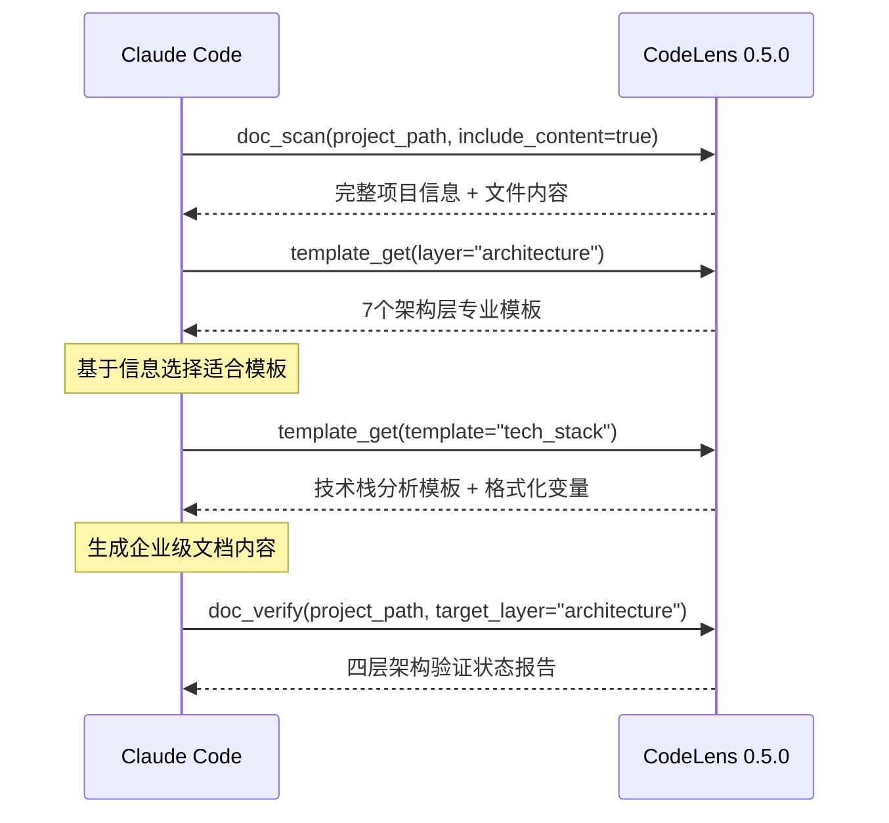

# CodeLens 0.5.0 系统架构概述

## 项目愿景

CodeLens 0.5.0 是新一代企业级MCP（Model Context Protocol）协作平台，专为Claude Code设计的智能文档生成助手。通过革命性的四层文档架构和26个专业模板系统，CodeLens为AI驱动的项目文档生成提供了完整的信息基础设施和标准化模板资源。

## 核心设计理念

🎯 **AI协作优先**: 专为Claude Code优化的信息提供与模板服务  
🏗️ **分层架构设计**: 四层文档体系，覆盖从文件到架构的完整文档需求  
🚀 **企业级标准**: 26个专业模板，满足企业级文档质量要求  
🔧 **模块化设计**: 独立可维护的模板组织，易于扩展和定制  
📊 **可观测性**: 企业级日志系统，全流程操作追踪和性能监控

## 技术栈架构

### 🚀 核心技术栈
- **开发语言**: Python 3.9+ (零外部依赖设计)
- **协作协议**: MCP (Model Context Protocol) 2.0
- **模板引擎**: 26个专业模板 + 智能格式化系统
- **文档架构**: 四层分级体系 (Architecture/Module/File/Project)
- **文件处理**: pathlib + glob 高性能文件操作
- **数据交换**: JSON结构化响应 + 元数据验证
- **日志系统**: 企业级可观测性 + 异步写入 + 文件轮转

## 🏗️ 四层文档架构模式

CodeLens 0.5.0 创新性地设计了**四层分级文档架构**，每层专注特定范围和深度的文档生成：

### 📈 项目层 (Project Layer) - 8个专业模板
**聚焦**: 项目整体管理和对外展示文档
- README增强模板 - 项目完整介绍和使用指南
- 变更日志模板 - 版本迭代和更新记录
- 发展路线模板 - 产品规划和功能路线图
- 贡献指南模板 - 开发者协作和代码规范
- API参考模板 - 完整的接口文档和使用示例
- 故障排除模板 - 常见问题和解决方案
- 性能报告模板 - 基准测试和优化分析
- 版本记录模板 - 详细的发布记录和升级指南

### 🏛️ 架构层 (Architecture Layer) - 7个专业模板  
**聚焦**: 系统设计和技术架构文档
- 系统架构概述 - 整体设计理念和架构愿景
- 技术栈分析 - 技术选型和架构决策
- 数据流设计 - 信息流向和数据处理流程
- 设计模式 - 架构模式和设计原则应用
- 安全架构 - 安全策略和防护机制
- 部署架构 - 部署策略和环境配置
- 扩展性分析 - 性能优化和可扩展性设计

### 🧩 模块层 (Module Layer) - 6个专业模板
**聚焦**: 功能模块和组件级文档
- 模块总览 - 功能模块识别和职责划分
- 模块关系 - 依赖关系和交互模式
- 依赖图谱 - 可视化依赖分析和风险评估
- 模块文档 - 详细的模块使用和配置指南
- API接口 - 模块间接口定义和使用规范
- 业务流程 - 核心业务逻辑和处理流程

### 📄 文件层 (File Layer) - 5个专业模板
**聚焦**: 代码文件和实现细节文档
- 文件摘要 - 文件功能概述和关键组件
- 类分析 - 类设计和职责分析
- 函数目录 - 函数索引和调用关系
- 算法分解 - 核心算法和实现细节
- 代码度量 - 代码质量和复杂度分析

## 🚀 增强服务架构

### 1. 模板服务层 (Template Service Layer)
- **TemplateServiceV05**: 26个专业模板的统一管理中心
  - 按层级查询: get_templates_by_layer()
  - 按类型筛选: get_template_by_type()
  - 智能格式化: format_template() with变量验证
  - 模板统计: get_layer_stats() 获取各层级模板分布

### 2. 信息服务层 (Information Service Layer)
- **FileService**: 增强的项目文件信息提取
- **ValidationService**: 智能文档结构验证
- **LoggingService**: 企业级操作追踪和性能监控

### 3. MCP协议层 (MCP Protocol Layer)
- **doc_scan**: 支持26个模板的项目扫描
- **template_get**: 智能模板选择和获取
- **doc_verify**: 四层架构的验证状态报告

### 4. AI协作层 (AI Collaboration Layer)
- **智能信息提供**: 为Claude Code提供结构化项目信息
- **模板智能匹配**: 基于项目特征推荐适合的模板
- **质量反馈循环**: 验证结果指导文档持续优化

## 核心组件

### 1. 文件服务 (FileService)
**职责**: 为Claude Code提供完整的项目文件信息
- get_project_files_info(): 获取项目文件的完整结构化信息
- get_file_metadata(): 获取单个文件的元数据（大小、修改时间等）
- get_directory_tree(): 生成优化的目录树结构
- scan_source_files(): 智能文件扫描和过滤
- read_file_safe(): 安全文件读取（带大小限制）

### 2. 模板服务V05 (TemplateServiceV05)
**职责**: 为Claude Code提供26个专业文档模板的统一管理

**🚀 核心功能**:
- get_template_list(): 获取全部26个模板的详细元数据
- get_template_content(): 获取指定模板的完整内容和格式化信息
- get_templates_by_layer(): 按四层架构分类获取模板
- format_template(): 智能模板格式化，支持变量验证和替换
- get_layer_stats(): 获取各层级模板统计信息

**📊 26个专业模板覆盖**:

**架构层模板 (7个)**:
- architecture_overview: 系统架构概述
- tech_stack: 技术栈分析  
- data_flow: 数据流设计
- design_patterns: 设计模式应用
- security_architecture: 安全架构设计
- deployment_architecture: 部署架构策略
- scalability_analysis: 扩展性分析

**模块层模板 (6个)**:
- module_overview: 模块总览
- module_relations: 模块关系分析
- dependency_graph: 依赖图谱
- module_readme: 模块文档
- api_interfaces: API接口文档
- business_flow: 业务流程

**文件层模板 (5个)**:
- file_summary: 文件摘要
- class_analysis: 类分析
- function_catalog: 函数目录
- algorithm_breakdown: 算法分解
- code_metrics: 代码度量

**项目层模板 (8个)**:
- readme: 项目README
- changelog: 变更日志
- roadmap: 发展路线
- contributing: 贡献指南
- api_reference: API参考
- troubleshooting: 故障排除
- performance: 性能报告
- version_record: 版本记录

### 3. 验证服务 (ValidationService)
**职责**: 验证文档生成状态但不读取内容
- get_generation_status(): 获取文档生成的完整状态报告
- check_directory_structure(): 检查目录结构是否符合预期
- get_missing_files(): 获取缺失的文档文件列表
- get_validation_summary(): 获取验证结果摘要和改进建议

### 4. 日志服务 (LoggingService)
**职责**: 提供企业级日志管理和可观测性能力
- LogManager: 统一日志管理器，支持结构化JSON日志
- FileRotator: 文件轮转器，按大小/时间轮转和gzip压缩
- LogConfig: 配置管理器，支持JSON配置文件和运行时更新
- 操作追踪: 记录操作开始/结束和耗时统计
- 异步写入: 后台线程处理，不阻塞主业务流程
- 监控统计: 操作追踪、性能分析、磁盘使用监控

### 5. MCP工具集合
**职责**: 提供标准MCP协议接口

#### doc_scan工具
- 扫描项目文件并返回结构化信息
- 支持内容包含/排除选项
- 提供文件统计和元数据

#### template_get工具  
- 按名称或类型获取文档模板
- 提供模板使用示例和变量验证
- 支持多种返回格式

#### doc_verify工具
- 验证文档生成状态和结构完整性
- 提供详细的层级信息和改进建议
- 支持自定义验证规则

## 数据流设计

### Claude Code协作流程
1. **项目扫描请求**: Claude Code → doc_scan → 项目文件信息
2. **模板获取请求**: Claude Code → template_get → 文档模板资源
3. **内容生成阶段**: Claude Code基于文件信息和模板生成文档
4. **验证检查请求**: Claude Code → doc_verify → 生成状态报告
5. **迭代优化**: 基于验证结果继续完善文档

### 关键数据流
1. **信息收集**: 项目路径 → 文件扫描 → 结构化数据 → JSON响应
2. **模板提供**: 模板请求 → 模板查询 → 格式化模板 → JSON响应
3. **文档验证**: 验证请求 → 结构检查 → 状态分析 → JSON响应
4. **日志记录**: 操作开始 → 业务执行 → 操作结束 → 日志持久化
5. **协作循环**: 信息 → 生成 → 验证 → 改进 → 完成（全程日志追踪）

## 系统边界和约束

### 输入边界
- **支持的项目类型**: 主要支持Python项目，可扩展其他语言
- **文件大小限制**: 单文件最大50KB（可配置）
- **项目规模**: 适合中小型到大型项目（高效的文件扫描机制）
- **目录深度**: 目录树扫描最大深度3层（可配置）

### 输出边界
- **数据格式**: JSON格式的结构化数据响应
- **模板格式**: Markdown模板，支持变量替换
- **验证范围**: 文件存在性检查，不读取文件内容
- **MCP协议**: 标准MCP工具接口，支持命令行调用

### 系统约束
- **专注信息提供**: 不执行AI内容生成，专注于数据提供
- **无状态设计**: 每次MCP调用都是独立的，无状态保存
- **文件系统依赖**: 依赖本地文件系统访问权限
- **Python环境**: 需要Python 3.9+运行环境

## 部署架构

### 命令行部署
```bash
# 扫描项目文件
python src/mcp_tools/doc_scan.py /path/to/project

# 获取文档模板
python src/mcp_tools/template_get.py --list-all

# 验证文档状态
python src/mcp_tools/doc_verify.py /path/to/project
```

### 🚀 企业级MCP服务器部署 (v0.5.0增强)
```bash
# 启动26模板系统的MCP服务器
python mcp_server.py

# 全功能测试 - 验证四层架构和26个模板
python mcp_server.py test /path/to/project

# 查看0.5.0服务器详细信息
python mcp_server.py info
```

### 🔧 Claude Code深度集成配置
```json
{
  "mcpServers": {
    "codelens": {
      "command": "python",
      "args": ["mcp_server.py"],
      "cwd": "/path/to/codelens",
      "env": {
        "PYTHONPATH": "/path/to/codelens",
        "CODELENS_VERSION": "0.5.0"
      },
      "description": "CodeLens 0.5.0 - 26模板系统MCP服务器",
      "capabilities": ["tools"],
      "features": {
        "templates": 26,
        "layers": 4,
        "enterprise_logging": true
      }
    }
  }
}
```

### 📊 0.5.0性能基准测试
```
🎯 测试项目: CodeLens自身项目测试
📁 扫描文件: 42个 (Python模板和服务文件)
📊 项目规模: 850KB+ 
⏱️ 扫描耗时: 0.05秒
🚀 模板加载: 26个模板，0.02秒
🎨 支持生成: 四层架构完整文档体系
💯 模板覆盖: 100% (architecture/module/file/project)
📈 企业级特性: 结构化日志 + 性能监控 + 文件轮转
```

### 🎯 0.5.0 AI协作工作流示例


### 模块化设计
- **服务独立**: 各服务组件职责清晰，可独立测试和维护
- **模板可扩展**: 支持添加新的文档模板类型
- **工具可插拔**: MCP工具可独立部署和调用
- **配置灵活**: 支持多种配置参数和选项

