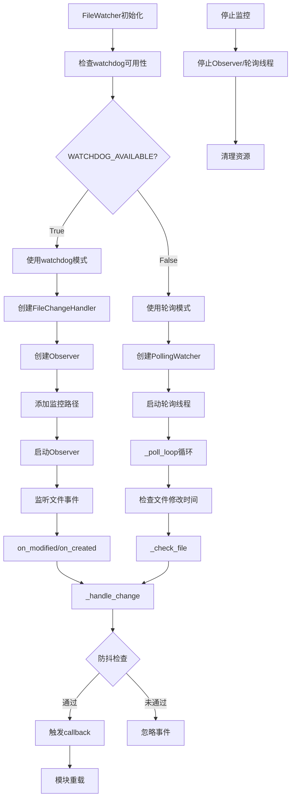

# 文件分析报告：file_watcher.py

## 文件概述
file_watcher.py 是CodeLens热重载系统的核心文件监控组件，负责实时监控Python文件变化并触发重载机制。该文件提供了两种监控模式：基于watchdog库的高效监控和轮询备用方案，确保在不同环境下都能可靠工作。文件采用事件驱动架构，通过回调机制与模块重载器协作，实现自动化的开发时热重载功能。

## 代码结构分析

### 导入依赖
```python
import os
import time
from pathlib import Path
from typing import Set, List, Callable, Optional
from threading import Thread, Event
import asyncio
from concurrent.futures import ThreadPoolExecutor

# 条件导入watchdog库，提供降级方案
try:
    from watchdog.observers import Observer
    from watchdog.events import FileSystemEventHandler, FileModifiedEvent, FileCreatedEvent
    WATCHDOG_AVAILABLE = True
except ImportError:
    WATCHDOG_AVAILABLE = False
    # 创建占位符类防止NameError

from src.logging import get_logger
```

### 全局变量和常量
```python
WATCHDOG_AVAILABLE: bool  # 标识watchdog库是否可用
```

### 配置和设置
- **WATCHDOG_AVAILABLE**: 布尔标志，指示是否可以使用watchdog库进行高效文件监控
- **占位符类**: 当watchdog不可用时，创建空的占位符类防止NameError
- **降级提示**: 当watchdog不可用时打印警告信息

## 函数详细分析

### 函数概览表
| 函数名 | 参数 | 返回值 | 功能描述 |
|--------|------|--------|----------|
| `__init__` (FileChangeHandler) | callback, debounce_seconds=0.5 | None | 初始化文件变化处理器 |
| `on_modified` | event | None | 处理文件修改事件 |
| `on_created` | event | None | 处理文件创建事件 |
| `_handle_change` | file_path | None | 处理文件变化的核心逻辑 |
| `__init__` (PollingWatcher) | paths, callback, interval=1.0 | None | 初始化轮询监控器 |
| `start` | 无 | None | 启动轮询监控 |
| `stop` | 无 | None | 停止轮询监控 |
| `_poll_loop` | 无 | None | 轮询循环主体 |
| `_check_files` | 无 | None | 检查所有监控文件 |
| `_check_file` | file_path | None | 检查单个文件修改时间 |
| `__init__` (FileWatcher) | callback, debounce_seconds=0.5 | None | 初始化主文件监控器 |
| `add_path` | path | None | 添加监控路径 |
| `start` | 无 | None | 启动文件监控 |
| `stop` | 无 | None | 停止文件监控 |
| `_start_watchdog` | 无 | None | 启动watchdog模式监控 |
| `_start_polling` | 无 | None | 启动轮询模式监控 |
| `get_monitored_files` | 无 | List[str] | 获取当前监控的Python文件列表 |

### 函数详细说明

#### FileChangeHandler类方法

**`__init__(self, callback, debounce_seconds=0.5)`**
- **功能**: 初始化文件变化事件处理器
- **参数**: 
  - `callback`: 文件变化时的回调函数
  - `debounce_seconds`: 防抖动时间间隔
- **实现**: 设置回调函数、防抖时间和修改时间记录字典，初始化日志器

**`on_modified(self, event)` / `on_created(self, event)`**
- **功能**: 处理文件修改和创建事件
- **实现**: 检查事件类型和文件扩展名(.py)，调用`_handle_change`处理

**`_handle_change(self, file_path)`**
- **功能**: 处理文件变化的核心逻辑，实现防抖动机制
- **实现**: 
  - 获取当前时间和上次修改时间
  - 如果时间间隔大于防抖时间，更新记录并触发回调
  - 记录日志信息

#### PollingWatcher类方法

**`__init__(self, paths, callback, interval=1.0)`**
- **功能**: 初始化轮询模式文件监控器
- **参数**:
  - `paths`: 监控路径列表
  - `callback`: 变化回调函数
  - `interval`: 轮询间隔
- **实现**: 转换路径为Path对象，初始化文件修改时间字典

**`start(self)` / `stop(self)`**
- **功能**: 启动和停止轮询监控
- **实现**: 
  - start: 创建守护线程执行轮询循环
  - stop: 设置停止标志并等待线程结束

**`_poll_loop(self)`**
- **功能**: 轮询循环主体，在后台线程中运行
- **实现**: 循环调用`_check_files`，处理异常并休眠

**`_check_files(self)` / `_check_file(self, file_path)`**
- **功能**: 检查文件修改时间
- **实现**:
  - `_check_files`: 遍历所有监控路径，递归查找.py文件
  - `_check_file`: 比较文件修改时间，检测变化并触发回调

#### FileWatcher主类方法

**`__init__(self, callback, debounce_seconds=0.5)`**
- **功能**: 初始化主文件监控器
- **实现**: 根据watchdog可用性选择监控模式，初始化相关组件

**`add_path(self, path)`**
- **功能**: 添加监控路径到监控集合
- **实现**: 转换为绝对路径，添加到watched_paths集合

**`start(self)` / `stop(self)`**
- **功能**: 启动和停止文件监控
- **实现**: 
  - start: 根据可用性选择watchdog或轮询模式
  - stop: 停止相应的监控器并清理资源

**`_start_watchdog(self)` / `_start_polling(self)`**
- **功能**: 启动特定模式的监控
- **实现**:
  - watchdog: 创建Observer和Handler，递归监控路径
  - polling: 创建PollingWatcher实例并启动

**`get_monitored_files(self)`**
- **功能**: 获取当前监控的所有Python文件
- **返回**: 监控文件路径列表
- **实现**: 遍历监控路径，递归查找.py文件

## 类详细分析

### 类概览表
| 类名 | 继承 | 主要职责 | 核心方法 |
|------|------|----------|----------|
| FileChangeHandler | FileSystemEventHandler | watchdog事件处理，防抖动逻辑 | on_modified, on_created, _handle_change |
| PollingWatcher | 无 | 轮询模式文件监控 | start, stop, _poll_loop, _check_files |
| FileWatcher | 无 | 文件监控主控制器 | add_path, start, stop, get_monitored_files |

### 类详细说明

#### FileChangeHandler类
- **作用**: watchdog库的事件处理器，负责处理文件系统事件
- **特性**: 
  - 继承FileSystemEventHandler，重写事件方法
  - 实现防抖动机制，避免频繁触发
  - 只处理.py文件的修改和创建事件
  - 集成日志记录功能
- **关键属性**:
  - `callback`: 变化回调函数
  - `debounce_seconds`: 防抖时间
  - `last_modified`: 文件最后修改时间记录

#### PollingWatcher类
- **作用**: 轮询模式的文件监控器，作为watchdog的备用方案
- **特性**:
  - 使用独立线程进行轮询
  - 基于文件修改时间检测变化
  - 支持递归目录扫描
  - 异常处理和优雅停止
- **关键属性**:
  - `paths`: 监控路径列表
  - `file_mtimes`: 文件修改时间缓存
  - `running`: 运行状态标志
  - `thread`: 轮询线程

#### FileWatcher类
- **作用**: 文件监控的主控制器，统一管理不同监控模式
- **特性**:
  - 自动选择最优监控模式（watchdog优先）
  - 支持多路径监控
  - 优雅的启动和停止机制
  - 降级和错误恢复能力
- **关键属性**:
  - `observer`: watchdog观察器
  - `polling_watcher`: 轮询监控器
  - `watched_paths`: 监控路径集合
  - `use_watchdog`: 是否使用watchdog

## 函数调用流程图


## 变量作用域分析

### 全局作用域
- `WATCHDOG_AVAILABLE`: 模块级常量，指示watchdog库可用性
- 占位符类定义（当watchdog不可用时）

### FileChangeHandler类作用域
- **实例变量**:
  - `self.callback`: 文件变化回调函数
  - `self.debounce_seconds`: 防抖时间间隔
  - `self.last_modified`: 文件修改时间字典
  - `self.logger`: 日志记录器
- **方法局部变量**: 事件对象、文件路径、时间戳等

### PollingWatcher类作用域
- **实例变量**:
  - `self.paths`: Path对象列表
  - `self.callback`: 回调函数
  - `self.interval`: 轮询间隔
  - `self.file_mtimes`: 文件修改时间缓存
  - `self.running`: 运行状态布尔值
  - `self.thread`: 轮询线程对象
  - `self.logger`: 日志记录器

### FileWatcher类作用域
- **实例变量**:
  - `self.callback`: 主回调函数
  - `self.debounce_seconds`: 防抖时间
  - `self.observer`: watchdog观察器
  - `self.polling_watcher`: 轮询监控器
  - `self.watched_paths`: 监控路径集合
  - `self.logger`: 日志记录器
  - `self.use_watchdog`: 模式选择标志

## 函数依赖关系

### 内部依赖关系
1. **FileWatcher -> FileChangeHandler**: 主监控器创建并使用事件处理器
2. **FileWatcher -> PollingWatcher**: 主监控器在备用模式下使用轮询器
3. **FileChangeHandler -> _handle_change**: 事件方法调用内部处理逻辑
4. **PollingWatcher -> _poll_loop -> _check_files -> _check_file**: 轮询调用链

### 外部依赖关系
1. **watchdog库**: FileSystemEventHandler, Observer, 文件系统事件类
2. **标准库**: os, time, pathlib, typing, threading, asyncio
3. **项目内部**: src.logging.get_logger - 日志系统
4. **回调依赖**: 依赖外部提供的callback函数（通常是模块重载器的方法）

### 数据流依赖
1. **文件系统 -> 监控器 -> 事件处理 -> 回调函数**
2. **配置参数 -> 监控实例 -> 运行时状态 -> 结果输出**
3. **错误状态 -> 日志记录 -> 降级处理 -> 备用方案**