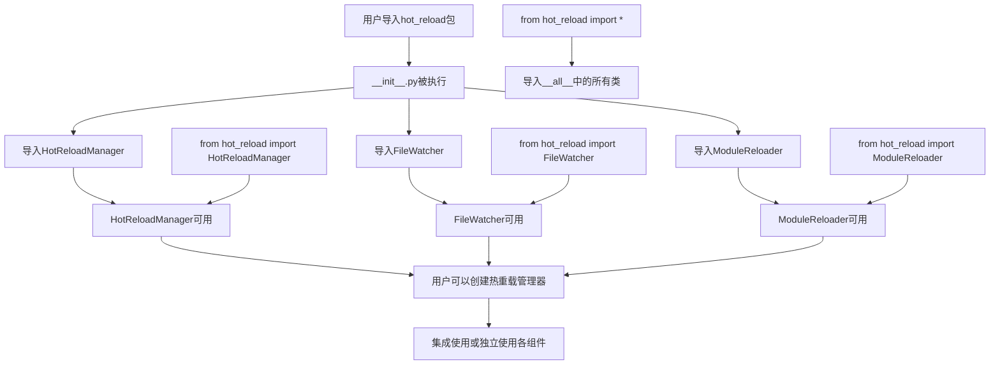

# 文件分析报告：__init__.py (hot_reload)

## 文件概述
hot_reload包的__init__.py文件是热重载系统的模块入口点，负责定义包的公共接口和导出核心组件。该文件通过简洁的导入和__all__声明，为用户提供了清晰的API接口，使得热重载功能可以通过统一的包导入方式使用。文件遵循Python包管理最佳实践，确保模块的正确初始化和组件访问。

## 代码结构分析

### 导入依赖
```python
from .hot_reload_manager import HotReloadManager
from .file_watcher import FileWatcher
from .module_reloader import ModuleReloader
```

### 全局变量和常量
```python
__all__ = ['HotReloadManager', 'FileWatcher', 'ModuleReloader']
```

### 配置和设置
- **包级导入**: 使用相对导入从同级模块导入核心组件
- **公共接口定义**: 通过__all__明确定义包的公共API
- **模块暴露**: 将三个核心类暴露给包用户

## 函数详细分析

### 函数概览表
该文件没有定义任何函数，只包含导入语句和模块级配置。

### 函数详细说明
无函数定义，所有功能通过导入语句和模块级声明实现。

## 类详细分析

### 类概览表
该文件没有定义类，而是从子模块导入类并重新导出。

| 导入的类名 | 源模块 | 主要职责 | 功能描述 |
|------------|--------|----------|----------|
| HotReloadManager | hot_reload_manager | 热重载总控制器 | 协调文件监控和模块重载 |
| FileWatcher | file_watcher | 文件监控器 | 监控Python文件变化 |
| ModuleReloader | module_reloader | 模块重载器 | 安全重载Python模块 |

### 类详细说明

#### 导入的核心组件

**HotReloadManager**
- **来源**: `hot_reload_manager`模块
- **作用**: 热重载系统的总控制器和协调者
- **导出原因**: 作为热重载功能的主要入口点，用户通常通过这个类来启动和管理整个热重载系统

**FileWatcher**
- **来源**: `file_watcher`模块  
- **作用**: 文件系统监控组件，监控Python文件的变化
- **导出原因**: 提供独立的文件监控能力，用户可能需要单独使用文件监控功能

**ModuleReloader**
- **来源**: `module_reloader`模块
- **作用**: Python模块的安全重载管理器
- **导出原因**: 支持用户手动控制模块重载过程，提供细粒度的重载控制

## 函数调用流程图


## 变量作用域分析

### 模块级作用域
- **导入的类**:
  - `HotReloadManager`: 从hot_reload_manager模块导入的类对象
  - `FileWatcher`: 从file_watcher模块导入的类对象  
  - `ModuleReloader`: 从module_reloader模块导入的类对象
- **模块属性**:
  - `__all__`: 列表类型，定义包的公共接口

### 导入作用域特点
- **相对导入**: 使用点号(.)表示相对导入，确保从同一包内导入
- **命名空间管理**: 导入的类直接进入当前模块的命名空间
- **公共接口控制**: 通过__all__控制`from hot_reload import *`的行为

### 生命周期
- **模块加载时**: 执行所有导入语句，类对象被加载到当前命名空间
- **运行时访问**: 用户可以通过`hot_reload.ClassName`或直接导入方式访问
- **内存管理**: 类对象的生命周期与模块对象相同

## 函数依赖关系

### 模块内部依赖
1. **__init__.py -> hot_reload_manager**: 依赖HotReloadManager类的定义
2. **__init__.py -> file_watcher**: 依赖FileWatcher类的定义  
3. **__init__.py -> module_reloader**: 依赖ModuleReloader类的定义

### 包级依赖结构
```
hot_reload/
├── __init__.py              # 包入口，导入并暴露核心组件
├── hot_reload_manager.py    # 总控制器
├── file_watcher.py          # 文件监控器  
└── module_reloader.py       # 模块重载器
```

### 外部依赖传递
- **间接依赖**: 通过导入的类，间接依赖于各子模块的外部依赖
- **依赖隔离**: __init__.py本身不直接依赖外部库，依赖关系通过子模块管理
- **导入链**: 用户导入 -> __init__.py -> 子模块 -> 外部依赖

### 使用模式
1. **完整导入**: `import hot_reload` - 通过点记法访问组件
2. **选择性导入**: `from hot_reload import HotReloadManager` - 直接导入特定组件
3. **批量导入**: `from hot_reload import *` - 导入__all__中定义的所有组件
4. **嵌套使用**: 导入的组件可以相互配合使用，形成完整的热重载解决方案

### API设计特点
- **简洁性**: 只导出核心的三个类，避免接口污染
- **完整性**: 涵盖热重载系统的所有核心功能组件
- **灵活性**: 支持整体使用或组件独立使用
- **标准化**: 遵循Python包管理和模块导出的标准实践