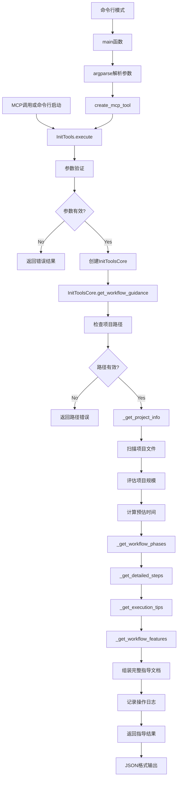

# 文件分析报告：init_tools.py

## 文件概述
init_tools.py 是CodeLens文档生成系统的初始化指导工具，提供标准的5阶段智能文档生成工作流指导。该工具不执行实际的文档生成操作，而是为用户提供完整的操作步骤、最佳实践建议和项目分析信息，帮助用户理解和正确执行CodeLens文档生成流程。文件采用MCP工具封装模式，集成了项目分析、工作流规划和执行指导功能。

## 代码结构分析

### 导入依赖
```python
#!/usr/bin/env python3
import sys
import json
import argparse
from pathlib import Path
from datetime import datetime
from typing import Dict, Any, List, Optional

# 条件导入日志系统，提供降级方案
try:
    import os
    project_root = os.path.dirname(os.path.dirname(os.path.dirname(__file__)))
    sys.path.insert(0, project_root)
    from src.logging import get_logger
except ImportError:
    # 创建虚拟日志器类作为fallback
    class DummyLogger:
        def debug(self, msg, context=None): pass
        def info(self, msg, context=None): pass
        def warning(self, msg, context=None): pass
        def error(self, msg, context=None, exc_info=None): pass
        def log_operation_start(self, operation, *args, **kwargs): return "dummy_id"
        def log_operation_end(self, operation, operation_id, success=True, **kwargs): pass
    
    get_logger = lambda **kwargs: DummyLogger()
```

### 全局变量和常量
文件中没有定义全局常量，所有配置都封装在类中。

### 配置和设置
- **Shebang声明**: `#!/usr/bin/env python3` 支持直接执行
- **日志降级方案**: 当日志系统不可用时提供DummyLogger
- **项目路径自动检测**: 通过文件路径计算项目根目录
- **MCP工具标准接口**: 遵循MCP工具规范的接口设计

## 函数详细分析

### 函数概览表
| 函数名 | 参数 | 返回值 | 功能描述 |
|--------|------|--------|----------|
| `__init__` (InitToolsCore) | project_path | None | 初始化指导工具核心 |
| `get_workflow_guidance` | 无 | Dict[str, Any] | 获取完整工作流指导 |
| `_get_project_info` | 无 | Dict[str, Any] | 分析项目基本信息 |
| `_get_workflow_phases` | 无 | List[Dict[str, str]] | 获取5阶段概述 |
| `_get_detailed_steps` | 无 | Dict[str, Any] | 获取详细执行步骤 |
| `_get_execution_tips` | 无 | List[str] | 获取执行提示 |
| `_get_workflow_features` | 无 | Dict[str, str] | 获取工作流特性说明 |
| `__init__` (InitTools) | 无 | None | 初始化MCP工具封装 |
| `get_tool_definition` | 无 | Dict[str, Any] | 获取MCP工具定义 |
| `execute` | arguments | Dict[str, Any] | 执行MCP工具 |
| `create_mcp_tool` | 无 | InitTools | 创建MCP工具实例 |
| `main` | 无 | None | 命令行接口主函数 |

### 函数详细说明

#### InitToolsCore类方法

**`__init__(self, project_path)`**
- **功能**: 初始化指导工具核心组件
- **参数**: `project_path` - 项目根目录路径
- **实现**: 
  - 转换路径为Path对象并解析为绝对路径
  - 初始化日志器
  - 记录初始化信息

**`get_workflow_guidance(self)`**
- **功能**: 生成完整的工作流指导文档
- **返回**: 包含完整指导信息的字典
- **实现**: 
  - 验证项目路径有效性
  - 获取项目基本信息和规模评估
  - 组装完整的指导文档结构
  - 记录操作日志和性能指标

**`_get_project_info(self)`**
- **功能**: 分析项目文件结构和规模
- **返回**: 项目信息字典
- **实现**: 
  - 扫描项目中的Python文件和总文件数
  - 根据文件数量评估项目规模
  - 估算文档生成所需时间
  - 处理扫描异常情况

**`_get_workflow_phases(self)`**
- **功能**: 定义标准的5阶段工作流概述
- **返回**: 阶段信息列表
- **实现**: 返回固定的5个阶段定义：
  1. Phase 1: 智能项目分析 (doc_guide)
  2. Phase 2: 任务计划生成 (task_init)  
  3. Phase 3: 状态监控检查 (task_status)
  4. Phase 4: 任务循环执行 (task_execute)
  5. Phase 5: 文档验证确认 (doc_verify)

**`_get_detailed_steps(self)`**
- **功能**: 提供详细的执行步骤指导
- **返回**: 步骤详情字典
- **实现**: 
  - 定义5个主要步骤的详细信息
  - 包含命令行示例、预计时间、依赖关系
  - 提供工作流程和下一步指导
  - 特别详述第4步的循环执行逻辑

**`_get_execution_tips(self)` / `_get_workflow_features(self)`**
- **功能**: 提供执行提示和工作流特性说明
- **返回**: 提示列表和特性字典
- **实现**: 返回静态的最佳实践建议和系统特性描述

#### InitTools类方法

**`__init__(self)`**
- **功能**: 初始化MCP工具封装类
- **实现**: 初始化日志器并记录工具准备状态

**`get_tool_definition(self)`**
- **功能**: 提供MCP工具的标准定义
- **返回**: 符合MCP规范的工具定义字典
- **实现**: 
  - 定义工具名称、描述和使用场景
  - 指定输入参数schema
  - 包含详细的工具说明文档

**`execute(self, arguments)`**
- **功能**: MCP工具的主要执行入口
- **参数**: `arguments` - 包含project_path的参数字典
- **返回**: 执行结果字典
- **实现**: 
  - 验证必需参数
  - 创建InitToolsCore实例
  - 调用核心功能生成指导
  - 处理异常并返回结果

#### 工具函数

**`create_mcp_tool()`**
- **功能**: 工厂函数，创建MCP工具实例
- **返回**: InitTools实例
- **实现**: 简单的实例化封装

**`main()`**
- **功能**: 命令行接口主函数
- **实现**: 
  - 使用argparse解析命令行参数
  - 创建工具实例并执行
  - 格式化输出JSON结果

## 类详细分析

### 类概览表
| 类名 | 继承 | 主要职责 | 核心方法 |
|------|------|----------|----------|
| DummyLogger | 无 | 日志降级方案 | debug, info, warning, error |
| InitToolsCore | 无 | 工作流指导核心逻辑 | get_workflow_guidance |
| InitTools | 无 | MCP工具封装接口 | execute, get_tool_definition |

### 类详细说明

#### DummyLogger类
- **作用**: 日志系统不可用时的降级方案
- **特性**: 
  - 提供与真实日志器相同的接口
  - 所有方法都是空实现，不执行实际日志记录
  - 确保代码在没有日志依赖时仍能正常运行
- **设计模式**: 空对象模式(Null Object Pattern)

#### InitToolsCore类
- **作用**: 工作流指导的核心业务逻辑实现
- **特性**: 
  - 项目信息分析和规模评估
  - 标准化工作流定义和步骤指导
  - 完整的错误处理和日志记录
  - 结构化的指导文档生成
- **关键属性**:
  - `project_path`: Path对象，项目根路径
  - `logger`: 日志记录器实例
- **设计特点**:
  - 纯指导性，不执行实际操作
  - 丰富的项目分析信息
  - 标准化的工作流程定义

#### InitTools类
- **作用**: MCP工具标准接口的封装实现
- **特性**: 
  - 符合MCP协议规范
  - 标准的工具定义和执行接口
  - 完整的参数验证和错误处理
  - 结构化的结果返回格式
- **MCP集成**:
  - 实现get_tool_definition()方法提供工具元数据
  - 实现execute()方法处理工具调用
  - 支持标准的MCP参数传递和结果返回

## 函数调用流程图


## 变量作用域分析

### 模块级作用域
- **导入模块**: sys, json, argparse, pathlib, datetime, typing
- **条件导入**: 日志系统和项目路径计算
- **工厂函数**: create_mcp_tool, main

### InitToolsCore类作用域
- **实例变量**:
  - `self.logger`: 日志记录器实例
  - `self.project_path`: Path对象，解析后的项目路径
- **方法局部变量**: 操作ID、项目信息、扫描结果等
- **返回数据结构**: 复杂的嵌套字典，包含完整指导信息

### InitTools类作用域
- **实例变量**:
  - `self.logger`: 日志记录器实例
- **方法局部变量**: 参数验证结果、核心实例、执行结果等
- **配置数据**: 工具定义字典、参数schema等

### 作用域特点
- **配置驱动**: 大量静态配置数据定义在方法中
- **状态无关**: 主要业务逻辑不依赖持久状态
- **异常安全**: 完整的异常处理确保作用域清理

## 函数依赖关系

### 内部依赖关系
1. **InitTools -> InitToolsCore**: MCP封装依赖核心逻辑
2. **get_workflow_guidance -> _get_project_info**: 主函数调用项目分析
3. **get_workflow_guidance -> _get_workflow_phases**: 主函数调用阶段定义
4. **get_workflow_guidance -> _get_detailed_steps**: 主函数调用步骤详情
5. **get_workflow_guidance -> _get_execution_tips**: 主函数调用提示信息
6. **get_workflow_guidance -> _get_workflow_features**: 主函数调用特性说明
7. **main -> create_mcp_tool -> InitTools**: 命令行到工具实例的调用链

### 外部依赖关系
1. **Python标准库**:
   - `pathlib.Path`: 路径处理和文件系统操作
   - `datetime.datetime`: 时间戳生成
   - `json`: 结果序列化输出
   - `argparse`: 命令行参数解析
2. **条件依赖**:
   - `src.logging.get_logger`: 日志功能（有fallback）
3. **文件系统**: 项目文件扫描、路径验证、存在性检查

### 数据流依赖
1. **输入处理**: 命令行参数/MCP参数 -> 参数验证 -> 路径解析
2. **分析流程**: 项目路径 -> 文件扫描 -> 规模评估 -> 时间估算
3. **指导生成**: 静态配置 -> 模板填充 -> 结构化组装 -> JSON输出
4. **错误处理**: 异常捕获 -> 日志记录 -> 错误结果 -> 用户反馈

### 设计模式
1. **工厂模式**: create_mcp_tool()函数
2. **模板方法**: get_workflow_guidance()调用多个辅助方法
3. **策略模式**: 条件日志导入和降级处理
4. **装饰器模式**: MCP工具接口封装核心逻辑