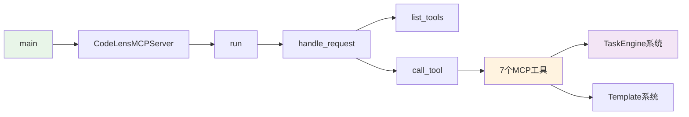

# 文件分析报告：mcp_server.py

## 文件概述

**文件路径**: `/mcp_server.py`  
**文件类型**: Python可执行脚本  
**主要作用**: CodeLens MCP协议服务器的核心实现，为Claude Code提供4阶段文档生成系统  
**代码行数**: 约200行  
**复杂度**: 高

这个文件是CodeLens项目的主入口，实现了标准的MCP（Model Context Protocol）服务器，集成了7个核心MCP工具和10个专业模板，为Claude Code提供智能任务引擎驱动的文档生成服务。它通过JSON-RPC通信协议，实现了完整的4阶段文档生成流程。

## 代码结构分析

### 导入依赖
```python
import sys, json, time, traceback  # 系统基础模块
from typing import Dict, Any, List  # 类型注解
# 7个MCP工具导入
from src.mcp_tools.doc_scan import DocScanTool
  
from src.mcp_tools.doc_guide import DocGuideTool
from src.mcp_tools.task_init import TaskInitTool
from src.mcp_tools.task_execute import TaskExecuteTool
from src.mcp_tools.task_status import TaskStatusTool
from src.mcp_tools.init_tools import InitTools
from src.logging import get_logger  # 可选日志系统
```

### 全局变量和常量
- **VERSION**: "0.6.2.0" - 服务器版本标识
- **SERVER_NAME**: "codelens" - MCP服务器名称
- **SUPPORTED_METHODS**: MCP协议支持的方法列表

### 配置和设置
- **MCP协议**: 标准JSON-RPC通信协议
- **工具集成**: 7个MCP工具的统一管理
- **错误处理**: 完整的异常捕获和错误响应机制

## 函数详细分析

### 函数概览表
| 函数名 | 参数数量 | 返回类型 | 主要功能 |
|--------|----------|----------|----------|
| __init__ | 0 | None | 初始化MCP服务器和工具集 |
| handle_request | 2 | Dict[str, Any] | 处理MCP请求的核心路由函数 |
| list_tools | 0 | Dict[str, Any] | 返回可用工具列表 |
| call_tool | 2 | Dict[str, Any] | 执行指定工具并返回结果 |
| run | 0 | None | 启动MCP服务器主循环 |
| main | 0 | None | 程序主入口函数 |

### 函数详细说明

**handle_request(method, params)**
- 核心的MCP请求路由处理函数
- 支持initialize、tools/list、tools/call三种方法
- 包含完整的错误处理和响应格式化

**call_tool(tool_name, arguments)**
- 动态调用指定的MCP工具
- 统一的参数传递和结果处理
- 工具执行时间监控和错误捕获

**run()**
- MCP服务器主循环，处理stdin/stdout通信
- JSON-RPC协议的完整实现
- 持续监听和响应Claude Code的请求

## 类详细分析

### 类概览表
| 类名 | 继承关系 | 主要属性 | 主要方法 | 核心功能 |
|------|----------|----------|----------|----------|
| CodeLensMCPServer | - | tools字典, logger | 6个核心方法 | MCP服务器核心 |
| DummyLogger | - | 空方法集 | debug, info等 | 日志系统备用实现 |

### 类详细说明

**CodeLensMCPServer类**
- **核心属性**：
  - `tools`: 7个MCP工具的字典映射
  - `logger`: 日志管理器实例
- **设计模式**: 服务器模式，统一管理工具调用和请求处理
- **关键特性**: JSON-RPC协议支持、工具动态调用、错误处理

## 函数调用流程图

```mermaid
graph TD
    A[mcp_server.py启动] --> B[CodeLensMCPServer初始化]
    B --> C[加载7个MCP工具]
    C --> D[run()主循环启动]
    D --> E[监听stdin请求]
    E --> F[handle_request处理]
    F --> G{请求类型}
    G -->|initialize| H[返回服务器信息]
    G -->|tools/list| I[list_tools返回工具列表]
    G -->|tools/call| J[call_tool执行工具]
    
    J --> K[选择对应工具]
    K --> L[工具执行]
    L --> M[返回结果到stdout]
    M --> E
    
    style A fill:#e1f5fe
    style G fill:#fff3e0
    style M fill:#f3e5f5
```

## 变量作用域分析

| 变量类型 | 作用域 | 生命周期 | 访问权限 |
|----------|--------|----------|----------|
| tools | 实例属性 | 服务器生命周期 | private |
| logger | 实例属性 | 服务器生命周期 | private |
| request_data | 局部变量 | 请求处理期间 | private |
| tool_instance | 局部变量 | 工具调用期间 | private |

## 函数依赖关系



### 在4阶段文档生成系统中的作用

1. **Phase 1 (项目扫描)**: 通过doc_scan和doc_guide工具支持项目分析
2. **Phase 2 (文件分析)**: 通过task_execute工具执行文件分析任务
3. **Phase 3 (架构分析)**: 通过task_execute工具执行架构分析任务
4. **Phase 4 (项目文档)**: 通过task_execute工具执行项目文档生成任务

**核心价值**:
- **统一入口**: 为Claude Code提供标准化的MCP服务接口
- **工具集成**: 统一管理7个专业MCP工具的调用和协调
- **协议标准**: 完整实现MCP协议，确保与Claude Code的兼容性
- **错误处理**: 提供健壮的错误处理和恢复机制
- **任务协调**: 协调4阶段文档生成流程的执行

**MCP工具集**:
- **init_tools**: 一键项目初始化
- **doc_scan**: 项目文件扫描和元数据提取
- **doc_guide**: 智能项目分析和策略生成
- **task_init**: 任务计划初始化和依赖解析
- **task_execute**: 任务执行引擎和模板集成
- **task_status**: 实时任务状态监控和进度跟踪

这是整个CodeLens系统的"神经中枢"，负责接收Claude Code的请求，协调各个组件的工作，确保4阶段文档生成流程的顺利执行。它体现了CodeLens作为Document-Driven MCP Server的核心设计理念。