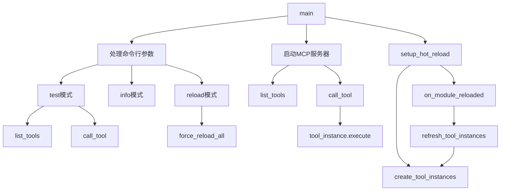

# 文件分析报告：mcp_server.py

## 文件概述
CodeLens MCP服务器主文件，实现了标准MCP协议，为Claude Code提供项目文档生成服务。集成了9个专业MCP工具和热重载功能，支持开发时的实时代码更新。作为整个系统的入口点，负责工具注册、请求路由和服务管理。支持3阶段文档生成工作流：文件层→架构层→项目层。

## 代码结构分析

### 导入依赖
```python
# 系统库
import sys, asyncio, json, os
from typing import Any, Sequence, Optional
from pathlib import Path

# MCP SDK
from mcp.server import Server
from mcp.server.stdio import stdio_server  
from mcp.types import Tool, TextContent

# CodeLens工具模块 - 9个专业MCP工具
from src.mcp_tools.doc_guide import DocGuideTool
from src.mcp_tools.task_init import TaskInitTool
from src.mcp_tools.task_execute import TaskExecuteTool
from src.mcp_tools.task_status import TaskStatusTool
from src.mcp_tools.init_tools import InitTools
from src.mcp_tools.task_complete import TaskCompleteTool
from src.mcp_tools.project_overview import ProjectOverviewTool
from src.mcp_tools.doc_update_init import DocUpdateInitTool
from src.mcp_tools.doc_update import DocUpdateTool

# 热重载功能
from src.hot_reload import HotReloadManager
```

### 全局变量和常量
```python
# MCP服务器实例
server = Server("codelens")

# 热重载管理器（全局实例）
hot_reload_manager: Optional[HotReloadManager] = None

# CodeLens工具实例字典 - 9个专业工具
codelens_tools = create_tool_instances()
```

### 配置和设置
```python
# 环境变量配置
CODELENS_HOT_RELOAD = 'true'  # 热重载开关

# 热重载参数
debounce_seconds = 0.5        # 防抖延迟
batch_reload_window = 2.0     # 批量重载时间窗口
```

## 函数详细分析

### 函数概览表
| 函数名 | 类型 | 行数 | 复杂度 | 描述 |
|--------|------|------|--------|------|
| create_tool_instances | 工厂函数 | 37-47 | 低 | 创建并返回工具实例字典 |
| setup_hot_reload | 初始化函数 | 52-80 | 中 | 设置和初始化热重载功能 |
| on_module_reloaded | 回调函数 | 82-89 | 低 | 处理模块重载事件 |
| refresh_tool_instances | 管理函数 | 91-107 | 中 | 刷新工具实例 |
| convert_tool_definition | 转换函数 | 109-115 | 低 | 转换工具定义格式 |
| list_tools | MCP处理函数 | 117-125 | 低 | 列出所有可用工具 |
| call_tool | MCP处理函数 | 127-155 | 高 | 执行工具调用 |
| main | 主入口函数 | 157-241 | 高 | 程序主入口和路由 |

### 函数详细说明

#### create_tool_instances()
**功能**: 工具实例工厂函数  
**参数**: 无  
**返回**: Dict[str, Tool] - 9个专业工具实例字典  
**逻辑**: 创建所有CodeLens工具的实例并返回字典映射，包含：
- 工作流工具：init_tools, task_complete
- 项目分析工具：doc_guide, project_overview
- 任务管理工具：task_init, task_execute, task_status
- 文档更新工具：doc_update_init, doc_update

#### setup_hot_reload()  
**功能**: 热重载系统初始化  
**参数**: 无  
**返回**: None  
**逻辑**: 
- 检查环境变量确定是否启用热重载
- 创建HotReloadManager实例
- 注册工具实例和回调函数
- 处理初始化异常

#### on_module_reloaded(reload_event)
**功能**: 模块重载事件回调  
**参数**: reload_event - 重载事件对象  
**返回**: None  
**逻辑**: 根据重载结果打印状态信息并刷新工具实例

#### refresh_tool_instances()
**功能**: 工具实例刷新管理  
**参数**: 无  
**返回**: None  
**逻辑**: 
- 重新创建工具实例
- 更新全局工具字典
- 重新注册到热重载管理器

#### convert_tool_definition(tool_def: dict) -> Tool
**功能**: 工具定义格式转换  
**参数**: tool_def - CodeLens工具定义字典  
**返回**: Tool - MCP标准工具对象  
**逻辑**: 将内部工具定义转换为MCP协议要求的格式

#### list_tools() -> list[Tool] 
**功能**: MCP工具列表接口  
**装饰器**: @server.list_tools()  
**参数**: 无  
**返回**: list[Tool] - MCP工具列表  
**逻辑**: 遍历注册工具，转换格式后返回

#### call_tool(name: str, arguments: dict) -> Sequence[TextContent]
**功能**: MCP工具调用接口  
**装饰器**: @server.call_tool()  
**参数**: name - 工具名, arguments - 调用参数  
**返回**: Sequence[TextContent] - 执行结果  
**逻辑**: 
- 验证工具名有效性
- 执行工具并捕获异常
- 将结果转换为MCP文本内容格式

#### main()
**功能**: 程序主入口函数  
**参数**: 无  
**返回**: None  
**逻辑**: 
- 初始化热重载系统
- 处理命令行参数(test/info/reload模式)
- 启动MCP stdio服务器
- 管理热重载生命周期

## 类详细分析

### 类概览表
本文件未定义自定义类，主要使用外部导入的类：
- Server (MCP库)
- HotReloadManager (热重载模块)
- 各种Tool类 (MCP工具模块)

### 类详细说明
本文件主要作为服务层，使用组合模式集成各个功能模块，未定义复杂的类结构。

## 函数调用流程图


## 变量作用域分析
```python
# 全局作用域
server: Server                              # MCP服务器实例
hot_reload_manager: Optional[HotReloadManager] # 热重载管理器
codelens_tools: Dict[str, Tool]             # 工具实例字典

# 函数局部作用域
main():
  - tools: List[Tool]                       # 工具列表
  - project_path: str                       # 项目路径
  - result: Sequence[TextContent]           # 调用结果

call_tool():
  - tool_instance: Tool                     # 工具实例
  - result: Dict                            # 执行结果
  - content: str                            # 内容字符串
```

## 函数依赖关系
```
create_tool_instances
└── (创建工具实例)

setup_hot_reload  
├── create_tool_instances
└── on_module_reloaded
    └── refresh_tool_instances
        └── create_tool_instances

list_tools
└── convert_tool_definition

call_tool
└── tool_instance.execute

main
├── setup_hot_reload
├── list_tools  
├── call_tool
└── hot_reload_manager.start/stop
```