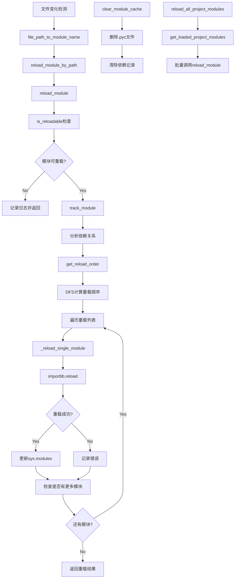

# 文件分析报告：module_reloader.py

## 文件概述
module_reloader.py 是CodeLens热重载系统的核心模块重载组件，负责安全地重新加载Python模块。该文件实现了智能的模块依赖关系分析、安全的重载机制和完整的缓存管理。通过DependencyTracker类追踪模块间的依赖关系，通过ModuleReloader类提供安全的重载功能，确保在开发过程中能够实时更新代码而不需要重启整个服务。

## 代码结构分析

### 导入依赖
```python
import sys
import importlib
import importlib.util
from pathlib import Path
from typing import Set, Dict, List, Optional, Any
import traceback
from collections import defaultdict

from src.logging import get_logger
```

### 全局变量和常量
文件中没有定义全局变量，所有状态都封装在类实例中。

### 配置和设置
- **项目根路径**: 通过`Path(__file__).parent.parent.parent`自动检测
- **可重载模块前缀**: 定义了项目内可以安全重载的模块前缀列表
- **排除模块列表**: 系统模块和第三方库模块的排除规则

## 函数详细分析

### 函数概览表
| 函数名 | 参数 | 返回值 | 功能描述 |
|--------|------|--------|----------|
| `__init__` (DependencyTracker) | 无 | None | 初始化依赖关系追踪器 |
| `track_module` | module_name | None | 追踪模块的依赖关系 |
| `clear_dependencies` | module_name | None | 清除模块的依赖关系记录 |
| `_is_dependent` | module1, module2 | bool | 检查模块间依赖关系 |
| `get_reload_order` | module_name | List[str] | 获取重载顺序 |
| `__init__` (ModuleReloader) | 无 | None | 初始化模块重载器 |
| `is_reloadable` | module_name | bool | 检查模块是否可重载 |
| `file_path_to_module_name` | file_path | Optional[str] | 文件路径转模块名 |
| `reload_module_by_path` | file_path | bool | 根据文件路径重载模块 |
| `reload_module` | module_name | bool | 重载指定模块 |
| `_reload_single_module` | module_name | bool | 重载单个模块 |
| `get_loaded_project_modules` | 无 | List[str] | 获取已加载项目模块 |
| `clear_module_cache` | module_name | None | 清除模块缓存 |
| `reload_all_project_modules` | 无 | Dict[str, bool] | 重载所有项目模块 |

### 函数详细说明

#### DependencyTracker类方法

**`__init__(self)`**
- **功能**: 初始化依赖关系追踪器
- **实现**: 创建正向和反向依赖关系字典，初始化日志器

**`track_module(self, module_name)`**
- **功能**: 分析并记录模块的依赖关系
- **实现**: 
  - 检查模块是否在sys.modules中并有有效文件
  - 清除旧的依赖关系记录
  - 遍历所有模块分析依赖关系
  - 更新正向和反向依赖字典

**`clear_dependencies(self, module_name)`**
- **功能**: 清除指定模块的所有依赖关系记录
- **实现**: 
  - 清除正向依赖，更新被依赖模块的反向记录
  - 清除反向依赖，更新依赖模块的正向记录

**`_is_dependent(self, module1, module2)`**
- **功能**: 检查module1是否依赖module2
- **实现**: 
  - 检查两个模块是否都有有效的文件路径
  - 比较文件路径，判断是否在同一包内或子包关系
- **返回**: 布尔值表示依赖关系

**`get_reload_order(self, module_name)`**
- **功能**: 通过深度优先搜索获取模块重载顺序
- **实现**: 
  - 使用DFS算法遍历依赖树
  - 确保被依赖的模块先重载
  - 返回有序的模块名列表

#### ModuleReloader类方法

**`__init__(self)`**
- **功能**: 初始化模块重载器
- **实现**: 
  - 创建依赖追踪器实例
  - 设置项目根路径和可重载模块前缀
  - 初始化日志器

**`is_reloadable(self, module_name)`**
- **功能**: 判断模块是否可以安全重载
- **实现**: 多层检查机制：
  - 排除系统模块和特殊模块
  - 排除第三方库模块
  - 排除纯包模块（无具体文件）
  - 检查是否为项目内模块
  - 验证文件有效性
- **返回**: 布尔值表示是否可重载

**`file_path_to_module_name(self, file_path)`**
- **功能**: 将文件路径转换为Python模块名
- **实现**: 
  - 将文件路径转换为相对于项目根的路径
  - 移除.py扩展名
  - 将路径分隔符转换为模块分隔符(.)
  - 处理__init__.py特殊情况
- **返回**: 模块名字符串或None

**`reload_module_by_path(self, file_path)`**
- **功能**: 根据文件路径重载模块
- **实现**: 先转换路径为模块名，然后调用reload_module
- **返回**: 重载是否成功

**`reload_module(self, module_name)`**
- **功能**: 重载指定模块及其依赖链
- **实现**: 
  - 检查模块可重载性
  - 追踪模块依赖关系
  - 获取重载顺序
  - 按顺序重载所有相关模块
- **返回**: 重载是否完全成功

**`_reload_single_module(self, module_name)`**
- **功能**: 重载单个模块的核心实现
- **实现**: 
  - 保存模块重要属性
  - 使用importlib.reload执行重载
  - 验证重载结果
  - 更新sys.modules
- **返回**: 单个模块重载是否成功

**`get_loaded_project_modules(self)`**
- **功能**: 获取所有已加载的项目模块列表
- **实现**: 
  - 遍历sys.modules
  - 过滤出可重载的项目模块
  - 只包含有具体文件的模块
- **返回**: 排序的模块名列表

**`clear_module_cache(self, module_name)`**
- **功能**: 清除模块的字节码缓存和依赖记录
- **实现**: 
  - 删除__pycache__中的.pyc文件
  - 清除依赖关系记录
  - 处理文件操作异常

**`reload_all_project_modules(self)`**
- **功能**: 批量重载所有项目模块
- **实现**: 
  - 获取所有项目模块列表
  - 逐个重载并记录结果
  - 统计成功率和失败情况
- **返回**: 每个模块的重载结果字典

## 类详细分析

### 类概览表
| 类名 | 继承 | 主要职责 | 核心方法 |
|------|------|----------|----------|
| DependencyTracker | 无 | 模块依赖关系分析和管理 | track_module, get_reload_order |
| ModuleReloader | 无 | 安全模块重载和缓存管理 | reload_module, is_reloadable |

### 类详细说明

#### DependencyTracker类
- **作用**: 分析和管理Python模块间的依赖关系
- **特性**: 
  - 维护正向和反向依赖关系图
  - 支持依赖关系的动态更新
  - 提供基于依赖的重载顺序计算
  - 使用深度优先搜索算法
- **关键属性**:
  - `dependencies`: 正向依赖关系字典 (模块 -> 其依赖的模块集合)
  - `reverse_dependencies`: 反向依赖关系字典 (模块 -> 依赖它的模块集合)
  - `logger`: 日志记录器
- **算法特点**:
  - 基于文件路径的启发式依赖分析
  - 同包内模块和子包关系检测
  - DFS算法确保依赖顺序正确

#### ModuleReloader类
- **作用**: 提供安全的Python模块重载功能
- **特性**: 
  - 智能模块过滤，只重载项目内模块
  - 集成依赖分析，按正确顺序重载
  - 完整的错误处理和日志记录
  - 缓存清理和状态管理
- **关键属性**:
  - `dependency_tracker`: 依赖关系追踪器实例
  - `project_root`: 项目根路径
  - `reloadable_prefixes`: 可重载模块前缀列表
  - `logger`: 日志记录器
- **安全机制**:
  - 多层模块过滤规则
  - 异常捕获和错误恢复
  - 模块有效性验证
  - 缓存一致性维护

## 函数调用流程图


## 变量作用域分析

### DependencyTracker类作用域
- **实例变量**:
  - `self.dependencies`: defaultdict(set) - 正向依赖关系映射
  - `self.reverse_dependencies`: defaultdict(set) - 反向依赖关系映射
  - `self.logger`: 日志记录器实例
- **方法局部变量**: 模块对象、文件路径、DFS访问集合等

### ModuleReloader类作用域
- **实例变量**:
  - `self.dependency_tracker`: DependencyTracker实例
  - `self.logger`: 日志记录器
  - `self.project_root`: Path对象，项目根路径
  - `self.reloadable_prefixes`: List[str] - 可重载模块前缀
- **类级配置**:
  - 排除模块列表（系统模块、第三方库）
  - 文件扩展名过滤规则
- **方法局部变量**: 模块名、文件路径、重载结果、异常信息等

### 作用域特点
- **封装性**: 所有状态都封装在类实例中，避免全局状态
- **线程安全**: 虽然没有显式锁，但主要操作是读取sys.modules和文件系统
- **生命周期**: 实例变量随对象生命周期管理，方法变量限定在调用范围内

## 函数依赖关系

### 内部依赖关系
1. **ModuleReloader -> DependencyTracker**: 主重载器使用依赖追踪器
2. **reload_module -> track_module**: 重载前先分析依赖
3. **reload_module -> get_reload_order**: 获取正确的重载顺序
4. **reload_module -> _reload_single_module**: 执行具体的重载操作
5. **reload_module_by_path -> file_path_to_module_name**: 路径到模块名转换
6. **clear_module_cache -> clear_dependencies**: 缓存清理包含依赖清理

### 外部依赖关系
1. **Python标准库**:
   - `sys.modules`: 模块注册表的读写操作
   - `importlib.reload`: 核心重载功能
   - `pathlib.Path`: 路径处理和操作
   - `traceback`: 异常信息格式化
2. **项目内部**:
   - `src.logging.get_logger`: 日志记录功能
3. **文件系统**: 文件存在性检查、路径解析、缓存文件删除

### 数据流依赖
1. **文件路径 -> 模块名 -> 重载操作 -> 结果状态**
2. **依赖分析 -> 重载顺序 -> 批量重载 -> 结果收集**
3. **模块状态 -> 缓存清理 -> 依赖更新 -> 状态同步**
4. **错误捕获 -> 日志记录 -> 降级处理 -> 用户反馈**