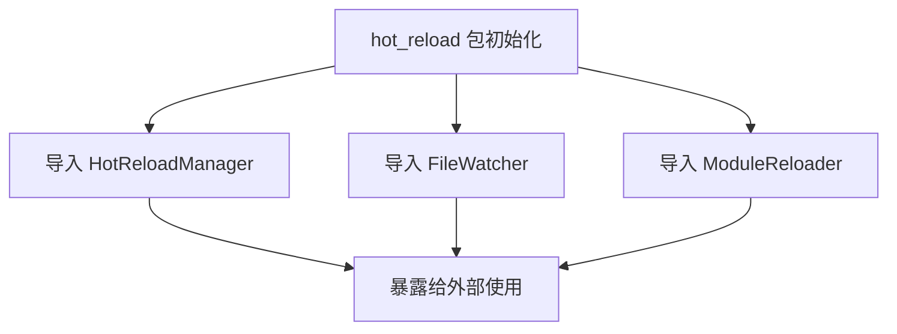
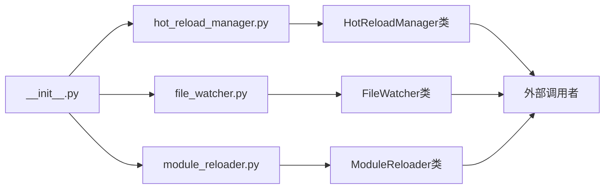

# 文件分析报告：__init__.py

## 文件概述
这是热重载系统的包初始化文件，负责统一暴露热重载相关的核心组件。该文件作为热重载模块的入口点，提供了对 HotReloadManager、FileWatcher 和 ModuleReloader 三个核心类的统一访问接口。

## 代码结构分析

### 导入依赖
```python
from .hot_reload_manager import HotReloadManager
from .file_watcher import FileWatcher  
from .module_reloader import ModuleReloader
```

**依赖分析：**
- `HotReloadManager`: 热重载管理器，协调整个热重载流程
- `FileWatcher`: 文件监控器，负责监控文件系统变化
- `ModuleReloader`: 模块重载器，负责Python模块的动态重载

### 全局变量和常量
```python
__all__ = ['HotReloadManager', 'FileWatcher', 'ModuleReloader']
```

**变量说明：**
- `__all__`: 定义模块的公共API，控制 `from hot_reload import *` 时导入的符号

### 配置和设置
无特殊配置项，该文件仅作为包的统一入口。

## 函数详细分析

### 函数概览表
| 函数名 | 参数 | 返回类型 | 描述 |
|-------|------|----------|------|
| 无 | - | - | 该文件未定义任何函数 |

### 函数详细说明
该文件为纯导入模块，不包含任何函数定义。

## 类详细分析

### 类概览表
| 类名 | 继承关系 | 主要方法 | 描述 |
|------|----------|----------|------|
| 无 | - | - | 该文件未定义任何类 |

### 类详细说明
该文件不包含类定义，仅负责导入和暴露其他模块中的类。

## 函数调用流程图


## 变量作用域分析

### 模块级作用域
- `__all__`: 模块级全局变量，定义公共API接口
- 导入的类: `HotReloadManager`, `FileWatcher`, `ModuleReloader` 在模块作用域内可访问

### 包级暴露策略
通过 `__all__` 明确定义了包的公共接口，确保：
1. API的清晰性和一致性
2. 避免内部实现细节的意外暴露
3. 支持IDE的自动补全和类型检查

## 函数依赖关系

### 模块依赖图


### 依赖层次
1. **导入层**: 从子模块导入核心类
2. **暴露层**: 通过 `__all__` 控制API暴露
3. **使用层**: 外部代码通过此模块访问热重载功能

## 设计模式与架构

### 模块模式
采用典型的Python包初始化模式：
- **统一入口**: 提供单一访问点
- **API控制**: 通过 `__all__` 精确控制暴露接口
- **依赖管理**: 集中管理模块间依赖关系

### 优势
1. **简化导入**: 用户只需从一个位置导入所有相关类
2. **版本控制**: 便于管理API的版本兼容性
3. **文档清晰**: 明确的公共接口利于文档编写和维护