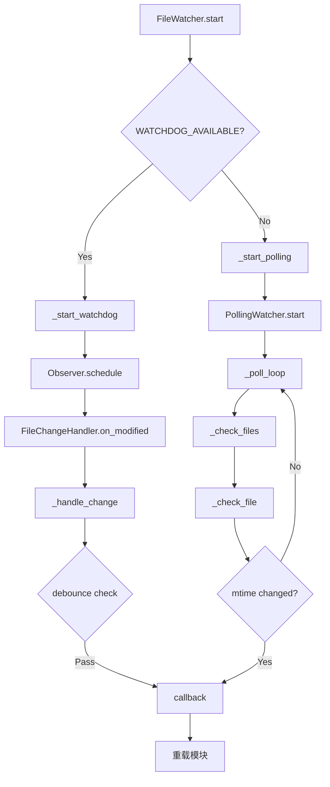
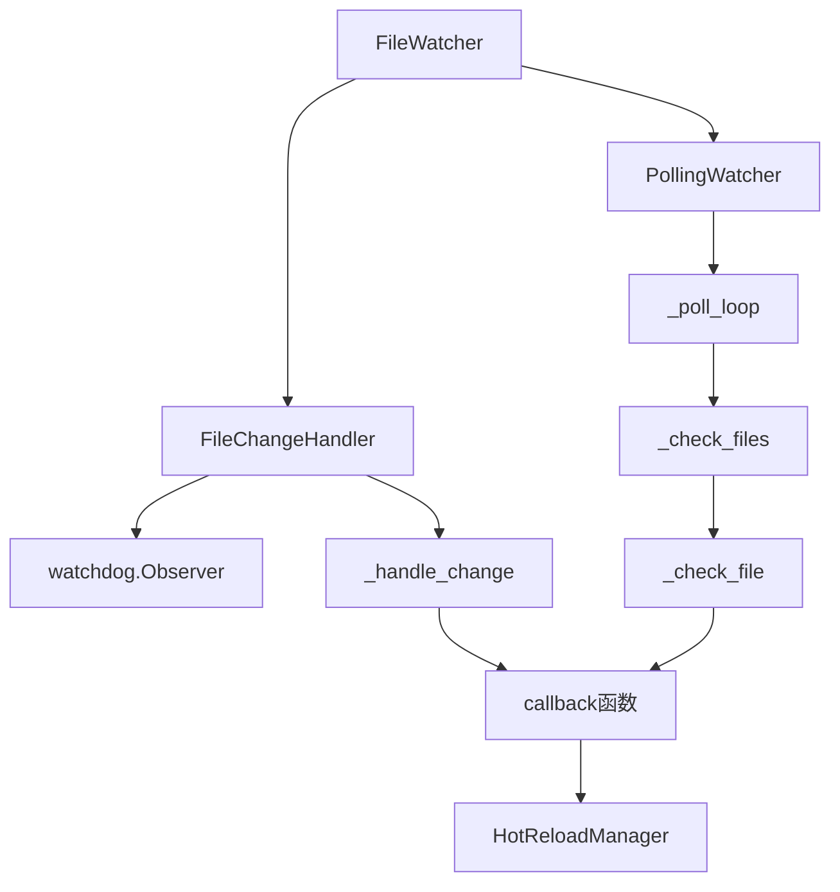

# 文件分析报告：file_watcher.py

## 文件概述
这是热重载系统的核心文件监控模块，负责监控Python文件的变化并触发重载机制。该模块采用双模式设计：优先使用watchdog库进行实时监控，当watchdog不可用时自动切换到轮询模式作为备用方案。具备防抖动、多路径监控、线程安全等高级特性。

## 代码结构分析

### 导入依赖
```python
import os
import time
from pathlib import Path
from typing import Set, List, Callable, Optional
from threading import Thread, Event
import asyncio
from concurrent.futures import ThreadPoolExecutor

# 条件导入watchdog
try:
    from watchdog.observers import Observer
    from watchdog.events import FileSystemEventHandler, FileModifiedEvent, FileCreatedEvent
    WATCHDOG_AVAILABLE = True
except ImportError:
    WATCHDOG_AVAILABLE = False
    # 占位符类定义
    
from src.logging import get_logger
```

**依赖层次：**
- **核心库**: os, time, pathlib - 基础文件系统操作
- **类型系统**: typing - 类型注解支持
- **并发库**: threading, asyncio, concurrent.futures - 多线程/异步支持  
- **可选依赖**: watchdog - 高性能文件监控（可选）
- **项目依赖**: src.logging - 统一日志系统

### 全局变量和常量
```python
WATCHDOG_AVAILABLE = True/False  # watchdog库可用性标志
```

### 配置和设置
- **防抖时间**: 默认0.5秒，防止文件频繁变化触发多次重载
- **轮询间隔**: 默认1.0秒，轮询模式的检查间隔
- **文件过滤**: 仅监控.py文件
- **递归监控**: 支持目录的递归文件监控

## 函数详细分析

### 函数概览表
| 函数名 | 参数 | 返回类型 | 描述 |
|-------|------|----------|------|
| `_handle_change` | file_path: str | None | 处理文件变化，包含防抖动逻辑 |
| `_poll_loop` | 无 | None | 轮询监控的主循环 |
| `_check_files` | 无 | None | 检查所有监控路径的文件 |
| `_check_file` | file_path: Path | None | 检查单个文件的修改时间 |
| `add_path` | path: str | None | 添加文件监控路径 |
| `start` | 无 | None | 启动文件监控 |
| `stop` | 无 | None | 停止文件监控 |
| `_start_watchdog` | 无 | None | 启动watchdog模式监控 |
| `_start_polling` | 无 | None | 启动轮询模式监控 |
| `get_monitored_files` | 无 | List[str] | 获取当前监控的所有Python文件 |

### 函数详细说明

#### `_handle_change(file_path: str)`
**功能**: 处理文件变化事件，实现防抖动机制
```python
def _handle_change(self, file_path: str):
    current_time = time.time()
    last_time = self.last_modified.get(file_path, 0)
    
    if current_time - last_time > self.debounce_seconds:
        self.last_modified[file_path] = current_time
        self.logger.info(f"检测到文件变化: {file_path}")
        self.callback(file_path)
```
- **防抖动**: 防止短时间内多次触发同一文件的变化事件
- **时间戳管理**: 维护每个文件的最后修改时间
- **回调触发**: 调用注册的回调函数处理文件变化

#### `_poll_loop()`
**功能**: 轮询模式的主要监控循环
```python
def _poll_loop(self):
    while self.running:
        try:
            self._check_files()
            time.sleep(self.interval)
        except Exception as e:
            self.logger.error(f"轮询检查文件时出错: {e}")
```
- **持续监控**: 在单独线程中持续运行
- **异常处理**: 确保监控的稳定性
- **间隔控制**: 可配置的检查间隔

#### `start()` 
**功能**: 启动文件监控，自动选择最佳模式
```python
def start(self):
    if not self.watched_paths:
        self.logger.warning("没有设置监控路径")
        return
    
    if self.use_watchdog:
        self._start_watchdog()
    else:
        self._start_polling()
```
- **智能选择**: 根据watchdog可用性自动选择监控模式
- **路径验证**: 确保设置了监控路径
- **模式切换**: 支持运行时模式降级

## 类详细分析

### 类概览表
| 类名 | 继承关系 | 主要方法 | 描述 |
|------|----------|----------|------|
| `FileChangeHandler` | FileSystemEventHandler | on_modified, on_created, _handle_change | Watchdog事件处理器 |
| `PollingWatcher` | 无 | start, stop, _poll_loop | 轮询模式监控器 |
| `FileWatcher` | 无 | add_path, start, stop | 文件监控器主类 |

### 类详细说明

#### `FileChangeHandler`
**职责**: Watchdog模式下的文件变化事件处理
- **事件过滤**: 仅处理Python文件的修改和创建事件
- **防抖动**: 实现文件变化的防抖动逻辑
- **回调管理**: 将文件变化事件转换为回调调用

**关键特性**:
```python
def __init__(self, callback: Callable[[str], None], debounce_seconds: float = 0.5):
    self.callback = callback
    self.debounce_seconds = debounce_seconds
    self.last_modified = {}  # 文件最后修改时间缓存
```

#### `PollingWatcher`
**职责**: 轮询模式下的文件监控实现
- **多路径支持**: 同时监控多个文件或目录
- **线程管理**: 在独立线程中运行监控循环
- **修改时间跟踪**: 通过比较文件修改时间检测变化

**生命周期管理**:
```python
def start(self):
    self.running = True
    self.thread = Thread(target=self._poll_loop, daemon=True)
    self.thread.start()

def stop(self):
    self.running = False
    if self.thread:
        self.thread.join(timeout=1.0)
```

#### `FileWatcher`
**职责**: 统一的文件监控接口，协调不同监控模式
- **模式选择**: 自动选择最优的监控模式
- **路径管理**: 管理所有需要监控的路径
- **生命周期**: 提供统一的启动/停止接口

**智能切换机制**:
```python
def _start_watchdog(self):
    try:
        # 尝试启动watchdog
        self.observer = Observer()
        # ... watchdog设置
    except Exception as e:
        self.logger.error(f"启动watchdog监控失败: {e}")
        self.use_watchdog = False
        self._start_polling()  # 自动降级到轮询模式
```

## 函数调用流程图


## 变量作用域分析

### 模块级作用域
- `WATCHDOG_AVAILABLE`: 全局标志，标识watchdog库的可用性
- 占位符类: 当watchdog不可用时的替代类定义

### 类级作用域
- **FileChangeHandler**: callback, debounce_seconds, last_modified, logger
- **PollingWatcher**: paths, callback, interval, file_mtimes, running, thread
- **FileWatcher**: callback, observer, polling_watcher, watched_paths, use_watchdog

### 线程安全考虑
- **线程分离**: 监控逻辑在独立线程中运行
- **状态管理**: 使用原子操作管理运行状态
- **资源清理**: 提供清理机制防止资源泄露

## 函数依赖关系

### 依赖层次图


### 设计模式

#### 策略模式
- **Watchdog策略**: 高性能实时监控
- **Polling策略**: 兼容性轮询监控
- **自动选择**: 根据环境自动选择最优策略

#### 观察者模式
- **事件源**: 文件系统变化
- **观察者**: FileWatcher及其监控策略
- **通知机制**: 通过callback函数通知变化

#### 适配器模式
- **统一接口**: FileWatcher提供统一的监控接口
- **多种实现**: 适配watchdog和polling两种不同的监控机制

## 性能优化与错误处理

### 性能优化
1. **防抖动机制**: 避免频繁的重载操作
2. **文件过滤**: 仅监控Python文件，减少无效事件
3. **智能降级**: 从高性能模式自动降级到兼容模式
4. **线程隔离**: 监控逻辑不阻塞主线程

### 错误处理
1. **导入容错**: 优雅处理watchdog库缺失的情况
2. **异常恢复**: 轮询循环中的异常不会中断监控
3. **资源清理**: 提供完整的停止和清理机制
4. **超时控制**: 线程停止时设置超时避免无限等待

### 可扩展性
- **回调机制**: 支持自定义的文件变化处理逻辑
- **配置灵活**: 支持自定义防抖时间和轮询间隔
- **路径管理**: 支持动态添加监控路径