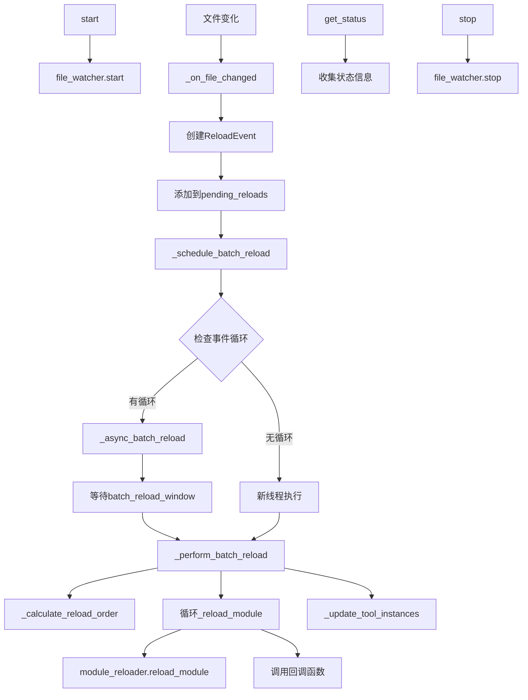

# 文件分析报告：hot_reload_manager.py

## 文件概述
热重载管理器的核心协调组件，负责统一管理文件监控、模块重载和工具实例更新。通过事件驱动机制实现实时代码更新，支持批量重载、依赖排序和智能防抖，是CodeLens热重载系统的大脑。

## 代码结构分析

### 导入依赖
```python
# 系统库
import asyncio, time
from pathlib import Path
from typing import Dict, List, Set, Optional, Callable, Any
from threading import Lock
from collections import defaultdict
import weakref

# 热重载组件
from .file_watcher import FileWatcher
from .module_reloader import ModuleReloader

# 日志系统
from src.logging import get_logger
```

### 全局变量和常量
本文件主要定义类，无全局变量和常量定义。

### 配置和设置
```python
# 默认配置参数
enabled = True                    # 热重载开关
debounce_seconds = 0.5           # 文件变化防抖时间
batch_reload_window = 2.0        # 批量重载时间窗口
max_reload_history = 100         # 最大历史记录数
```

## 函数详细分析

### 函数概览表
| 函数名 | 类型 | 行数 | 复杂度 | 描述 |
|--------|------|------|--------|------|
| `__init__` | 构造函数 | 30-69 | 中 | 初始化管理器和核心组件 |
| _setup_default_watch_paths | 私有方法 | 71-86 | 低 | 设置默认监控路径 |
| register_tool_instance | 公有方法 | 88-91 | 低 | 注册工具实例到缓存 |
| add_reload_callback | 公有方法 | 93-95 | 低 | 添加重载回调函数 |
| start | 公有方法 | 97-118 | 中 | 启动热重载管理器 |
| stop | 公有方法 | 120-136 | 中 | 停止热重载管理器 |
| _on_file_changed | 私有回调 | 138-164 | 中 | 处理文件变化事件 |
| _schedule_batch_reload | 私有方法 | 166-188 | 高 | 调度批量重载任务 |
| _async_batch_reload | 异步方法 | 190-198 | 低 | 异步执行批量重载 |
| _perform_batch_reload | 私有方法 | 200-222 | 中 | 执行批量重载逻辑 |
| _calculate_reload_order | 私有方法 | 224-230 | 低 | 计算模块重载顺序 |
| _reload_module | 私有方法 | 232-272 | 高 | 重载单个模块 |
| _update_tool_instances | 私有方法 | 274-292 | 中 | 更新工具实例 |
| force_reload_all | 公有方法 | 294-297 | 低 | 强制重载所有模块 |
| get_status | 公有方法 | 299-324 | 中 | 获取热重载状态 |
| add_watch_path | 公有方法 | 326-329 | 低 | 添加监控路径 |
| enable/disable | 公有方法 | 331-339 | 低 | 启用/禁用热重载 |
| `__enter__/__exit__` | 上下文方法 | 341-348 | 低 | 上下文管理器支持 |

### 函数详细说明

#### `__init__(enabled, debounce_seconds, batch_reload_window)`
**功能**: 初始化热重载管理器  
**参数**: enabled(bool), debounce_seconds(float), batch_reload_window(float)  
**返回**: None  
**逻辑**: 
- 创建文件监控器和模块重载器实例
- 初始化状态管理和回调机制
- 设置默认监控路径

#### start()
**功能**: 启动热重载管理器  
**参数**: 无  
**返回**: None  
**逻辑**:
- 检查启用状态和运行状态
- 启动文件监控器
- 记录监控文件数量

#### _on_file_changed(file_path)
**功能**: 文件变化事件回调处理器  
**参数**: file_path(str) - 变化的文件路径  
**返回**: None  
**逻辑**:
- 将文件路径转换为模块名
- 检查模块是否可重载
- 创建重载事件并加入待重载队列
- 触发批量重载调度

#### _schedule_batch_reload()
**功能**: 调度批量重载任务  
**参数**: 无  
**返回**: None  
**逻辑**:
- 取消现有的批量重载任务
- 检查事件循环状态
- 在异步环境中调度或在新线程中执行

#### _perform_batch_reload()
**功能**: 执行批量重载的核心逻辑  
**参数**: 无  
**返回**: None  
**逻辑**:
- 收集所有待重载事件
- 按依赖顺序计算重载序列
- 逐个重载模块并处理结果
- 更新工具实例

#### _reload_module(event)
**功能**: 重载单个模块  
**参数**: event(ReloadEvent) - 重载事件对象  
**返回**: None  
**逻辑**:
- 清除模块缓存
- 执行模块重载
- 记录重载结果和耗时
- 调用所有注册的回调函数
- 更新历史记录

#### get_status()
**功能**: 获取热重载系统状态信息  
**参数**: 无  
**返回**: Dict[str, Any] - 状态信息字典  
**逻辑**:
- 收集运行状态、待重载数量
- 获取最近重载历史
- 统计监控文件和工具实例数量

## 类详细分析

### 类概览表
| 类名 | 行数 | 方法数 | 属性数 | 复杂度 | 核心功能 |
|------|------|--------|--------|--------|----------|
| ReloadEvent | 17-25 | 1 | 5 | 低 | 重载事件数据结构 |
| HotReloadManager | 27-348 | 18 | 12 | 高 | 热重载核心管理器 |

### 类详细说明

#### ReloadEvent类
**功能**: 重载事件的数据结构  
**属性**:
- file_path: 变化的文件路径
- module_name: 对应的模块名
- timestamp: 事件发生时间戳
- success: 重载是否成功
- error: 错误信息（如果失败）

**设计模式**: 简单数据类，用于在系统各组件间传递重载事件信息

#### HotReloadManager类
**核心属性**:
- file_watcher: 文件监控器实例
- module_reloader: 模块重载器实例  
- pending_reloads: 待重载事件字典
- reload_history: 重载历史记录
- reload_callbacks: 回调函数列表
- tool_instances: 工具实例弱引用缓存

**设计模式**: 
- 管理器模式：统一协调各个子组件
- 观察者模式：通过回调机制通知事件
- 单例模式：全局唯一的热重载管理器

**关键特性**:
- 异步批量重载：避免频繁重载影响性能
- 智能依赖排序：按模块层级深度排序重载
- 弱引用管理：避免内存泄漏
- 上下文管理器：支持with语句自动管理生命周期

## 函数调用流程图


## 变量作用域分析
```python
# 实例属性作用域
HotReloadManager:
  - enabled: bool                           # 启用状态
  - debounce_seconds: float                 # 防抖时间
  - batch_reload_window: float              # 批量窗口
  - file_watcher: FileWatcher               # 文件监控器
  - module_reloader: ModuleReloader         # 模块重载器
  - pending_reloads: Dict[str, ReloadEvent] # 待重载字典
  - reload_history: List[ReloadEvent]       # 历史记录
  - reload_callbacks: List[Callable]        # 回调列表
  - tool_instances: Dict[str, weakref]      # 工具实例缓存

# 方法局部作用域
_perform_batch_reload():
  - events_to_process: Dict                 # 处理事件字典
  - reload_order: List[str]                 # 重载顺序

_reload_module(event):
  - start_time: float                       # 开始时间
  - duration: float                         # 持续时间
  - success: bool                           # 成功状态
```

## 函数依赖关系
```
HotReloadManager.__init__
├── FileWatcher(callback=_on_file_changed)
├── ModuleReloader()
└── _setup_default_watch_paths
    └── file_watcher.add_path

start
└── file_watcher.start

_on_file_changed
├── module_reloader.file_path_to_module_name
├── module_reloader.is_reloadable
└── _schedule_batch_reload
    ├── _batch_reload_task.cancel()
    └── _async_batch_reload
        └── _perform_batch_reload
            ├── _calculate_reload_order
            ├── _reload_module
            │   ├── module_reloader.clear_module_cache
            │   ├── module_reloader.reload_module
            │   └── callback(event) [循环调用]
            └── _update_tool_instances

get_status
└── file_watcher.get_monitored_files

stop
└── file_watcher.stop
```