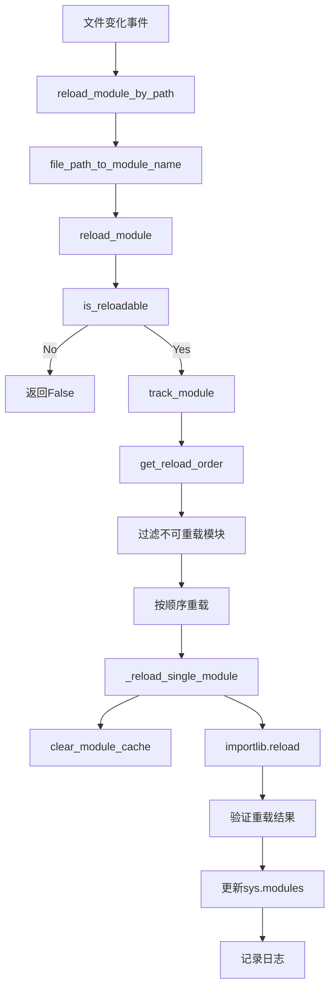
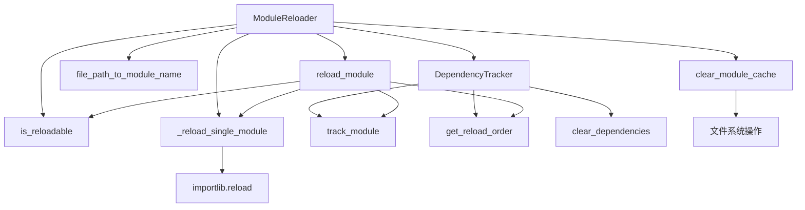
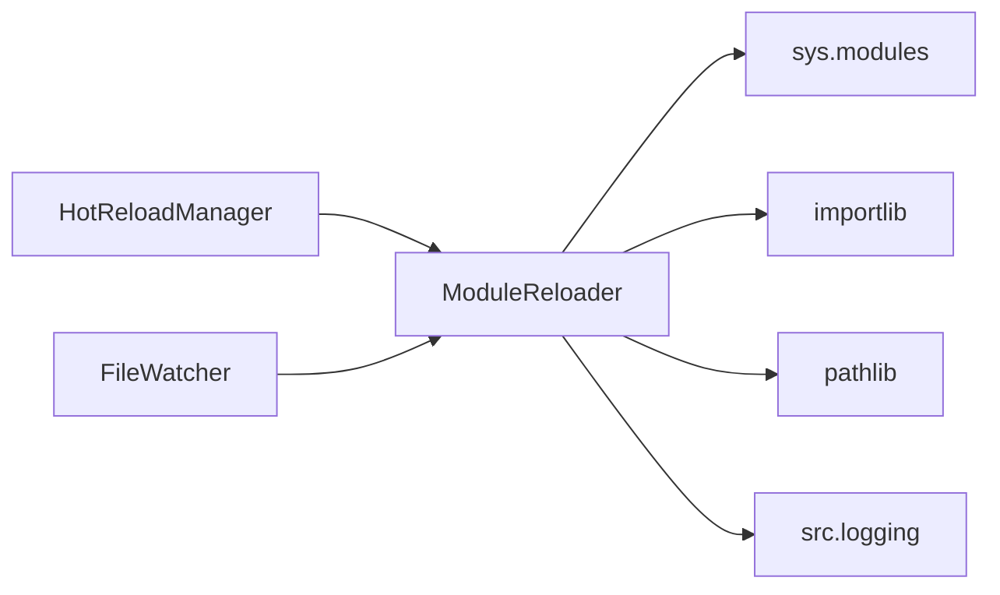

# 文件分析报告：module_reloader.py

## 文件概述
这是热重载系统的核心模块重载组件，负责安全地重新加载Python模块。该模块实现了智能的依赖关系追踪、安全的重载策略、以及完整的错误处理机制。通过DependencyTracker和ModuleReloader两个核心类，提供了生产级的Python模块热重载能力。

## 代码结构分析

### 导入依赖
```python
import sys
import importlib
import importlib.util
from pathlib import Path
from typing import Set, Dict, List, Optional, Any
import traceback
from collections import defaultdict

from src.logging import get_logger
```

**依赖分析：**
- **核心模块**: sys, importlib - Python模块系统核心
- **文件系统**: pathlib - 现代路径处理
- **类型系统**: typing - 完整的类型注解支持
- **错误处理**: traceback - 详细的错误追踪
- **数据结构**: collections.defaultdict - 高效的默认字典
- **项目依赖**: src.logging - 统一日志系统

### 全局变量和常量
模块内各类维护的重要常量：
- **reloadable_prefixes**: 可重载模块前缀列表
- **系统模块黑名单**: 禁止重载的系统关键模块
- **第三方库前缀**: 排除的外部依赖前缀

### 配置和设置
- **项目根目录**: 自动检测项目根路径
- **依赖追踪**: 正向和反向依赖关系映射
- **安全策略**: 多层次的模块过滤机制
- **错误恢复**: 完整的异常处理和日志记录

## 函数详细分析

### 函数概览表
| 函数名 | 参数 | 返回类型 | 描述 |
|-------|------|----------|------|
| `track_module` | module_name: str | None | 追踪模块的依赖关系 |
| `clear_dependencies` | module_name: str | None | 清除模块的依赖关系记录 |
| `get_reload_order` | module_name: str | List[str] | 获取重载顺序（依赖优先） |
| `is_reloadable` | module_name: str | bool | 检查模块是否可以重载 |
| `file_path_to_module_name` | file_path: str | Optional[str] | 将文件路径转换为模块名 |
| `reload_module_by_path` | file_path: str | bool | 根据文件路径重载模块 |
| `reload_module` | module_name: str | bool | 重载指定模块 |
| `_reload_single_module` | module_name: str | bool | 重载单个模块 |
| `get_loaded_project_modules` | 无 | List[str] | 获取已加载的项目模块列表 |
| `clear_module_cache` | module_name: str | None | 清除模块缓存 |
| `reload_all_project_modules` | 无 | Dict[str, bool] | 重载所有项目模块 |

### 函数详细说明

#### `track_module(module_name: str)`
**功能**: 追踪模块的依赖关系，构建依赖图
```python
def track_module(self, module_name: str):
    # 清除旧的依赖关系
    self.clear_dependencies(module_name)
    
    # 分析新的依赖关系
    for name, obj in sys.modules.items():
        if self._is_dependent(module, obj):
            self.dependencies[module_name].add(name)
            self.reverse_dependencies[name].add(module_name)
```
- **依赖发现**: 通过文件路径和包结构分析依赖关系
- **双向映射**: 维护正向和反向依赖关系
- **动态更新**: 实时更新依赖图

#### `get_reload_order(module_name: str) -> List[str]`
**功能**: 获取重载顺序，确保依赖的模块先重载
```python
def get_reload_order(self, module_name: str) -> List[str]:
    order = []
    visited = set()
    
    def dfs(name: str):
        if name in visited:
            return
        visited.add(name)
        
        # 先处理依赖
        for dep in self.dependencies.get(name, set()):
            if dep in sys.modules:
                dfs(dep)
        
        order.append(name)
    
    dfs(module_name)
    return order
```
- **拓扑排序**: 使用深度优先搜索确定重载顺序
- **依赖优先**: 确保被依赖的模块先重载
- **循环检测**: 处理潜在的循环依赖

#### `is_reloadable(module_name: str) -> bool`
**功能**: 多层次检查模块是否可以安全重载
```python
def is_reloadable(self, module_name: str) -> bool:
    # 排除系统模块
    if module_name.startswith('__') or module_name in [...]:
        return False
    
    # 排除第三方库
    if any(module_name.startswith(prefix) for prefix in [...]):
        return False
    
    # 只重载项目内的模块
    if any(module_name.startswith(prefix) for prefix in self.reloadable_prefixes):
        return True
```
- **系统模块保护**: 防止重载关键系统模块
- **第三方库排除**: 避免重载外部依赖
- **项目范围限制**: 只重载项目内的模块
- **文件验证**: 确保模块对应实际的Python文件

#### `reload_module(module_name: str) -> bool`
**功能**: 主要的模块重载流程
```python
def reload_module(self, module_name: str) -> bool:
    # 检查可重载性
    if not self.is_reloadable(module_name):
        return False
    
    # 追踪依赖关系
    self.dependency_tracker.track_module(module_name)
    
    # 获取重载顺序
    reload_order = self.dependency_tracker.get_reload_order(module_name)
    
    # 按顺序重载模块
    for mod_name in filtered_order:
        if not self._reload_single_module(mod_name):
            success = False
            break
```
- **前置检查**: 验证模块可重载性
- **依赖分析**: 构建完整的依赖关系图
- **顺序执行**: 按依赖顺序重载相关模块
- **错误处理**: 完整的异常捕获和恢复

#### `_reload_single_module(module_name: str) -> bool`
**功能**: 执行单个模块的重载操作
```python
def _reload_single_module(self, module_name: str) -> bool:
    module = sys.modules[module_name]
    
    # 保存模块的重要属性
    old_file = getattr(module, '__file__', None)
    old_name = getattr(module, '__name__', module_name)
    
    # 执行重载
    reloaded_module = importlib.reload(module)
    
    # 验证重载是否成功
    if reloaded_module is not module:
        self.logger.warning(f"重载后模块对象发生变化: {module_name}")
```
- **状态保存**: 保留模块的重要属性
- **原子重载**: 使用importlib.reload进行安全重载
- **一致性检查**: 验证重载后的模块对象
- **更新确认**: 确保sys.modules的一致性

## 类详细分析

### 类概览表
| 类名 | 继承关系 | 主要方法 | 描述 |
|------|----------|----------|------|
| `DependencyTracker` | 无 | track_module, get_reload_order | 模块依赖关系追踪器 |
| `ModuleReloader` | 无 | reload_module, is_reloadable | 模块重载器主类 |

### 类详细说明

#### `DependencyTracker`
**职责**: 追踪和管理模块间的依赖关系
- **依赖发现**: 自动分析模块间的依赖关系
- **关系映射**: 维护正向和反向依赖映射
- **顺序计算**: 计算安全的重载顺序
- **关系清理**: 提供依赖关系清理机制

**核心数据结构**:
```python
def __init__(self):
    self.dependencies: Dict[str, Set[str]] = defaultdict(set)        # 正向依赖
    self.reverse_dependencies: Dict[str, Set[str]] = defaultdict(set) # 反向依赖
```

**依赖检测算法**:
```python
def _is_dependent(self, module1: Any, module2: Any) -> bool:
    # 检查是否在同一个包内
    if file1.parent == file2.parent:
        return True
    
    # 检查是否是子包关系
    if str(file2.parent) in str(file1.parent):
        return True
```

#### `ModuleReloader`
**职责**: 提供完整的模块重载能力
- **安全检查**: 多层次的模块可重载性检查
- **路径转换**: 文件路径到模块名的智能转换
- **依赖管理**: 集成依赖追踪器进行智能重载
- **缓存管理**: 清理Python字节码缓存
- **批量操作**: 支持批量重载项目模块

**安全策略设计**:
```python
def is_reloadable(self, module_name: str) -> bool:
    # 多层过滤策略
    # 1. 系统模块黑名单
    # 2. 第三方库排除
    # 3. 包模块过滤
    # 4. 文件存在性验证
    # 5. 项目范围验证
```

**缓存清理机制**:
```python
def clear_module_cache(self, module_name: str):
    # 清除__pycache__中的.pyc文件
    for cache_file in cache_dir.glob(pattern):
        cache_file.unlink()
    
    # 清除依赖关系记录
    self.dependency_tracker.clear_dependencies(module_name)
```

## 函数调用流程图


## 变量作用域分析

### 类级作用域
- **DependencyTracker**: dependencies, reverse_dependencies, logger
- **ModuleReloader**: dependency_tracker, logger, project_root, reloadable_prefixes

### 方法级作用域
- **track_module**: 模块对象引用、依赖分析结果
- **reload_module**: 重载顺序列表、成功状态跟踪
- **_reload_single_module**: 模块属性备份、重载结果验证

### 全局状态管理
- **sys.modules**: Python全局模块注册表
- **依赖图**: 持久化的模块依赖关系
- **缓存文件**: 文件系统中的字节码缓存

## 函数依赖关系

### 内部依赖图


### 外部依赖


## 设计模式与架构

### 命令模式
- **重载命令**: 封装模块重载操作
- **撤销机制**: 通过错误处理提供恢复能力
- **批量执行**: 支持批量重载命令

### 观察者模式
- **依赖变化**: 追踪模块依赖关系变化
- **重载通知**: 通过日志系统通知重载结果

### 策略模式
- **安全策略**: 可配置的模块安全检查策略
- **重载策略**: 不同类型模块的重载策略

## 错误处理与安全机制

### 多层安全检查
1. **模块类型检查**: 排除系统和第三方模块
2. **文件存在性**: 验证模块对应的Python文件
3. **项目范围**: 限制在项目范围内的模块
4. **依赖完整性**: 确保依赖关系的完整性

### 错误恢复机制
1. **异常捕获**: 完整的异常处理和日志记录
2. **状态恢复**: 重载失败时保持原有状态
3. **部分成功**: 支持部分模块重载成功的情况
4. **缓存清理**: 自动清理损坏的缓存文件

### 性能优化
1. **依赖缓存**: 缓存模块依赖关系避免重复分析
2. **智能过滤**: 多层过滤减少不必要的重载操作
3. **批量处理**: 支持批量重载提高效率
4. **异步安全**: 设计支持多线程环境使用

## 实际应用场景

### 开发时热重载
- 文件修改触发自动重载
- 保持应用状态的同时更新代码
- 加速开发调试周期

### 生产环境更新
- 无停机代码更新
- 渐进式模块替换
- 错误回滚机制

### 插件系统
- 动态加载和卸载插件模块
- 插件依赖关系管理
- 插件版本升级支持