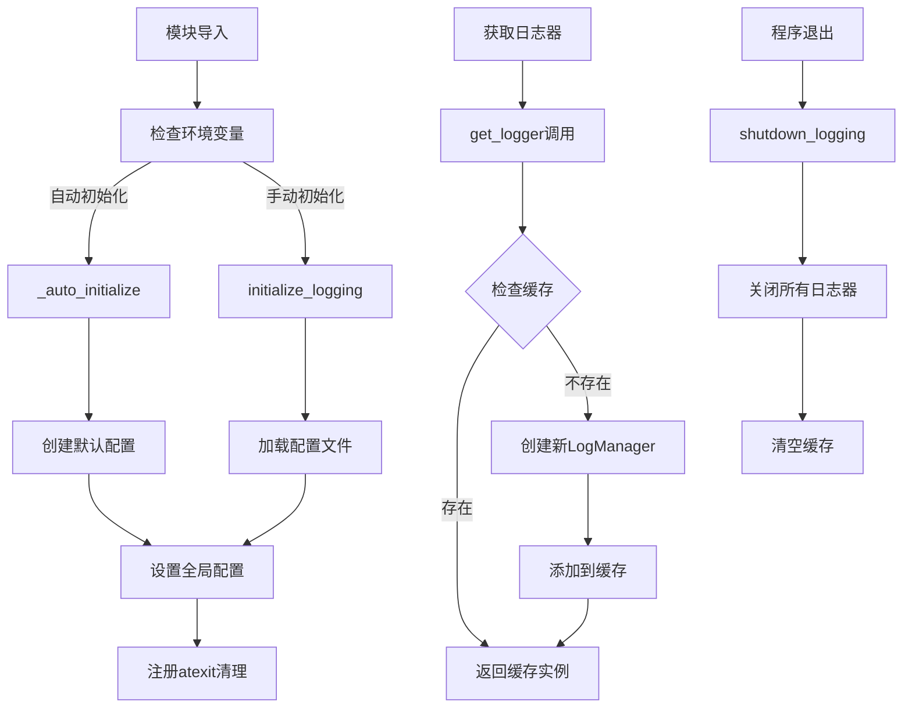

# 文件分析报告：src/logging/__init__.py

## 文件概述
CodeLens日志系统的统一接口文件，提供企业级日志管理功能的完整API。该文件作为日志系统的门面模块，整合了LogManager、FileRotator、LogConfig等核心组件，为整个CodeLens项目提供结构化日志记录、异步写入、文件轮转和配置管理等功能，具备完整的便捷函数和全局状态管理。

## 代码结构分析

### 导入依赖
- **系统模块**: `atexit, os` - 程序退出处理和环境变量访问
- **类型注解**: `typing.Dict, Optional, Any` - 类型提示支持
- **核心组件**: 
  - `LogConfig` - 配置管理和文件加载
  - `LogManager` - 日志记录和管理
  - `FileRotator` - 文件轮转和压缩
- **配置函数**: `get_default_config, set_default_config` - 全局配置管理

### 全局变量和常量
- **_loggers: Dict[str, LogManager]**: 全局日志器缓存字典
- **_default_config: Optional[LogConfig]**: 全局默认配置实例
- **__all__列表**: 定义公共API接口，包含23个导出项

### 配置和设置
- **缓存机制**: 基于component:operation键的日志器缓存
- **配置管理**: 支持配置文件、环境变量和运行时覆盖
- **自动初始化**: 基于环境变量的可选自动初始化
- **清理机制**: atexit注册的优雅关闭处理

## 函数详细分析

### 函数概览表
| 函数名 | 参数 | 返回值 | 功能描述 |
|--------|------|--------|----------|
| `initialize_logging` | config_path, **config_overrides | LogConfig | 初始化日志系统，设置全局配置 |
| `get_logger` | component, operation, config | LogManager | 获取缓存的日志器实例 |
| `create_logger` | component, operation, config_path, **config_overrides | LogManager | 创建新的日志器实例（不使用缓存） |
| `set_log_level` | level, component | None | 设置全局或组件级日志级别 |
| `create_default_config_file` | config_path | None | 创建默认配置文件 |
| `get_log_stats` | 无参数 | Dict[str, Any] | 获取日志系统统计信息 |
| `shutdown_logging` | timeout | None | 关闭所有日志器并清理资源 |
| `setup_file_logging` | log_path, level, max_size_mb, backup_count | LogConfig | 快速设置文件日志 |
| `setup_console_logging` | level | LogConfig | 快速设置控制台日志 |
| `debug/info/warning/error/critical` | message, context, component | None | 便捷日志记录函数 |

### 函数详细说明

**`initialize_logging(config_path, **config_overrides)`**
- 加载配置文件或创建默认配置
- 应用运行时配置覆盖参数
- 设置全局默认配置并注册清理函数
- 返回配置对象供进一步使用

**`get_logger(component, operation, config)`**
- 使用component:operation作为缓存键
- 检查缓存，不存在则创建新的LogManager实例
- 支持自定义配置或使用全局默认配置
- 确保相同参数返回相同的日志器实例

**`create_logger(component, operation, config_path, **config_overrides)`**
- 每次调用都创建新的日志器实例
- 不使用缓存机制，适合特殊场景
- 支持独立的配置文件和配置覆盖
- 适用于临时日志记录需求

**`get_log_stats()`**
- 统计活跃日志器数量和列表
- 收集每个日志器的详细统计信息
- 包含全局配置信息
- 提供异常安全的统计收集

**`shutdown_logging(timeout)`**
- 遍历所有缓存的日志器并执行关闭
- 支持超时控制，避免无限等待
- 清空全局缓存，释放资源
- 提供异常安全的关闭处理

## 类详细分析

### 类概览表
| 类名 | 继承关系 | 主要职责 | 实例方法数量 |
|------|----------|----------|--------------|
| 导入的类 | 见各自模块 | 日志系统组件 | 见各自定义 |

### 类详细说明
该文件主要通过导入和封装其他模块的类来提供统一接口：
- **LogConfig**: 配置管理，支持JSON文件和运行时更新
- **LogManager**: 核心日志管理，结构化日志和异步写入
- **FileRotator**: 文件轮转，支持大小和时间轮转策略

## 函数调用流程图

## 变量作用域分析
- **模块作用域**: _loggers缓存字典、_default_config全局配置
- **函数作用域**: 各函数内的局部变量，如config、logger_key
- **全局作用域**: 通过__all__暴露的公共API函数
- **缓存作用域**: _loggers字典维护的日志器实例生命周期

## 函数依赖关系
- `initialize_logging` → `LogConfig` 构造和配置设置
- `get_logger` → `LogManager` 实例创建
- `set_log_level` → 全局配置更新
- `shutdown_logging` → 所有日志器的关闭方法
- 便捷函数 → `get_logger` → `LogManager` 方法
- 自动初始化 → 环境变量检查 → `initialize_logging`

