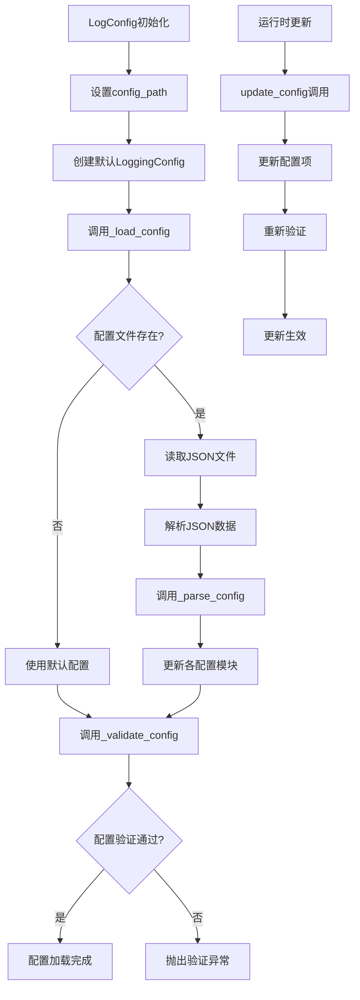

# 文件分析报告：src/logging/config.py

## 文件概述
CodeLens日志系统的配置管理核心模块，提供完整的企业级配置管理功能。该文件通过dataclass模式定义了层次化的配置结构，支持JSON配置文件加载、运行时配置更新、配置验证和默认配置生成，为整个日志系统提供了灵活可靠的配置基础设施。

## 代码结构分析

### 导入依赖
- **系统模块**: `json, os, pathlib.Path` - JSON解析、环境变量访问和路径操作
- **类型系统**: `typing.Dict, Any, Optional` - 类型注解和可选类型支持
- **数据类**: `dataclasses.dataclass, asdict` - 结构化数据定义和序列化

### 全局变量和常量
- **VALID_LEVELS**: {"DEBUG", "INFO", "WARNING", "ERROR", "CRITICAL"} - 支持的日志级别
- **VALID_ROTATION**: {"size", "time"} - 支持的文件轮转策略
- **VALID_FORMATS**: {"structured", "simple"} - 支持的日志格式
- **_default_config**: 全局默认配置实例缓存

### 配置和设置
- **dataclass配置**: 使用dataclass定义配置结构，确保类型安全
- **默认值策略**: 为所有配置项提供合理的默认值
- **验证机制**: 完整的配置验证逻辑确保配置有效性

## 函数详细分析

### 函数概览表
| 函数名 | 参数 | 返回值 | 功能描述 |
|--------|------|--------|----------|
| `__init__` | config_path | None | 初始化配置管理器，加载配置文件 |
| `_load_config` | self | None | 内部配置加载方法 |
| `_parse_config` | self, config_data | None | 解析JSON配置数据 |
| `_validate_config` | self | None | 验证配置有效性 |
| `get_config` | self | LoggingConfig | 获取当前配置对象 |
| `get_log_level` | self, component | str | 获取指定组件的日志级别 |
| `get_log_level_int` | self, component | int | 获取日志级别的数值表示 |
| `get_file_path` | self | str | 获取日志文件路径 |
| `get_absolute_file_path` | self | Path | 获取日志文件的绝对路径 |
| `is_file_logging_enabled` | self | bool | 检查文件日志是否启用 |
| `is_console_logging_enabled` | self | bool | 检查控制台日志是否启用 |
| `is_async_enabled` | self | bool | 检查异步日志是否启用 |
| `update_config` | self, **kwargs | None | 运行时更新配置 |
| `update_component_level` | self, component, level | None | 更新组件日志级别 |
| `save_config` | self, config_path | None | 保存配置到文件 |
| `to_dict` | self | Dict[str, Any] | 将配置转换为字典 |
| `create_default_config_file` | config_path | None | 创建默认配置文件(类方法) |

### 函数详细说明

**`__init__(self, config_path)`**
- 初始化配置路径并创建默认配置对象
- 调用_load_config()加载指定的配置文件
- 处理配置文件不存在的情况，使用默认配置

**`_load_config(self)`**
- 检查配置文件是否存在，存在则加载JSON内容
- 处理嵌套的"logging"配置节点
- 异常安全处理，配置加载失败时使用默认配置
- 调用配置验证确保配置有效性

**`_parse_config(self, config_data)`**
- 解析JSON配置数据到dataclass对象
- 处理文件、控制台、组件和保留策略等各个配置模块
- 使用get()方法提供默认值，确保配置完整性
- 支持增量配置更新，保持未指定项的默认值

**`_validate_config(self)`**
- 验证日志级别的有效性（全局和组件级别）
- 验证日志格式和轮转策略的有效性
- 验证数值配置的合理性（文件大小、备份数量、保留天数）
- 抛出详细的错误信息帮助定位配置问题

**`update_config(self, **kwargs)`**
- 支持运行时动态更新配置
- 处理复杂配置对象（file、console、retention）的增量更新
- 更新后重新验证配置确保一致性
- 保持配置变更的原子性

**`get_absolute_file_path(self)`**
- 处理相对路径和绝对路径的转换
- 相对路径基于项目根目录解析
- 返回Path对象便于后续路径操作

## 类详细分析

### 类概览表
| 类名 | 继承关系 | 主要职责 | 实例方法数量 |
|------|----------|----------|--------------|
| `FileConfig` | @dataclass | 文件日志配置 | 0 (数据类) |
| `ConsoleConfig` | @dataclass | 控制台日志配置 | 0 (数据类) |
| `RetentionConfig` | @dataclass | 日志保留策略配置 | 0 (数据类) |
| `LoggingConfig` | @dataclass | 主配置容器 | 1 (__post_init__) |
| `LogConfig` | 普通类 | 配置管理器 | 17个 |

### 类详细说明

**`FileConfig`**
- **设计目的**: 封装文件日志相关的所有配置项
- **核心属性**: enabled、path、max_size_mb、backup_count、rotation
- **默认策略**: 启用文件日志，10MB大小限制，5个备份文件

**`ConsoleConfig`**
- **设计目的**: 管理控制台输出的配置
- **核心属性**: enabled、level
- **默认策略**: 启用控制台，WARNING级别

**`RetentionConfig`**
- **设计目的**: 定义日志文件的保留和清理策略
- **核心属性**: days、compress
- **默认策略**: 保留30天，启用压缩

**`LoggingConfig`**
- **设计目的**: 作为所有配置的顶层容器
- **初始化逻辑**: __post_init__方法确保子配置对象的正确初始化
- **组件支持**: 内置常见组件的默认日志级别配置

**`LogConfig`**
- **设计目的**: 提供配置管理的完整API
- **核心职责**: 配置加载、验证、更新、保存和查询
- **扩展性**: 支持新增配置项和自定义验证规则

## 函数调用流程图

## 变量作用域分析
- **模块作用域**: 常量定义（VALID_LEVELS等）、全局配置实例
- **类作用域**: dataclass字段定义、LogConfig方法定义
- **实例作用域**: 配置对象状态、文件路径等实例属性
- **函数作用域**: 临时变量、配置解析中间结果

## 函数依赖关系
- `__init__` → `_load_config` → `_parse_config` → `_validate_config`
- `update_config` → `_validate_config`
- `save_config` → `to_dict` → `asdict`
- `get_absolute_file_path` → `Path`操作
- 全局函数 → `LogConfig`实例方法

