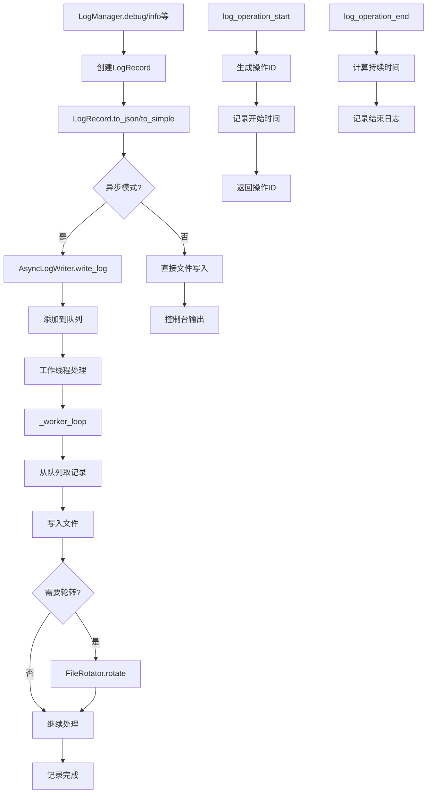

# 文件分析报告：src/logging/manager.py

## 文件概述
CodeLens日志系统的核心管理器实现，为整个日志系统提供统一的日志管理功能，包括结构化日志生成、异步写入、文件轮转协调和上下文信息管理。该文件作为日志系统的管理中枢，集成LogRecord日志记录对象、AsyncLogWriter异步写入器和LogManager主管理器，实现企业级的日志处理能力。

## 代码结构分析

### 导入依赖
- **时间处理**: `datetime` - 时间戳生成和格式化
- **数据处理**: `json` - JSON格式序列化
- **系统模块**: `os, sys, threading, uuid` - 系统信息、线程管理和唯一标识
- **并发模块**: `queue.Queue, Empty` - 异步队列管理
- **异常处理**: `traceback` - 异常堆栈信息
- **类型注解**: `typing.Dict, Any, Optional` - 类型提示支持
- **配置管理**: `.config.LogConfig` - 日志配置管理
- **文件轮转**: `.rotator.FileRotator` - 文件轮转服务

### 全局变量和常量
- 无全局变量定义，所有状态封装在类中

### 配置和设置
- **结构化日志**: 支持JSON和简单文本两种输出格式
- **异步写入**: 基于队列的异步日志写入机制
- **上下文管理**: 完整的日志上下文信息记录
- **元数据支持**: 进程ID、线程ID、请求ID等系统元数据

## 函数详细分析

### 函数概览表
| 函数名 | 参数 | 返回值 | 功能描述 |
|--------|------|--------|----------|
| `__init__` | self, level, component, operation, message, context, exc_info | None | 初始化日志记录对象 |
| `to_json` | self | str | 将日志记录转换为JSON格式 |
| `to_simple` | self | str | 将日志记录转换为简单文本格式 |
| `__init__` | self, config | None | 初始化异步日志写入器 |
| `_start_worker` | self | None | 启动异步写入工作线程 |
| `_worker_loop` | self | None | 异步写入工作循环 |
| `write_log` | self, record | None | 写入日志记录到队列 |
| `shutdown` | self, timeout | None | 关闭异步写入器 |
| `__init__` | self, component, operation, config | None | 初始化日志管理器 |
| `log_operation_start` | self, operation, **context | str | 记录操作开始日志 |
| `log_operation_end` | self, operation, operation_id, **context | None | 记录操作结束日志 |
| `debug/info/warning/error/critical` | self, message, context, exc_info | None | 各级别日志记录方法 |

### 函数详细说明

**`LogRecord.__init__(self, level, component, operation, message, context, exc_info)`**
- 创建结构化日志记录对象
- 生成ISO格式时间戳和系统元数据
- 收集进程ID、线程ID、请求ID等系统信息
- 处理异常信息和上下文数据

**`LogRecord.to_json(self)`**
- 将日志记录序列化为JSON格式
- 包含完整的日志信息和系统元数据
- 处理异常信息的详细堆栈跟踪
- 使用紧凑的JSON输出格式

**`LogRecord.to_simple(self)`**
- 生成简单易读的文本格式日志
- 按时间戳、级别、组件、操作、消息的顺序排列
- 可选地包含上下文信息和异常信息
- 适用于人工查看和调试

**`AsyncLogWriter.__init__(self, config)`**
- 初始化异步日志写入组件
- 创建日志队列和文件轮转器
- 根据配置决定是否启动异步工作线程
- 设置关闭标志和文件句柄

**`AsyncLogWriter._worker_loop(self)`**
- 异步写入的核心工作循环
- 从队列中取出日志记录并写入文件
- 处理文件轮转和异常情况
- 支持优雅关闭和超时处理

**`LogManager.log_operation_start(self, operation, **context)`**
- 记录操作开始的日志
- 生成唯一的操作ID用于关联
- 记录操作开始时间和上下文信息
- 返回操作ID供后续使用

**`LogManager.log_operation_end(self, operation, operation_id, **context)`**
- 记录操作结束的日志
- 计算操作持续时间
- 关联开始和结束的操作ID
- 记录操作结果和性能信息

## 类详细分析

### 类概览表
| 类名 | 继承关系 | 主要职责 | 实例方法数量 |
|------|----------|----------|--------------|
| `LogRecord` | 无继承 | 日志记录对象，数据结构和格式化 | 3个 |
| `AsyncLogWriter` | 无继承 | 异步日志写入器，队列和线程管理 | 8个 |
| `LogManager` | 无继承 | 日志管理器，统一接口和操作管理 | 10个以上 |

### 类详细说明

**`LogRecord`**
- **设计目的**: 封装单条日志记录的所有信息
- **核心职责**: 日志数据结构化、格式化输出、元数据管理
- **数据字段**: 时间戳、级别、组件、操作、消息、上下文、异常、元数据
- **输出格式**: 支持JSON和简单文本两种格式
- **扩展性**: 易于添加新的输出格式和字段

**`AsyncLogWriter`**
- **设计目的**: 提供高性能的异步日志写入能力
- **核心职责**: 队列管理、异步写入、文件轮转协调、线程安全
- **工作机制**: 基于生产者-消费者模式的异步处理
- **性能优化**: 批量写入、缓冲管理、非阻塞操作
- **可靠性**: 优雅关闭、错误恢复、资源清理

**`LogManager`**
- **设计目的**: 提供统一的日志管理接口
- **核心职责**: 日志记录、操作跟踪、配置管理、输出控制
- **集成能力**: 整合配置、写入器、轮转器等组件
- **易用性**: 提供便捷的日志记录方法和操作跟踪
- **企业级**: 支持结构化日志、异步写入、文件管理

## 函数调用流程图

## 变量作用域分析
- **模块作用域**: 导入的模块和类
- **类作用域**: LogRecord、AsyncLogWriter、LogManager类定义
- **实例作用域**: 配置对象、队列、线程、文件句柄等实例属性
- **方法作用域**: 各方法内的局部变量，如日志记录、时间戳等

## 函数依赖关系
- `LogManager` → `LogRecord` 日志记录创建
- `LogManager` → `AsyncLogWriter` 异步写入
- `AsyncLogWriter` → `FileRotator` 文件轮转
- `LogRecord` → `json, datetime` 数据序列化
- `AsyncLogWriter` → `Queue, threading` 异步处理
- 操作跟踪方法 → `uuid` 唯一标识生成
- 异常处理 → `traceback` 堆栈信息收集