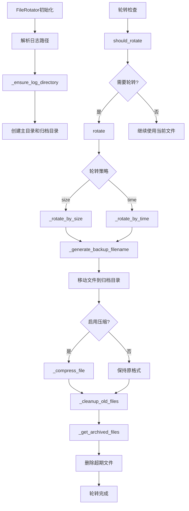

# 文件分析报告：src/logging/rotator.py

## 文件概述
CodeLens日志系统的文件轮转器实现，为日志系统提供完整的日志文件创建、轮转和清理功能。该组件支持按大小或时间进行文件轮转，提供自动目录创建、历史文件清理和文件压缩等企业级日志管理功能，确保日志文件的有序管理和存储空间的合理利用。

## 代码结构分析

### 导入依赖
- **时间处理**: `datetime` - 时间戳和日期处理
- **文件压缩**: `gzip` - 日志文件压缩功能
- **系统操作**: `os, shutil` - 文件系统操作和文件移动
- **路径处理**: `pathlib.Path` - 现代Python路径操作
- **类型注解**: `typing.List` - 类型提示支持
- **配置管理**: `.config.LogConfig` - 日志配置管理

### 全局变量和常量
- 无全局变量定义，所有配置通过LogConfig传入

### 配置和设置
- **轮转策略**: 支持按大小("size")和按时间("time")两种轮转方式
- **目录管理**: 自动创建日志目录和归档目录结构
- **文件命名**: 基于时间戳的备份文件命名规则
- **压缩配置**: 可选的历史文件压缩功能

## 函数详细分析

### 函数概览表
| 函数名 | 参数 | 返回值 | 功能描述 |
|--------|------|--------|----------|
| `__init__` | self, config | None | 初始化文件轮转器，设置路径和目录 |
| `_ensure_log_directory` | self | None | 确保日志目录和归档目录存在 |
| `should_rotate` | self | bool | 检查是否需要执行文件轮转 |
| `rotate` | self | str | 执行文件轮转操作 |
| `_rotate_by_size` | self | str | 按大小轮转文件 |
| `_rotate_by_time` | self | str | 按时间轮转文件 |
| `_generate_backup_filename` | self | str | 生成备份文件名 |
| `_cleanup_old_files` | self | None | 清理超期的日志文件 |
| `_get_archived_files` | self | List[Path] | 获取归档目录中的文件列表 |
| `_compress_file` | self, file_path | str | 压缩指定的日志文件 |

### 函数详细说明

**`__init__(self, config)`**
- 初始化文件轮转器，解析日志文件路径信息
- 提取日志目录、文件名和扩展名
- 调用_ensure_log_directory确保目录结构存在
- 为轮转操作准备基础环境

**`_ensure_log_directory(self)`**
- 创建日志主目录，支持多级目录创建
- 创建archived归档子目录用于存放历史文件
- 使用exist_ok参数避免重复创建错误
- 为文件轮转提供目录基础

**`should_rotate(self)`**
- 检查当前日志文件是否需要轮转
- 基于配置的轮转策略进行判断
- 按大小轮转：检查文件大小是否超过限制
- 按时间轮转：检查文件修改时间是否超期

**`rotate(self)`**
- 执行文件轮转的主控制方法
- 根据配置的轮转策略路由到相应方法
- 支持size和time两种轮转模式
- 返回新创建的备份文件路径

**`_rotate_by_size(self)`**
- 按文件大小执行轮转操作
- 生成带时间戳的备份文件名
- 将当前日志文件移动到归档目录
- 可选地压缩备份文件

**`_rotate_by_time(self)`**
- 按时间周期执行轮转操作
- 基于文件修改时间判断是否需要轮转
- 生成基于日期的备份文件名
- 执行文件移动和可选压缩

**`_cleanup_old_files(self)`**
- 清理超过保留期限的历史日志文件
- 基于配置的保留天数和备份数量限制
- 删除最旧的文件以控制存储空间
- 支持压缩文件和普通文件的混合清理

**`_compress_file(self, file_path)`**
- 使用gzip压缩指定的日志文件
- 创建.gz格式的压缩文件
- 删除原始文件以节省空间
- 返回压缩后的文件路径

## 类详细分析

### 类概览表
| 类名 | 继承关系 | 主要职责 | 实例方法数量 |
|------|----------|----------|--------------|
| `FileRotator` | 无继承 | 日志文件轮转和管理 | 10个 |

### 类详细说明

**`FileRotator`**
- **设计目的**: 提供完整的日志文件生命周期管理
- **核心职责**: 文件轮转、目录管理、历史清理、文件压缩
- **轮转策略**: 支持按大小和按时间两种轮转模式
- **存储管理**: 自动清理超期文件，支持文件压缩
- **集成能力**: 与LogConfig深度集成，配置驱动
- **可靠性**: 目录自动创建，异常安全处理

## 函数调用流程图

## 变量作用域分析
- **模块作用域**: 导入的模块和类
- **类作用域**: FileRotator类定义和方法
- **实例作用域**: config、log_path、log_dir、log_name、log_ext等路径信息
- **方法作用域**: 各方法内的局部变量，如备份文件名、文件列表等

## 函数依赖关系
- `__init__` → `_ensure_log_directory` 目录初始化
- `rotate` → `should_rotate` 轮转条件检查
- `rotate` → `_rotate_by_size` / `_rotate_by_time` 策略执行
- 轮转方法 → `_generate_backup_filename` 文件命名
- 轮转方法 → `_compress_file` 可选压缩
- `rotate` → `_cleanup_old_files` 历史清理
- `_cleanup_old_files` → `_get_archived_files` 文件列表获取
- 所有方法 → `LogConfig` 配置访问
- 文件操作 → `pathlib.Path, shutil` 系统调用