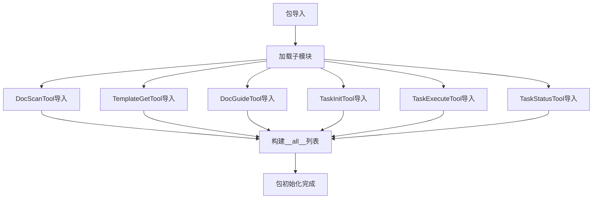

# 文件分析报告：src/mcp_tools/__init__.py

## 文件概述
CodeLens MCP工具包的初始化文件，负责统一管理和导出6个核心MCP工具模块。该文件作为MCP工具集合的对外接口，通过标准化的导入声明和__all__列表，为Claude Code提供了项目文件扫描、文档生成引导、任务管理和状态跟踪的完整功能集。

## 代码结构分析

### 导入依赖
- **DocScanTool**: 项目文件扫描和元数据提取工具
- **TemplateGetTool**: 文档模板获取和管理工具
- **DocGuideTool**: 智能项目分析和文档策略生成工具
- **TaskInitTool**: 任务计划初始化和依赖解析工具
- **TaskExecuteTool**: 任务执行引擎和模板集成工具
- **TaskStatusTool**: 实时任务状态监控和进度跟踪工具

### 全局变量和常量
- **__all__列表**: 定义包的公共API接口，包含6个核心工具类
- **包文档字符串**: 描述MCP工具集合的用途和目标

### 配置和设置
- **导入配置**: 使用相对导入，确保包内模块的正确引用
- **API暴露**: 通过__all__列表精确控制对外暴露的接口
- **文档配置**: 完整的包级别文档字符串，说明工具集的功能范围

## 函数详细分析

### 函数概览表
| 函数名 | 参数 | 返回值 | 功能描述 |
|--------|------|--------|----------|
| 无函数定义 | - | - | 纯导入和导出配置文件 |

### 函数详细说明
该文件专注于模块导入和API定义，不包含具体的函数实现。

## 类详细分析

### 类概览表
| 类名 | 继承关系 | 主要职责 | 实例方法数量 |
|------|----------|----------|--------------|
| 导入的类 | 见各自模块 | MCP工具实现 | 见各自定义 |

### 类详细说明
该文件通过导入语句引入了6个核心MCP工具类，每个类都有各自的专业功能：
- **DocScanTool**: 项目扫描和文件分析
- **TemplateGetTool**: 模板系统管理
- **DocGuideTool**: 智能分析和策略指导
- **TaskInitTool**: 任务初始化和计划生成
- **TaskExecuteTool**: 任务执行和模板应用
- **TaskStatusTool**: 状态监控和进度管理

## 函数调用流程图

## 变量作用域分析
- **模块作用域**: __all__列表和导入的类定义
- **包作用域**: 为整个mcp_tools包提供统一的对外接口
- **全局作用域**: 通过__all__暴露的公共API

## 函数依赖关系
- **导入依赖**: 依赖于6个子模块的正确实现
- **接口依赖**: __all__列表依赖于导入类的命名一致性
- **包依赖**: 为上层模块提供统一的工具导入接口

