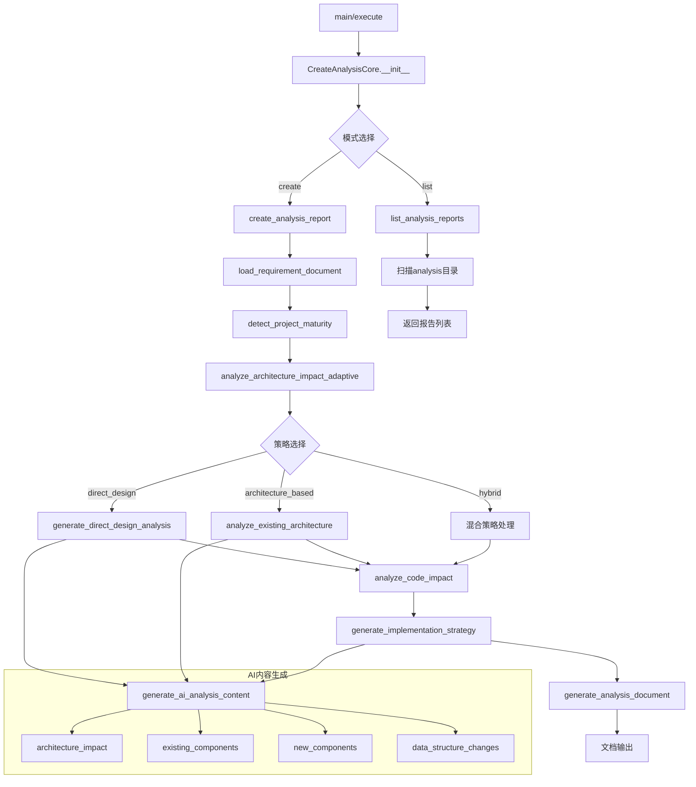

# 文件分析报告：create_analysis.py

## 文件概述
CodeLens创造模式第二阶段分析实现工具，专注于基于架构文档分析实现方案和影响链。该工具提供智能的项目成熟度检测、自适应分析策略以及全面的架构影响评估功能，是功能需求从概念转化为具体实现计划的关键桥梁。

## 代码结构分析

### 导入依赖
```python
# 标准库导入
import sys, json, argparse, time
from pathlib import Path
from datetime import datetime
from typing import Dict, Any, List, Optional

# 项目依赖（带容错处理）
from src.logging import get_logger
from src.templates.document_templates import TemplateService
from src.services.file_service import FileService
```

### 全局变量和常量
```python
# 项目根目录路径计算
project_root = os.path.dirname(os.path.dirname(os.path.dirname(__file__)))

# 技术栈检测指标字典
tech_indicators = {
    "Python": [".py", "requirements.txt", "setup.py", "pyproject.toml"],
    "JavaScript/Node.js": ["package.json", ".js", ".ts", "node_modules"],
    "Java": [".java", "pom.xml", "build.gradle"],
    "Go": [".go", "go.mod", "go.sum"],
    "Rust": [".rs", "Cargo.toml"],
    "C/C++": [".c", ".cpp", ".h", "Makefile", "CMakeLists.txt"]
}
```

### 配置和设置
```python
# 文档目录结构配置
self.create_docs_path = self.project_path / "docs" / "project" / "create"
self.requirements_dir = self.create_docs_path / "requirements"
self.analysis_dir = self.create_docs_path / "analysis"
self.architecture_docs_path = self.project_path / "docs" / "architecture"

# 成熟度检测阈值
key_docs = ["overview.md", "tech-stack.md", "data-flow.md", "architecture.md", "design.md"]
substantial_doc_threshold = 1000  # 1KB
maturity_threshold = 5000  # 5KB
```

## 函数详细分析

### 函数概览表
| 函数名 | 功能描述 | 参数 | 返回值 |
|--------|----------|------|--------|
| `__init__` | 初始化分析工具实例 | project_path | None |
| `analyze_project_context` | 分析项目上下文信息 | 无 | Dict[项目分析结果] |
| `generate_ai_analysis_content` | 生成AI驱动的分析内容 | field_name, feature_name, context, requirement_info | str |
| `generate_analysis_id` | 生成唯一分析标识符 | requirement_id | str |
| `load_requirement_document` | 加载需求文档 | requirement_id | Dict[加载结果] |
| `detect_project_maturity` | 检测项目成熟度级别 | 无 | Dict[成熟度信息] |
| `analyze_architecture_impact_adaptive` | 自适应架构影响分析 | requirement_info | Dict[架构分析] |
| `generate_direct_design_analysis` | 新项目直接设计分析 | feature_name, requirement_info, field_type | str |
| `analyze_existing_architecture` | 现有架构分析 | requirement_info, context | Dict[架构分析] |
| `analyze_code_impact` | 分析代码影响 | requirement_info | Dict[代码影响] |
| `generate_implementation_strategy` | 生成实现策略 | requirement_info, architecture_analysis, code_analysis | Dict[实现策略] |
| `create_analysis_report` | 创建完整分析报告 | requirement_id, analysis_depth, include_tests | Dict[分析报告] |
| `generate_analysis_document` | 生成分析文档 | analysis_id, template_data | Dict[文档生成结果] |
| `list_analysis_reports` | 列出现有分析报告 | 无 | Dict[报告列表] |

### 函数详细说明

#### 核心分析函数

**`analyze_project_context()`**
- **功能**: 全面分析项目技术栈、文件结构和现有服务
- **实现**: 扫描项目文件，通过文件扩展名和配置文件推断技术栈类型
- **特点**: 智能识别Flask/Django/FastAPI等框架类型

**`detect_project_maturity()`**
- **功能**: 智能检测项目成熟度，决定分析策略
- **分级**: new(新项目) / developing(开发中) / mature(成熟项目)
- **策略**: direct_design / hybrid / architecture_based
- **阈值**: 基于文档数量、大小、关键文档存在性判断

**`analyze_architecture_impact_adaptive()`**
- **功能**: 根据项目成熟度自适应选择分析策略
- **策略1**: 直接设计 - 适用于无架构文档的新项目
- **策略2**: 架构分析 - 适用于有完整架构文档的成熟项目
- **策略3**: 混合模式 - 适用于部分文档的开发中项目

#### AI内容生成函数

**`generate_ai_analysis_content()`**
- **功能**: 基于功能特征和项目上下文生成分析内容
- **领域**: architecture_impact, existing_components, new_components等
- **特点**: 针对不同功能类型(缓存、认证、API)提供专门化分析

**`generate_implementation_strategy()`**
- **功能**: 生成完整的实现策略和技术方案
- **内容**: 技术选型、实现步骤、风险评估、测试策略
- **覆盖**: 18个维度的全面实现指导

#### 文档处理函数

**`load_requirement_document()`**
- **功能**: 解析需求文档，提取功能名称和需求信息
- **解析**: 支持markdown格式需求文档的结构化解析
- **容错**: 提供完整的错误处理和异常恢复

**`create_analysis_report()`**
- **功能**: 整合所有分析结果，生成完整分析报告
- **流程**: 需求加载 → 架构分析 → 代码分析 → 策略生成 → 文档输出
- **模板**: 使用TemplateService格式化专业分析文档

## 类详细分析

### 类概览表
| 类名 | 继承关系 | 主要职责 | 关键方法 |
|------|----------|----------|----------|
| `CreateAnalysisCore` | 无 | 分析引擎核心实现 | analyze_*, generate_*, create_analysis_report |
| `CreateAnalysisTool` | 无 | MCP工具接口封装 | get_tool_definition, execute |
| `DummyLogger` | 无 | 日志系统降级实现 | debug, info, warning, error |
| `DummyTemplateService` | 无 | 模板服务降级实现 | get_template_content, format_template |
| `DummyFileService` | 无 | 文件服务降级实现 | scan_source_files |

### 类详细说明

#### `CreateAnalysisCore`
**设计模式**: 门面模式 + 策略模式
- **门面模式**: 为复杂的分析流程提供统一简洁接口
- **策略模式**: 根据项目成熟度动态选择不同分析策略

**核心功能模块**:
1. **项目上下文分析**: 技术栈识别、文件结构扫描、服务发现
2. **成熟度检测**: 智能评估项目文档完整度和技术复杂度
3. **自适应分析**: 根据成熟度选择最适合的分析策略
4. **AI内容生成**: 基于模式匹配和上下文生成分析内容
5. **文档管理**: 完整的分析报告生成和管理

**状态管理**:
- 使用文件系统持久化分析结果
- 支持增量分析和历史版本管理
- 提供完整的操作审计日志

#### `CreateAnalysisTool`
**设计模式**: 适配器模式
- 将`CreateAnalysisCore`的功能适配为MCP工具接口
- 提供标准化的工具定义和执行接口
- 处理参数验证和错误转换

**接口规范**:
```python
tool_definition = {
    "name": "create_analysis",
    "description": "基于架构文档分析实现方案和影响链",
    "modes": ["create", "list"],
    "parameters": ["project_path", "requirement_id", "analysis_depth", "include_tests"]
}
```

## 函数调用流程图


## 变量作用域分析

### 实例变量作用域
- **`self.project_path`**: 全局实例作用域，贯穿所有方法调用
- **`self.logger`**: 日志记录器，支持操作跟踪和性能监控
- **`self.*_dir`**: 文档目录路径，用于文件组织和访问
- **`self.template_service`**: 模板处理服务，支持文档格式化
- **`self.file_service`**: 文件扫描服务，提供项目文件分析

### 方法内变量作用域
- **`operation_id`**: 方法级日志追踪标识符
- **`context`**: 项目上下文信息，在分析方法间传递
- **`maturity_info`**: 项目成熟度信息，影响策略选择
- **`template_data`**: 模板数据字典，用于文档生成

### 配置常量作用域
- **`tech_indicators`**: 技术栈识别规则，方法级常量
- **阈值常量**: 文件大小、文档数量等判断标准

## 函数依赖关系

### 外部依赖
```python
# 核心服务依赖
src.logging.get_logger                    # 日志服务
src.templates.document_templates.TemplateService  # 模板服务  
src.services.file_service.FileService    # 文件服务

# 标准库依赖
pathlib.Path     # 路径处理
datetime         # 时间戳生成
json            # 数据序列化
argparse        # 命令行解析
```

### 内部依赖链
```
create_analysis_report
├── load_requirement_document
├── analyze_architecture_impact_adaptive
│   ├── detect_project_maturity
│   ├── analyze_project_context
│   ├── generate_direct_design_analysis
│   └── analyze_existing_architecture
│       └── generate_ai_analysis_content
├── analyze_code_impact
│   └── analyze_project_context
├── generate_implementation_strategy
│   └── analyze_project_context
└── generate_analysis_document
    └── template_service.*
```

### 数据流依赖
1. **需求文档** → **项目上下文** → **成熟度检测** → **策略选择**
2. **架构分析** + **代码分析** → **实现策略** → **文档生成**
3. **AI内容生成** 贯穿整个分析流程，提供智能化内容补充

### 错误处理依赖
- 所有主要方法都有完整的异常处理
- 提供降级策略和默认值返回
- 支持操作失败时的状态恢复