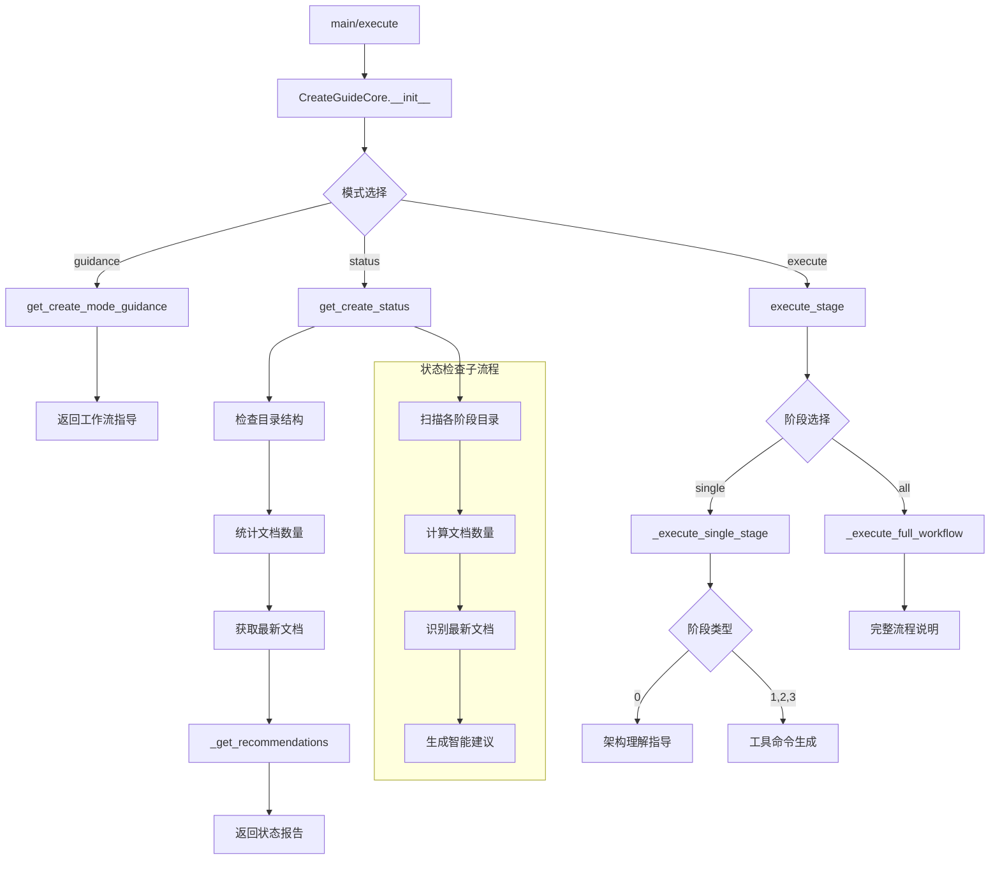

# 文件分析报告：create_guide.py

## 文件概述
CodeLens创造模式引导工具，作为创造模式的主入口，提供四阶段功能创新开发流程的完整指导和工作流编排。该工具专注于用户引导、状态跟踪和工作流协调，不执行具体的内容生成任务，而是为用户提供清晰的操作指引和进度跟踪。

## 代码结构分析

### 导入依赖
```python
# 标准库导入
import sys, json, argparse
from pathlib import Path
from datetime import datetime
from typing import Dict, Any, List, Optional

# 项目依赖（带容错处理）
from src.logging import get_logger
```

### 全局变量和常量
```python
# 项目根目录路径计算
project_root = os.path.dirname(os.path.dirname(os.path.dirname(__file__)))

# 工作流阶段定义
WORKFLOW_STAGES = {
    0: "架构理解 (Architecture)",
    1: "需求确认 (Requirement)", 
    2: "分析实现 (Analysis)",
    3: "生成计划 (Todo)"
}
```

### 配置和设置
```python
# 文档目录结构配置
self.create_docs_path = self.project_path / "docs" / "project" / "create"

# 各阶段子目录
architecture_dir = self.create_docs_path / "architecture"
requirements_dir = self.create_docs_path / "requirements"
analysis_dir = self.create_docs_path / "analysis"
todos_dir = self.create_docs_path / "todos"

# 必读架构文档列表
required_reading = [
    "docs/architecture/overview.md - 系统架构概述",
    "docs/architecture/tech-stack.md - 技术栈详细分析", 
    "docs/architecture/data-flow.md - 数据流设计",
    "docs/architecture/diagrams/ - 架构图表"
]
```

## 函数详细分析

### 函数概览表
| 函数名 | 功能描述 | 参数 | 返回值 |
|--------|----------|------|--------|
| `__init__` | 初始化引导工具实例 | project_path | None |
| `get_create_mode_guidance` | 获取完整工作流指导 | 无 | Dict[工作流指导] |
| `get_create_status` | 获取当前创造模式状态 | 无 | Dict[状态信息] |
| `_get_recommendations` | 生成阶段建议 | arch_count, req_count, analysis_count, todo_count | List[建议列表] |
| `execute_stage` | 执行指定工作流阶段 | stage, **kwargs | Dict[执行结果] |
| `_execute_single_stage` | 执行单个阶段 | stage_num, **kwargs | Dict[阶段执行] |
| `_execute_full_workflow` | 执行完整工作流 | **kwargs | Dict[工作流执行] |

### 函数详细说明

#### 核心指导函数

**`get_create_mode_guidance()`**
- **功能**: 提供创造模式四阶段工作流的完整指导信息
- **输出内容**: 
  - 工作流概述和阶段描述
  - 每个阶段的工具命令和预期输出
  - 使用模式说明（交互式、完整流程、状态检查）
  - 目录结构和优势介绍
- **设计理念**: 一站式工作流指导，减少用户学习成本

**`get_create_status()`**
- **功能**: 检查当前创造模式的执行状态和进度
- **检查内容**:
  - 各阶段目录是否存在
  - 每个阶段的文档数量统计
  - 最新文档文件识别
  - 基于状态的智能建议生成
- **状态判断**: 通过文档存在性判断阶段完成情况

#### 工作流编排函数

**`execute_stage()`**
- **功能**: 工作流编排的统一入口，支持单阶段和完整流程
- **参数处理**: 解析stage参数，路由到对应的执行函数
- **阶段支持**: "0", "1", "2", "3", "all"
- **错误处理**: 完整的参数验证和异常捕获

**`_execute_single_stage()`**
- **功能**: 执行单个工作流阶段的具体逻辑
- **阶段映射**: 
  - 阶段0: 架构理解（手动阅读）
  - 阶段1: 需求确认（create_requirement工具）
  - 阶段2: 分析实现（create_analysis工具）
  - 阶段3: 生成计划（create_todo工具）
- **特殊处理**: 阶段0提供必读文档列表，其他阶段提供工具命令

**`_get_recommendations()`**
- **功能**: 基于当前状态生成智能化的下一步建议
- **逻辑**: 根据各阶段文档数量判断进度，提供相应的操作指引
- **建议类型**: 命令行指令、操作建议、学习资源

## 类详细分析

### 类概览表
| 类名 | 继承关系 | 主要职责 | 关键方法 |
|------|----------|----------|----------|
| `CreateGuideCore` | 无 | 创造模式工作流指导引擎 | get_create_mode_guidance, get_create_status, execute_stage |
| `CreateGuideTool` | 无 | MCP工具接口封装 | get_tool_definition, execute |
| `DummyLogger` | 无 | 日志系统降级实现 | debug, info, warning, error |

### 类详细说明

#### `CreateGuideCore`
**设计模式**: 门面模式 + 状态模式
- **门面模式**: 为复杂的多阶段工作流提供简洁统一的接口
- **状态模式**: 根据项目当前状态提供不同的操作建议

**核心功能模块**:
1. **工作流指导**: 提供详细的四阶段操作指南和最佳实践
2. **状态跟踪**: 实时监控各阶段的执行进度和文档状态
3. **智能建议**: 基于当前状态生成个性化的下一步操作建议
4. **工作流编排**: 协调各个阶段工具的执行顺序和依赖关系

**数据结构设计**:
```python
workflow_structure = {
    "stages": [
        {"stage": 0, "name": "架构理解", "tool": "architecture_analysis"},
        {"stage": 1, "name": "需求确认", "tool": "create_requirement"},
        {"stage": 2, "name": "分析实现", "tool": "create_analysis"},
        {"stage": 3, "name": "生成计划", "tool": "create_todo"}
    ],
    "usage_modes": ["interactive", "full_workflow", "status_check"],
    "directory_structure": {...}
}
```

**状态管理策略**:
- 文件系统作为状态存储，通过文档存在性判断进度
- 支持多个并行功能的开发跟踪
- 提供状态恢复和增量操作能力

#### `CreateGuideTool`
**设计模式**: 适配器模式
- 将`CreateGuideCore`的功能适配为标准MCP工具接口
- 提供参数验证和错误处理包装
- 支持多种执行模式的统一调用

**接口规范**:
```python
tool_definition = {
    "name": "create_guide",
    "description": "四阶段功能创新开发流程指导",
    "modes": ["guidance", "status", "execute"],
    "parameters": ["project_path", "mode", "stage", "feature_name"]
}
```

## 函数调用流程图


## 变量作用域分析

### 实例变量作用域
- **`self.project_path`**: 全局实例作用域，作为所有操作的根路径
- **`self.logger`**: 日志记录器，用于操作跟踪和调试
- **`self.create_docs_path`**: 创造模式文档根目录，所有阶段的基础路径

### 方法内变量作用域
- **`operation_id`**: 方法级日志追踪标识符，用于操作链路跟踪
- **`guidance/status/result`**: 返回数据容器，方法内构建并返回
- **目录变量**: `architecture_dir`, `requirements_dir`等，方法内路径操作
- **计数变量**: `arch_count`, `req_count`等，状态统计使用

### 配置常量作用域
- **工作流阶段信息**: stage_info字典，方法级常量定义
- **必读文档列表**: reading_list，硬编码的架构文档路径
- **推荐命令模板**: 各阶段的标准执行命令

## 函数依赖关系

### 外部依赖
```python
# 核心服务依赖
src.logging.get_logger         # 日志服务

# 标准库依赖
pathlib.Path                   # 路径操作
datetime.datetime              # 时间戳生成
json                          # 数据序列化
argparse                      # 命令行解析
```

### 内部依赖链
```
execute (主入口)
├── get_create_mode_guidance (指导模式)
├── get_create_status (状态模式)
│   ├── 目录状态检查
│   ├── 文档计数统计
│   └── _get_recommendations
└── execute_stage (执行模式)
    ├── _execute_single_stage
    │   └── stage_info映射
    └── _execute_full_workflow
```

### 数据流依赖
1. **项目路径** → **目录检查** → **状态分析** → **建议生成**
2. **用户模式** → **功能路由** → **结果生成** → **JSON输出**
3. **阶段参数** → **工具映射** → **命令生成** → **执行指导**

### 工具协调依赖
- **create_guide** → **create_requirement** (阶段1)
- **create_guide** → **create_analysis** (阶段2)  
- **create_guide** → **create_todo** (阶段3)
- 各工具间的文档依赖和数据传递关系