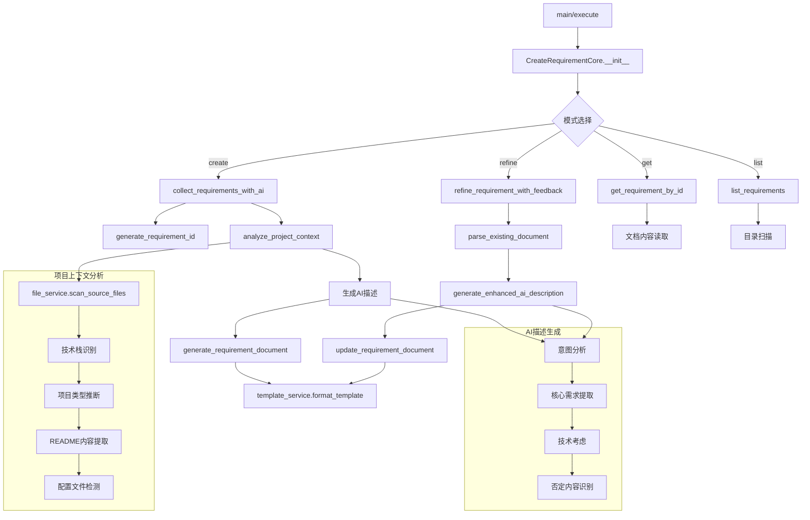

# 文件分析报告：create_requirement.py

## 文件概述
CodeLens创造模式第一阶段的需求确认工具，专注于交互式功能需求分析和验收标准确认。该工具提供AI辅助的需求收集、智能项目上下文分析、需求文档生成与管理，以及基于用户反馈的需求迭代优化功能，是功能想法转化为结构化需求文档的核心工具。

## 代码结构分析

### 导入依赖
```python
# 标准库导入
import sys, json, argparse, time
from pathlib import Path
from datetime import datetime
from typing import Dict, Any, List, Optional

# 项目依赖（带容错处理）
from src.logging import get_logger
from src.templates.document_templates import TemplateService
from src.services.file_service import FileService
```

### 全局变量和常量
```python
# 项目根目录路径计算
project_root = os.path.dirname(os.path.dirname(os.path.dirname(__file__)))

# 技术栈识别指标字典
tech_indicators = {
    "Python": [".py", "requirements.txt", "setup.py", "pyproject.toml"],
    "JavaScript/Node.js": ["package.json", ".js", ".ts", "node_modules"],
    "Java": [".java", "pom.xml", "build.gradle"],
    "Go": [".go", "go.mod", "go.sum"],
    "Rust": [".rs", "Cargo.toml"],
    "C/C++": [".c", ".cpp", ".h", "Makefile", "CMakeLists.txt"]
}
```

### 配置和设置
```python
# 文档目录结构配置
self.create_docs_path = self.project_path / "docs" / "project" / "create"
self.requirements_dir = self.create_docs_path / "requirements"

# README文件检测列表
readme_files = ["README.md", "README.txt", "README.rst", "readme.md"]

# 配置文件检测模式
config_patterns = ["config", "settings", ".env", "docker", "compose"]

# 需求文档字段结构
requirement_fields = [
    "feature_name", "requirement_id", "created_time", "creator",
    "project_name", "requirement_type", "user_description", 
    "ai_description", "user_revision"
]
```

## 函数详细分析

### 函数概览表
| 函数名 | 功能描述 | 参数 | 返回值 |
|--------|----------|------|--------|
| `__init__` | 初始化需求工具实例 | project_path | None |
| `generate_requirement_id` | 生成唯一需求标识符 | feature_name | str |
| `analyze_project_context` | 分析项目技术栈和上下文 | 无 | Dict[项目上下文] |
| `collect_requirements_with_ai` | AI辅助需求收集 | feature_name, requirement_type | Dict[需求数据] |
| `collect_requirements_interactive` | 交互式需求收集 | feature_name, requirement_type | Dict[交互式数据] |
| `generate_requirement_document` | 生成需求文档 | requirement_data | Dict[文档生成结果] |
| `list_requirements` | 列出现有需求文档 | 无 | Dict[需求列表] |
| `get_requirement_by_id` | 获取特定需求文档 | requirement_id | Dict[需求文档] |
| `parse_existing_document` | 解析现有需求文档 | requirement_id | Dict[解析结果] |
| `refine_requirement_with_feedback` | 基于反馈优化需求 | requirement_id, user_feedback, refinement_type | Dict[优化结果] |
| `generate_enhanced_ai_description` | 生成AI增强描述 | feature_name, enhanced_user_description, context | str |
| `update_requirement_document` | 更新需求文档 | requirement_id, updated_data | Dict[更新结果] |

### 函数详细说明

#### 核心需求收集函数

**`collect_requirements_with_ai()`**
- **功能**: AI辅助的智能需求收集，提供简化版本的需求分析
- **流程**: 生成需求ID → 分析项目上下文 → 生成AI描述 → 构建需求数据
- **简化策略**: 仅包含三个核心字段(用户描述、AI描述、用户修正)
- **智能化**: 基于项目上下文和功能名称生成初始分析

**`collect_requirements_interactive()`**
- **功能**: 交互式需求收集，为用户提供结构化的需求填写界面
- **设计理念**: 简化用户操作，专注核心需求描述
- **交互字段**: 
  - user_description: 用户详细功能描述
  - ai_description: AI自动生成的理解和分析
  - user_revision: 用户确认和修正信息
- **用户友好**: 提供占位符和问题引导

#### 项目分析函数

**`analyze_project_context()`**
- **功能**: 全面分析项目技术栈、文件结构和README内容
- **技术栈识别**: 通过文件扩展名和配置文件智能识别技术栈
- **项目类型推断**: 基于技术栈判断Flask/Django/FastAPI等框架类型
- **README提取**: 自动读取并提取README文件内容(限制2000字符)
- **配置文件检测**: 识别项目中的配置文件和设置文件

**`generate_enhanced_ai_description()`**
- **功能**: 基于用户描述和项目上下文生成智能化的AI分析
- **分析维度**: 
  - 技术栈分析
  - 功能理解和意图识别
  - 核心需求提取
  - 实现方式建议
  - 明确排除内容识别
  - 技术考虑因素
- **智能过滤**: 识别用户否定表述，避免过度假设

#### 文档管理函数

**`generate_requirement_document()`**
- **功能**: 使用模板服务生成专业的需求文档
- **模板系统**: 集成TemplateService，支持标准化文档格式
- **元数据跟踪**: 记录文档创建时间、文件大小等信息
- **工作流集成**: 提供下一阶段的工具调用命令

**`parse_existing_document()`**
- **功能**: 解析现有markdown格式的需求文档，提取结构化数据
- **解析策略**: 基于markdown标题和格式的结构化解析
- **字段提取**: 支持提取所有标准需求字段
- **容错处理**: 处理格式不完整或不规范的文档

#### 需求优化函数

**`refine_requirement_with_feedback()`**
- **功能**: 基于用户反馈迭代优化需求文档
- **优化流程**: 解析现有文档 → 整合用户反馈 → 重新生成AI分析 → 更新文档
- **反馈集成**: 将用户反馈追加到原有描述中
- **迭代支持**: 支持多轮反馈和持续改进
- **状态管理**: 维护优化历史和时间戳

## 类详细分析

### 类概览表
| 类名 | 继承关系 | 主要职责 | 关键方法 |
|------|----------|----------|----------|
| `CreateRequirementCore` | 无 | 需求收集和分析引擎 | collect_*, generate_*, parse_*, refine_* |
| `CreateRequirementTool` | 无 | MCP工具接口封装 | get_tool_definition, execute |
| `DummyLogger` | 无 | 日志系统降级实现 | debug, info, warning, error |
| `DummyTemplateService` | 无 | 模板服务降级实现 | get_template_content, format_template |
| `DummyFileService` | 无 | 文件服务降级实现 | scan_source_files, get_project_info |

### 类详细说明

#### `CreateRequirementCore`
**设计模式**: 建造者模式 + 策略模式
- **建造者模式**: 分步骤构建复杂的需求文档，支持渐进式完善
- **策略模式**: 支持AI辅助和交互式两种需求收集策略

**核心功能模块**:
1. **智能需求收集**: AI辅助的需求理解和分析
2. **项目上下文分析**: 技术栈识别、文件结构分析、README提取
3. **文档生成管理**: 模板化的需求文档生成和版本管理
4. **交互式优化**: 基于用户反馈的迭代式需求完善
5. **结构化解析**: 现有文档的智能解析和数据提取

**数据处理流程**:
```python
需求收集流程:
用户输入 → 项目分析 → AI理解生成 → 用户确认 → 文档生成
         ↓
用户反馈 → 需求优化 → AI重新分析 → 文档更新 → 迭代循环
```

**智能化特性**:
- **上下文感知**: 基于项目技术栈和类型提供针对性分析
- **意图识别**: 通过关键词分析用户需求类型(修复/新增/优化)
- **否定识别**: 智能识别用户明确排除的内容
- **渐进式完善**: 支持多轮对话和需求迭代

#### `CreateRequirementTool`
**设计模式**: 适配器模式 + 命令模式
- **适配器模式**: 将复杂的需求收集流程适配为标准MCP接口
- **命令模式**: 支持多种操作模式(create/list/get/refine)的统一执行

**操作模式支持**:
```python
operation_modes = {
    "create": "创建新需求文档",
    "list": "列出现有需求文档", 
    "get": "获取特定需求文档",
    "refine": "基于反馈优化需求"
}
```

**参数验证策略**:
- 不同模式需要不同的必需参数
- 提供详细的参数错误提示
- 支持可选参数的默认值处理

## 函数调用流程图


## 变量作用域分析

### 实例变量作用域
- **`self.project_path`**: 全局实例作用域，项目根路径
- **`self.create_docs_path`**: 创造模式文档根目录路径
- **`self.requirements_dir`**: 需求文档专用目录路径
- **`self.template_service`**: 模板处理服务实例
- **`self.file_service`**: 文件扫描服务实例
- **`self.logger`**: 日志记录器，支持操作跟踪

### 方法内变量作用域
- **`operation_id`**: 方法级日志追踪标识符
- **`requirement_id`**: 需求唯一标识符，在多个方法间传递
- **`context`**: 项目上下文信息，在需求分析方法间共享
- **`requirement_data`**: 需求数据容器，用于模板生成和文档输出
- **`interactive_questions`**: 交互式问题集合，方法内配置

### 配置常量作用域
- **`tech_indicators`**: 技术栈识别规则，方法级常量
- **`readme_files`**: README文件检测列表，方法级常量
- **`config_patterns`**: 配置文件检测模式，方法级常量
- **文档字段名**: 需求文档的标准字段定义

## 函数依赖关系

### 外部依赖
```python
# 核心服务依赖
src.logging.get_logger                        # 日志服务
src.templates.document_templates.TemplateService  # 模板服务
src.services.file_service.FileService        # 文件服务

# 标准库依赖
pathlib.Path                                  # 路径处理
datetime.datetime                             # 时间戳生成
time.time                                     # 需求ID时间戳
json                                          # 数据序列化
argparse                                      # 命令行解析
```

### 内部依赖链
```
CreateRequirementCore主流程:
├── collect_requirements_with_ai
│   ├── generate_requirement_id
│   ├── analyze_project_context
│   │   └── file_service.scan_source_files
│   └── generate_enhanced_ai_description
├── generate_requirement_document
│   └── template_service.*
├── refine_requirement_with_feedback
│   ├── parse_existing_document
│   ├── analyze_project_context
│   ├── generate_enhanced_ai_description
│   └── update_requirement_document
└── 文档管理方法 (list_requirements, get_requirement_by_id)
```

### 数据流依赖
1. **需求收集流程**: 用户输入 → 项目分析 → AI描述生成 → 文档生成
2. **需求优化流程**: 现有文档解析 → 用户反馈整合 → AI重新分析 → 文档更新
3. **项目上下文**: 文件扫描 → 技术栈识别 → 项目类型推断 → 上下文构建
4. **文档生成**: 需求数据 → 模板格式化 → 文件写入 → 元数据记录

### 错误处理依赖
- 所有主要方法都包含完整的异常处理
- 提供降级策略和默认值返回
- 支持部分功能失败时的优雅降级
- 记录详细的错误上下文信息用于调试