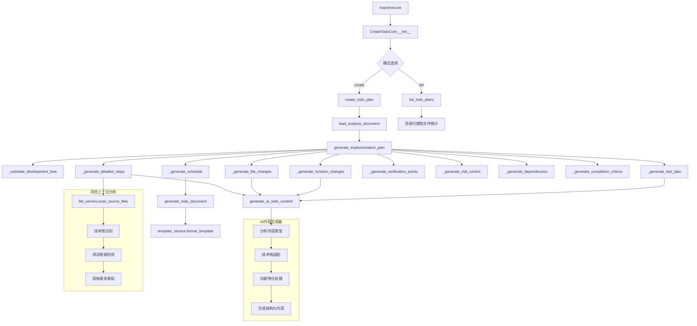

# 文件分析报告：create_todo.py

## 文件概述
CodeLens创造模式第三阶段的Todo生成工具，专注于基于确认的分析报告生成详细实现计划。该工具提供全面的项目实施规划功能，包括时间估算、风险控制、测试策略、文件变更清单、函数实现计划以及里程碑时间表，是将分析结果转化为可执行开发计划的核心工具。

## 代码结构分析

### 导入依赖
```python
# 标准库导入
import sys, json, argparse, time
from pathlib import Path
from datetime import datetime, timedelta
from typing import Dict, Any, List, Optional

# 项目依赖（带容错处理）
from src.logging import get_logger
from src.templates.document_templates import TemplateService
from src.services.file_service import FileService
```

### 全局变量和常量
```python
# 项目根目录路径计算
project_root = os.path.dirname(os.path.dirname(os.path.dirname(__file__)))

# 技术栈识别指标字典
tech_indicators = {
    "Python": [".py", "requirements.txt", "setup.py", "pyproject.toml"],
    "JavaScript/Node.js": ["package.json", ".js", ".ts", "node_modules"],
    "Java": [".java", "pom.xml", "build.gradle"],
    "Go": [".go", "go.mod", "go.sum"],
    "Rust": [".rs", "Cargo.toml"],
    "C/C++": [".c", ".cpp", ".h", "Makefile", "CMakeLists.txt"]
}
```

### 配置和设置
```python
# 文档目录结构配置
self.create_docs_path = self.project_path / "docs" / "project" / "create"
self.analysis_dir = self.create_docs_path / "analysis"
self.todos_dir = self.create_docs_path / "todos"

# 实现阶段定义
implementation_phases = [
    "阶段1：环境准备和基础架构搭建",
    "阶段2：核心功能逻辑实现", 
    "阶段3：集成测试和验证",
    "阶段4：文档更新和部署准备"
]

# 开发时间估算基准
base_time = 5  # 基础时间（天）
```

## 函数详细分析

### 函数概览表
| 函数名 | 功能描述 | 参数 | 返回值 |
|--------|----------|------|--------|
| `__init__` | 初始化Todo工具实例 | project_path | None |
| `analyze_project_context` | 分析项目上下文信息 | 无 | Dict[项目上下文] |
| `generate_ai_todo_content` | 生成AI驱动的Todo内容 | content_type, feature_name, context, analysis_info | str |
| `generate_todo_id` | 生成唯一Todo标识符 | analysis_id | str |
| `load_analysis_document` | 加载分析文档 | analysis_id | Dict[分析信息] |
| `generate_implementation_plan` | 生成实现计划 | analysis_info, todo_granularity, include_testing | Dict[实现计划] |
| `create_todo_plan` | 创建完整Todo计划 | analysis_id, todo_granularity, include_testing | Dict[Todo计划] |
| `generate_todo_document` | 生成Todo文档 | todo_id, template_data | Dict[文档生成结果] |
| `list_todo_plans` | 列出现有Todo计划 | 无 | Dict[计划列表] |
| `_estimate_development_time` | 估算开发时间 | feature_name, granularity | str |
| `_generate_detailed_steps` | 生成详细实现步骤 | feature_name, include_testing | Dict[分阶段步骤] |
| `_generate_file_changes` | 生成文件变更清单 | feature_name | Dict[文件变更] |
| `_generate_function_changes` | 生成函数类变更清单 | feature_name, granularity | Dict[代码变更] |
| `_generate_test_plan` | 生成测试计划 | feature_name, include_testing | Dict[测试计划] |
| `_generate_verification_points` | 生成验证检查点 | feature_name | Dict[验证点] |
| `_generate_risk_control` | 生成风险控制方案 | feature_name | Dict[风险控制] |
| `_generate_dependencies` | 生成依赖事项 | feature_name | Dict[依赖分析] |
| `_generate_completion_criteria` | 生成完成标准 | feature_name | Dict[完成标准] |
| `_generate_schedule` | 生成时间表 | estimated_time | Dict[时间表] |

### 函数详细说明

#### 核心计划生成函数

**`generate_implementation_plan()`**
- **功能**: 生成全面的实现计划，包含12个维度的详细规划
- **计划维度**:
  - 总体策略和实现阶段
  - 详细实现步骤（4个阶段）
  - 文件变更清单（新增/修改/删除）
  - 函数类变更清单
  - 测试计划（单元/集成/手动）
  - 验证检查点（功能/性能/兼容性）
  - 风险控制方案
  - 依赖事项分析
  - 完成标准定义
  - 里程碑时间表
- **智能化**: 基于功能特征和项目上下文生成针对性计划

**`create_todo_plan()`**
- **功能**: 整合所有计划组件，生成完整可执行的Todo计划
- **流程**: 加载分析文档 → 生成实现计划 → 创建Todo ID → 格式化模板 → 生成文档
- **输出**: 结构化的Todo文档和实施指导信息

#### AI内容生成函数

**`generate_ai_todo_content()`**
- **功能**: 基于内容类型和项目上下文生成智能化Todo内容
- **内容类型**:
  - detailed_steps_phase1-4: 四个实施阶段的详细步骤
  - new_files/modified_files: 文件变更清单
  - function_changes_new: 新增函数类清单
  - testing_plan_unit: 单元测试计划
- **技术栈适配**: 根据项目技术栈生成对应的实施步骤
- **功能特化**: 为缓存、认证等特定功能类型提供专门化实施指导

#### 项目分析函数

**`analyze_project_context()`**
- **功能**: 为Todo生成提供项目上下文分析
- **分析内容**: 技术栈识别、现有服务发现、测试结构分析、项目类型推断
- **特殊关注**: 识别现有测试框架(pytest/unittest/Jest/Mocha)
- **服务发现**: 自动识别现有的service和api模块

#### 计划生成辅助函数

**`_estimate_development_time()`**
- **功能**: 基于功能复杂度和实施粒度智能估算开发时间
- **复杂度评估**: 通过关键词分析判断功能复杂度
- **粒度调整**: 根据todo粒度(step/function/file)调整时间估算
- **输出格式**: 时间范围估算（如"5-7天"）

**`_generate_detailed_steps()`**
- **功能**: 生成四个阶段的详细实施步骤
- **阶段划分**: 环境准备 → 核心实现 → 测试验证 → 文档部署
- **技术栈适配**: 为不同技术栈生成对应的实施指导
- **测试集成**: 可选择是否包含详细测试步骤

#### 风险和质量管理函数

**`_generate_risk_control()`**
- **功能**: 生成全面的风险识别和控制方案
- **风险类型**: 技术风险、集成风险、性能风险、数据风险
- **应对措施**: 分阶段实施、测试策略、监控机制、回滚计划
- **预防策略**: 提前识别和缓解潜在风险

**`_generate_verification_points()`**
- **功能**: 生成多维度的验证检查点
- **验证维度**: 功能验证、性能验证、兼容性验证
- **质量保证**: 确保实施质量和系统稳定性

## 类详细分析

### 类概览表
| 类名 | 继承关系 | 主要职责 | 关键方法 |
|------|----------|----------|----------|
| `CreateTodoCore` | 无 | Todo计划生成引擎 | generate_implementation_plan, create_todo_plan, generate_ai_todo_content |
| `CreateTodoTool` | 无 | MCP工具接口封装 | get_tool_definition, execute |
| `DummyLogger` | 无 | 日志系统降级实现 | debug, info, warning, error |
| `DummyTemplateService` | 无 | 模板服务降级实现 | get_template_content, format_template |
| `DummyFileService` | 无 | 文件服务降级实现 | scan_source_files |

### 类详细说明

#### `CreateTodoCore`
**设计模式**: 建造者模式 + 模板方法模式
- **建造者模式**: 分步骤构建复杂的实施计划，每个组件独立生成
- **模板方法模式**: 定义标准的计划生成流程，具体内容通过AI生成器填充

**核心功能模块**:
1. **智能计划生成**: 基于分析文档生成详细实施计划
2. **时间估算引擎**: 智能评估功能开发时间和资源需求
3. **风险管理系统**: 全面的风险识别、评估和控制方案
4. **测试策略规划**: 多层次测试计划和验证策略
5. **文档管理服务**: 模板化的Todo文档生成和版本管理

**计划生成架构**:
```python
计划组件结构:
├── 总体策略 (overall_strategy)
├── 实施阶段 (implementation_phases)
├── 时间估算 (estimated_time)
├── 详细步骤 (phase_1-4_detailed_steps)
├── 文件变更 (new_files, modified_files, deleted_files)
├── 代码变更 (new_functions_classes, modified_functions_classes)
├── 测试计划 (unit_test, integration_test, manual_test)
├── 验证点 (function_verification, performance_verification)
├── 风险控制 (critical_risks, risk_responses, rollback_plan)
├── 依赖分析 (external_dependencies, internal_dependencies)
├── 完成标准 (completion_criteria, quality_gates)
└── 时间表 (milestone_schedule, key_milestones)
```

**智能化特性**:
- **上下文感知**: 基于项目技术栈和现有结构生成针对性计划
- **功能特化**: 为不同功能类型(缓存/认证/API)提供专门化实施步骤
- **复杂度评估**: 智能分析功能复杂度并调整时间和资源估算
- **测试框架适配**: 自动识别项目测试框架并生成对应测试计划

#### `CreateTodoTool`
**设计模式**: 适配器模式 + 策略模式
- **适配器模式**: 将复杂的计划生成流程适配为标准MCP接口
- **策略模式**: 支持不同粒度(file/function/step)和测试策略的计划生成

**参数控制策略**:
```python
granularity_strategies = {
    "file": "文件级别规划，关注整体文件结构",
    "function": "函数级别规划，平衡粒度和可操作性", 
    "step": "步骤级别规划，最细粒度的实施指导"
}

testing_strategies = {
    "include_testing": "包含完整测试策略和验证计划",
    "exclude_testing": "专注核心功能实现，简化测试步骤"
}
```

## 函数调用流程图


## 变量作用域分析

### 实例变量作用域
- **`self.project_path`**: 全局实例作用域，项目根路径
- **`self.create_docs_path`**: 创造模式文档根目录路径
- **`self.analysis_dir`**: 分析文档目录路径
- **`self.todos_dir`**: Todo文档专用目录路径
- **`self.template_service`**: 模板处理服务实例
- **`self.file_service`**: 文件扫描服务实例
- **`self.logger`**: 日志记录器，支持操作跟踪

### 方法内变量作用域
- **`operation_id`**: 方法级日志追踪标识符
- **`todo_id`**: Todo唯一标识符，在计划生成流程中传递
- **`analysis_info`**: 分析文档信息，在计划生成方法间共享
- **`implementation_plan`**: 实施计划数据容器，包含所有计划组件
- **`template_data`**: 模板数据字典，用于文档生成

### 计划组件作用域
- **阶段步骤**: 四个实施阶段的详细步骤，方法内生成
- **文件变更清单**: 新增、修改、删除文件的清单
- **代码变更规划**: 函数类的新增和修改计划
- **测试策略**: 单元、集成、手动测试的详细计划
- **时间和风险**: 估算数据和风险控制方案

## 函数依赖关系

### 外部依赖
```python
# 核心服务依赖
src.logging.get_logger                        # 日志服务
src.templates.document_templates.TemplateService  # 模板服务
src.services.file_service.FileService        # 文件服务

# 标准库依赖
pathlib.Path                                  # 路径处理
datetime.datetime, timedelta                  # 时间处理和计算
time.time                                     # Todo ID时间戳
json                                          # 数据序列化
argparse                                      # 命令行解析
```

### 内部依赖链
```
create_todo_plan (主流程):
├── load_analysis_document
├── generate_implementation_plan
│   ├── analyze_project_context
│   ├── _estimate_development_time
│   ├── _generate_detailed_steps
│   │   └── generate_ai_todo_content
│   ├── _generate_file_changes
│   │   └── generate_ai_todo_content
│   ├── _generate_function_changes
│   │   └── generate_ai_todo_content
│   ├── _generate_test_plan
│   │   └── generate_ai_todo_content
│   ├── _generate_verification_points
│   ├── _generate_risk_control
│   ├── _generate_dependencies
│   ├── _generate_completion_criteria
│   └── _generate_schedule
└── generate_todo_document
    └── template_service.*
```

### 数据流依赖
1. **分析文档** → **计划生成** → **Todo文档**
2. **项目上下文** → **AI内容生成** → **结构化计划**
3. **功能特征** → **时间估算** + **风险评估** → **资源规划**
4. **技术栈信息** → **实施策略** → **具体步骤**

### 错误处理依赖
- 所有主要方法都包含完整的异常处理
- 提供降级策略和默认计划模板
- 支持部分组件生成失败时的优雅处理
- 详细的错误上下文记录用于调试和改进