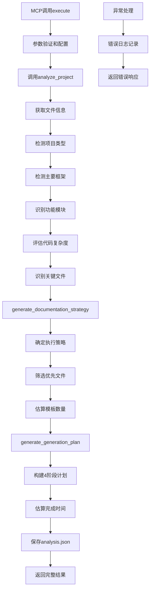

# 文件分析报告：src/mcp_tools/doc_guide.py

## 文件概述
CodeLens智能项目分析MCP工具核心实现，专门为Claude Code提供深度项目特征分析、框架检测和文档生成策略制定功能。该工具作为3阶段文档生成系统的分析入口，集成项目类型识别、复杂度评估、关键文件筛选和智能文档策略生成，为后续任务规划和执行提供数据基础。基于FileService的集成扫描功能，直接支持文件层→架构层→项目层的文档生成流程分析。

## 代码结构分析

### 导入依赖
- **系统模块**: `os, sys, time, pathlib.Path` - 系统操作、时间处理和路径管理
- **命令行处理**: `argparse` - 命令行参数解析
- **数据处理**: `json, collections.Counter` - JSON处理和数据统计
- **日志系统**: `logging` - 标准Python日志记录
- **类型注解**: `typing.Dict, Any, List` - 类型提示支持
- **核心服务**: `FileService` - 文件扫描和处理服务

### 全局变量和常量
- **project_root**: 项目根目录路径，用于模块导入
- **tool配置**: tool_name="doc_guide", description - MCP工具基本信息

### 配置和设置
- **项目模式配置**: 5种主流语言的文件、目录、扩展名特征模式
- **框架检测配置**: 8种主流框架的特征模式匹配
- **忽略模式配置**: 默认忽略文件和目录的模式列表
- **MCP工具配置**: 标准化的inputSchema定义，支持5个参数

## 函数详细分析

### 函数概览表
| 函数名 | 参数 | 返回值 | 功能描述 |
|--------|------|--------|----------|
| `__init__` | self | None | 初始化项目分析器，设置检测模式 |
| `analyze_project` | self, project_path, config | Dict[str, Any] | 核心项目分析方法，综合分析项目特征 |
| `generate_documentation_strategy` | self, analysis, focus_areas | Dict[str, Any] | 基于分析结果生成文档策略 |
| `generate_generation_plan` | self, analysis, strategy | Dict[str, Any] | 生成4阶段具体执行计划 |
| `_get_file_info` | self, project_path, config | Dict[str, Any] | 获取项目文件信息和分布统计 |
| `_should_ignore_file` | file_path, ignore_files, ignore_dirs | bool | 检查文件是否应该被忽略(静态方法) |
| `_detect_project_type` | self, project_path, file_info | str | 智能检测项目类型 |
| `_detect_framework` | self, project_path, file_info, project_type | str | 检测主要框架 |
| `_identify_modules` | project_path, file_info, project_type | List[str] | 识别功能模块(静态方法) |
| `_assess_complexity` | file_info | str | 评估代码复杂度(静态方法) |
| `_identify_key_files` | project_path, file_info, project_type | List[str] | 识别关键文件(静态方法) |
| `_get_architecture_components` | project_type | List[str] | 获取架构组件列表(静态方法) |
| `_estimate_duration` | file_count, module_count, arch_count | str | 估计完成时间(静态方法) |

### 函数详细说明

**`__init__(self)`**
- 初始化FileService实例用于文件操作
- 设置项目类型检测模式，包含5种语言的特征配置
- 配置框架检测模式，支持8种主流框架识别
- 建立分析器的基础运行环境

**`analyze_project(self, project_path, config)`**
- 核心项目分析聚合方法，整合多个分析维度
- 调用文件信息获取、项目类型检测、框架识别等子方法
- 执行功能模块识别和代码复杂度评估
- 识别项目关键文件并返回完整分析结果

**`generate_documentation_strategy(self, analysis, focus_areas)`**
- 基于项目分析结果制定文档生成策略
- 根据复杂度和文件数量确定执行顺序（顺序/自上而下/自下而上）
- 筛选优先处理文件（最多10个）
- 估算模板数量需求和复杂度级别

**`generate_generation_plan(self, analysis, strategy)`**
- 生成4阶段详细执行计划
- Phase 1: 项目扫描和分析任务
- Phase 2: 文件层文档生成（优先文件+关键文件）
- Phase 3: 架构层文档组件
- Phase 4: 项目层总结文档
- 提供完成时间估算

**`_detect_project_type(self, project_path, file_info)`**
- 基于多维度评分系统检测项目类型
- 特征文件权重3分，目录结构权重2分，扩展名按数量计分
- 支持Python、JavaScript、Java、Go、Rust五种语言
- 检测失败时返回"unknown"类型

**`_detect_framework(self, project_path, file_info, project_type)`**
- 读取关键配置文件内容进行框架检测
- 分析requirements.txt、package.json等配置文件
- 扫描源代码文件前2000字符查找框架特征
- 支持Django、Flask、FastAPI、React、Vue、Spring等8种框架

## 类详细分析

### 类概览表
| 类名 | 继承关系 | 主要职责 | 实例方法数量 |
|------|----------|----------|--------------|
| `ProjectAnalyzer` | 无继承 | 项目智能分析核心引擎 | 13个 |
| `DocGuideTool` | 无继承 | MCP协议doc_guide工具实现 | 5个 |

### 类详细说明

**`ProjectAnalyzer`**
- **设计目的**: 提供完整的项目智能分析功能
- **核心职责**: 项目类型检测、框架识别、模块发现、复杂度评估、策略制定
- **检测能力**: 支持5种编程语言和8种主流框架
- **分析维度**: 文件分布、目录结构、内容特征、复杂度评估
- **输出结果**: 结构化的项目分析数据和文档生成策略

**`DocGuideTool`**
- **设计目的**: 实现MCP协议的doc_guide工具功能
- **核心职责**: 参数验证、分析执行、结果格式化、文件保存
- **MCP集成**: 完全符合MCP工具接口规范
- **数据持久化**: 分析结果保存到.codelens/analysis.json
- **错误处理**: 完整的异常捕获和错误响应机制

## 函数调用流程图

## 变量作用域分析
- **模块作用域**: project_root路径、导入的模块和类
- **类作用域**: ProjectAnalyzer和DocGuideTool类定义
- **实例作用域**: file_service实例、配置模式字典、logger实例
- **方法作用域**: 各方法内的局部变量，如分析结果、评分字典等

## 函数依赖关系
- `__init__` → `FileService()` 文件服务初始化
- `analyze_project` → `_get_file_info` → `_detect_project_type` → `_detect_framework`
- `analyze_project` → `_identify_modules` → `_assess_complexity` → `_identify_key_files`
- `generate_documentation_strategy` → 分析结果处理
- `generate_generation_plan` → `_get_architecture_components` → `_estimate_duration`
- `execute` → `analyze_project` → `generate_documentation_strategy` → `generate_generation_plan`
- 静态方法群 → 独立的工具函数，无依赖关系