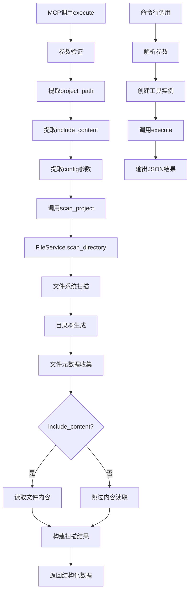

# 文件分析报告：src/mcp_tools/doc_scan.py

## 文件概述
CodeLens MCP协议的doc_scan工具核心实现，专门为Claude Code提供项目文件的结构化扫描功能。该工具作为CodeLens 4阶段文档生成系统的入口，负责收集项目的完整文件信息、目录结构和元数据，为后续的文档生成和任务规划提供基础数据支持。

## 代码结构分析

### 导入依赖
- **系统模块**: `sys, os, json, time, pathlib.Path` - 系统操作、JSON处理、时间管理和路径操作
- **类型注解**: `typing.Dict, Any` - 类型提示支持
- **核心服务**: `FileService` - 文件扫描和处理的核心服务
- **日志系统**: `logging` - 标准Python日志记录

### 全局变量和常量
- **project_root**: 项目根目录路径，用于模块导入
- **工具标识**: tool_name="doc_scan", description - MCP工具的基本信息

### 配置和设置
- **MCP工具配置**: 标准化的inputSchema定义，支持project_path、include_content和config参数
- **日志配置**: 使用标准logging模块进行日志记录
- **文件服务集成**: 集成FileService提供核心扫描功能

## 函数详细分析

### 函数概览表
| 函数名 | 参数 | 返回值 | 功能描述 |
|--------|------|--------|----------|
| `__init__` | self | None | 初始化doc_scan工具实例 |
| `get_tool_definition` | self | Dict[str, Any] | 获取MCP工具的完整定义 |
| `execute` | self, arguments | Dict[str, Any] | 执行文件扫描操作 |
| `scan_project` | self, project_path, include_content, config | Dict[str, Any] | 核心项目扫描逻辑 |
| `main` | 无参数 | None | 命令行入口函数 |

### 函数详细说明

**`__init__(self)`**
- 初始化工具名称和描述信息
- 创建FileService实例用于文件操作
- 设置日志记录器，组件标识为'doc_scan'
- 建立工具的基本运行环境

**`get_tool_definition(self)`**
- 返回标准的MCP工具定义结构
- 定义inputSchema，包含project_path（必需）、include_content（可选）和config（可选）参数
- 提供详细的参数类型和描述信息
- 确保与MCP协议的完全兼容

**`execute(self, arguments)`**
- MCP协议的标准执行入口
- 解析和验证输入参数
- 调用scan_project执行核心扫描逻辑
- 处理执行过程中的异常并返回标准化结果
- 提供成功/失败状态和详细的错误信息

**`scan_project(self, project_path, include_content, config)`**
- 执行实际的项目文件扫描
- 调用FileService的scan_directory方法
- 处理扫描配置和参数传递
- 返回结构化的扫描结果数据
- 支持可选的文件内容包含和自定义配置

**`main()`**
- 提供命令行测试接口
- 解析命令行参数（项目路径）
- 创建工具实例并执行扫描
- 输出JSON格式的扫描结果
- 支持独立运行和调试

## 类详细分析

### 类概览表
| 类名 | 继承关系 | 主要职责 | 实例方法数量 |
|------|----------|----------|--------------|
| `DocScanTool` | 无继承 | MCP协议doc_scan工具实现 | 4个 |

### 类详细说明

**`DocScanTool`**
- **设计目的**: 实现MCP协议的doc_scan工具功能
- **核心职责**: 项目文件扫描、数据收集、结果格式化
- **实例属性**: tool_name、description、file_service、logger
- **MCP集成**: 完全符合MCP工具接口规范
- **扩展性**: 支持配置参数和功能扩展

## 函数调用流程图

## 变量作用域分析
- **模块作用域**: project_root路径、导入的模块
- **类作用域**: DocScanTool类定义和方法
- **实例作用域**: tool_name、description、file_service、logger
- **方法作用域**: 各方法内的局部变量，如arguments、project_path等

## 函数依赖关系
- `__init__` → `FileService()` 初始化
- `execute` → `scan_project` → `FileService.scan_directory`
- `main` → `DocScanTool()` → `execute`
- 所有方法 → `logging.getLogger`
- 模块级别 → `sys.path` 操作

