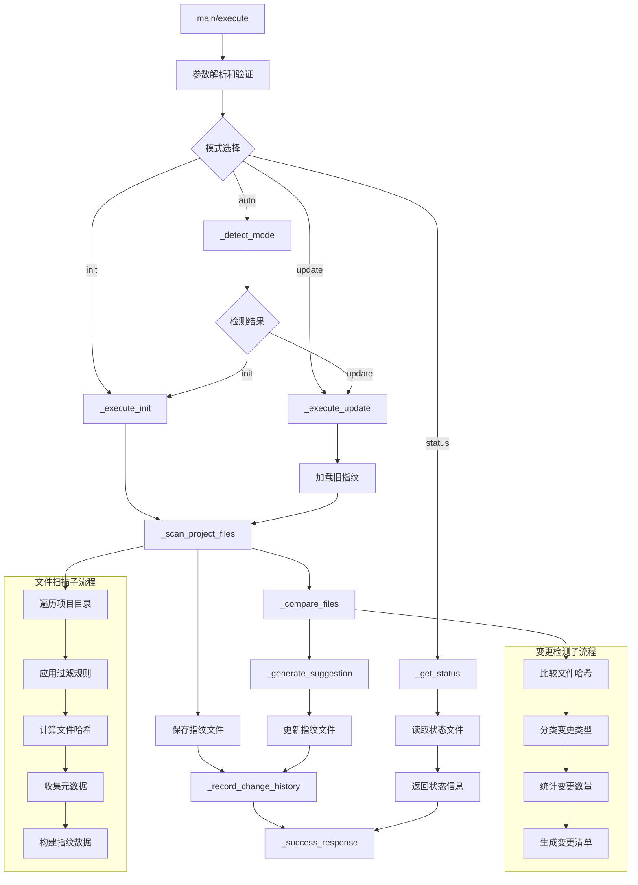

# 文件分析报告：doc_sync.py

## 文件概述
智能文档同步工具，专注于自动检测并处理项目文件变更。该工具合并了文档初始化和更新检测功能，通过文件指纹技术智能监控代码文件变化，提供完整的变更历史记录和建议更新提示，是项目文档维护的核心自动化工具。

## 代码结构分析

### 导入依赖
```python
# 标准库导入
import sys, os, json, hashlib
from pathlib import Path
from datetime import datetime
from typing import Dict, Any, List, Tuple

# 项目依赖
from src.logging import get_logger
```

### 全局变量和常量
```python
# 项目根目录路径计算
project_root = os.path.dirname(os.path.dirname(os.path.dirname(__file__)))

# 忽略目录定义
ignore_dirs = {
    '.git', '__pycache__', '.pytest_cache', 'node_modules', 
    '.idea', '.vscode', 'venv', 'env', '.env', 'dist', 'build',
    'docs', '.codelens'
}

# 忽略文件扩展名（文档和临时文件）
ignore_extensions = {
    '.md', '.txt', '.rst', '.doc', '.docx', '.pdf',
    '.log', '.tmp', '.temp', '.cache', '.bak',
    '.pyc', '.pyo', '.pyd', '__pycache__'
}

# 代码文件扩展名
code_extensions = {
    '.py', '.js', '.jsx', '.ts', '.tsx', '.json', '.yaml', '.yml',
    '.toml', '.cfg', '.ini', '.conf', '.sh', '.bat', '.ps1',
    '.html', '.css', '.scss', '.less', '.vue', '.go', '.rs',
    '.java', '.kt', '.cpp', '.c', '.h', '.hpp', '.cs', '.php',
    '.rb', '.swift', '.dart', '.sql', '.r', '.m', '.scala'
}
```

### 配置和设置
```python
# 工作目录和文件配置
codelens_dir = project_path / ".codelens"
fingerprints_file = codelens_dir / "file_fingerprints.json"
history_file = codelens_dir / "change_history.json"
last_change_file = codelens_dir / "last_change.json"

# 操作模式定义
modes = ["auto", "init", "update", "status"]

# 重要的无扩展名文件
important_files = {
    'Dockerfile', 'Makefile', 'requirements.txt', 
    'package.json', 'Cargo.toml', 'go.mod', 'pom.xml'
}
```

## 函数详细分析

### 函数概览表
| 函数名 | 功能描述 | 参数 | 返回值 |
|--------|----------|------|--------|
| `__init__` | 初始化工具实例 | 无 | None |
| `get_tool_definition` | 获取MCP工具定义 | 无 | Dict[工具定义] |
| `execute` | 主执行方法 | arguments | Dict[执行结果] |
| `_detect_mode` | 智能检测操作模式 | project_path | str |
| `_execute_init` | 执行初始化操作 | project_path, record_changes | Dict[初始化结果] |
| `_execute_update` | 执行更新检测操作 | project_path, record_changes | Dict[更新结果] |
| `_get_status` | 获取项目状态信息 | project_path | Dict[状态信息] |
| `_scan_project_files` | 扫描项目文件并计算指纹 | project_path | Dict[文件指纹] |
| `_compare_files` | 对比文件变化 | old_files, current_files | Tuple[变更列表] |
| `_generate_suggestion` | 生成更新建议 | changed_files, new_files, deleted_files | str |
| `_record_change_history` | 记录变更历史 | project_path, change_info | None |
| `_create_empty_history` | 创建空历史记录 | 无 | Dict[历史结构] |
| `_success_response` | 成功响应格式化 | data | Dict[响应] |
| `_error_response` | 错误响应格式化 | message | Dict[错误响应] |

### 函数详细说明

#### 核心执行函数

**`execute()`**
- **功能**: 主执行入口，负责参数解析、模式路由和结果返回
- **参数处理**: 
  - project_path: 项目路径（可选，默认当前目录）
  - mode: 操作模式（auto/init/update/status）
  - record_changes: 是否记录变更历史
- **路径验证**: 检查项目路径存在性和有效性
- **模式路由**: 根据模式参数调用对应的执行方法

**`_detect_mode()`**
- **功能**: 智能检测应该使用初始化还是更新模式
- **检测逻辑**: 
  - 检查指纹文件是否存在
  - 验证指纹文件的有效性和完整性
  - 根据文件状态决定操作模式
- **智能化**: 自动处理损坏的指纹文件，提供无缝的用户体验

#### 文件监控函数

**`_scan_project_files()`**
- **功能**: 全面扫描项目文件并计算MD5指纹
- **文件过滤策略**:
  - 忽略文档、临时、缓存等非代码文件
  - 只处理代码文件和重要配置文件
  - 排除版本控制和构建产物目录
- **指纹计算**: 使用MD5算法计算文件内容哈希值
- **元数据收集**: 记录文件大小、修改时间等额外信息

**`_compare_files()`**
- **功能**: 精确对比新旧文件状态，识别变更类型
- **变更分类**:
  - changed_files: 内容已修改的文件（哈希值变化）
  - new_files: 新增的文件
  - deleted_files: 已删除的文件
- **算法效率**: O(n)时间复杂度的高效比较算法

#### 操作执行函数

**`_execute_init()`**
- **功能**: 执行项目初始化，建立文件指纹基点
- **初始化流程**:
  1. 扫描当前项目所有代码文件
  2. 计算并保存文件指纹数据
  3. 创建指纹基点文件
  4. 记录初始化操作历史
- **基点建立**: 为后续变更检测提供比较基准

**`_execute_update()`**
- **功能**: 执行更新检测，识别文件变更并提供建议
- **检测流程**:
  1. 加载历史指纹数据
  2. 扫描当前文件状态
  3. 对比分析文件变化
  4. 生成更新建议
  5. 更新指纹文件和历史记录
- **建议生成**: 提供具体的文档更新指导

#### 历史管理函数

**`_record_change_history()`**
- **功能**: 记录完整的变更历史，支持操作审计
- **记录内容**:
  - 变更唯一标识和时间戳
  - 操作类型和详细信息
  - 文件变更统计和清单
- **存储策略**: 
  - 完整历史记录(change_history.json)
  - 最新变更快照(last_change.json)

**`_generate_suggestion()`**
- **功能**: 基于文件变更生成智能化的更新建议
- **建议内容**:
  - 分类展示变更文件清单
  - 提供具体的操作建议
  - 包含文档更新的最佳实践指导
- **格式化**: 使用Markdown格式提供清晰的视觉效果

## 类详细分析

### 类概览表
| 类名 | 继承关系 | 主要职责 | 关键方法 |
|------|----------|----------|----------|
| `DocSyncTool` | 无 | 智能文档同步引擎 | execute, _detect_mode, _scan_project_files, _compare_files |

### 类详细说明

#### `DocSyncTool`
**设计模式**: 命令模式 + 状态模式
- **命令模式**: 将不同的同步操作封装为独立的命令方法
- **状态模式**: 根据项目状态（已初始化/未初始化）选择不同的操作策略

**核心功能模块**:
1. **智能模式检测**: 自动判断项目状态，选择合适的操作模式
2. **文件指纹管理**: 使用MD5哈希实现精确的文件变更检测
3. **变更历史跟踪**: 完整记录所有同步操作和文件变更历史
4. **智能建议系统**: 基于变更分析生成个性化的文档更新建议
5. **状态信息服务**: 提供项目同步状态的全面信息

**文件过滤系统**:
```python
文件分类策略:
├── 代码文件 (需要监控)
│   ├── 源代码文件 (.py, .js, .java等)
│   ├── 配置文件 (.json, .yaml, .toml等)
│   └── 重要文件 (Dockerfile, Makefile等)
├── 文档文件 (排除监控)
│   ├── 文档格式 (.md, .txt, .pdf等)
│   └── 临时文件 (.log, .tmp, .cache等)
└── 系统文件 (排除监控)
    ├── 版本控制 (.git)
    ├── 依赖目录 (node_modules, __pycache__)
    └── 构建产物 (dist, build)
```

**同步操作流程**:
```python
智能同步流程:
1. 参数验证和路径检查
2. 模式检测 (auto模式下自动判断)
3. 执行对应操作:
   ├── init: 建立指纹基点
   ├── update: 检测变更并更新
   ├── status: 获取状态信息
   └── auto: 智能选择init或update
4. 记录操作历史
5. 返回结构化结果
```

**错误处理策略**:
- 完整的异常捕获和日志记录
- 优雅降级处理损坏的指纹文件
- 详细的错误信息和恢复建议
- 支持部分文件读取失败的容错机制

## 函数调用流程图


## 变量作用域分析

### 实例变量作用域
- **`self.tool_name`**: 工具名称标识符，全局实例作用域
- **`self.description`**: 工具描述信息，用于MCP接口
- **`self.logger`**: 日志记录器实例，支持全局操作跟踪

### 方法内变量作用域
- **`project_path`**: 项目路径，在主要方法间传递
- **`fingerprints`**: 指纹数据字典，存储文件哈希信息
- **`change_info`**: 变更信息字典，用于历史记录
- **`current_files`**: 当前文件状态，文件扫描结果
- **文件列表**: changed_files, new_files, deleted_files 变更分类

### 配置常量作用域
- **过滤规则**: ignore_dirs, ignore_extensions, code_extensions 文件过滤配置
- **重要文件列表**: important_files 无扩展名重要文件定义
- **文件路径**: 各种配置和数据文件的路径常量

## 函数依赖关系

### 外部依赖
```python
# 核心服务依赖
src.logging.get_logger               # 日志服务

# 标准库依赖
pathlib.Path                         # 路径操作
hashlib.md5                          # 文件指纹计算
datetime.datetime                    # 时间戳处理
json                                # 数据序列化
os, sys                             # 系统操作
```

### 内部依赖链
```
execute (主入口):
├── _detect_mode (智能模式检测)
├── _execute_init (初始化操作)
│   ├── _scan_project_files
│   └── _record_change_history
├── _execute_update (更新检测)
│   ├── _scan_project_files
│   ├── _compare_files
│   ├── _generate_suggestion
│   └── _record_change_history
└── _get_status (状态查询)
```

### 数据流依赖
1. **初始化流程**: 项目扫描 → 指纹计算 → 基点建立 → 历史记录
2. **更新检测流程**: 指纹加载 → 当前扫描 → 变更比较 → 建议生成 → 历史更新
3. **状态查询流程**: 文件读取 → 信息提取 → 状态组装 → 结果返回

### 错误处理依赖
- 所有文件操作都包含异常处理
- 支持损坏数据文件的自动恢复
- 提供详细的错误上下文和恢复建议
- 日志系统记录完整的操作轨迹