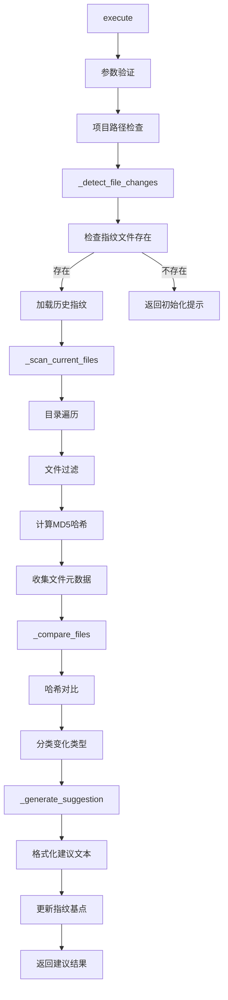
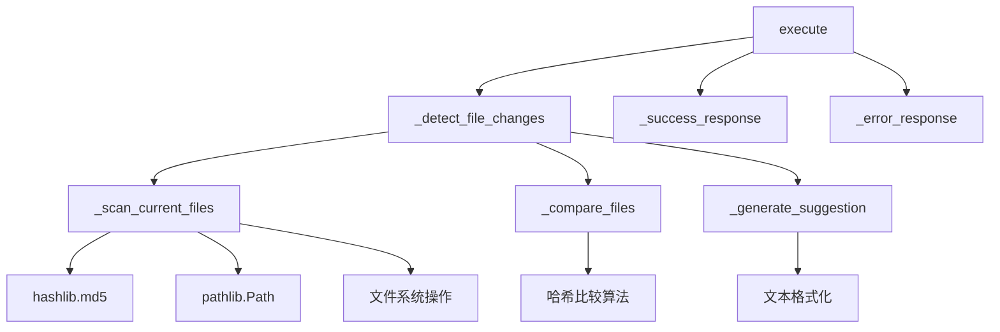
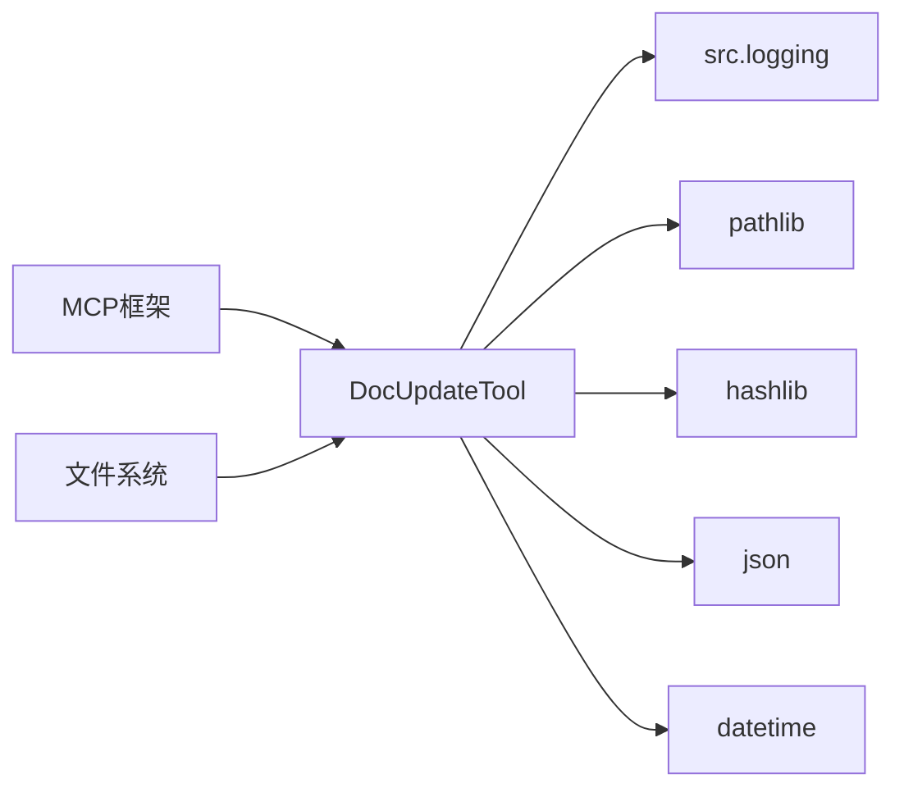

# 文件分析报告：doc_update.py

## 文件概述
这是一个智能的文档更新检测MCP工具，通过文件指纹技术检测项目代码变化，并生成针对性的文档更新建议。该工具采用MD5哈希算法跟踪文件变化，支持多种编程语言的代码文件检测，为文档维护提供自动化支持。

## 代码结构分析

### 导入依赖
```python
import sys
import os
import json
import hashlib
from pathlib import Path
from datetime import datetime
from typing import Dict, Any, List

from src.logging import get_logger
```

**依赖分析：**
- **核心库**: sys, os - 系统路径和环境管理
- **文件处理**: pathlib - 现代路径处理库
- **加密**: hashlib - MD5文件指纹计算
- **数据处理**: json - 指纹数据持久化
- **时间处理**: datetime - 时间戳管理
- **类型系统**: typing - 完整的类型注解
- **项目依赖**: src.logging - 统一日志系统

### 全局变量和常量
```python
project_root = os.path.dirname(os.path.dirname(os.path.dirname(__file__)))
```

### 配置和设置
文件过滤配置：
- **忽略目录**: `.git`, `__pycache__`, `node_modules`, `docs`, `.codelens`等
- **忽略扩展名**: `.md`, `.txt`, `.log`, `.pyc`等文档和临时文件
- **代码扩展名**: `.py`, `.js`, `.ts`, `.json`等30+种编程语言文件
- **重要文件**: `Dockerfile`, `Makefile`, `requirements.txt`等配置文件

## 函数详细分析

### 函数概览表
| 函数名 | 参数 | 返回类型 | 描述 |
|-------|------|----------|------|
| `get_tool_definition` | 无 | Dict[str, Any] | 获取MCP工具定义 |
| `execute` | arguments: Dict[str, Any] | Dict[str, Any] | 执行文档更新检测 |
| `_detect_file_changes` | project_path: Path | str | 检测文件变化并生成建议 |
| `_scan_current_files` | project_path: Path | Dict[str, Dict[str, Any]] | 扫描当前项目文件状态 |
| `_compare_files` | old_files, current_files | tuple | 对比文件变化 |
| `_generate_suggestion` | changed_files, new_files, deleted_files | str | 生成更新建议提示词 |
| `_success_response` | data: Dict[str, Any] | Dict[str, Any] | 生成成功响应 |
| `_error_response` | message: str | Dict[str, Any] | 生成错误响应 |

### 函数详细说明

#### `execute(arguments: Dict[str, Any]) -> Dict[str, Any]`
**功能**: 主要的工具执行入口，协调整个文档更新检测流程
```python
def execute(self, arguments: Dict[str, Any]) -> Dict[str, Any]:
    # 参数验证和项目路径处理
    project_path = arguments.get("project_path") or os.getcwd()
    
    # 路径存在性和有效性检查
    if not project_path.exists() or not project_path.is_dir():
        return self._error_response(error_msg)
    
    # 核心检测逻辑
    suggestion = self._detect_file_changes(project_path)
    
    return self._success_response({"suggestion": suggestion})
```
- **智能默认**: 未提供路径时自动使用当前工作目录
- **完整验证**: 多层次的路径有效性检查
- **异常处理**: 全面的错误捕获和日志记录

#### `_detect_file_changes(project_path: Path) -> str`
**功能**: 核心的文件变化检测算法
```python
def _detect_file_changes(self, project_path: Path) -> str:
    fingerprints_file = project_path / ".codelens" / "file_fingerprints.json"
    
    # 加载历史指纹
    with open(fingerprints_file, 'r') as f:
        old_fingerprints = json.load(f)
    
    # 扫描当前状态
    current_files = self._scan_current_files(project_path)
    
    # 变化检测
    changed_files, new_files, deleted_files = self._compare_files(
        old_fingerprints.get("files", {}), current_files
    )
    
    # 生成建议并更新指纹基点
    suggestion = self._generate_suggestion(changed_files, new_files, deleted_files)
    # 更新指纹文件...
```
- **增量检测**: 基于历史指纹进行增量变化检测
- **三种变化**: 识别修改、新增、删除三类文件变化
- **自动更新**: 检测完成后自动更新指纹基点

#### `_scan_current_files(project_path: Path) -> Dict[str, Dict[str, Any]]`
**功能**: 智能扫描项目文件，计算文件指纹
```python
def _scan_current_files(self, project_path: Path) -> Dict[str, Dict[str, Any]]:
    # 多层过滤策略
    ignore_dirs = {'.git', '__pycache__', 'docs', ...}
    ignore_extensions = {'.md', '.txt', '.log', ...}
    code_extensions = {'.py', '.js', '.ts', '.json', ...}
    
    for file_path in project_path.rglob("*"):
        # 目录过滤
        if any(ignore_dir in file_path.parts for ignore_dir in ignore_dirs):
            continue
        
        # 扩展名过滤
        if file_suffix in ignore_extensions:
            continue
        
        # 代码文件检测
        if file_suffix in code_extensions or file_path.name in important_files:
            # 计算文件哈希
            content = file_path.read_text(encoding='utf-8')
            file_hash = hashlib.md5(content.encode()).hexdigest()
```
- **智能过滤**: 多维度文件过滤策略
- **文件指纹**: MD5哈希算法确保变化检测准确性
- **元数据收集**: 记录文件大小、修改时间等元信息
- **容错处理**: 优雅处理文件读取异常

#### `_compare_files() -> tuple[List[str], List[str], List[str]]`
**功能**: 高效的文件变化对比算法
```python
def _compare_files(self, old_files, current_files):
    changed_files = []
    new_files = []
    deleted_files = []
    
    for file_path, current_info in current_files.items():
        if file_path in old_files:
            if current_info["hash"] != old_files[file_path]["hash"]:
                changed_files.append(file_path)
        else:
            new_files.append(file_path)
    
    for file_path in old_files:
        if file_path not in current_files:
            deleted_files.append(file_path)
```
- **哈希比较**: 基于MD5哈希的精确变化检测
- **分类识别**: 准确分类修改、新增、删除的文件
- **高效算法**: O(n)时间复杂度的比较算法

#### `_generate_suggestion() -> str`
**功能**: 生成人性化的文档更新建议
```python
def _generate_suggestion(self, changed_files, new_files, deleted_files):
    if not any([changed_files, new_files, deleted_files]):
        return "没有检测到文件变化，无需更新文档。"
    
    suggestion = "检测到以下文件变化，建议更新相关文档：\n\n"
    
    if changed_files:
        suggestion += "📝 已修改的文件：\n"
        for file in changed_files:
            suggestion += f"- {file}\n"
```
- **视觉友好**: 使用emoji和结构化格式
- **分类展示**: 按变化类型组织显示
- **可操作性**: 提供具体的文档更新指导

## 类详细分析

### 类概览表
| 类名 | 继承关系 | 主要方法 | 描述 |
|------|----------|----------|------|
| `DocUpdateTool` | 无 | execute, _detect_file_changes | 文档更新检测MCP工具 |

### 类详细说明

#### `DocUpdateTool`
**职责**: 提供智能的文档更新检测服务
- **MCP集成**: 标准的MCP工具接口实现
- **变化检测**: 基于文件指纹的增量变化检测
- **建议生成**: 智能生成文档更新建议
- **状态管理**: 维护项目文件的历史状态

**核心特性**:
```python
def __init__(self):
    self.tool_name = "doc_update"
    self.description = "检测项目文件变化并生成文档更新建议"
    self.logger = get_logger(component="DocUpdateTool", operation="init")
```

**工具定义结构**:
```python
def get_tool_definition(self) -> Dict[str, Any]:
    return {
        "name": self.tool_name,
        "description": self.description,
        "inputSchema": {
            "type": "object",
            "properties": {
                "project_path": {
                    "type": "string",
                    "description": "项目根路径"
                }
            },
            "required": []
        }
    }
```

## 函数调用流程图


## 变量作用域分析

### 类级作用域
- **DocUpdateTool**: tool_name, description, logger

### 方法级作用域
- **_scan_current_files**: current_files字典、过滤配置、文件元数据
- **_compare_files**: 变化文件列表、比较结果
- **_detect_file_changes**: 指纹数据、建议文本

### 文件系统状态
- **指纹文件**: `.codelens/file_fingerprints.json`
- **项目文件**: 扫描范围内的所有代码文件
- **元数据**: 文件哈希、大小、修改时间

## 函数依赖关系

### 内部依赖链


### 外部依赖


## 设计模式与架构

### 策略模式
- **过滤策略**: 可配置的文件过滤规则
- **扫描策略**: 支持不同类型项目的扫描策略
- **建议策略**: 可扩展的建议生成策略

### 模板方法模式
- **检测流程**: 固定的检测流程模板
- **可扩展点**: 过滤规则、比较算法、建议格式

### 命令模式
- **工具执行**: 封装完整的检测命令
- **参数传递**: 标准化的参数接口
- **结果返回**: 统一的响应格式

## 性能优化与扩展性

### 性能优化
1. **增量检测**: 基于指纹的增量变化检测，避免全量比较
2. **智能过滤**: 多层过滤减少不必要的文件处理
3. **哈希缓存**: MD5哈希结果持久化避免重复计算
4. **懒加载**: 仅在需要时读取文件内容

### 扩展性设计
1. **过滤配置**: 支持自定义文件类型过滤
2. **哈希算法**: 可扩展支持其他哈希算法
3. **建议格式**: 支持多种建议输出格式
4. **存储后端**: 支持不同的指纹存储方式

### 错误处理
1. **文件访问**: 优雅处理文件读取权限问题
2. **编码问题**: 自动处理文件编码问题
3. **路径问题**: 完整的路径验证和错误提示
4. **数据损坏**: 指纹文件损坏时的恢复机制

## 实际应用场景

### 持续集成
- 自动检测代码变化
- 触发文档更新流程
- 集成到CI/CD管道

### 开发工作流
- 开发阶段的文档同步提醒
- 代码审查时的文档检查
- 版本发布前的文档验证

### 文档维护
- 定期的文档一致性检查
- 大型项目的文档维护管理
- 多人协作的文档同步

## 技术特色

### 文件指纹技术
- **准确性**: MD5哈希确保变化检测的准确性
- **效率**: 增量检测避免全量扫描
- **可靠性**: 持久化存储确保状态一致性

### 智能过滤
- **多语言支持**: 覆盖30+种编程语言
- **配置灵活**: 支持项目特定的过滤规则
- **性能优化**: 减少不必要的文件处理

### 用户体验
- **直观反馈**: 清晰的变化分类和建议
- **自动化**: 最小化用户手动操作
- **集成友好**: 标准MCP接口便于集成