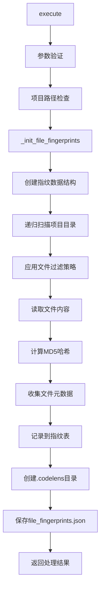
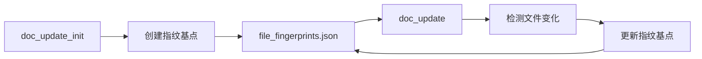

# 文件分析报告：doc_update_init.py

## 文件概述
这是文档更新系统的初始化工具，负责创建项目文件的指纹基点。该工具扫描项目中的所有代码文件，计算MD5哈希值并保存为基线数据，为后续的文件变化检测提供参考点。与doc_update.py配合使用，构成完整的文档更新检测系统。

## 代码结构分析

### 导入依赖
```python
import sys, os, json, hashlib
from pathlib import Path
from datetime import datetime
from typing import Dict, Any
from src.logging import get_logger
```

**核心依赖与doc_update.py一致：**
- **文件系统**: pathlib进行路径操作
- **加密算法**: hashlib计算文件指纹  
- **数据持久化**: json存储指纹数据
- **时间管理**: datetime记录创建时间

### 配置和设置
使用与doc_update.py完全相同的过滤配置：
- **ignore_dirs**: 排除.git, __pycache__, docs等目录
- **ignore_extensions**: 忽略.md, .log, .pyc等文件类型
- **code_extensions**: 检测30+种编程语言文件
- **important_files**: 包含Dockerfile, Makefile等重要配置文件

## 函数详细分析

### 函数概览表
| 函数名 | 参数 | 返回类型 | 描述 |
|-------|------|----------|------|
| `execute` | arguments: Dict[str, Any] | Dict[str, Any] | 执行初始化工具主流程 |
| `_init_file_fingerprints` | project_path: Path | str | 扫描并创建文件指纹基点 |
| `_success_response` | data: Dict[str, Any] | Dict[str, Any] | 生成成功响应 |
| `_error_response` | message: str | Dict[str, Any] | 生成错误响应 |

### 核心功能分析

#### `_init_file_fingerprints(project_path: Path) -> str`
**功能**: 创建项目文件指纹基点的核心算法
```python
def _init_file_fingerprints(self, project_path: Path) -> str:
    fingerprints = {
        "created_at": datetime.now().isoformat(),
        "files": {}
    }
    
    # 使用与doc_update相同的过滤策略
    for file_path in project_path.rglob("*"):
        # 多层过滤逻辑
        if self._should_process_file(file_path):
            # 计算文件哈希和元数据
            content = file_path.read_text(encoding='utf-8')
            file_hash = hashlib.md5(content.encode()).hexdigest()
            
            fingerprints["files"][relative_path] = {
                "hash": file_hash,
                "size": file_path.stat().st_size,
                "modified_time": datetime.fromtimestamp(file_path.stat().st_mtime).isoformat()
            }
    
    # 保存到.codelens/file_fingerprints.json
    self._save_fingerprints(fingerprints, project_path)
```

**关键特性**:
- **一致性**: 与doc_update.py使用相同的文件过滤策略
- **完整性**: 记录文件哈希、大小、修改时间等完整元数据
- **时间戳**: 记录创建时间用于追踪基点历史
- **持久化**: 保存到标准化的.codelens目录

## 类详细分析

### `DocUpdateInitTool`
**职责**: 文档更新系统的初始化入口
- **基点创建**: 扫描项目并创建文件指纹基点
- **MCP集成**: 标准MCP工具接口实现
- **状态初始化**: 为doc_update工具准备初始状态

**工作流程**:
1. **参数验证**: 检查项目路径有效性
2. **目录扫描**: 递归扫描项目文件
3. **文件过滤**: 应用多层过滤策略
4. **指纹计算**: 为每个文件计算MD5哈希
5. **数据保存**: 将指纹数据保存到JSON文件

## 函数调用流程图


## 与doc_update.py的关系

### 协作模式


### 数据格式一致性
```json
{
  "created_at": "2025-09-15T23:54:00.123456",
  "files": {
    "src/main.py": {
      "hash": "a1b2c3d4e5f6...",
      "size": 1024,
      "modified_time": "2025-09-15T23:53:30.456789"
    }
  }
}
```

### 职责分工
- **doc_update_init**: 创建初始指纹基点，项目首次设置
- **doc_update**: 增量检测变化，持续监控更新

## 设计优势

### 一致性保证
1. **相同过滤策略**: 确保初始化和更新检测使用相同的文件范围
2. **相同哈希算法**: 使用MD5确保指纹计算一致性
3. **相同数据格式**: 统一的JSON数据结构

### 可靠性设计
1. **异常处理**: 单个文件失败不影响整体扫描
2. **编码容错**: 自动处理文件编码问题
3. **路径规范化**: 使用相对路径确保跨平台兼容

### 用户体验
1. **自动目录创建**: 自动创建.codelens工作目录
2. **详细反馈**: 提供处理文件数量等进度信息
3. **命令行支持**: 提供独立的命令行接口

## 实际应用场景

### 项目初始化
- 新项目设置文档更新检测
- 现有项目启用文档同步
- 团队协作的文档基线建立

### 迁移和重置
- 项目迁移后重新建立基点
- 文档检测系统的重置
- 基点数据损坏后的恢复

### 集成部署
- CI/CD流水线的初始化步骤
- 自动化文档工作流的起点
- 多环境部署的基线同步