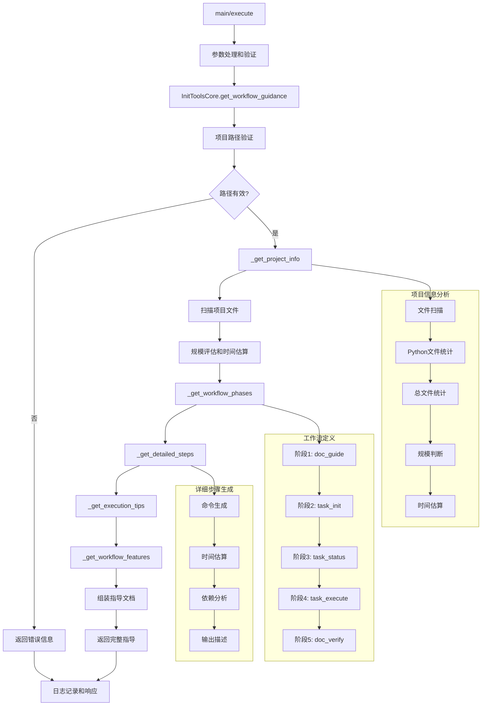

# 文件分析报告：init_tools.py

## 文件概述
CodeLens初始化指导工具，专注于提供标准5阶段文档生成工作流的完整指导。该工具是纯指导性工具，不执行实际操作，而是为用户提供详细的操作步骤、执行提示和工作流特性说明，确保用户能够正确理解和执行CodeLens的完整文档生成流程。

## 代码结构分析

### 导入依赖
```python
# 标准库导入
import sys, json, argparse
from pathlib import Path
from datetime import datetime
from typing import Dict, Any, List, Optional

# 项目依赖（带容错处理）
from src.logging import get_logger
```

### 全局变量和常量
```python
# 项目根目录路径计算
project_root = os.path.dirname(os.path.dirname(os.path.dirname(__file__)))

# 工作流阶段定义
WORKFLOW_PHASES = 5  # 5阶段标准流程

# 项目规模评估阈值
SMALL_PROJECT_THRESHOLD = 20   # 小型项目文件数阈值
MEDIUM_PROJECT_THRESHOLD = 100 # 中型项目文件数阈值
```

### 配置和设置
```python
# 5阶段工作流定义
workflow_phases = [
    "Phase 1: 智能项目分析 (doc_guide)",
    "Phase 2: 任务计划生成 (task_init)", 
    "Phase 3: 状态监控检查 (task_status)",
    "Phase 4: 任务循环执行 (task_execute)",
    "Phase 5: 文档验证确认 (doc_verify)"
]

# 项目规模和时间估算映射
scale_mapping = {
    "小型项目": "10-20分钟",
    "中型项目": "30-60分钟", 
    "大型项目": "1-3小时"
}

# 工具命令模板
command_templates = {
    "doc_guide": "python src/mcp_tools/doc_guide.py {project_path}",
    "task_init": "python src/mcp_tools/task_init.py {project_path} --analysis-file .codelens/analysis.json --create-tasks",
    "task_status": "python src/mcp_tools/task_status.py {project_path} --type current_task",
    "task_execute": "python src/mcp_tools/task_execute.py {project_path} --task-id <TASK_ID>",
    "doc_verify": "python src/mcp_tools/doc_verify.py {project_path}"
}
```

## 函数详细分析

### 函数概览表
| 函数名 | 功能描述 | 参数 | 返回值 |
|--------|----------|------|--------|
| `__init__` | 初始化指导工具实例 | project_path | None |
| `get_workflow_guidance` | 生成完整工作流指导 | 无 | Dict[指导内容] |
| `_get_project_info` | 获取项目基本信息 | 无 | Dict[项目信息] |
| `_get_workflow_phases` | 获取5阶段工作流概述 | 无 | List[阶段信息] |
| `_get_detailed_steps` | 获取详细执行步骤 | 无 | Dict[步骤详情] |
| `_get_execution_tips` | 获取执行提示 | 无 | List[提示信息] |
| `_get_workflow_features` | 获取工作流特性说明 | 无 | Dict[特性描述] |

### 函数详细说明

#### 核心指导生成函数

**`get_workflow_guidance()`**
- **功能**: 生成完整的CodeLens工作流指导文档
- **指导内容**:
  - 项目基本信息和规模评估
  - 5阶段工作流概述
  - 详细步骤说明和命令
  - 执行提示和最佳实践
  - 工作流特性和能力介绍
- **验证机制**: 项目路径有效性检查和错误处理
- **输出结构**: 结构化的JSON格式指导文档

#### 项目分析函数

**`_get_project_info()`**
- **功能**: 分析项目基本信息并评估规模
- **分析维度**:
  - 总文件数量统计
  - Python文件数量统计
  - 项目规模评估（小型/中型/大型）
  - 预计文档生成耗时估算
- **规模判断逻辑**:
  - <20文件: 小型项目（10-20分钟）
  - 20-100文件: 中型项目（30-60分钟）
  - >100文件: 大型项目（1-3小时）

#### 工作流结构化函数

**`_get_workflow_phases()`**
- **功能**: 定义5阶段工作流的标准结构
- **阶段定义**:
  - Phase 1: 智能项目分析（doc_guide）
  - Phase 2: 任务计划生成（task_init）
  - Phase 3: 状态监控检查（task_status）
  - Phase 4: 任务循环执行（task_execute）
  - Phase 5: 文档验证确认（doc_verify）
- **元数据**: 每个阶段包含工具名称、描述和功能说明

**`_get_detailed_steps()`**
- **功能**: 提供每个阶段的详细执行步骤
- **步骤信息**:
  - 具体的命令行指令
  - 预计执行时间
  - 期望输出结果
  - 依赖关系和执行顺序
  - 特殊注意事项
- **循环处理**: 特别处理Phase 4的循环执行逻辑

#### 用户指导函数

**`_get_execution_tips()`**
- **功能**: 提供执行过程中的实用提示
- **提示类型**:
  - 执行顺序要求
  - 循环步骤处理
  - 错误处理建议
  - 进度检查方法
  - 质量验证要求
- **实用性**: 基于实际使用经验的最佳实践

**`_get_workflow_features()`**
- **功能**: 介绍CodeLens工作流的核心特性
- **特性说明**:
  - 智能分析能力
  - 任务管理系统
  - 模板化文档生成
  - 状态跟踪机制
  - 质量保证体系
- **价值传达**: 突出工作流的技术优势和用户价值

## 类详细分析

### 类概览表
| 类名 | 继承关系 | 主要职责 | 关键方法 |
|------|----------|----------|----------|
| `InitToolsCore` | 无 | 工作流指导生成引擎 | get_workflow_guidance, _get_project_info, _get_workflow_phases |
| `InitTools` | 无 | MCP工具接口封装 | get_tool_definition, execute |
| `DummyLogger` | 无 | 日志系统降级实现 | debug, info, warning, error |

### 类详细说明

#### `InitToolsCore`
**设计模式**: 模板方法模式 + 建造者模式
- **模板方法模式**: 定义标准的指导生成流程，各个组件独立构建
- **建造者模式**: 分步骤构建复杂的指导文档，每个部分独立生成

**核心功能模块**:
1. **项目分析引擎**: 自动分析项目规模和特征
2. **工作流模板**: 标准化的5阶段工作流定义
3. **指导文档生成器**: 结构化的指导内容生成
4. **最佳实践库**: 基于经验的执行提示和建议
5. **特性说明系统**: 全面的工作流能力介绍

**指导文档结构**:
```python
guidance_structure = {
    "workflow_name": "CodeLens 5阶段智能文档生成工作流",
    "description": "标准化文档生成流程说明",
    "project_info": "项目基本信息和规模评估",
    "phases": "5阶段工作流概述",
    "detailed_steps": "详细执行步骤和命令",
    "execution_tips": "执行提示和最佳实践",
    "workflow_features": "工作流特性和能力说明"
}
```

**项目评估算法**:
- 基于文件数量的简单但有效的规模评估
- 考虑Python项目特征的专门化分析
- 提供realistic的时间估算帮助用户规划

#### `InitTools`
**设计模式**: 适配器模式 + 门面模式
- **适配器模式**: 将核心指导生成功能适配为MCP标准接口
- **门面模式**: 为复杂的工作流提供简单统一的访问入口

**MCP接口设计**:
```python
tool_definition = {
    "name": "init_tools",
    "description": "5阶段文档生成工作流指导工具",
    "use_cases": [
        "开始新项目文档生成时",
        "需要了解完整工作流程时", 
        "不确定下一步操作时"
    ],
    "important_note": "这是指导工具，不执行实际操作"
}
```

**错误处理策略**:
- 完整的异常捕获和日志记录
- 用户友好的错误信息
- 提供问题解决建议和替代方案

## 函数调用流程图


## 变量作用域分析

### 实例变量作用域
- **`self.project_path`**: 全局实例作用域，项目根路径
- **`self.logger`**: 日志记录器实例，支持全局操作跟踪

### 方法内变量作用域
- **`operation_id`**: 方法级日志追踪标识符
- **`project_info`**: 项目信息字典，在指导生成过程中传递
- **`result`**: 指导文档容器，逐步构建最终输出
- **文件统计变量**: python_files, all_files 用于项目分析

### 配置常量作用域
- **工作流阶段**: 标准的5阶段工作流定义
- **命令模板**: 各个工具的标准执行命令
- **规模阈值**: 项目规模判断的数值常量
- **时间估算**: 不同规模项目的预计耗时

## 函数依赖关系

### 外部依赖
```python
# 核心服务依赖
src.logging.get_logger           # 日志服务

# 标准库依赖
pathlib.Path                     # 路径操作
datetime.datetime                # 时间戳生成
json                            # 数据序列化
argparse                        # 命令行解析
os.getcwd                       # 当前目录获取
```

### 内部依赖链
```
get_workflow_guidance (主流程):
├── 项目路径验证
├── _get_project_info
│   ├── 文件扫描 (*.py, **/*)
│   └── 规模评估算法
├── _get_workflow_phases
├── _get_detailed_steps
├── _get_execution_tips
├── _get_workflow_features
└── 指导文档组装
```

### 数据流依赖
1. **项目分析**: 文件扫描 → 统计分析 → 规模评估 → 时间估算
2. **工作流构建**: 阶段定义 → 步骤详化 → 提示生成 → 特性说明
3. **文档组装**: 各组件合并 → 结构化输出 → JSON序列化

### 错误处理依赖
- 项目路径验证和错误恢复
- 文件扫描异常的优雅处理
- 完整的日志记录和错误追踪
- 用户友好的错误信息和解决建议