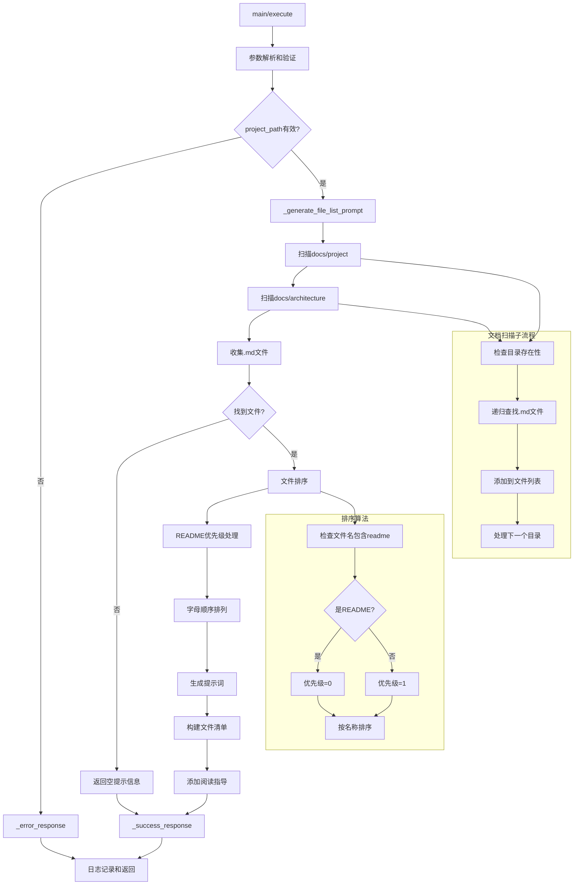

# 文件分析报告：project_overview.py

## 文件概述
项目文档概览工具，专注于扫描项目docs文件夹并生成AI阅读提示词。该工具是一个轻量级的文档索引工具，能够自动发现项目中的文档文件，按优先级排序，并生成结构化的阅读指导，帮助AI系统快速理解项目的整体架构和功能特点。

## 代码结构分析

### 导入依赖
```python
# 标准库导入
import sys, os, json
from pathlib import Path
from typing import Dict, Any

# 项目依赖
from src.logging import get_logger
```

### 全局变量和常量
```python
# 项目根目录路径计算
project_root = os.path.dirname(os.path.dirname(os.path.dirname(__file__)))

# 文档扫描目录配置
DOCS_DIRECTORIES = [
    "docs/project",      # 项目级文档
    "docs/architecture"  # 架构文档
]

# 文件类型过滤
DOCUMENT_EXTENSIONS = [".md"]  # 支持的文档格式
```

### 配置和设置
```python
# 工具基本信息
tool_name = "project_overview"
description = "扫描项目docs文件夹，生成文档阅读提示词"

# 文件排序规则
priority_files = ["readme", "README"]  # 优先读取的文件名

# 响应格式模板
response_template = {
    "success": bool,
    "tool": str,
    "data": dict,
    "error": str  # 可选
}
```

## 函数详细分析

### 函数概览表
| 函数名 | 功能描述 | 参数 | 返回值 |
|--------|----------|------|--------|
| `__init__` | 初始化工具实例 | 无 | None |
| `get_tool_definition` | 获取MCP工具定义 | 无 | Dict[工具定义] |
| `execute` | 执行文档扫描和提示生成 | arguments | Dict[执行结果] |
| `_generate_file_list_prompt` | 生成文档阅读提示词 | project_path | str |
| `_success_response` | 成功响应格式化 | data | Dict[成功响应] |
| `_error_response` | 错误响应格式化 | message | Dict[错误响应] |

### 函数详细说明

#### 核心执行函数

**`execute()`**
- **功能**: 主执行入口，处理文档扫描请求
- **参数处理**: 
  - project_path: 项目路径（可选，默认当前目录）
- **验证机制**: 项目路径存在性和目录有效性检查
- **执行流程**: 参数验证 → 文档扫描 → 提示生成 → 结果返回
- **错误处理**: 完整的异常捕获和日志记录

#### 文档扫描函数

**`_generate_file_list_prompt()`**
- **功能**: 扫描项目文档目录并生成AI阅读提示词
- **扫描范围**:
  - docs/project: 项目级文档
  - docs/architecture: 架构文档
- **文件过滤**: 仅扫描.md格式的文档文件
- **排序策略**: README文件优先，其他文件按字母顺序
- **提示格式**: 生成结构化的阅读指导和文件清单

#### 文档发现算法

**文档扫描逻辑**:
```python
扫描流程:
1. 检查 docs/project 目录
   └── 递归查找所有 *.md 文件
2. 检查 docs/architecture 目录  
   └── 递归查找所有 *.md 文件
3. 文件排序优化
   └── README文件置顶，其他按名称排序
4. 生成阅读提示词
   └── 包含文件路径和阅读指导
```

**排序优先级**:
- 第一优先级: README相关文件（readme.md, README.md等）
- 第二优先级: 按文件名字母顺序排列
- 相对路径显示: 便于定位和访问

#### 提示词生成策略

**提示词结构**:
```python
prompt_structure = {
    "header": "请按顺序阅读以下{count}个项目文档文件，了解{project_name}项目：",
    "file_list": "- {relative_path}\n",
    "footer": "阅读完成后，请总结项目的核心功能和架构特点。"
}
```

**智能化特性**:
- 动态计算文档数量
- 使用项目名称个性化提示
- 提供明确的阅读目标和期望输出

## 类详细分析

### 类概览表
| 类名 | 继承关系 | 主要职责 | 关键方法 |
|------|----------|----------|----------|
| `ProjectOverviewTool` | 无 | 项目文档扫描和提示生成引擎 | execute, _generate_file_list_prompt |

### 类详细说明

#### `ProjectOverviewTool`
**设计模式**: 策略模式 + 模板方法模式
- **策略模式**: 提供灵活的文档扫描策略，支持不同的目录结构
- **模板方法模式**: 定义标准的扫描和提示生成流程

**核心功能模块**:
1. **文档发现引擎**: 自动扫描项目文档目录
2. **智能排序系统**: 基于重要性的文件排序算法
3. **提示词生成器**: 创建结构化的AI阅读指导
4. **路径处理服务**: 相对路径计算和格式化
5. **错误处理机制**: 完整的异常处理和恢复

**文档处理流程**:
```python
document_processing_flow:
1. 路径验证 (Path Validation)
   ├── 检查项目路径存在性
   ├── 验证路径为有效目录
   └── 设置默认路径处理
2. 目录扫描 (Directory Scanning)
   ├── 扫描 docs/project
   ├── 扫描 docs/architecture
   └── 收集所有.md文件
3. 文件排序 (File Sorting)
   ├── README文件优先级处理
   ├── 字母顺序排列
   └── 相对路径计算
4. 提示词生成 (Prompt Generation)
   ├── 构建文件清单
   ├── 添加阅读指导
   └── 格式化最终输出
```

**特性和优势**:
- **轻量级设计**: 最小化依赖，快速执行
- **智能发现**: 自动识别标准文档目录结构
- **用户友好**: 生成易于理解的阅读提示
- **扩展性**: 易于添加新的文档类型和目录

**限制和约束**:
- 仅支持Markdown格式文档
- 固定的目录结构约定
- 简单的排序算法
- 基础的提示词模板

## 函数调用流程图


## 变量作用域分析

### 实例变量作用域
- **`self.tool_name`**: 工具名称标识符，全局实例作用域
- **`self.description`**: 工具描述信息，用于MCP接口定义
- **`self.logger`**: 日志记录器实例，支持全局操作跟踪

### 方法内变量作用域
- **`project_path`**: 项目路径，在主要方法间传递使用
- **`files_to_read`**: 文档文件列表，文档扫描结果容器
- **`prompt`**: 生成的提示词字符串，最终输出内容
- **目录变量**: project_docs, arch_docs 用于目录扫描

### 配置常量作用域
- **工具元信息**: tool_name, description 工具基本信息
- **目录路径**: 标准的文档目录结构定义
- **文件扩展名**: 支持的文档格式配置
- **排序关键词**: README识别模式

## 函数依赖关系

### 外部依赖
```python
# 核心服务依赖
src.logging.get_logger               # 日志服务

# 标准库依赖
pathlib.Path                         # 路径操作和文件系统访问
os.getcwd                           # 当前工作目录获取
json                                # 数据序列化
sys, os                             # 系统操作
```

### 内部依赖链
```
execute (主入口):
├── 参数验证和路径处理
├── _generate_file_list_prompt
│   ├── 目录扫描 (docs/project)
│   ├── 目录扫描 (docs/architecture)
│   ├── 文件收集和过滤
│   ├── 文件排序算法
│   └── 提示词构建
├── _success_response
└── _error_response
```

### 数据流依赖
1. **扫描流程**: 项目路径 → 目录检查 → 文件发现 → 文件收集
2. **处理流程**: 文件列表 → 排序优化 → 相对路径计算 → 提示词生成
3. **输出流程**: 提示内容 → 响应格式化 → JSON序列化 → 结果返回

### 错误处理依赖
- 路径验证和存在性检查
- 目录访问权限处理
- 文件读取异常的优雅处理
- 完整的日志记录和错误追踪