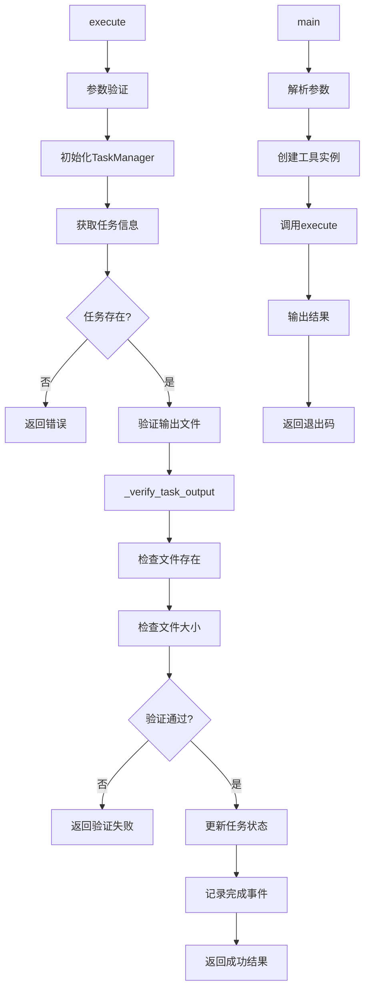

# 文件分析报告：task_complete.py

## 文件概述
任务完成工具的MCP实现，负责验证任务输出并标记任务为完成状态。作为4阶段文档生成流程的收尾工具，确保每个任务的输出文件质量和完整性，并更新任务状态到数据库中。

## 代码结构分析

### 导入依赖
```python
# 系统库
import sys, os, json, time
from pathlib import Path
from typing import Dict, Any

# 项目模块
from src.task_engine.task_manager import TaskManager, TaskStatus
from src.task_engine.state_tracker import StateTracker

# 日志系统（可选）
from src.logging import get_logger
```

### 全局变量和常量
```python
# 项目根目录路径设置
project_root = os.path.dirname(os.path.dirname(os.path.dirname(__file__)))
```

### 配置和设置
```python
# MCP工具配置
tool_name = "task_complete"
tool_description = "完成任务并验证输出质量"
required_params = ["project_path", "task_id"]
optional_params = ["output_file"]
```

## 函数详细分析

### 函数概览表
| 函数名 | 类型 | 行数 | 复杂度 | 描述 |
|--------|------|------|--------|------|
| `__init__` | 构造函数 | 41-43 | 低 | 初始化工具和日志器 |
| get_tool_definition | MCP接口 | 45-68 | 低 | 返回MCP工具定义 |
| execute | 核心方法 | 70-214 | 高 | 执行任务完成逻辑 |
| _verify_task_output | 私有方法 | 216-268 | 中 | 验证任务输出文件 |
| main | 命令行接口 | 271-301 | 中 | 命令行工具入口 |

### 函数详细说明

#### `__init__()`
**功能**: 初始化任务完成工具  
**参数**: 无  
**返回**: None  
**逻辑**: 创建日志器实例并记录初始化信息

#### get_tool_definition() -> Dict[str, Any]
**功能**: 获取MCP工具定义  
**参数**: 无  
**返回**: Dict - MCP标准工具定义  
**逻辑**: 返回包含工具名称、描述和输入模式的标准MCP工具定义

#### execute(arguments) -> Dict[str, Any]
**功能**: 执行任务完成和验证流程  
**参数**: arguments(Dict) - 包含project_path, task_id, output_file  
**返回**: Dict - 执行结果（成功/失败状态和详细信息）  
**逻辑**: 
- 验证必需参数
- 初始化任务管理器并获取任务信息
- 验证输出文件存在和内容
- 标记任务为完成状态
- 记录完成事件到状态跟踪器
- 返回详细的执行结果

#### _verify_task_output(output_path, task_type) -> Dict[str, Any]
**功能**: 验证任务输出文件质量  
**参数**: output_path(Path) - 输出文件路径, task_type(str) - 任务类型  
**返回**: Dict - 验证结果（包含valid状态、issues列表、文件大小）  
**逻辑**: 
- 检查文件是否存在
- 检查文件是否为空
- 返回详细的验证报告

#### main()
**功能**: 命令行界面入口  
**参数**: 通过argparse解析命令行参数  
**返回**: None（通过sys.exit返回状态码）  
**逻辑**: 
- 解析命令行参数
- 创建工具实例并执行
- 输出JSON格式结果
- 返回适当的退出码

## 类详细分析

### 类概览表
| 类名 | 行数 | 方法数 | 属性数 | 复杂度 | 核心功能 |
|------|------|--------|--------|--------|----------|
| TaskCompleteTool | 38-268 | 4 | 1 | 中 | 任务完成和验证工具 |
| DummyLogger | 27-34 | 6 | 0 | 低 | 日志系统备用实现 |

### 类详细说明

#### TaskCompleteTool类
**核心属性**:
- logger: 日志器实例

**设计模式**: MCP工具模式，实现标准的MCP工具接口

**关键特性**: 
- 输出文件验证：确保任务输出文件存在且不为空
- 状态管理：更新任务状态为完成
- 事件记录：记录任务完成事件到状态跟踪系统
- 错误处理：完整的错误捕获和报告机制

**工作流程**:
1. 参数验证和任务查找
2. 输出文件验证
3. 任务状态更新
4. 事件记录
5. 返回结果

#### DummyLogger类
**功能**: 日志系统不可用时的备用实现  
**特点**: 提供空操作方法，确保代码在没有日志系统时正常运行

## 函数调用流程图


## 变量作用域分析
```python
# 类属性作用域
TaskCompleteTool:
  - logger: Logger                          # 日志器实例

# 方法局部作用域
execute(arguments):
  - operation_id: str                       # 操作标识
  - project_path: str                       # 项目路径
  - task_id: str                            # 任务ID
  - output_file: str                        # 输出文件路径
  - task_manager: TaskManager               # 任务管理器
  - task: Task                              # 任务对象
  - expected_output: Path                   # 期望输出路径
  - verification_result: Dict               # 验证结果

_verify_task_output():
  - result: Dict[str, Any]                  # 验证结果字典
  - file_size: int                          # 文件大小
```

## 函数依赖关系
```
TaskCompleteTool.__init__
└── get_logger(component="TaskCompleteTool")

get_tool_definition
└── (返回静态工具定义)

execute
├── TaskManager(project_path)
├── task_manager.get_task(task_id)
├── _verify_task_output(output_path, task_type)
├── task_manager.update_task_status(task_id, TaskStatus.COMPLETED)
└── StateTracker(project_path, task_manager, None)
    └── state_tracker.record_task_event("completed", task_id)

_verify_task_output
├── output_path.exists()
├── output_path.stat().st_size
└── (返回验证结果字典)

main
├── argparse.ArgumentParser()
├── TaskCompleteTool()
├── tool.execute(arguments)
└── sys.exit()
```