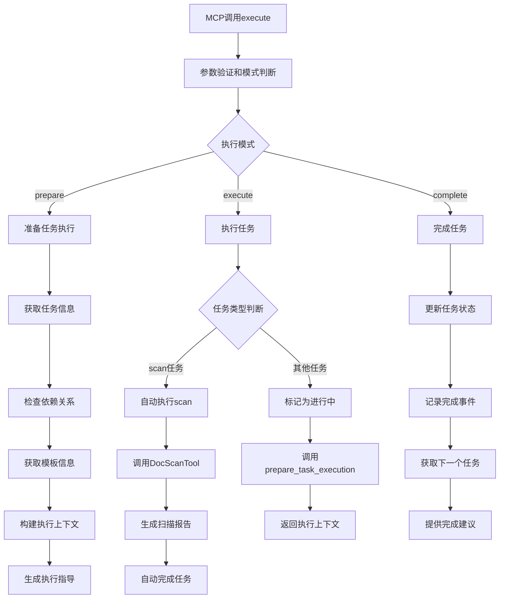

# 文件分析报告：src/mcp_tools/task_execute.py

## 文件概述
CodeLens智能任务执行MCP工具核心实现，负责执行单个或批量任务，提供完整的模板、上下文信息和执行指导。该工具作为4阶段文档生成系统的核心执行引擎，集成任务管理器、阶段控制器和状态跟踪器，实现任务的完整生命周期管理，特别针对scan任务提供自动执行功能。

## 代码结构分析

### 导入依赖
- **系统模块**: `sys, os, time, pathlib.Path` - 系统操作、时间处理和路径管理
- **数据处理**: `json` - JSON格式处理
- **类型注解**: `typing.Dict, Any, List, Optional` - 类型提示支持
- **任务引擎**: `TaskManager, TaskStatus, Task, PhaseController, Phase, StateTracker` - 核心任务管理组件
- **服务层**: `FileService, TemplateService` - 文件服务和模板服务
- **日志系统**: `logging` - 标准Python日志记录

### 全局变量和常量
- **project_root**: 项目根目录路径，用于模块导入
- **工具标识**: tool_name="task_execute", description - MCP工具基本信息

### 配置和设置
- **MCP工具配置**: 标准化的inputSchema定义，支持6个主要参数
- **执行模式枚举**: ["prepare", "execute", "complete"] - 三种执行模式
- **任务状态管理**: 集成TaskStatus状态机
- **上下文增强**: 支持可选的上下文信息增强

## 函数详细分析

### 函数概览表
| 函数名 | 参数 | 返回值 | 功能描述 |
|--------|------|--------|----------|
| `__init__` | self, project_path | None | 初始化任务执行器，创建所有服务组件 |
| `prepare_task_execution` | self, task_id, context_enhancement | Dict[str, Any] | 准备任务执行上下文，检查依赖和获取模板 |
| `execute_task` | self, task_id, mark_in_progress | Dict[str, Any] | 执行任务，标记状态并提供执行上下文 |
| `_execute_scan_task` | self, task_id | Dict[str, Any] | 自动执行scan任务的特殊处理方法 |
| `_generate_scan_report` | self, scan_data | str | 生成项目扫描报告内容 |
| `complete_task` | self, task_id, success, error_message | Dict[str, Any] | 完成任务，更新状态并提供后续建议 |
| `_check_dependencies` | self, task | Dict[str, Any] | 检查任务依赖关系满足情况 |
| `_get_template_info` | self, task | Dict[str, Any] | 获取任务相关的模板信息 |
| `_build_execution_context` | self, task, context_enhancement | Dict[str, Any] | 构建任务执行的完整上下文 |
| `_get_generation_guidance` | self, task | Dict[str, Any] | 获取任务类型特定的生成指导 |
| `_get_next_task` | self, task | Optional[Dict[str, Any]] | 获取下一个建议执行的任务 |

### 函数详细说明

**`__init__(self, project_path)`**
- 初始化项目路径和所有必要的服务组件
- 创建TaskManager、PhaseController、StateTracker实例
- 集成FileService和TemplateService服务
- 设置日志记录器，组件标识为'task_executor'

**`prepare_task_execution(self, task_id, context_enhancement)`**
- 获取任务信息并验证任务存在性
- 检查任务依赖关系，确保前置任务已完成
- 获取模板内容和元数据信息
- 构建完整的执行上下文环境
- 提供生成指导和下一个任务建议

**`execute_task(self, task_id, mark_in_progress)`**
- 验证任务状态是否可执行（PENDING或FAILED）
- 特殊处理scan任务，调用自动执行逻辑
- 标记任务为IN_PROGRESS状态
- 记录任务开始事件到状态跟踪器
- 调用prepare_task_execution获取执行上下文

**`_execute_scan_task(self, task_id)`**
- scan任务的自动执行特殊处理
- 调用DocScanTool执行项目扫描
- 生成项目扫描报告并保存到指定路径
- 自动完成任务状态更新
- 提供异常安全的错误处理

**`_generate_scan_report(self, scan_data)`**
- 基于扫描数据生成结构化的项目报告
- 包含项目基本信息、目录结构、文件类型分布
- 使用Markdown格式生成可读性强的报告
- 为后续文档生成提供基础信息

**`complete_task(self, task_id, success, error_message)`**
- 更新任务状态为COMPLETED或FAILED
- 记录任务完成事件和错误信息
- 获取阶段进度状态和下一个任务
- 提供完成后的智能建议和推荐

## 类详细分析

### 类概览表
| 类名 | 继承关系 | 主要职责 | 实例方法数量 |
|------|----------|----------|--------------|
| `TaskExecutor` | 无继承 | 任务执行核心引擎 | 11个以上 |
| `TaskExecuteTool` | 无继承 | MCP协议task_execute工具实现 | 4个 |

### 类详细说明

**`TaskExecutor`**
- **设计目的**: 提供完整的任务执行管理功能
- **核心职责**: 任务生命周期管理、上下文构建、依赖检查、状态跟踪
- **集成组件**: TaskManager、PhaseController、StateTracker、FileService、TemplateService
- **特色功能**: scan任务自动执行、智能上下文构建、依赖验证
- **执行模式**: 支持准备、执行、完成三种模式的完整工作流

**`TaskExecuteTool`**
- **设计目的**: 实现MCP协议的task_execute工具功能
- **核心职责**: 参数验证、执行模式路由、结果格式化
- **MCP集成**: 完全符合MCP工具接口规范
- **执行策略**: 支持三种执行模式的灵活调用
- **错误处理**: 完整的异常捕获和错误响应机制

## 函数调用流程图

## 变量作用域分析
- **模块作用域**: project_root路径、导入的模块和类
- **类作用域**: TaskExecutor和TaskExecuteTool类定义
- **实例作用域**: 服务组件实例、项目路径、日志器
- **方法作用域**: 各方法内的局部变量，如任务信息、执行上下文等

## 函数依赖关系
- `__init__` → 所有服务组件的初始化
- `execute_task` → `_execute_scan_task` 特殊任务处理
- `execute_task` → `prepare_task_execution` 上下文准备
- `prepare_task_execution` → `_check_dependencies` → `_get_template_info` → `_build_execution_context`
- `_execute_scan_task` → `DocScanTool` → `_generate_scan_report`
- `complete_task` → 状态更新 → 事件记录 → 下一任务获取
- 所有方法 → `logger` 日志记录
- MCP工具方法 → TaskExecutor核心方法调用