# 文件分析报告：src/mcp_tools/task_execute.py

## 文件概述

**CodeLens智能任务执行引擎**——CodeLens系统的核心执行组件，实现了完整的3阶段文档生成工作流程的任务执行管理。该文件提供了高度智能化的任务执行功能，包括三种执行模式、空文件检测与自动文档生成、**🔥新增大文件分片处理与合并**、输出验证、上下文增强等高级特性。作为MCP协议的task_execute工具实现，它集成了TaskManager、PhaseController、StateTracker等核心组件，并新增了大文件智能处理能力，实现了完整的任务生命周期管理。基于FileService集成的项目分析，直接执行文件层→架构层→项目层的文档生成流程。

## 基本信息

- **文件路径**: `src/mcp_tools/task_execute.py`
- **文件类型**: .py
- **代码行数**: ~1700行 (🔥大幅扩展)
- **主要类**: 2个 (`TaskExecutor`, `TaskExecuteTool`)
- **主要函数**: 25+个核心方法 (🔥新增10+个大文件处理方法)
- **集成组件**: TaskManager, PhaseController, StateTracker, FileService, TemplateService + **🔥LargeFileHandler集成**

## 代码结构分析

### 导入依赖
```python
# 系统基础模块
import sys, os, json, time
from pathlib import Path
from typing import Dict, Any, List, Optional

# CodeLens核心组件
from src.task_engine.task_manager import TaskManager, TaskStatus, Task
from src.task_engine.phase_controller import PhaseController, Phase
from src.task_engine.state_tracker import StateTracker
from src.services.file_service import FileService
from src.templates.document_templates import TemplateService
from src.logging import get_logger

# 🔥新增: 大文件处理相关类
from src.services.large_file_handler import ChunkingResult, CodeChunk
HAS_LARGE_FILE_HANDLER = True  # 大文件处理器可用性标志
```

### 全局变量和常量
- **project_root**: 动态计算的项目根目录路径
- **MCP工具标识**: `tool_name="task_execute"`, `description="执行单个或批量任务，提供模板和上下文信息"`
- **🔥新增**: **HAS_LARGE_FILE_HANDLER**: 大文件处理器可用性检查

### 配置和设置
- **执行模式**: `["prepare", "execute", "complete"]` - 三阶段执行模式
- **MCP接口配置**: 完整的inputSchema定义，支持6个主要参数
- **日志配置**: 组件级日志记录，支持操作追踪
- **验证规则**: 输出文件最小100字节验证，空文件≤10字符检测
- **🔥新增**: **大文件处理配置**: 50KB分片阈值，120KB处理上限，自动分片启用

## 函数详细分析

### 函数概览表 🔥重大扩展
| 函数名 | 参数 | 返回值 | 核心功能 |
|--------|------|--------|----------|
| `TaskExecutor.__init__` | project_path | None | 🔥更新：初始化执行器，集成大文件处理能力 |
| `prepare_task_execution` | task_id, context_enhancement | Dict | 准备执行上下文，检查依赖和模板 |
| `execute_task` | task_id, mark_in_progress | Dict | 🔥更新：主执行方法，支持大文件自动处理 |
| `_execute_scan_task` | task_id | Dict | 自动执行scan任务的特殊处理 |
| `_generate_scan_report` | scan_data | str | 生成结构化项目扫描报告 |
| `_check_and_handle_empty_file` | task_id | Optional[Dict] | 检测并自动处理空文件 |
| `🔥新增 _check_and_handle_large_file` | task_id | Optional[Dict] | **核心新功能**：检测并自动处理大文件 |
| `🔥新增 _process_chunks_and_merge` | task, chunking_result | str | 处理代码分片并合并生成最终文档 |
| `🔥新增 _sort_chunks_by_dependencies` | chunks | List[CodeChunk] | 根据依赖关系对分片排序 |
| `🔥新增 _generate_chunk_documentation` | chunk, template, task | str | 为单个代码分片生成文档 |
| `🔥新增 _generate_class_chunk_doc` | chunk, template | str | 生成类分片的专业文档 |
| `🔥新增 _generate_function_chunk_doc` | chunk, template | str | 生成函数分片的专业文档 |
| `🔥新增 _generate_module_chunk_doc` | chunk, template | str | 生成模块级分片的专业文档 |
| `🔥新增 _generate_generic_chunk_doc` | chunk, template | str | 生成通用分片的专业文档 |
| `🔥新增 _merge_chunk_documentations` | chunk_docs, task, result | str | 合并所有分片文档为最终文档 |
| `🔥新增 get_chunking_stats` | - | Dict[str, Any] | 获取分片处理统计信息 |
| `_generate_empty_file_doc` | file_path, content | str | 为空文件生成标准化文档 |
| `complete_task` | task_id, success, error_message | Dict | 完成任务，包含输出验证 |
| `_check_dependencies` | task | Dict | 检查任务依赖满足情况 |
| `_get_template_info` | task | Dict | 获取任务模板信息和元数据 |
| `_build_execution_context` | task, context_enhancement | Dict | 构建完整执行上下文 |
| `_get_file_context` | target_file, enhanced | Dict | 获取文件级上下文信息 |
| `_get_project_context` | - | Dict | 获取项目级上下文信息 |
| `_get_phase_context` | phase | Dict | 获取阶段级上下文信息 |
| `_get_generation_guidance` | task | Dict | 获取任务类型特定的生成指导 |
| `_find_related_files` | target_file | List[str] | 查找相关文件（最多5个） |

### 核心方法详细说明

**`TaskExecutor.__init__(self, project_path: str)` 🔥重大更新** *第27-42行*
- 初始化项目路径和日志记录器
- 创建TaskManager、PhaseController、StateTracker核心实例
- **🔥新增**: 集成大文件处理能力的FileService实例
- **🔥新增**: 大文件处理配置和阈值设置
- **🔥新增**: 大文件处理能力检查和日志记录

**`execute_task(self, task_id: str, mark_in_progress: bool = True)` 🔥重大更新** *第107-170行*
- **状态验证**: 检查任务是否处于可执行状态（PENDING/FAILED）
- **🔥新增**: **双重文件预处理**:
  - **空文件检查**: 调用`_check_and_handle_empty_file`自动处理
  - **🔥大文件检查**: 调用`_check_and_handle_large_file`自动处理
- **特殊处理**: 
  - scan任务：调用`_execute_scan_task`自动执行
- **状态更新**: 标记任务为IN_PROGRESS，记录开始事件
- **执行上下文**: 调用`prepare_task_execution`获取完整上下文

**🔥新增 `_check_and_handle_large_file(self, task_id: str) -> Optional[Dict[str, Any]]`** *第856-927行*
- **核心新功能**: 检测50KB-120KB范围的大文件并自动分片处理
- **智能检测**: 使用FileService检查文件是否需要分片处理
- **自动处理**: 调用大文件处理器执行语义分片
- **文档生成**: 调用`_process_chunks_and_merge`生成合并文档
- **自动完成**: 直接完成任务并返回处理结果
- **错误恢复**: 分片失败时恢复任务状态，不中断正常流程

**🔥新增 `_process_chunks_and_merge(self, task: Task, chunking_result: ChunkingResult) -> str`** *第929-955行*
- **分片处理协调**: 协调整个分片文档生成流程
- **模板集成**: 获取任务模板并传递给分片处理
- **依赖排序**: 调用`_sort_chunks_by_dependencies`对分片排序
- **批量生成**: 为每个分片生成专业文档
- **智能合并**: 调用`_merge_chunk_documentations`生成最终文档

**🔥新增 `_generate_chunk_documentation(self, chunk: CodeChunk, template: str, task: Task) -> str`** *第972-982行*
- **类型路由**: 根据分片类型路由到专业的文档生成器
- **模板传递**: 将模板信息传递给具体的生成器
- **上下文保持**: 保持任务上下文信息
- **专业化**: 每种分片类型有专门的文档生成逻辑

**🔥新增 `_generate_class_chunk_doc(self, chunk: CodeChunk, template: str) -> str`** *第984-1013行*
- **类分片专业文档**: 生成类的详细分析文档
- **元数据利用**: 利用类名、方法数量、基类等元数据
- **代码展示**: 包含完整的类代码和语法高亮
- **依赖分析**: 展示类的定义符号和引用关系
- **特征识别**: 识别私有类、继承关系等特征

**🔥新增 `_generate_function_chunk_doc(self, chunk: CodeChunk, template: str) -> str`** *第1015-1046行*
- **函数/方法专业文档**: 区分类方法和模块函数
- **参数分析**: 展示参数数量和函数特征
- **方法特征**: 识别私有方法、特殊方法（__init__等）
- **所属关系**: 显示方法所属的类信息
- **实现分析**: 包含完整的实现代码和依赖关系

**🔥新增 `_merge_chunk_documentations(self, chunk_docs: List[Dict], task: Task, chunking_result: ChunkingResult) -> str`** *第1089-1152行*
- **文档合并核心**: 将所有分片文档合并为完整的分析报告
- **专业头部**: 生成包含文件信息、分片统计的专业头部
- **分片概览**: 提供分片类型统计和处理概览
- **详细分析**: 有序合并所有分片的详细文档
- **处理总结**: 包含处理统计、成功率、性能信息的尾部

## 🔥大文件处理工作流程

### 双阈值处理策略 (v1.1.1.0)
- **分片阈值**: 50KB - 启动分片处理的阈值
- **处理上限**: 120KB - 文件处理的最大限制
- **处理范围**: 50KB-120KB之间文件通过智能分片处理
- **跳过策略**: 超过120KB的文件被完全跳过
- **兼容性**: 现有50KB分片逻辑保持不变

### 大文件自动检测与处理流程

```mermaid
graph TD
    A[execute_task调用] --> B[文件预处理阶段]
    B --> C[空文件检查]
    C --> D{是空文件?}
    D -->|是| E[生成空文件文档]
    D -->|否| F[🔥大文件检查]
    
    F --> G{文件>50KB分片阈值?}
    G -->|否| H[正常任务执行流程]
    G -->|是| I[🔥调用大文件处理器\n50KB-120KB范围]
    
    I --> J[语言检测]
    J --> K[AST语义分片]
    K --> L[依赖关系分析]
    L --> M[分片排序]
    M --> N[批量文档生成]
    N --> O[智能文档合并]
    O --> P[自动完成任务]
    
    E --> Q[返回处理结果]
    P --> Q
    H --> R[常规执行流程]
    
    style I fill:#f3e5f5
    style O fill:#e8f5e8
    style P fill:#fff3e0
```


### 分片文档生成架构

```mermaid
graph TD
    A[ChunkingResult输入] --> B[分片类型识别]
    B --> C{分片类型?}
    
    C -->|class| D[_generate_class_chunk_doc]
    C -->|function| E[_generate_function_chunk_doc]
    C -->|module| F[_generate_module_chunk_doc]
    C -->|其他| G[_generate_generic_chunk_doc]
    
    D --> H[类特征分析]
    E --> I[函数特征分析]
    F --> J[模块级分析]
    G --> K[通用代码分析]
    
    H --> L[生成类文档片段]
    I --> M[生成函数文档片段]
    J --> N[生成模块文档片段]
    K --> O[生成通用文档片段]
    
    L --> P[文档片段收集]
    M --> P
    N --> P
    O --> P
    
    P --> Q[_merge_chunk_documentations]
    Q --> R[生成完整文档]
    
    style D fill:#e3f2fd
    style E fill:#f1f8e9
    style F fill:#fff8e1
    style G fill:#fce4ec
```


## 类详细分析

### 类概览表
| 类名 | 继承关系 | 主要职责 | 实例方法数量 |
|------|----------|----------|-------------|
| `TaskExecutor` | 无继承 | 任务执行引擎 + 🔥大文件处理集成 | 25+个 (🔥新增10+个) |
| `TaskExecuteTool` | 无继承 | MCP工具接口 | 3个 |

### 类详细说明

**`TaskExecutor` 🔥重大升级**
- **核心职责扩展**: 从任务执行器升级为智能文件处理执行器
- **新增能力**:
  - 大文件自动检测和分片处理
  - 多类型代码分片的专业文档生成
  - 智能文档合并和质量保证
  - 分片处理统计和监控
- **处理流程**: 空文件 → 大文件 → 常规任务的三层处理架构
- **自动化程度**: 大文件处理完全自动化，无需用户干预
- **向后兼容**: 完全兼容原有功能，新功能透明集成

**`TaskExecuteTool`**
- **MCP接口**: 提供标准的MCP工具接口
- **参数验证**: 完整的参数验证和类型检查
- **执行委托**: 委托给TaskExecutor实际执行
- **结果格式化**: 格式化返回结果符合MCP标准

## 🔥分片文档生成特性

### 类分片文档模板
```markdown
### 类: ClassName

**定义位置**: 第 X-Y 行
**复杂度评分**: N.N
**大小**: XXX 字节

#### 类特征
- 方法数量: N
- 继承关系: BaseClass1, BaseClass2
- 是否为私有类: 是/否

#### 类结构分析
[完整代码展示]

#### 依赖关系
- **定义的符号**: symbol1, symbol2
- **引用的符号**: ref1, ref2
```

### 函数分片文档模板
```markdown
### 方法/函数: function_name

**定义位置**: 第 X-Y 行
**复杂度评分**: N.N
**参数数量**: N
**所属类**: ClassName (如果是方法)

#### 函数特征
- 类型: 类方法/模块函数
- 私有方法: 是/否
- 特殊方法: 是/否

#### 实现分析
[完整代码展示]

#### 依赖分析
[依赖关系分析]
```

### 合并文档结构
```markdown
# 文件分析报告：filename

## 文件概述
**大文件分片处理报告** - 自动分片处理说明

## 基本信息
- **文件路径**: `path`
- **文件大小**: XXX KB (分片阈值50KB, 处理上限120KB)
- **分片数量**: N个
- **处理方法**: python_ast_semantic
- **处理时间**: X.XX 秒

## 分片处理结果
### 分片概览
- Class 分片: N 个
- Function 分片: N 个

## 详细分析
[所有分片文档的有序合并]

## 分片处理总结
[处理统计和技术说明]
```

## 函数调用流程图 🔥更新

```mermaid
graph TD
    A[TaskExecutor.execute_task] --> B[任务状态检查]
    B --> C[scan任务特殊处理]
    C --> D[文件预处理阶段]
    
    D --> E[_check_and_handle_empty_file]
    E --> F{是空文件?}
    F -->|是| G[生成空文件文档并完成]
    F -->|否| H[🔥_check_and_handle_large_file]
    
    H --> I{是大文件?}
    I -->|否| J[标记任务进行中]
    I -->|是| K[🔥大文件分片处理]
    
    K --> L[FileService.read_file_with_chunking]
    L --> M[LargeFileHandler.process_large_file]
    M --> N[🔥_process_chunks_and_merge]
    
    N --> O[🔥_sort_chunks_by_dependencies]
    O --> P[🔥批量_generate_chunk_documentation]
    P --> Q[🔥_merge_chunk_documentations]
    Q --> R[写入最终文档]
    R --> S[自动完成任务]
    
    J --> T[prepare_task_execution]
    T --> U[返回执行上下文]
    
    G --> V[返回处理结果]
    S --> V
    U --> W[用户执行任务]
    
    style K fill:#f3e5f5
    style N fill:#e8f5e8
    style Q fill:#fff3e0
```


## 变量作用域分析 🔥扩展
- **模块作用域**: 导入模块、HAS_LARGE_FILE_HANDLER标志、project_root
- **类作用域**: TaskExecutor和TaskExecuteTool的方法定义
- **实例作用域**: 
  - 原有：task_manager、phase_controller、state_tracker等
  - **🔥新增**: large_file_threshold、enable_chunking配置
- **方法作用域**: 
  - 原有：任务对象、上下文信息、模板数据等
  - **🔥新增**: 分片结果、文档片段、合并数据等

## 性能优化特性 🔥新增
- **自动化处理**: 大文件完全自动化处理，无需用户干预
- **内存效率**: 分片处理避免大文件全量内存加载
- **并行友好**: 分片架构支持未来并行文档生成
- **缓存利用**: 分片结果可被缓存系统利用
- **错误隔离**: 大文件处理失败不影响其他任务

## 错误处理机制 🔥增强
- **分层处理**: 空文件 → 大文件 → 常规任务的错误隔离
- **自动恢复**: 大文件处理失败时自动恢复任务状态
- **优雅降级**: 分片失败时不中断正常任务流程
- **详细日志**: 完整的错误日志和处理轨迹
- **状态一致**: 确保任务状态的一致性和可恢复性

## 函数依赖关系 🔥更新
- `execute_task` → `_check_and_handle_empty_file` → `_check_and_handle_large_file` 预处理链
- `_check_and_handle_large_file` → `FileService.read_file_with_chunking` → `_process_chunks_and_merge` 大文件处理链
- `_process_chunks_and_merge` → `_sort_chunks_by_dependencies` → `_generate_chunk_documentation` → `_merge_chunk_documentations` 分片文档生成链
- `_generate_chunk_documentation` → `_generate_class_chunk_doc`/`_generate_function_chunk_doc`/`_generate_module_chunk_doc`/`_generate_generic_chunk_doc` 专业文档生成链
- `get_chunking_stats` → `FileService.large_file_handler` 统计信息链
- 所有方法 → `logger` 日志记录链

## 🔥新功能使用示例

### 大文件自动处理
```python
# 初始化执行器（自动启用大文件处理）
executor = TaskExecutor("/path/to/project")

# 执行文件摘要任务（自动检测大文件）
result = executor.execute_task("file_summary_task_id")

# 检查是否是大文件自动处理
if result.get('chunking_info'):
    print(f"大文件自动处理完成: {result['chunking_info']['total_chunks']} 个分片")
    print(f"处理方法: {result['chunking_info']['processing_method']}")
    print(f"处理时间: {result['chunking_info']['processing_time']:.2f}秒")
```

### 分片统计查询
```python
# 获取分片处理统计
stats = executor.get_chunking_stats()
if stats.get('chunking_enabled'):
    print(f"分片功能已启用，阈值: {stats['threshold_kb']} KB")
    print(f"已处理文件: {stats['total_files_processed']} 个")
    print(f"已生成分片: {stats['total_chunks_created']} 个")
```

### 任务执行状态检查
```python
# 执行任务并检查类型
result = executor.execute_task(task_id)

if result.get('task_completed'):
    if 'chunking_info' in result:
        print("大文件自动分片处理完成")
    elif result.get('auto_generated'):
        print("空文件自动处理完成")
    else:
        print("常规任务需要继续执行")
```