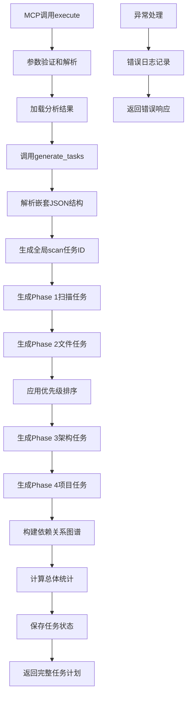

# 文件分析报告：src/mcp_tools/task_init.py

## 文件概述
CodeLens智能任务计划生成MCP工具核心实现，基于项目分析结果生成完整的4阶段任务列表。该工具作为任务引擎的核心规划组件，负责将分析结果转化为可执行的任务队列，建立任务依赖关系图谱，实现从项目扫描到文档生成的全流程任务调度和时间估算。

## 代码结构分析

### 导入依赖
- **系统模块**: `sys, os, time, pathlib.Path` - 系统操作、时间处理和路径管理
- **数据处理**: `json` - JSON格式处理
- **类型注解**: `typing.Dict, Any, List, Optional` - 类型提示支持
- **任务引擎**: `TaskManager, TaskType, TaskStatus, PhaseController, Phase` - 核心任务管理组件
- **日志系统**: `logging` - 标准Python日志记录

### 全局变量和常量
- **project_root**: 项目根目录路径，用于模块导入
- **工具标识**: tool_name="task_init", description - MCP工具基本信息

### 配置和设置
- **模板映射配置**: TaskType到模板名称的映射关系，支持8种核心任务类型
- **优先级映射配置**: 文件优先级分类，包含high、normal、low三个级别
- **MCP工具配置**: 标准化的inputSchema定义，支持5个参数
- **4阶段架构**: Phase 1 Scan → Phase 2 Files → Phase 3 Architecture → Phase 4 Project

## 函数详细分析

### 函数概览表
| 函数名 | 参数 | 返回值 | 功能描述 |
|--------|------|--------|----------|
| `__init__` | self | None | 初始化任务计划生成器，设置映射关系 |
| `generate_tasks` | self, project_path, analysis_result, task_granularity, parallel_tasks, custom_priorities | Dict[str, Any] | 核心方法：生成完整的4阶段任务计划 |
| `_generate_phase_1_tasks` | self, project_path, project_analysis, scan_task_id | List[Dict] | 生成Phase 1扫描任务 |
| `_generate_phase_2_tasks` | self, project_path, plan, scan_task_id, custom_priorities | List[Dict] | 生成Phase 2文件层任务 |
| `_generate_phase_3_tasks` | self, project_path, project_analysis, phase_2_tasks | List[Dict] | 生成Phase 3架构层任务 |
| `_generate_phase_4_tasks` | self, project_path, project_analysis, phase_3_tasks | List[Dict] | 生成Phase 4项目层任务 |
| `_build_dependency_graph` | self, all_tasks | Dict[str, List[str]] | 构建任务依赖关系图谱 |
| `_get_file_priority` | self, file_path, custom_priorities | str | 计算文件优先级级别 |
| `_estimate_task_duration` | self, task_type, target | int | 估算单个任务完成时间 |
| `_get_output_path` | self, task_type, target, project_path | str | 生成任务输出路径 |

### 函数详细说明

**`__init__(self)`**
- 初始化模板映射关系，支持8种核心任务类型
- 设置文件优先级映射，包含high、normal、low三个级别
- 建立TaskType到模板名称的对应关系
- 为任务生成提供基础配置

**`generate_tasks(self, project_path, analysis_result, task_granularity, parallel_tasks, custom_priorities)`**
- 核心任务计划生成方法，处理嵌套JSON结构解析
- 生成全局scan任务ID，确保依赖关系一致性
- 按顺序生成4个阶段的任务列表
- 计算总体统计和依赖关系图谱
- 构建完整的任务计划响应结构

**`_generate_phase_1_tasks(self, project_path, project_analysis, scan_task_id)`**
- 生成Phase 1项目扫描任务
- 创建唯一的scan任务，作为所有后续任务的依赖
- 设置扫描任务的输出路径和模板映射
- 为整个任务流程建立起始点

**`_generate_phase_2_tasks(self, project_path, plan, scan_task_id, custom_priorities)`**
- 生成Phase 2文件层文档任务
- 基于项目分析结果中的关键文件列表
- 应用文件优先级排序和自定义优先级
- 建立对scan任务的依赖关系

**`_generate_phase_3_tasks(self, project_path, project_analysis, phase_2_tasks)`**
- 生成Phase 3架构层文档任务
- 包含系统架构、技术栈、数据流等架构组件
- 依赖于Phase 2所有文件任务完成
- 为系统架构文档生成提供任务框架

**`_generate_phase_4_tasks(self, project_path, project_analysis, phase_3_tasks)`**
- 生成Phase 4项目层文档任务
- 包含项目README等项目级别文档
- 依赖于Phase 3所有架构任务完成
- 作为整个文档生成流程的收尾

## 类详细分析

### 类概览表
| 类名 | 继承关系 | 主要职责 | 实例方法数量 |
|------|----------|----------|--------------|
| `TaskPlanGenerator` | 无继承 | 任务计划生成核心引擎 | 10个 |
| `TaskInitTool` | 无继承 | MCP协议task_init工具实现 | 4个 |

### 类详细说明

**`TaskPlanGenerator`**
- **设计目的**: 提供完整的4阶段任务计划生成功能
- **核心职责**: 任务列表生成、依赖关系建立、时间估算、优先级排序
- **映射系统**: 任务类型到模板的映射、文件优先级映射
- **架构支持**: 完整的4阶段文档生成架构
- **扩展性**: 支持自定义优先级和任务粒度配置

**`TaskInitTool`**
- **设计目的**: 实现MCP协议的task_init工具功能
- **核心职责**: 参数验证、任务生成调用、结果格式化
- **MCP集成**: 完全符合MCP工具接口规范
- **数据处理**: 处理复杂的嵌套分析结果结构
- **错误处理**: 完整的异常捕获和错误响应机制

## 函数调用流程图

## 变量作用域分析
- **模块作用域**: project_root路径、导入的模块和类
- **类作用域**: TaskPlanGenerator和TaskInitTool类定义
- **实例作用域**: 模板映射字典、优先级映射、任务管理器实例
- **方法作用域**: 各方法内的局部变量，如任务列表、依赖图谱等

## 函数依赖关系
- `__init__` → 映射关系初始化
- `generate_tasks` → `_generate_phase_1_tasks` → `_generate_phase_2_tasks` → `_generate_phase_3_tasks` → `_generate_phase_4_tasks`
- `generate_tasks` → `_build_dependency_graph` 依赖图谱构建
- `_generate_phase_2_tasks` → `_get_file_priority` 优先级计算
- 各阶段生成方法 → `_get_output_path` → `_estimate_task_duration`
- `execute` → `TaskPlanGenerator.generate_tasks` → `TaskManager` 状态保存
- 所有方法 → `logger` 日志记录