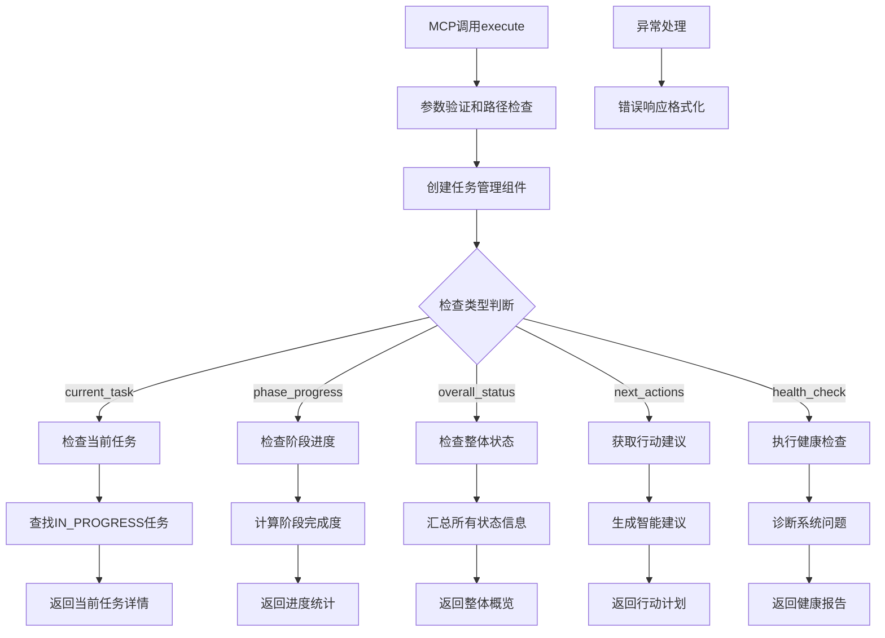

# 文件分析报告：src/mcp_tools/task_status.py

## 文件概述
CodeLens实时任务状态监控MCP工具核心实现，为Claude Code提供完整的任务进度查询、阶段管理和项目概览功能。该工具作为4阶段文档生成系统的状态管理组件，集成任务管理器、阶段控制器和状态跟踪器，实现任务执行状态的实时监控和智能的下一步行动建议，支持5种不同的检查类型。

## 代码结构分析

### 导入依赖
- **系统模块**: `sys, os` - 系统操作和路径管理
- **数据处理**: `json` - JSON格式处理
- **类型注解**: `typing.Dict, Any, List, Optional` - 类型提示支持
- **任务引擎**: `TaskManager, TaskStatus, PhaseController, Phase, StateTracker` - 核心任务管理组件
- **日志系统**: `logging` - 标准Python日志记录

### 全局变量和常量
- **project_root**: 项目根目录路径，用于模块导入
- **工具标识**: tool_name="task_status", description - MCP工具基本信息

### 配置和设置
- **MCP工具配置**: 标准化的inputSchema定义，支持5个参数
- **检查类型枚举**: ["current_task", "phase_progress", "overall_status", "next_actions", "health_check"]
- **阶段过滤器**: ["phase_1_scan", "phase_2_files", "phase_3_architecture", "phase_4_project"]
- **状态监控**: 集成TaskStatus状态机和Phase阶段管理

## 函数详细分析

### 函数概览表
| 函数名 | 参数 | 返回值 | 功能描述 |
|--------|------|--------|----------|
| `__init__` | self | None | 初始化task_status工具，设置日志器 |
| `get_tool_definition` | self | Dict[str, Any] | 获取MCP工具的完整定义 |
| `execute` | self, arguments | Dict[str, Any] | 执行状态检查的核心方法 |
| `_check_current_task` | self, task_manager, phase_controller, state_tracker | Dict[str, Any] | 检查当前正在执行的任务 |
| `_check_phase_progress` | self, task_manager, phase_controller, phase_filter, detailed | Dict[str, Any] | 检查阶段进度状态 |
| `_check_overall_status` | self, task_manager, phase_controller, state_tracker | Dict[str, Any] | 检查项目整体状态 |
| `_check_next_actions` | self, task_manager, phase_controller | Dict[str, Any] | 获取下一步行动建议 |
| `_check_health` | self, task_manager, phase_controller, state_tracker | Dict[str, Any] | 执行系统健康检查 |
| `_success_response` | self, data | Dict[str, Any] | 构建成功响应格式 |
| `_error_response` | self, message | Dict[str, Any] | 构建错误响应格式 |

### 函数详细说明

**`__init__(self)`**
- 初始化工具名称和描述信息
- 设置日志记录器，组件标识为'task_status'
- 建立工具的基本运行环境
- 为状态检查功能提供基础配置

**`get_tool_definition(self)`**
- 返回符合MCP协议的工具定义结构
- 定义5种检查类型的枚举值和默认值
- 支持阶段过滤器和详细分析选项
- 提供特定任务ID查询功能

**`execute(self, arguments)`**
- MCP协议的标准执行入口，支持多种检查模式
- 参数验证和项目路径存在性检查
- 创建任务管理组件实例（TaskManager、PhaseController、StateTracker）
- 根据check_type路由到相应的检查方法

**`_check_current_task(self, task_manager, phase_controller, state_tracker)`**
- 查找当前正在执行的任务（IN_PROGRESS状态）
- 提供任务详细信息包括描述、阶段、进度等
- 如果没有正在执行的任务，建议获取下一个任务
- 集成任务执行时间和阶段上下文信息

**`_check_phase_progress(self, task_manager, phase_controller, phase_filter, detailed)`**
- 检查指定阶段或所有阶段的完成进度
- 计算任务完成百分比和统计信息
- 支持详细分析模式，提供任务列表和状态分布
- 判断阶段是否可以进入下一阶段

**`_check_overall_status(self, task_manager, phase_controller, state_tracker)`**
- 提供项目整体状态概览
- 集成所有阶段的进度统计
- 包含最近完成的任务和失败的任务信息
- 计算总体完成百分比和预计剩余时间

**`_check_next_actions(self, task_manager, phase_controller)`**
- 获取智能的下一步行动建议
- 基于当前进度状态推荐具体行动
- 提供优先级排序的任务建议
- 考虑阶段依赖关系和任务可执行性

**`_check_health(self, task_manager, phase_controller, state_tracker)`**
- 执行系统健康检查，发现潜在问题
- 检查任务状态一致性和依赖关系
- 识别长时间停滞的任务
- 提供系统状态诊断和修复建议

## 类详细分析

### 类概览表
| 类名 | 继承关系 | 主要职责 | 实例方法数量 |
|------|----------|----------|--------------|
| `TaskStatusTool` | 无继承 | MCP协议task_status工具实现 | 10个 |

### 类详细说明

**`TaskStatusTool`**
- **设计目的**: 实现MCP协议的task_status工具功能
- **核心职责**: 任务状态监控、进度查询、健康检查、行动建议
- **检查类型**: 支持5种不同维度的状态检查
- **集成能力**: 整合TaskManager、PhaseController、StateTracker三大组件
- **智能分析**: 提供详细的状态分析和智能建议
- **实时监控**: 支持项目执行过程中的实时状态跟踪

## 函数调用流程图

## 变量作用域分析
- **模块作用域**: project_root路径、导入的模块和类
- **类作用域**: TaskStatusTool类定义和方法
- **实例作用域**: tool_name、description、logger
- **方法作用域**: 各方法内的局部变量，如任务状态、进度信息等

## 函数依赖关系
- `__init__` → 基础配置初始化
- `execute` → 组件创建 → 检查类型路由
- `_check_current_task` → `TaskManager.get_tasks_by_status` 状态查询
- `_check_phase_progress` → `PhaseController.get_phase_progress` 进度计算
- `_check_overall_status` → 多组件状态聚合
- `_check_next_actions` → `TaskManager.get_next_executable_tasks` 任务推荐
- `_check_health` → 多维度健康状态检查
- 响应方法 → `_success_response` / `_error_response` 格式化