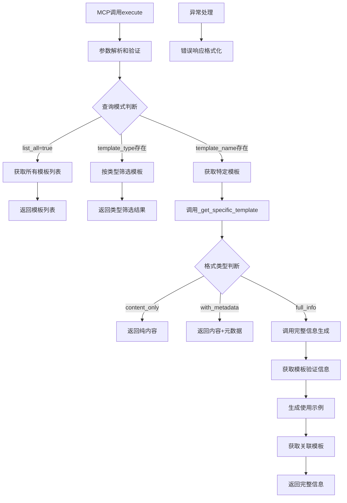

# 文件分析报告：src/mcp_tools/template_get.py

## 文件概述
CodeLens MCP协议的template_get工具核心实现，专门为Claude Code提供标准化的文档模板获取功能。该工具作为模板服务的对外接口，支持多种查询模式、格式化输出和丰富的元数据信息，确保文档生成的标准化和一致性。集成TemplateService，提供完整的模板资源服务能力。

## 代码结构分析

### 导入依赖
- **系统模块**: `os, sys` - 系统操作和路径管理
- **命令行处理**: `argparse` - 命令行参数解析
- **数据处理**: `json` - JSON格式处理
- **日志系统**: `logging` - 标准Python日志记录
- **类型注解**: `typing.Dict, Any, List` - 类型提示支持
- **模板服务**: `templates.document_templates.TemplateService` - 核心模板服务

### 全局变量和常量
- **路径配置**: sys.path动态添加父目录，确保模块导入
- **工具标识**: tool_name="template_get", description - MCP工具基本信息

### 配置和设置
- **MCP工具配置**: 标准化的inputSchema定义，支持4个参数
- **模板名称枚举**: ["file_summary", "module_analysis", "architecture", "project_readme"]
- **模板类型枚举**: ["file_level", "module_level", "architecture_level", "project_level"]
- **格式类型枚举**: ["content_only", "with_metadata", "full_info"]

## 函数详细分析

### 函数概览表
| 函数名 | 参数 | 返回值 | 功能描述 |
|--------|------|--------|----------|
| `__init__` | self | None | 初始化template_get工具，创建模板服务实例 |
| `get_tool_definition` | self | Dict[str, Any] | 获取MCP工具的完整定义 |
| `execute` | self, arguments | Dict[str, Any] | 执行模板获取逻辑的核心方法 |
| `_get_specific_template` | self, template_name, format_type | Dict[str, Any] | 获取特定模板的详细信息 |
| `_generate_usage_example` | self, template_name | Dict[str, Any] | 生成模板使用示例和变量说明 |
| `_get_related_templates` | self, template_name | List[str] | 获取相关模板列表 |
| `_success_response` | self, data | Dict[str, Any] | 构建成功响应格式 |
| `_error_response` | self, message | Dict[str, Any] | 构建错误响应格式 |
| `create_mcp_tool` | 无参数 | TemplateGetTool | 工厂函数，创建工具实例 |
| `main` | 无参数 | None | 命令行测试接口 |

### 函数详细说明

**`__init__(self)`**
- 初始化工具名称和描述信息
- 创建TemplateService实例用于模板操作
- 设置日志记录器，组件标识为'template_get'
- 建立工具的基本运行环境

**`get_tool_definition(self)`**
- 返回符合MCP协议的工具定义结构
- 定义复杂的inputSchema，支持多种查询模式
- 使用anyOf逻辑支持三种查询方式：按名称、按类型、列出全部
- 提供详细的参数类型、枚举值和描述信息

**`execute(self, arguments)`**
- MCP协议的标准执行入口，支持多种查询模式
- 解析和验证输入参数，提供默认值处理
- 根据参数类型路由到不同的处理逻辑
- 支持列出所有模板、按类型筛选、获取特定模板三种模式

**`_get_specific_template(self, template_name, format_type)`**
- 调用TemplateService获取模板内容和元数据
- 根据格式要求返回不同详细程度的信息
- content_only模式只返回模板内容
- with_metadata模式包含元数据信息
- full_info模式提供完整信息，包含验证、示例和关联模板

**`_generate_usage_example(self, template_name)`**
- 为4种核心模板类型提供详细的使用示例
- 包含模板描述、典型用途和示例变量
- 为每种模板提供具体的变量示例值
- 提供通用模板的兜底处理

**`_get_related_templates(self, template_name)`**
- 定义模板间的关联关系映射
- 支持文档生成的工作流程导航
- 从文件摘要→模块分析→架构→项目README的关联链

## 类详细分析

### 类概览表
| 类名 | 继承关系 | 主要职责 | 实例方法数量 |
|------|----------|----------|--------------|
| `TemplateGetTool` | 无继承 | MCP协议template_get工具实现 | 8个 |

### 类详细说明

**`TemplateGetTool`**
- **设计目的**: 实现MCP协议的template_get工具功能
- **核心职责**: 模板查询、格式化输出、元数据提供、使用示例生成
- **实例属性**: tool_name、description、template_service、logger
- **查询能力**: 支持按名称、按类型、列出全部三种查询模式
- **输出格式**: 支持content_only、with_metadata、full_info三种输出级别
- **扩展性**: 易于添加新模板类型和格式支持

## 函数调用流程图

## 变量作用域分析
- **模块作用域**: 导入的模块、路径配置
- **类作用域**: TemplateGetTool类定义和方法
- **实例作用域**: tool_name、description、template_service、logger
- **方法作用域**: 各方法内的局部变量，如arguments、template_info等

## 函数依赖关系
- `__init__` → `TemplateService()` 模板服务初始化
- `execute` → `_get_specific_template` 特定模板获取
- `_get_specific_template` → `template_service.get_template_content` 内容获取
- `_get_specific_template` → `_generate_usage_example` 示例生成
- `_get_specific_template` → `_get_related_templates` 关联查询
- `main` → `create_mcp_tool` → `execute` 命令行调用链
- 响应方法 → `_success_response` / `_error_response` 格式化