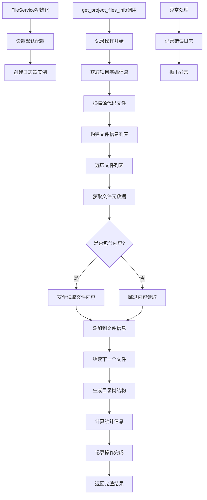

# 文件分析报告：src/services/file_service.py

## 文件概述
CodeLens文件服务的核心实现，为Claude Code提供完整的项目文件信息、元数据提取和目录树生成功能。该服务作为文件系统操作的专业封装，支持智能文件扫描、安全文件读取、结构化元数据提取，并集成企业级日志系统，确保操作的可追踪性和性能监控。

## 代码结构分析

### 导入依赖
- **系统模块**: `os` - 文件系统基础操作
- **时间模块**: `time, datetime` - 性能测量和时间戳处理
- **路径操作**: `pathlib.Path` - 现代Python路径操作
- **类型注解**: `typing.List, Dict, Optional, Any` - 类型提示支持
- **日志系统**: `..logging.get_logger` - 企业级日志集成，含DummyLogger降级机制

### 全局变量和常量
- **default_extensions**: ['.py'] - 默认扫描的文件扩展名
- **default_excludes**: 排除目录列表，包含'__pycache__', '.git', 'node_modules'等
- **DummyLogger类**: 日志系统不可用时的降级处理类

### 配置和设置
- **文件扫描配置**: 支持自定义扩展名和排除模式
- **安全读取配置**: 默认50KB文件大小限制
- **目录树配置**: 默认3层深度限制
- **日志集成**: 完整的操作开始/结束日志记录

## 函数详细分析

### 函数概览表
| 函数名 | 参数 | 返回值 | 功能描述 |
|--------|------|--------|----------|
| `__init__` | self | None | 初始化文件服务，设置默认配置和日志器 |
| `scan_source_files` | project_path, extensions, exclude_patterns | List[str] | 智能扫描项目源代码文件 |
| `read_file_safe` | file_path, max_size | Optional[str] | 安全读取文件内容，带大小限制 |
| `get_relative_path` | file_path, project_path | str | 获取相对于项目根目录的路径 |
| `scan_directory_structure` | project_path, max_depth | Dict | 扫描目录结构，返回层次化信息 |
| `get_project_info` | project_path | Dict | 获取项目基础信息，包含主文件和配置文件 |
| `_should_exclude` | path, exclude_patterns | bool | 检查路径是否应该被排除 |
| `create_file_summary_path` | file_path, project_path, docs_path | str | 创建文件摘要的输出路径 |
| `get_file_metadata` | file_path | Optional[Dict[str, Any]] | 获取文件详细元数据信息 |
| `get_directory_tree` | project_path, max_depth | Dict[str, Any] | 获取优化的目录树结构 |
| `get_project_files_info` | project_path, include_content, extensions, exclude_patterns, max_file_size | Dict[str, Any] | 核心方法：获取项目文件完整结构化信息 |

### 函数详细说明

**`__init__(self)`**
- 初始化FileService实例
- 设置默认文件扩展名和排除模式
- 创建组件日志器实例，支持操作追踪
- 建立基础配置和运行环境

**`scan_source_files(self, project_path, extensions, exclude_patterns)`**
- 使用glob模式扫描指定扩展名的文件
- 应用排除规则过滤不需要的文件和目录
- 返回排序后的文件路径列表
- 支持递归扫描和模式匹配

**`read_file_safe(self, file_path, max_size)`**
- 检查文件存在性和大小限制
- 使用UTF-8编码安全读取文件内容
- 提供异常安全处理，避免读取失败中断程序
- 对超大文件进行警告提示

**`get_project_files_info(self, project_path, include_content, extensions, exclude_patterns, max_file_size)`**
- 核心聚合方法，提供完整的项目文件信息
- 集成项目信息、文件扫描、元数据提取和目录树生成
- 包含详细的统计分析：文件数量、大小、类型分布
- 完整的操作日志记录，包含性能监控和错误追踪
- 支持内容包含/排除的灵活配置

**`get_directory_tree(self, project_path, max_depth)`**
- 专为Claude Code优化的目录树结构生成
- 包含文件大小、修改时间等元数据
- 支持深度控制，避免过深的目录结构
- 提供子节点计数和层次化组织

## 类详细分析

### 类概览表
| 类名 | 继承关系 | 主要职责 | 实例方法数量 |
|------|----------|----------|--------------|
| `FileService` | 无继承 | 文件系统操作服务 | 11个 |
| `DummyLogger` | 无继承 | 日志系统降级处理 | 7个 |

### 类详细说明

**`FileService`**
- **设计目的**: 为Claude Code提供完整的文件系统操作服务
- **核心职责**: 文件扫描、内容读取、元数据提取、目录结构分析
- **实例属性**: default_extensions、default_excludes、logger
- **特色功能**: 企业级日志集成、性能监控、异常安全处理
- **API设计**: 方法命名清晰，参数灵活，返回值结构化

**`DummyLogger`**
- **设计目的**: 日志系统不可用时的降级处理
- **核心职责**: 提供空实现，避免日志调用异常
- **降级策略**: 所有方法返回空或默认值
- **兼容性**: 与真实日志器接口完全兼容

## 函数调用流程图

## 变量作用域分析
- **模块作用域**: 导入的模块、DummyLogger类定义
- **类作用域**: FileService方法定义、默认配置常量
- **实例作用域**: default_extensions、default_excludes、logger实例
- **方法作用域**: 各方法内的局部变量，如文件路径、统计信息等

## 函数依赖关系
- `__init__` → `get_logger` 日志器创建
- `get_project_files_info` → `get_project_info` → `scan_source_files` → `get_file_metadata`
- `scan_source_files` → `_should_exclude` 文件过滤
- `read_file_safe` → `Path` 路径操作
- `get_directory_tree` → `_should_exclude` 目录过滤
- 所有方法 → `logger` 日志记录
- 异常处理 → `DummyLogger` 降级机制