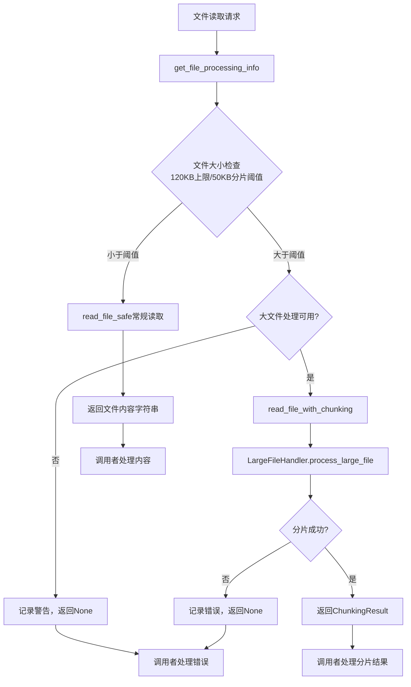
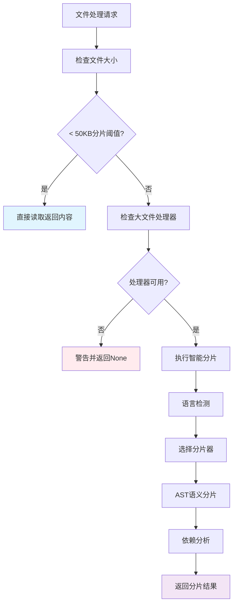
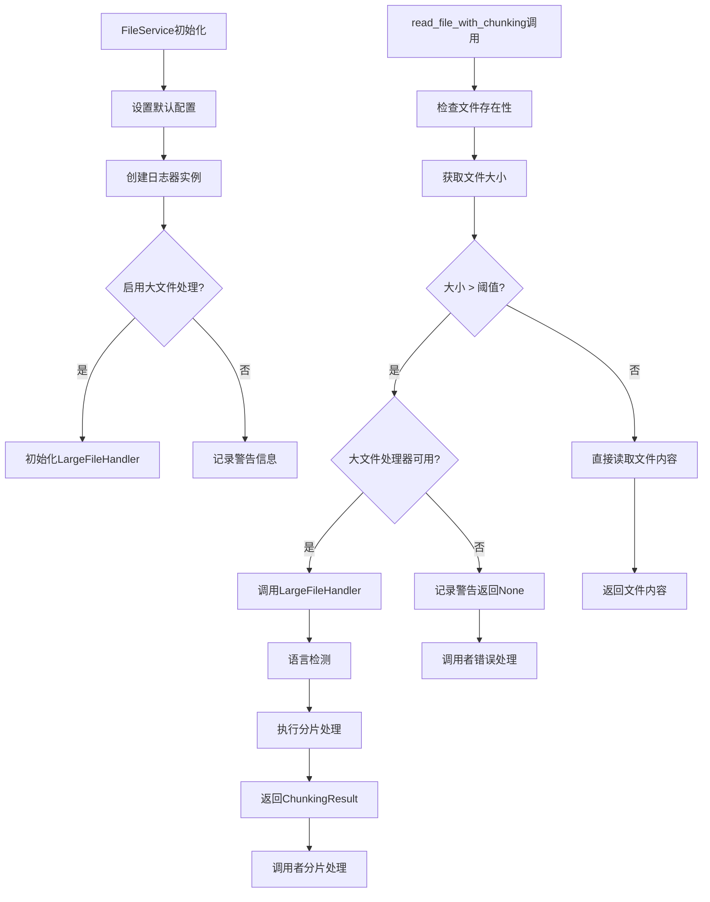

# 文件分析报告：src/services/file_service.py

## 文件概述
CodeLens文件服务的核心实现，为Claude Code提供完整的项目文件信息、元数据提取和目录树生成功能。**集成doc_scan功能和大文件分片处理**，支持超大代码文件的智能处理。该服务作为文件系统操作的专业封装，支持智能文件扫描、安全文件读取、结构化元数据提取，集成企业级日志系统和大文件分片系统，确保操作的可追踪性、性能监控和大文件处理能力。作为3阶段文档生成架构的基础服务，直接支持文件层→架构层→项目层的文档生成流程。

## 代码结构分析

### 导入依赖
- **系统模块**: `os` - 文件系统基础操作
- **时间模块**: `time, datetime` - 性能测量和时间戳处理
- **路径操作**: `pathlib.Path` - 现代Python路径操作
- **类型注解**: `typing.List, Dict, Optional, Any, Union, Tuple` - 完整类型提示支持
- **日志系统**: `..logging.get_logger` - 企业级日志集成，含DummyLogger降级机制
- **🔥新增**: **大文件处理**: `.large_file_handler.LargeFileHandler, ChunkingResult, CodeChunk` - 大文件分片处理集成

### 全局变量和常量
- **default_extensions**: ['.py'] - 默认扫描的文件扩展名
- **default_excludes**: 排除目录列表，包含'__pycache__', '.git', 'node_modules'等
- **DummyLogger类**: 日志系统不可用时的降级处理类
- **🔥新增**: **HAS_LARGE_FILE_HANDLER**: 大文件处理器可用性标志

### 配置和设置
- **文件扫描配置**: 支持自定义扩展名和排除模式
- **安全读取配置**: 默认120KB文件处理上限，50KB分片阈值
- **目录树配置**: 默认3层深度限制
- **日志集成**: 完整的操作开始/结束日志记录
- **🔥新增**: **大文件处理配置**: 支持启用/禁用大文件分片功能

## 函数详细分析

### 函数概览表
| 函数名 | 参数 | 返回值 | 功能描述 |
|--------|------|--------|----------|
| `__init__` | self, enable_large_file_chunking | None | 🔥更新：初始化文件服务，支持大文件分片配置 |
| `scan_source_files` | project_path, extensions, exclude_patterns | List[str] | 智能扫描项目源代码文件 |
| `read_file_safe` | file_path, max_size | Optional[str] | 🔥更新：安全读取文件内容，改进日志记录 |
| `🔥新增 read_file_with_chunking` | file_path, max_size | Union[str, ChunkingResult, None] | **核心新功能**：智能文件读取，大文件自动分片 |
| `🔥新增 should_chunk_file` | file_path, max_size | bool | 判断文件是否需要分片处理 |
| `🔥新增 get_file_processing_info` | file_path, max_size | Dict[str, Any] | 获取文件处理详细信息和建议 |
| `get_relative_path` | file_path, project_path | str | 获取相对于项目根目录的路径 |
| `scan_directory_structure` | project_path, max_depth | Dict | 扫描目录结构，返回层次化信息 |
| `get_project_info` | project_path | Dict | 获取项目基础信息，包含主文件和配置文件 |
| `_should_exclude` | path, exclude_patterns | bool | 检查路径是否应该被排除 |
| `create_file_summary_path` | file_path, project_path, docs_path | str | 创建文件摘要的输出路径 |
| `get_file_metadata` | file_path | Optional[Dict[str, Any]] | 获取文件详细元数据信息 |
| `get_directory_tree` | project_path, max_depth | Dict[str, Any] | 获取优化的目录树结构 |
| `get_project_files_info` | project_path, include_content, extensions, exclude_patterns, max_file_size | Dict[str, Any] | 核心方法：获取项目文件完整结构化信息 |

### 函数详细说明

**`__init__(self, enable_large_file_chunking: bool = True)` 🔥更新**
- **新增参数**: enable_large_file_chunking - 控制大文件分片功能
- 初始化FileService实例，集成大文件处理器
- 设置默认文件扩展名和排除模式
- 创建组件日志器实例，支持操作追踪
- **智能初始化**: 根据依赖可用性智能启用大文件处理
- **降级处理**: 依赖不可用时优雅降级并记录警告

**🔥新增 `read_file_with_chunking(self, file_path: str, max_size: int = 122880) -> Union[str, ChunkingResult, None]`**
- **核心新功能**: 智能文件读取，自动处理大文件分片
- **智能判断**: 小文件(<50KB)直接返回，50KB-120KB分片处理，>120KB跳过
- **透明处理**: 对调用者透明，根据文件大小自动选择处理策略
- **错误安全**: 分片失败时优雅降级，不中断正常流程
- **性能监控**: 详细的处理日志和性能记录
- **类型安全**: 返回类型明确，支持isinstance判断

**🔥新增 `should_chunk_file(self, file_path: str, max_size: int = 50000) -> bool`** (分片阈值)
- **快速判断**: 基于文件大小和处理器可用性快速判断
- **配置感知**: 考虑大文件处理功能的启用状态
- **阈值灵活**: 支持自定义大小阈值
- **委托处理**: 委托给专业的LargeFileHandler判断逻辑

**🔥新增 `get_file_processing_info(self, file_path: str, max_size: int = 50000) -> Dict[str, Any]`** (分片阈值)
- **详细分析**: 提供文件的完整处理信息和建议
- **语言检测**: 集成语言检测和分片器可用性检查
- **处理建议**: 明确的处理建议和能力说明
- **错误处理**: 文件不存在或访问错误的详细处理
- **信息丰富**: 文件大小、MB转换、处理能力等完整信息

**`read_file_safe(self, file_path: str, max_size: int = 122880) -> Optional[str]` 🔥更新**
- **改进日志**: 使用self.logger替代print，提高日志质量
- 检查文件存在性和大小限制
- 使用UTF-8编码安全读取文件内容
- **专业日志**: 错误和警告信息通过日志系统记录
- 提供异常安全处理，避免读取失败中断程序

**`get_project_files_info(self, project_path, include_content, extensions, exclude_patterns, max_file_size)`**
- 核心聚合方法，提供完整的项目文件信息
- 集成项目信息、文件扫描、元数据提取和目录树生成
- 包含详细的统计分析：文件数量、大小、类型分布
- **兼容性**: 与新的大文件处理系统完全兼容
- 完整的操作日志记录，包含性能监控和错误追踪

## 类详细分析

### 类概览表
| 类名 | 继承关系 | 主要职责 | 实例方法数量 |
|------|----------|----------|--------------|
| `FileService` | 无继承 | 文件系统操作服务 + 🔥大文件处理集成 | 14个 (新增3个) |
| `DummyLogger` | 无继承 | 日志系统降级处理 | 7个 |

### 类详细说明

**`FileService` 🔥重大更新**
- **设计升级**: 从单纯文件服务升级为智能文件处理服务
- **核心职责**: 文件扫描、内容读取、元数据提取、目录结构分析 + **大文件智能处理**
- **新增属性**: 
  - `enable_large_file_chunking` - 大文件分片功能开关
  - `large_file_handler` - 大文件处理器实例
- **智能处理**: 根据文件大小自动选择处理策略
- **向后兼容**: 完全兼容现有API，无破坏性变更
- **错误容错**: 大文件处理失败时优雅降级到常规处理

**`DummyLogger`**
- **设计目的**: 日志系统不可用时的降级处理
- **核心职责**: 提供空实现，避免日志调用异常
- **降级策略**: 所有方法返回空或默认值
- **兼容性**: 与真实日志器接口完全兼容

## 🔥大文件处理集成架构

### 双阈值处理策略 (v1.1.1.0)
- **分片阈值**: 50KB - 超过此大小启动分片处理
- **处理上限**: 120KB - 超过此大小完全跳过文件
- **处理范围**: 50KB-120KB之间的文件通过分片系统处理
- **兼容性**: 分片逻辑保持不变，仅扩展处理能力

### 架构图

### 处理流程图


### 智能处理策略


## 函数调用流程图


## 变量作用域分析
- **模块作用域**: 导入的模块、DummyLogger类定义、HAS_LARGE_FILE_HANDLER标志
- **类作用域**: FileService方法定义、默认配置常量
- **实例作用域**: 
  - 原有：default_extensions、default_excludes、logger实例
  - **新增**: enable_large_file_chunking、large_file_handler实例
- **方法作用域**: 各方法内的局部变量，如文件路径、统计信息、分片结果等

## 性能优化特性
- **智能路由**: 根据文件大小自动选择最优处理策略
- **内存效率**: 大文件分片处理避免全量内存加载
- **缓存友好**: 分片结果可被下游系统缓存利用
- **错误隔离**: 大文件处理失败不影响常规文件操作
- **懒加载**: 大文件处理器仅在需要时初始化

## 向后兼容性
- **API保持**: 所有原有公共方法签名保持不变
- **行为一致**: 原有功能的行为完全一致
- **优雅降级**: 大文件处理不可用时自动降级
- **透明集成**: 现有代码无需修改即可使用新功能
- **配置可选**: 可通过参数完全禁用新功能

## 错误处理增强
- **分层处理**: 不同层次的错误有不同的处理策略
- **日志完善**: 所有错误和警告通过日志系统记录
- **优雅降级**: 大文件处理失败时的多级降级机制
- **状态隔离**: 大文件处理错误不影响其他功能
- **用户友好**: 明确的错误信息和处理建议

## 函数依赖关系
- `__init__` → `get_logger` → `LargeFileHandler` 初始化链
- `read_file_with_chunking` → `should_chunk_file` → `large_file_handler.process_large_file` 大文件处理链
- `get_file_processing_info` → `large_file_handler.should_chunk_file` → `large_file_handler.detect_language` 信息获取链
- `get_project_files_info` → `get_project_info` → `scan_source_files` → `get_file_metadata` 原有处理链
- 所有方法 → `logger` 日志记录链
- 错误处理 → `DummyLogger` 降级机制链

## 🔥新功能使用示例

### 基本使用
```python
# 启用大文件处理（默认）
file_service = FileService(enable_large_file_chunking=True)

# 智能文件读取
result = file_service.read_file_with_chunking("large_file.py")

if isinstance(result, str):
    print("普通文件内容", len(result))
elif isinstance(result, ChunkingResult):
    print(f"大文件分片处理: {result.total_chunks} 个分片 (50KB-120KB自动分片)")
else:
    print("文件读取失败")
```

### 处理信息查询
```python
# 获取文件处理建议
info = file_service.get_file_processing_info("some_file.py")
print(f"需要分片: {info['needs_chunking']}")
print(f"支持的语言: {info.get('detected_language')}")
print(f"有可用分片器: {info.get('has_chunker')}")
```

### 兼容性检查
```python
# 检查大文件处理能力
if file_service.enable_large_file_chunking:
    print("大文件处理可用")
else:
    print("仅支持常规文件处理")
```