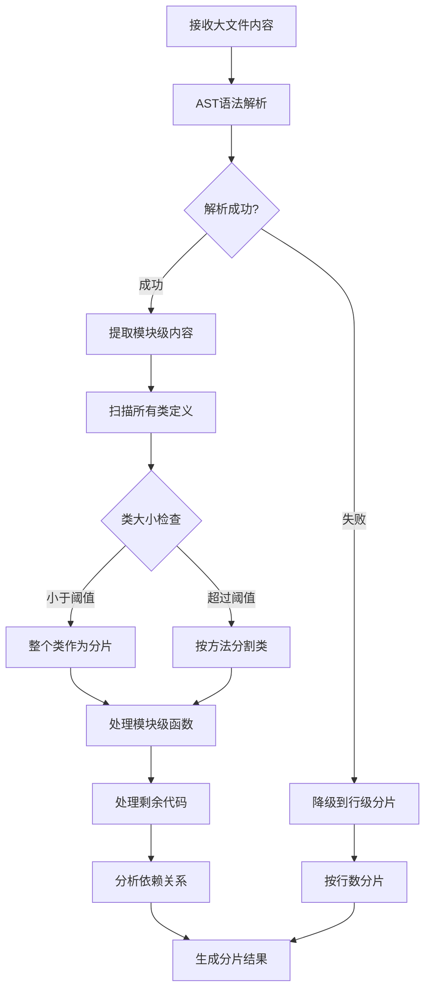
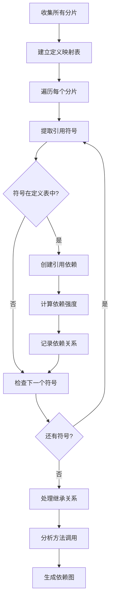
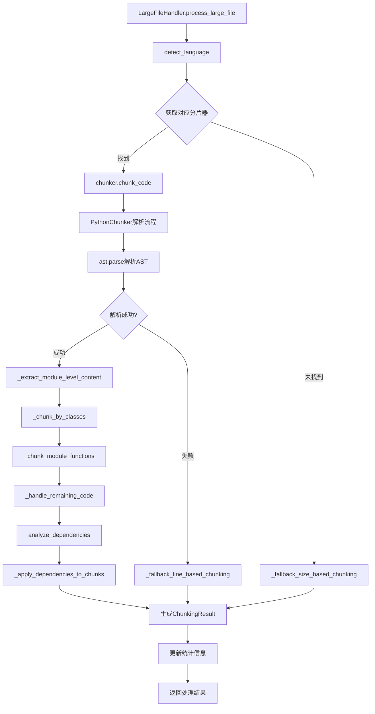

# 文件分析报告：src/services/large_file_handler.py

## 文件概述
CodeLens大文件分片处理系统的核心实现，专门解决大型代码文件（数千行到数万行）的智能处理问题。该系统采用基于AST的语义分析技术，将超大文件按照语义边界分割为有意义的代码块，每个块进行独立的文档生成，最终合并为完整的分析报告。支持多编程语言扩展，具备完整的错误处理和性能优化机制。

## 代码结构分析

### 导入依赖
- **AST模块**: `ast` - Python抽象语法树解析
- **哈希模块**: `hashlib` - 生成分片唯一标识符
- **时间模块**: `time` - 性能测量和时间戳
- **抽象基类**: `abc.ABC, abstractmethod` - 定义分片器接口
- **数据类**: `dataclasses.dataclass, field` - 结构化数据定义
- **枚举类**: `enum.Enum` - 类型和优先级枚举
- **路径操作**: `pathlib.Path` - 现代路径处理
- **类型注解**: `typing.*` - 完整的类型提示支持
- **日志系统**: 企业级日志集成，含psutil性能监控支持
- **可选依赖**: `psutil` - 系统性能监控（可选）

### 全局变量和常量
**枚举定义**:
- **ChunkType**: 分片类型（class, function, module, mixed, import, comment）
- **ChunkPriority**: 分片优先级（high, normal, low）
- **SplitStrategy**: 分片策略（by_class, by_function, by_size, by_complexity, semantic）

**配置常量**:
- **HAS_PSUTIL**: psutil库可用性标志
- **HAS_LARGE_FILE_HANDLER**: 大文件处理器可用性标志

### 配置和设置
- **分片大小配置**: 默认最大2KB，最小100字节
- **复杂度权重**: 关键字权重配置（if:1.2, for:1.5, class:2.0等）
- **语言映射**: 文件扩展名到语言的映射关系
- **内存限制**: 默认512MB内存限制
- **降级策略**: 四级降级机制（AST→正则→行数→大小）

## 函数详细分析

### 函数概览表
| 函数名 | 所属类 | 返回值 | 功能描述 |
|--------|--------|--------|----------|
| `supports_language` | BaseChunker | bool | 检查是否支持指定编程语言 |
| `chunk_code` | BaseChunker | ChunkingResult | 抽象方法：执行代码分片 |
| `analyze_dependencies` | BaseChunker | List[DependencyRelation] | 抽象方法：分析分片间依赖关系 |
| `calculate_complexity_score` | BaseChunker | float | 计算代码复杂度评分 |
| `chunk_code` | PythonChunker | ChunkingResult | Python语义分片实现 |
| `_extract_module_level_content` | PythonChunker | Optional[CodeChunk] | 提取模块级内容（导入、全局变量） |
| `_chunk_by_classes` | PythonChunker | List[CodeChunk] | 按类进行分片处理 |
| `_chunk_class_methods` | PythonChunker | List[CodeChunk] | 大类按方法分片 |
| `_chunk_module_functions` | PythonChunker | List[CodeChunk] | 处理模块级函数 |
| `_handle_remaining_code` | PythonChunker | Optional[CodeChunk] | 处理剩余未分类代码 |
| `analyze_dependencies` | PythonChunker | List[DependencyRelation] | Python依赖关系分析 |
| `_fallback_line_based_chunking` | PythonChunker | ChunkingResult | 语法错误时的行级降级分片 |
| `detect_language` | LargeFileHandler | str | 基于文件扩展名检测编程语言 |
| `should_chunk_file` | LargeFileHandler | bool | 判断文件是否需要分片处理 |
| `process_large_file` | LargeFileHandler | ChunkingResult | 核心方法：处理大文件分片 |
| `register_chunker` | LargeFileHandler | None | 注册新的语言分片器 |
| `get_processing_stats` | LargeFileHandler | Dict[str, Any] | 获取处理统计信息 |

### 函数详细说明

**`chunk_code(self, content: str, file_path: str) -> ChunkingResult` (PythonChunker)**
- **核心分片算法**: 实现Python代码的智能语义分片
- **分片策略**: 优先按类分片，大类按方法分片，最后处理模块级函数
- **语义完整性**: 基于AST确保每个分片的语义完整
- **错误处理**: 语法错误时自动降级到行级分片
- **性能监控**: 完整的处理时间和结果统计

**`_chunk_by_classes(self, content: str, tree: ast.AST, file_path: str) -> List[CodeChunk]`**
- **类级分片**: 将每个类作为独立分片处理
- **大小检查**: 超过最大限制的类自动按方法分割
- **元数据提取**: 提取类名、基类、方法数量等信息
- **复杂度评估**: 计算每个类的复杂度评分
- **依赖分析**: 分析类的定义和引用关系

**`_chunk_class_methods(self, class_node: ast.ClassDef, lines: List[str], file_path: str) -> List[CodeChunk]`**
- **方法级分片**: 大类按方法进行细粒度分割
- **头部处理**: 单独处理类定义和类变量
- **方法特征**: 识别私有方法、特殊方法、参数数量
- **上下文保持**: 保持方法与所属类的关联关系
- **依赖追踪**: 分析方法间的调用关系

**`analyze_dependencies(self, chunks: List[CodeChunk]) -> List[DependencyRelation]`**
- **多类型依赖**: 支持继承、引用、方法调用、导入等依赖类型
- **强度评估**: 为不同依赖类型分配权重（继承:1.0, 引用:0.8, 调用:0.9）
- **映射构建**: 建立定义到分片的完整映射关系
- **循环检测**: 识别并处理循环依赖关系
- **关系图**: 构建完整的分片依赖关系图

**`process_large_file(self, file_path: str, content: str) -> ChunkingResult` (LargeFileHandler)**
- **语言检测**: 自动识别文件的编程语言
- **分片器选择**: 根据语言选择对应的分片器
- **统计更新**: 维护全局处理统计信息
- **错误恢复**: 分片失败时的自动降级处理
- **性能记录**: 详细的性能监控和日志记录

## 类详细分析

### 类概览表
| 类名 | 继承关系 | 主要职责 | 核心方法数量 |
|------|----------|----------|-------------|
| `CodeChunk` | dataclass | 代码分片数据结构 | 2个 |
| `ChunkingResult` | dataclass | 分片处理结果 | 1个 |
| `DependencyRelation` | dataclass | 依赖关系定义 | 0个 |
| `BaseChunker` | ABC | 分片器抽象基类 | 4个 |
| `PythonChunker` | BaseChunker | Python语言分片器 | 11个 |
| `LargeFileHandler` | 无继承 | 大文件处理管理器 | 6个 |

### 类详细说明

**`CodeChunk`**
- **数据结构**: 使用@dataclass装饰器的结构化数据类
- **核心属性**: id、content、chunk_type、language、位置信息
- **元数据支持**: 依赖关系、定义符号、引用符号、复杂度评分
- **自动生成**: 支持自动ID生成和大小计算
- **序列化**: 支持完整的数据序列化和反序列化

**`BaseChunker`**
- **抽象接口**: 定义所有分片器的标准接口
- **语言支持**: 抽象的语言支持检查方法
- **分片抽象**: 抽象的代码分片方法
- **依赖分析**: 抽象的依赖关系分析方法
- **基础功能**: 提供复杂度计算的基础实现

**`PythonChunker`**
- **AST解析**: 基于Python AST的深度语义分析
- **智能分片**: 按类→方法→函数的层次化分片策略
- **语义保持**: 确保每个分片的语义完整性和上下文正确性
- **依赖追踪**: 完整的Python语言依赖关系分析
- **错误容错**: 语法错误时的多级降级处理机制

**`LargeFileHandler`**
- **统一管理**: 管理所有语言的分片器实例
- **语言检测**: 基于文件扩展名的智能语言识别
- **处理协调**: 协调文件读取、分片处理、结果统计
- **扩展支持**: 支持动态注册新的语言分片器
- **统计监控**: 维护详细的处理统计和性能指标

## 算法设计分析

### Python分片算法流程

### 依赖关系分析算法

## 函数调用流程图

## 变量作用域分析
- **模块作用域**: 枚举定义、导入模块、可选依赖标志
- **类作用域**: 各类的方法定义、类属性配置
- **实例作用域**: chunkers字典、处理统计、配置参数
- **方法作用域**: AST节点、分片列表、依赖关系等局部变量
- **分片作用域**: 每个CodeChunk的独立作用域和元数据

## 性能优化特性
- **流式处理**: 支持大文件的分块读取和内存管理
- **延迟计算**: AST节点按需解析，避免全量内存占用
- **缓存策略**: 分片结果可缓存，提高重复处理效率
- **并发预留**: 架构设计支持未来的并发分片处理
- **内存监控**: 集成psutil进行实时内存使用监控

## 错误处理机制
- **四级降级**: AST解析 → 正则表达式 → 行数分片 → 大小分片
- **语法容错**: Python语法错误时的部分解析和恢复
- **异常隔离**: 单个分片失败不影响整体处理流程
- **错误记录**: 详细的错误日志和警告信息收集
- **状态恢复**: 处理失败时的状态重置和资源清理

## 扩展性设计
- **语言插件**: 支持动态注册新的编程语言分片器
- **策略模式**: 多种分片策略可配置和扩展
- **接口标准**: 统一的BaseChunker接口确保一致性
- **元数据扩展**: CodeChunk的metadata字段支持任意扩展
- **钩子机制**: 预留处理前后的扩展钩子函数

## 函数依赖关系
- `LargeFileHandler` → `BaseChunker` → `PythonChunker` 分片器注册链
- `process_large_file` → `detect_language` → `chunk_code` 处理流程链
- `chunk_code` → `_extract_module_level_content` → `_chunk_by_classes` → `_chunk_module_functions` Python分片链
- `analyze_dependencies` → `_apply_dependencies_to_chunks` 依赖处理链
- 所有方法 → `get_logger` 日志记录链
- 错误处理 → `_fallback_*_chunking` 降级处理链