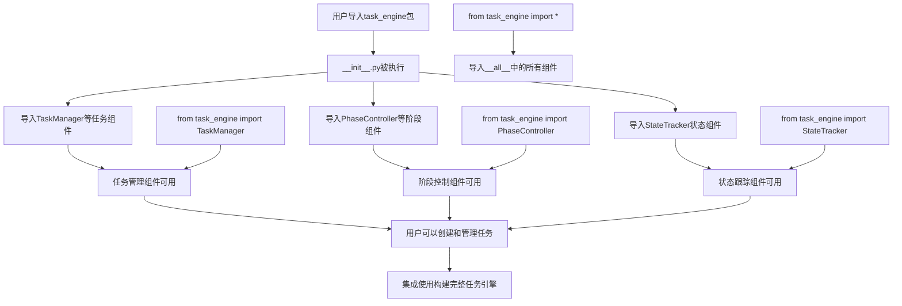

# 文件分析报告：__init__.py (task_engine)

## 文件概述
task_engine包的__init__.py文件是任务引擎模块的入口点，负责定义包的公共接口和导出核心组件。该文件通过简洁的导入和__all__声明，为用户提供了清晰的API接口，使得任务管理功能可以通过统一的包导入方式使用。文件遵循Python包管理最佳实践，确保模块的正确初始化和组件访问。任务引擎模块提供智能化的文档生成任务管理功能，包括任务管理、阶段控制和状态跟踪。

## 代码结构分析

### 导入依赖
```python
from .task_manager import TaskManager, Task, TaskStatus, TaskType
from .phase_controller import PhaseController, Phase, PhaseStatus
from .state_tracker import StateTracker
```

### 全局变量和常量
```python
__all__ = [
    'TaskManager', 'Task', 'TaskStatus', 'TaskType',
    'PhaseController', 'Phase', 'PhaseStatus', 
    'StateTracker'
]
```

### 配置和设置
- **包级导入**: 使用相对导入从同级模块导入核心组件
- **公共接口定义**: 通过__all__明确定义包的公共API
- **模块暴露**: 将任务管理相关的类和枚举暴露给包用户

## 函数详细分析

### 函数概览表
该文件没有定义任何函数，只包含导入语句和模块级配置。

### 函数详细说明
无函数定义，所有功能通过导入语句和模块级声明实现。

## 类详细分析

### 类概览表
该文件没有定义类，而是从子模块导入类并重新导出。

| 导入的类名 | 源模块 | 主要职责 | 功能描述 |
|------------|--------|----------|----------|
| TaskManager | task_manager | 任务生命周期管理 | 创建、调度、执行文档生成任务 |
| Task | task_manager | 任务实体定义 | 单个任务的数据结构和状态 |
| TaskStatus | task_manager | 任务状态枚举 | 定义任务的各种状态 |
| TaskType | task_manager | 任务类型枚举 | 定义不同类型的文档生成任务 |
| PhaseController | phase_controller | 阶段流程控制 | 管理五个文档生成阶段 |
| Phase | phase_controller | 阶段定义 | 阶段实体和配置 |
| PhaseStatus | phase_controller | 阶段状态枚举 | 定义阶段的各种状态 |
| StateTracker | state_tracker | 状态跟踪管理 | 跟踪任务执行状态和进度 |

### 类详细说明

#### 导入的核心组件

**TaskManager, Task, TaskStatus, TaskType**
- **来源**: `task_manager`模块
- **作用**: 任务管理的核心组件，负责文档生成任务的完整生命周期
- **导出原因**: 作为任务引擎的主要功能，用户需要通过这些类来创建和管理文档生成任务

**PhaseController, Phase, PhaseStatus**
- **来源**: `phase_controller`模块  
- **作用**: 阶段控制组件，管理文档生成的五个阶段流程
- **导出原因**: 提供阶段级别的流程控制，用户可以通过这些类管理文档生成的整体流程

**StateTracker**
- **来源**: `state_tracker`模块
- **作用**: 状态跟踪组件，监控任务执行状态和进度
- **导出原因**: 支持实时状态监控和进度跟踪，为用户提供任务执行的可见性

## 函数调用流程图


## 变量作用域分析

### 模块级作用域
- **导入的类**:
  - `TaskManager`: 任务管理器类对象
  - `Task`: 任务实体类对象
  - `TaskStatus`: 任务状态枚举类对象
  - `TaskType`: 任务类型枚举类对象
  - `PhaseController`: 阶段控制器类对象
  - `Phase`: 阶段实体类对象
  - `PhaseStatus`: 阶段状态枚举类对象
  - `StateTracker`: 状态跟踪器类对象
- **模块属性**:
  - `__all__`: 列表类型，定义包的公共接口

### 导入作用域特点
- **相对导入**: 使用点号(.)表示相对导入，确保从同一包内导入
- **命名空间管理**: 导入的类直接进入当前模块的命名空间
- **公共接口控制**: 通过__all__控制`from task_engine import *`的行为

### 生命周期
- **模块加载时**: 执行所有导入语句，类对象被加载到当前命名空间
- **运行时访问**: 用户可以通过`task_engine.ClassName`或直接导入方式访问
- **内存管理**: 类对象的生命周期与模块对象相同

## 函数依赖关系

### 模块内部依赖
1. **__init__.py -> task_manager**: 依赖TaskManager、Task、TaskStatus、TaskType的定义
2. **__init__.py -> phase_controller**: 依赖PhaseController、Phase、PhaseStatus的定义  
3. **__init__.py -> state_tracker**: 依赖StateTracker类的定义

### 包级依赖结构
```
task_engine/
├── __init__.py              # 包入口，导入并暴露核心组件
├── task_manager.py          # 任务管理核心
├── phase_controller.py      # 阶段控制器  
└── state_tracker.py         # 状态跟踪器
```

### 外部依赖传递
- **间接依赖**: 通过导入的类，间接依赖于各子模块的外部依赖
- **依赖隔离**: __init__.py本身不直接依赖外部库，依赖关系通过子模块管理
- **导入链**: 用户导入 -> __init__.py -> 子模块 -> 外部依赖

### 使用模式
1. **完整导入**: `import task_engine` - 通过点记法访问组件
2. **选择性导入**: `from task_engine import TaskManager` - 直接导入特定组件
3. **批量导入**: `from task_engine import *` - 导入__all__中定义的所有组件
4. **分层使用**: 任务管理、阶段控制、状态跟踪三层协同工作

### API设计特点
- **完整性**: 覆盖任务引擎的所有核心功能组件
- **层次性**: 任务、阶段、状态三个层次清晰分离
- **一致性**: 所有组件都遵循相同的设计模式和接口规范
- **灵活性**: 支持整体使用或组件独立使用的多种模式