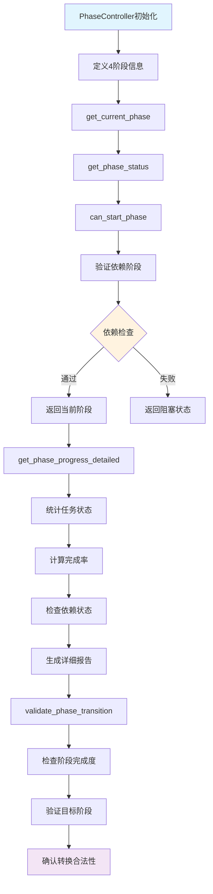
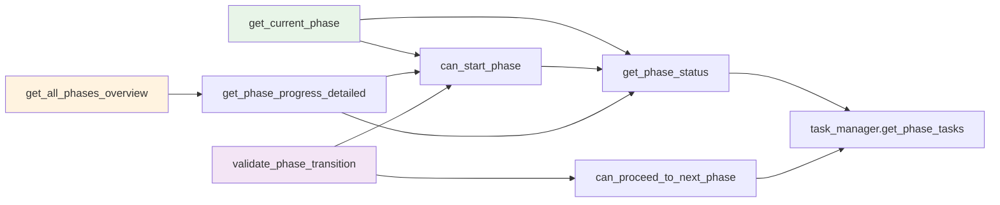

# 文件分析报告：src/task_engine/phase_controller.py

## 文件概述

**文件路径**: `/src/task_engine/phase_controller.py`  
**文件类型**: Python模块  
**主要作用**: 管理CodeLens文档生成系统的4阶段流程控制器  
**代码行数**: 284行  
**复杂度**: 高

这个文件是CodeLens任务引擎的核心组件，负责管理文档生成的4个阶段（项目扫描、文件分析、架构分析、项目文档）的流程控制。它提供了阶段状态管理、依赖关系验证、进度追踪和阶段转换控制等关键功能。

## 代码结构分析

### 导入依赖
```python
from enum import Enum  # 枚举类型支持
from typing import Dict, List, Optional, Any, Tuple  # 类型注解
from datetime import datetime  # 时间处理
from dataclasses import dataclass  # 数据类装饰器
from .task_manager import TaskManager, TaskStatus  # 任务管理器和状态
```

### 全局变量和常量
- **PhaseStatus**: 阶段状态枚举（NOT_STARTED, IN_PROGRESS, COMPLETED, BLOCKED）
- **Phase**: 4个阶段枚举（PHASE_1_SCAN, PHASE_2_FILES, PHASE_3_ARCHITECTURE, PHASE_4_PROJECT）

### 配置和设置
- **phases_info**: 各阶段配置字典，包含依赖关系、预期任务类型、最小完成率等
- **min_completion_rate**: 各阶段默认需要100%完成才能进入下一阶段

## 函数详细分析

### 函数概览表
| 函数名 | 参数数量 | 返回类型 | 主要功能 |
|--------|----------|----------|----------|
| get_phase_status | 1 | PhaseStatus | 获取指定阶段的当前状态 |
| can_start_phase | 1 | Tuple[bool, str] | 检查是否可以开始指定阶段 |
| get_current_phase | 0 | Optional[Phase] | 获取当前应该执行的阶段 |
| get_next_phase | 1 | Optional[Phase] | 获取指定阶段的下一个阶段 |
| get_phase_progress_detailed | 1 | Dict[str, Any] | 获取阶段的详细进度信息 |
| get_all_phases_overview | 0 | Dict[str, Any] | 获取所有阶段的概览信息 |
| can_proceed_to_next_phase | 1 | Tuple[bool, str] | 检查是否可以进入下一阶段 |
| validate_phase_transition | 2 | Tuple[bool, str] | 验证阶段转换是否合法 |

### 函数详细说明

**get_phase_status(phase: Phase)**
- 分析指定阶段的任务完成情况
- 根据任务状态统计返回阶段整体状态
- 核心逻辑：无任务=未开始，全完成=已完成，其他=进行中

**can_start_phase(phase: Phase)**
- 验证依赖阶段是否完成
- 检查当前阶段是否已完成
- 返回布尔值和详细消息

**get_phase_progress_detailed(phase: Phase)**
- 生成详细的阶段进度报告
- 包含任务统计、完成率、依赖状态等
- 提供前端展示所需的完整数据结构

## 类详细分析

### 类概览表
| 类名 | 继承关系 | 主要属性 | 主要方法 | 核心功能 |
|------|----------|----------|----------|----------|
| PhaseStatus | Enum | NOT_STARTED, IN_PROGRESS, COMPLETED, BLOCKED | - | 阶段状态枚举 |
| Phase | Enum | PHASE_1-4 | - | 4阶段定义 |
| PhaseInfo | dataclass | phase, name, description, dependencies, expected_tasks | - | 阶段信息封装 |
| PhaseController | - | task_manager, phases_info | 8个核心方法 | 阶段流程控制 |

### 类详细说明

**PhaseController类**
- **核心属性**：
  - `task_manager`: 任务管理器实例
  - `phases_info`: 4阶段配置字典
- **设计模式**: 控制器模式，负责协调任务管理器和阶段逻辑
- **关键特性**: 严格的阶段依赖验证、详细的进度追踪、安全的阶段转换

## 函数调用流程图



## 变量作用域分析

| 变量类型 | 作用域 | 生命周期 | 访问权限 |
|----------|--------|----------|----------|
| task_manager | 实例属性 | 对象生命周期 | public |
| phases_info | 实例属性 | 对象生命周期 | public |
| phase_tasks | 局部变量 | 方法执行期间 | private |
| completion_rate | 局部变量 | 方法执行期间 | private |
| dependencies_status | 局部变量 | 方法执行期间 | private |

## 函数依赖关系



### 在4阶段文档生成系统中的作用

1. **Phase 1 (项目扫描)**: 控制项目分析和初始化阶段，确保项目扫描任务完成
2. **Phase 2 (文件分析)**: 管理文件层文档生成，依赖Phase 1完成
3. **Phase 3 (架构分析)**: 控制架构层文档生成，包含6种架构文档类型
4. **Phase 4 (项目文档)**: 管理最终项目文档生成，依赖前面所有阶段

**核心价值**: 
- **严格流程控制**: 确保4阶段按序执行，避免跳跃或回退
- **智能依赖管理**: 自动检查阶段依赖关系，防止不当转换
- **详细进度追踪**: 提供实时的阶段和任务完成情况
- **灵活扩展性**: 支持调整完成率要求和添加新的阶段类型

这是整个CodeLens系统的"大脑"，协调各个阶段的有序进行，确保文档生成流程的完整性和可靠性。