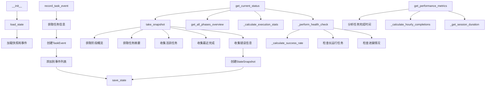

# 文件分析报告：state_tracker.py

## 文件概述
状态跟踪器是任务引擎的核心监控组件，负责实时跟踪4阶段文档生成流程中的任务执行状态、进度变化和性能指标。通过快照机制和事件记录，为系统提供完整的执行历史和健康检查功能。

## 代码结构分析

### 导入依赖
```python
# 系统库
import json, time
from datetime import datetime, timedelta
from typing import Dict, List, Optional, Any
from pathlib import Path
from dataclasses import dataclass, asdict
from enum import Enum

# 任务引擎模块
from .task_manager import TaskManager, TaskStatus
from .phase_controller import PhaseController, PhaseStatus
```

### 全局变量和常量
本文件主要定义类和数据结构，无全局变量和常量。

### 配置和设置
```python
# 状态跟踪配置
MAX_SNAPSHOTS = 100              # 最大快照数量
MAX_EVENTS = 1000               # 最大事件数量
RECENT_COMPLETION_WINDOW = 10    # 最近完成窗口（分钟）
LONG_RUNNING_THRESHOLD = 1800    # 长时间运行阈值（30分钟）
MAX_RECENT_ERRORS = 5            # 最大近期错误数
```

## 函数详细分析

### 函数概览表
| 函数名 | 类型 | 行数 | 复杂度 | 描述 |
|--------|------|------|--------|------|
| `__init__` | 构造函数 | 43-60 | 中 | 初始化状态跟踪器 |
| take_snapshot | 核心方法 | 62-107 | 高 | 创建状态快照 |
| record_task_event | 核心方法 | 109-130 | 中 | 记录任务事件 |
| get_current_status | 查询方法 | 132-145 | 中 | 获取当前完整状态 |
| get_progress_history | 查询方法 | 147-163 | 中 | 获取进度历史 |
| get_task_timeline | 查询方法 | 165-167 | 低 | 获取任务时间线 |
| get_phase_events | 查询方法 | 169-179 | 中 | 获取阶段事件 |
| get_performance_metrics | 分析方法 | 181-217 | 高 | 获取性能指标 |
| _calculate_execution_stats | 私有方法 | 219-248 | 高 | 计算执行统计 |
| _calculate_success_rate | 私有方法 | 250-259 | 低 | 计算成功率 |
| _calculate_hourly_completions | 私有方法 | 261-273 | 中 | 计算每小时完成数 |
| _get_session_duration | 私有方法 | 275-291 | 中 | 获取会话持续时间 |
| _perform_health_check | 私有方法 | 293-330 | 高 | 执行健康检查 |
| load_state | IO方法 | 332-353 | 中 | 加载状态数据 |
| save_state | IO方法 | 355-368 | 中 | 保存状态数据 |
| export_summary_report | 导出方法 | 370-383 | 中 | 导出摘要报告 |

### 函数详细说明

#### `__init__(project_path, task_manager, phase_controller)`
**功能**: 初始化状态跟踪器  
**参数**: project_path(str), task_manager(TaskManager), phase_controller(PhaseController)  
**返回**: None  
**逻辑**: 
- 设置项目路径和状态文件位置
- 初始化快照和事件列表
- 加载历史状态数据

#### take_snapshot() -> StateSnapshot
**功能**: 创建当前状态的完整快照  
**参数**: 无  
**返回**: StateSnapshot - 状态快照对象  
**逻辑**: 
- 获取阶段概览和任务摘要
- 收集最近完成的任务和活跃任务
- 提取错误信息
- 创建状态快照并保存

#### record_task_event(event_type, task_id, details)
**功能**: 记录任务事件到历史中  
**参数**: event_type(str), task_id(str), details(Dict, optional)  
**返回**: None  
**逻辑**: 
- 获取任务信息
- 创建TaskEvent对象
- 添加到事件列表并维护最大数量限制
- 保存状态到文件

#### get_current_status() -> Dict[str, Any]
**功能**: 获取系统当前完整状态  
**参数**: 无  
**返回**: Dict - 包含快照、概览、统计和健康检查的完整状态  
**逻辑**: 
- 创建当前快照
- 获取阶段概览
- 计算执行统计
- 执行健康检查

#### get_performance_metrics() -> Dict[str, Any]
**功能**: 计算和返回性能指标  
**参数**: 无  
**返回**: Dict - 性能指标字典  
**逻辑**: 
- 计算任务完成时间统计
- 分析平均、最小、最大持续时间
- 计算每小时完成率
- 获取会话持续时间

#### _perform_health_check() -> Dict[str, Any]
**功能**: 执行系统健康检查  
**参数**: 无  
**返回**: Dict - 健康状态报告  
**逻辑**: 
- 检查任务成功率
- 识别长时间运行的任务
- 检查进展情况
- 生成健康评级和建议

#### load_state() / save_state()
**功能**: 状态数据的持久化管理  
**参数**: 无  
**返回**: None  
**逻辑**: 
- 从JSON文件加载/保存快照和事件数据
- 处理文件IO异常
- 维护数据格式一致性

## 类详细分析

### 类概览表
| 类名 | 行数 | 方法数 | 属性数 | 复杂度 | 核心功能 |
|------|------|--------|--------|--------|----------|
| StateSnapshot | 16-27 | 0 | 7 | 低 | 状态快照数据结构 |
| TaskEvent | 29-37 | 0 | 6 | 低 | 任务事件数据结构 |
| StateTracker | 40-383 | 16 | 7 | 高 | 状态跟踪核心管理器 |

### 类详细说明

#### StateSnapshot类
**功能**: 系统状态快照的数据结构  
**属性**:
- timestamp: 快照时间戳
- overall_progress: 总体进度百分比
- current_phase: 当前执行阶段
- phase_states: 各阶段状态字典
- task_counts: 任务数量统计
- active_tasks: 活跃任务列表
- recent_completions: 最近完成任务列表
- errors: 错误信息列表

**设计模式**: 数据类(dataclass)，用于结构化状态信息

#### TaskEvent类
**功能**: 任务事件的数据结构  
**属性**:
- timestamp: 事件时间戳
- event_type: 事件类型(created/started/completed/failed/retried)
- task_id: 任务ID
- task_type: 任务类型
- phase: 所属阶段
- details: 详细信息字典

**设计模式**: 数据类(dataclass)，用于记录任务执行历史

#### StateTracker类
**核心属性**:
- project_path: 项目路径
- task_manager: 任务管理器引用
- phase_controller: 阶段控制器引用
- snapshots: 状态快照列表
- events: 任务事件列表
- state_dir: 状态文件目录
- snapshots_file/events_file: 持久化文件路径

**设计模式**: 
- 观察者模式：监控任务管理器和阶段控制器状态变化
- 快照模式：定期保存系统状态
- 单例模式：每个项目唯一的状态跟踪器

**关键特性**:
- 实时状态监控：快照和事件记录
- 性能分析：任务执行时间和效率统计
- 健康检查：系统运行状态评估
- 历史追踪：完整的执行历史记录
- 数据持久化：状态信息的文件存储

## 函数调用流程图


## 变量作用域分析
```python
# 实例属性作用域
StateTracker:
  - project_path: Path                      # 项目路径
  - task_manager: TaskManager               # 任务管理器
  - phase_controller: PhaseController       # 阶段控制器
  - state_dir: Path                         # 状态目录
  - snapshots_file: Path                    # 快照文件
  - events_file: Path                       # 事件文件
  - snapshots: List[StateSnapshot]          # 快照列表
  - events: List[TaskEvent]                 # 事件列表

# 方法局部作用域
take_snapshot():
  - overview: Dict                          # 阶段概览
  - task_summary: Dict                      # 任务摘要
  - recent_completions: List[str]           # 最近完成列表
  - active_tasks: List[str]                 # 活跃任务列表
  - errors: List[str]                       # 错误列表
  - snapshot: StateSnapshot                 # 快照对象

get_performance_metrics():
  - completion_times: List[float]           # 完成时间列表
  - task_durations: Dict                    # 任务持续时间
  - avg_duration: float                     # 平均持续时间
  - hourly_completions: List[Dict]          # 每小时完成统计
```

## 函数依赖关系
```
StateTracker.__init__
├── Path(project_path)
├── state_dir.mkdir()
└── load_state()
    ├── snapshots_file.exists()
    ├── json.load()
    └── StateSnapshot/TaskEvent构造

take_snapshot
├── phase_controller.get_all_phases_overview()
├── task_manager.export_tasks_summary()
├── 收集任务状态信息
├── StateSnapshot构造
└── save_state()

record_task_event
├── task_manager.get_task(task_id)
├── TaskEvent构造
└── save_state()

get_current_status
├── take_snapshot()
├── phase_controller.get_all_phases_overview()
├── _calculate_execution_stats()
└── _perform_health_check()

get_performance_metrics
├── 分析事件时间线
├── _calculate_hourly_completions()
└── _get_session_duration()

_perform_health_check
├── _calculate_success_rate()
├── 检查长运行任务
└── 检查进展变化

save_state
├── open(snapshots_file)
├── asdict(snapshot/event)
└── json.dump()
```