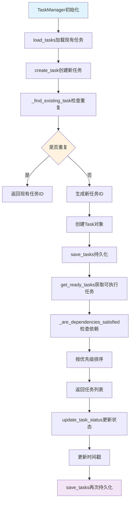
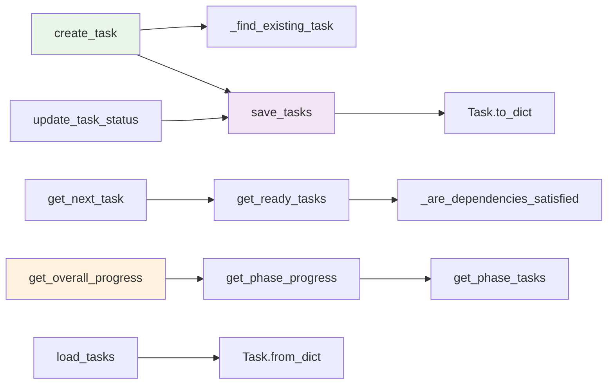

# 文件分析报告：src/task_engine/task_manager.py

## 文件概述

**文件路径**: `/src/task_engine/task_manager.py`  
**文件类型**: Python模块  
**主要作用**: CodeLens任务引擎的核心任务管理器，负责任务创建、调度、执行和状态管理  
**代码行数**: 367行  
**复杂度**: 高

这个文件是CodeLens系统的任务管理核心，提供完整的任务生命周期管理功能。它管理9种不同类型的文档生成任务，支持依赖关系验证、优先级调度、状态持久化和智能去重等功能。

## 代码结构分析

### 导入依赖
```python
import json  # JSON序列化
import time  # 时间戳生成
from dataclasses import dataclass, asdict  # 数据类支持
from datetime import datetime  # 时间处理
from enum import Enum  # 枚举类型
from pathlib import Path  # 路径操作
from typing import Dict, List, Optional, Any  # 类型注解
```

### 全局变量和常量
- **TaskStatus**: 6种任务状态（PENDING, READY, IN_PROGRESS, COMPLETED, FAILED, BLOCKED）
- **TaskType**: 9种任务类型（SCAN, FILE_SUMMARY, ARCHITECTURE等）

### 配置和设置
- **task_file**: 任务持久化文件路径（.codelens/tasks.json）
- **priority_order**: 优先级排序映射（high=0, normal=1, low=2）

## 函数详细分析

### 函数概览表
| 函数名 | 参数数量 | 返回类型 | 主要功能 |
|--------|----------|----------|----------|
| create_task | 12 | str | 创建新任务，支持去重和ID预定义 |
| _find_existing_task | 5 | Optional[str] | 查找现有相同任务，避免重复创建 |
| get_task | 1 | Optional[Task] | 根据ID获取任务详情 |
| update_task_status | 3 | bool | 更新任务状态和时间戳 |
| get_ready_tasks | 1 | List[Task] | 获取依赖满足的可执行任务 |
| get_next_task | 1 | Optional[Task] | 获取下一个最高优先级任务 |
| get_phase_tasks | 1 | List[Task] | 获取指定阶段的所有任务 |
| get_phase_progress | 1 | Dict[str, Any] | 计算阶段进度和统计信息 |
| get_overall_progress | 0 | Dict[str, Any] | 获取整体项目进度 |
| _are_dependencies_satisfied | 1 | bool | 检查任务依赖是否全部完成 |

### 函数详细说明

**create_task(...)**
- 支持任务去重检查，避免创建重复任务
- 统一ID生成逻辑，支持预定义ID
- 完整的任务元数据管理
- 自动持久化到JSON文件

**get_ready_tasks(phase)**
- 智能依赖解析，只返回可执行任务
- 按优先级自动排序（high > normal > low）
- 支持按阶段过滤

**get_phase_progress(phase)**
- 详细的阶段进度统计
- 包含各状态任务数量和完成百分比
- 提供阶段转换条件判断

## 类详细分析

### 类概览表
| 类名 | 继承关系 | 主要属性 | 主要方法 | 核心功能 |
|------|----------|----------|----------|----------|
| TaskStatus | Enum | 6种状态枚举值 | - | 任务状态定义 |
| TaskType | Enum | 9种任务类型 | - | 任务类型定义 |
| Task | dataclass | 16个核心属性 | to_dict, from_dict | 任务数据封装 |
| TaskManager | - | project_path, tasks, task_file | 15个核心方法 | 任务管理核心 |

### 类详细说明

**Task类**
- **核心属性**: id, type, description, phase, dependencies, status等
- **序列化**: 支持to_dict/from_dict转换，便于JSON持久化
- **时间戳**: 自动记录created_at, started_at, completed_at
- **元数据**: 支持自定义metadata字段

**TaskManager类**
- **核心特性**: 智能去重、依赖管理、优先级调度、状态持久化
- **存储机制**: JSON文件持久化，支持增量保存
- **性能优化**: 内存缓存 + 文件同步的混合策略

## 函数调用流程图



## 变量作用域分析

| 变量类型 | 作用域 | 生命周期 | 访问权限 |
|----------|--------|----------|----------|
| project_path | 实例属性 | 对象生命周期 | public |
| tasks | 实例属性 | 对象生命周期 | public |
| task_file | 实例属性 | 对象生命周期 | public |
| priority_order | 局部变量 | 方法执行期间 | private |
| ready_tasks | 局部变量 | 方法执行期间 | private |
| phase_tasks | 局部变量 | 方法执行期间 | private |

## 函数依赖关系



### 在4阶段文档生成系统中的作用

1. **Phase 1 (项目扫描)**: 创建和管理SCAN类型任务，确保项目分析完成
2. **Phase 2 (文件分析)**: 管理FILE_SUMMARY任务，跟踪每个文件的文档生成进度
3. **Phase 3 (架构分析)**: 协调6种架构任务（ARCHITECTURE, TECH_STACK, DATA_FLOW等）
4. **Phase 4 (项目文档)**: 管理PROJECT_README等最终文档任务

**核心价值**:
- **智能调度**: 基于依赖关系和优先级的智能任务调度
- **状态一致性**: 确保任务状态与实际执行状态同步
- **去重机制**: 避免重复任务创建，提高系统效率
- **持久化保障**: 可靠的状态持久化，支持系统重启恢复
- **进度追踪**: 详细的阶段和整体进度统计

这是整个CodeLens系统的"执行引擎"，确保所有文档生成任务按正确顺序和优先级执行，是4阶段流程控制的核心基础。