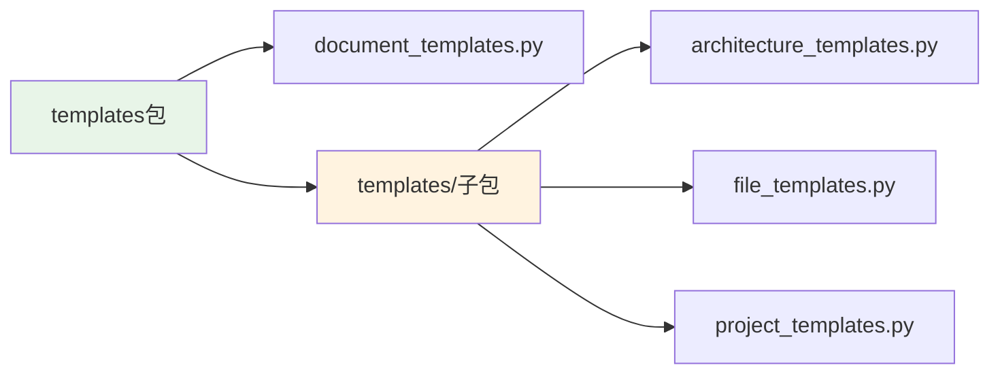

# 文件分析报告：src/templates/__init__.py

## 文件概述

**文件路径**: `/src/templates/__init__.py`  
**文件类型**: Python包初始化文件  
**主要作用**: Templates包的初始化文件，为CodeLens模板系统提供包级别的统一入口  
**代码行数**: 1行  
**复杂度**: 极简

这个文件是CodeLens模板系统的包初始化文件，标识src/templates目录为Python包。它为10个专业模板的组织和访问提供了包结构基础，支持3层文档架构（架构层、文件层、项目层）的模块化管理。

## 代码结构分析

### 导入依赖
无导入语句

### 全局变量和常量
无全局变量或常量定义

### 配置和设置
无配置项，仅包含包标识注释：
```python
# Templates package
```

## 函数详细分析

### 函数概览表
| 函数名 | 参数数量 | 返回类型 | 主要功能 |
|--------|----------|----------|----------|
| 无函数 | - | - | - |

### 函数详细说明
本文件不包含任何函数定义。

## 类详细分析

### 类概览表
| 类名 | 继承关系 | 主要属性 | 主要方法 | 核心功能 |
|------|----------|----------|----------|----------|
| 无类 | - | - | - | - |

### 类详细说明
本文件不包含任何类定义。

## 函数调用流程图

```mermaid
graph TD
    A[包导入] --> B[/__init__.py加载]
    B --> C[包空间初始化]
    C --> D[子模块可访问]
    D --> E[document_templates模块]
    D --> F[templates/子包]
    F --> G[architecture_templates]
    F --> H[file_templates]
    F --> I[project_templates]
    
    style B fill:#e1f5fe
    style C fill:#f3e5f5
    style D fill:#e8f5e8
```

## 变量作用域分析

| 变量类型 | 作用域 | 生命周期 | 访问权限 |
|----------|--------|----------|----------|
| 无变量 | - | - | - |

## 函数依赖关系

本文件作为包初始化文件，不存在函数依赖关系，但支持以下模块访问：



### 在4阶段文档生成系统中的作用

1. **Phase 1 (项目扫描)**: 为模板系统提供包结构基础，支持项目扫描模板访问
2. **Phase 2 (文件分析)**: 提供file_templates子模块的访问路径
3. **Phase 3 (架构分析)**: 支持6种架构模板（architecture_templates）的包级访问
4. **Phase 4 (项目文档)**: 提供project_templates模块的包结构支持

**核心价值**:
- **包结构基础**: 为10个专业模板的组织提供Python包结构
- **模块化支持**: 支持3层文档架构的模块化管理
- **访问统一性**: 提供统一的模板系统访问入口
- **扩展性**: 为未来模板系统扩展提供稳定基础

**模板系统架构支持**:
- **架构层模板**: 支持6种架构文档模板的包级访问
- **文件层模板**: 提供统一文件分析模板的组织结构  
- **项目层模板**: 支持3种项目文档模板的包管理

虽然代码极简，但在CodeLens模板系统的模块化架构中起到关键的包组织作用，是整个3层10模板文档架构的结构基础。